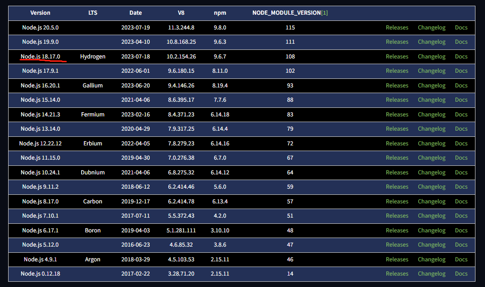

# Website

This website is built using [Docusaurus 2](https://docusaurus.io/), a modern static website generator.

### Node down

https://nodejs.org/en/download/releases

```
node -v
v18.17.0
```



### Installation

```
$ yarn
```

### Local Development

```
$ yarn start
```

This command starts a local development server and opens up a browser window. Most changes are reflected live without having to restart the server.

### Build

```
$ yarn build
```

This command generates static content into the `build` directory and can be served using any static contents hosting service.


### Markdown learn

https://markdown.com.cn/intro.html#markdown-%E6%98%AF%E4%BB%80%E4%B9%88%EF%BC%9F


### Git learn
https://learngitbranching.js.org/?locale=zh_CN

### Project effect address
https://zhangyongtian.github.io/

If there is a problem, I hope to be able to submit your PR :joy:

### How to modify this item
| file      | Description |
| ----------- | ----------- |
| sidebars.js      | Add a new directory, such as adding new things in ./docs, declare it here       |
| docusaurus.config.js   | The configuration of the first page of the file, the specified location for document storage, and the corresponding charts, etc.        |
| ./src   | Related configuration of static website home page        |
| ./i18n   | Configuration of static website homepage's foot and head        |
| ./docs   | The configuration of the first page of the file, the specified location for document storage, and the corresponding charts, etc.        |
| ./blog  | The specific content of the document        |
