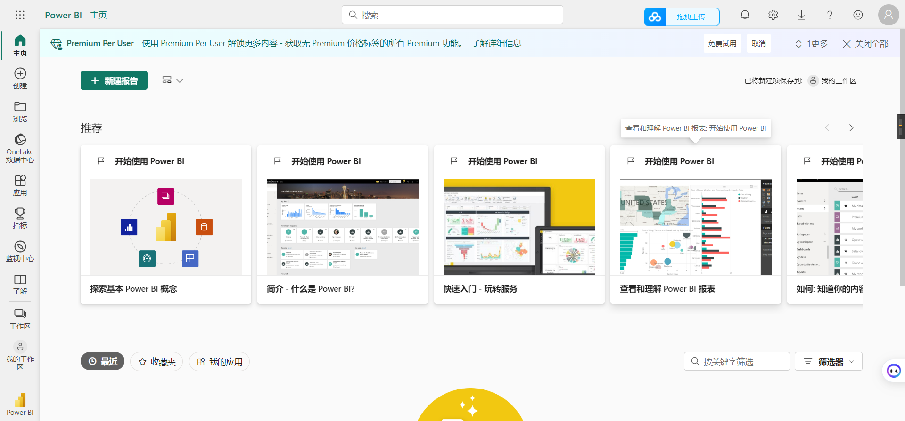

## 下载地址

### 官网地址
> https://www.microsoft.com/zh-cn/download/details.aspx?id=58494

### 百度网盘

>链接：https://pan.baidu.com/s/1RFzYiB5Wbi1Vp9yW5A9ywQ 
提取码：yyds 
--来自百度网盘超级会员V5的分享

## 注册一个Power BI账户

### 官方地址
>https://powerbi.microsoft.com/zh-cn/getting-started-with-power-bi/

### 接下来的操作

- 点击免费试用。

- 如果需要企业邮箱，那么使用下面的临时邮箱就行了。
  
    >https://temp-mail.org/zh/

<!-- xahodi8765@horsgit.com -->
<!-- fkadshf463287@ -->

<!-- wejilo1409@searpen.com -->
<!-- fdaskjfhk4872368% -->
- 如果看到下面的内容说明注册成功了。
  
  
- 

