## 安装教程

> https://blog.csdn.net/qq_43437122/article/details/116292544

### 百度网盘地址
```
链接：https://pan.baidu.com/s/1qvvBx5CxddWsf4d2qzoPmA 
提取码：yyds 
--来自百度网盘超级会员V5的分享
```

---
> 注意点：2019的比较好使，2021的不会出现图像的情况（因为这个是破解版）。


## 图形大全

### 柱状图

#### 相关数据

```
地区	销售额
东北	988,839
华北	2,486,905.6
华东	9,325,385.74
华南	1,262,111.5
华中	531,589.5
西北	889,195.8
西南	1,009,293.3
```

> 这个数据统计的时候也就是一个group by统计的结果,主要的用途看一个各类型统计对比查看。

#### 图形样式

柱状图分为水平条形和垂直条形，下面这个是水平条形。

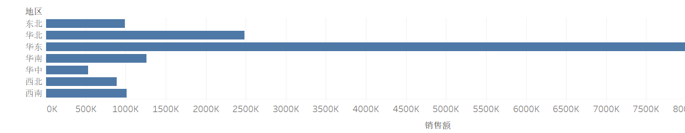

下面的图形就是更加细粒度的group by数据。

```
地区	城市	销售额

华北	济南	374,894.5
华北	淄博	34,785.5
华东	太仓	27,738
华东	通州	41,735
华中	武汉	251,916
华中	宜昌	49,880
西北	包头	72,553.5
西北	宝鸡	53,222.5
西南	昆明	108,658
西南	重庆	358,721.6
```

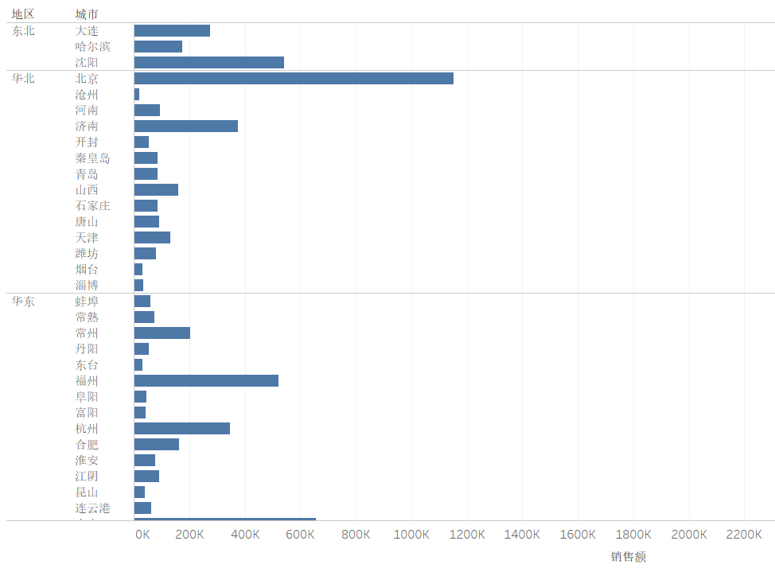

### 堆积条形图

#### 相关数据

```
地区	城市	销售额

华北	济南	374,894.5
华北	淄博	34,785.5
华东	太仓	27,738
华东	通州	41,735
华中	武汉	251,916
华中	宜昌	49,880
西北	包头	72,553.5
西北	宝鸡	53,222.5
西南	昆明	108,658
西南	重庆	358,721.6
```

> 最少两级的group by数据才能有堆积效果。

#### 图形样式

> 下面的图形也就是对维度的时候堆叠在一块进行查看。

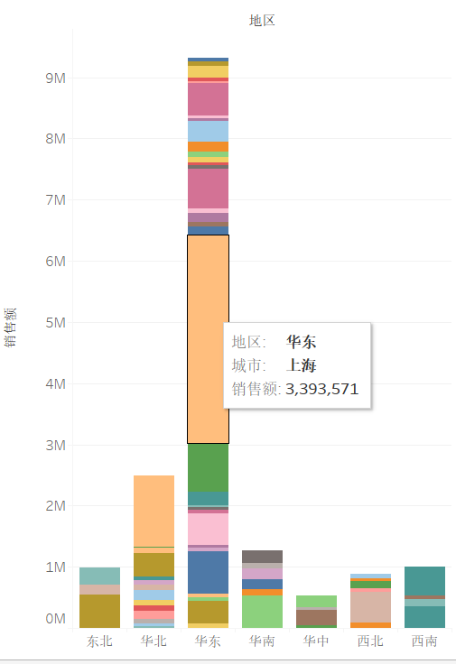

### 折线图

#### 相关数据

```
业务员	日期 月	销售额
业务员01	一月	28,682.3367385
业务员02	一月	221,952.4418475
业务员03	一月	2,784.4685925
业务员01	二月	16,513
业务员02	二月	86,021.006551
业务员03	二月	1,727
业务员01	三月	11,235.768314
业务员02	三月	133,125.4662585
业务员03	三月	610.928627
```

> 这里的数据是按照月维度进行统计的，所以这里的数据是按照月维度进行统计的，group by业务员，还有对应的日期数据。

#### 图形样式

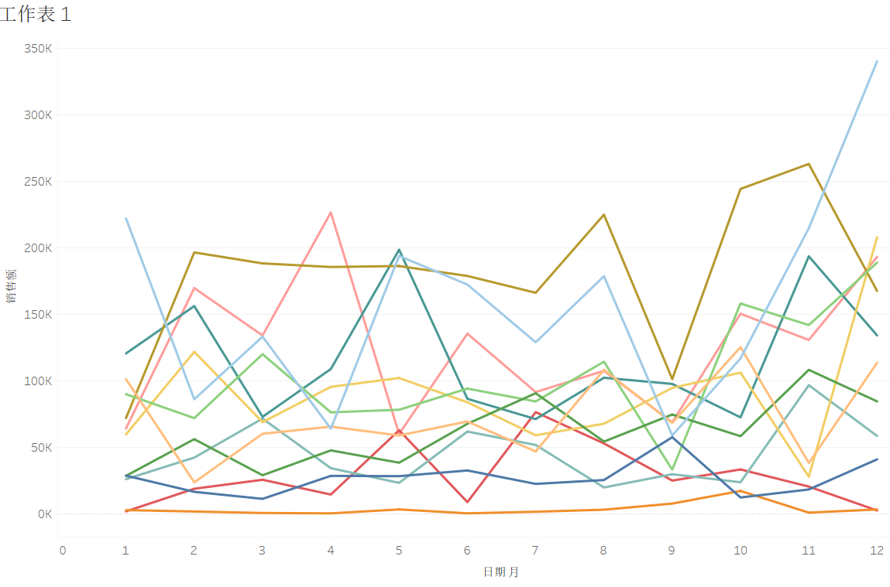

### 面积图

#### 相关数据

```
产品	月份	销售额 的总计 %
产品1	1月	37.521339088%
产品1	2月	15.342056828%
产品1	3月	33.042912636%
产品1	9月	45.912888427%
产品1	10月	22.449295276%
产品1	11月	18.084199792%
产品1	12月	37.946756482%
产品2	1月	38.742735584%
产品2	2月	67.662429176%
产品2	3月	58.445362606%
```

> 准备的数据和折线图差不多。这个就是看不同的产品占比比价方便。

#### 图形样式

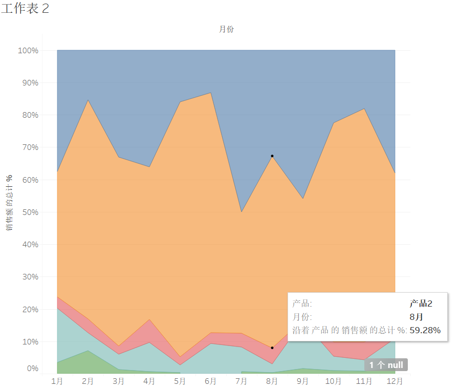

### 气泡图

#### 相关数据

```
产品	销售额
产品1	17,074,067.201184
产品2	16,103,964.2834519
产品3	10,736,430.3736547
产品4	27,756,668.118743
产品5	1,352,306.03215599
```

> 对于气泡图，可以进行两个维度的分析，比如x,y。也可以进行3个维度的分析，比如x,y,z。z表示气泡的大小。典型案例如下。

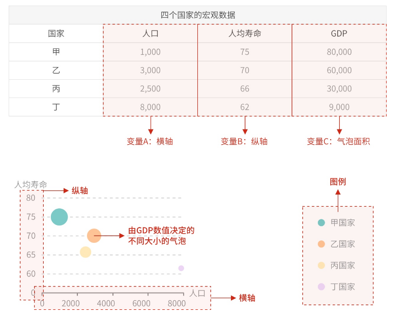

> 数据适用场景，group by 以后求3个维度的聚合操作比如，select sum(xx),avg(xx),sum(xx) where xx group by xx。

**适用场景**

- 多维数据。一般而言气泡图需要3个变量，其中2个决定了气泡在笛卡尔坐标系中的位置（即x，y轴上的值），另外一个则通过气泡的大小来表示。当然，气泡图也可以容纳更多维的数据，例如用第4个变量决定气泡的颜色、透明度等。

- 特殊地，气泡图也可以用于二维数据。即，y轴和气泡大小使用同一维度的数据（y轴和气泡大小的双视觉编码）。这种情况下，它实际上是作为柱状图的替代，用于表示分类数据对比，但比柱状图更加简洁美观。例如，下图表示了2014年每个季度的sales。x轴代表时间，y轴和气泡大小代表了销售业绩。

### 饼图

#### 相关数据

```
地区	实际销售额
东北	1,036,233.5
华北	2,486,905.6
华东	9,325,385.74
华南	1,262,111.5
华中	531,589.5
西北	889,195.8
西南	1,009,293.3
```

> 饼图，一般用于表示分类数据对比。

#### 图形样式

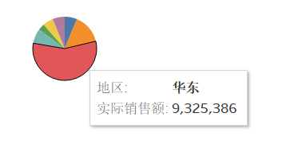

### 树状图

#### 相关数据

```
地区	城市	实际销售额
东北	大连	274,026.5
东北	哈尔滨	267,584.5
东北	沈阳	494,622.5
华北	北京	1,153,332.6
华北	沧州	19,707
华东	浙江	371,636.2
华东	镇江	73,155
华南	汕头	102,682
华南	深圳	525,776.5
华中	长沙	195,725.5
华中	南昌	34,068
西北	包头	72,553.5
西北	宝鸡	53,222.5
西南	成都	481,467.7
西南	贵阳	60,446
```

> 这种也是对个维度的group by操作，这种图表比饼图更加的清晰。

#### 图形样式

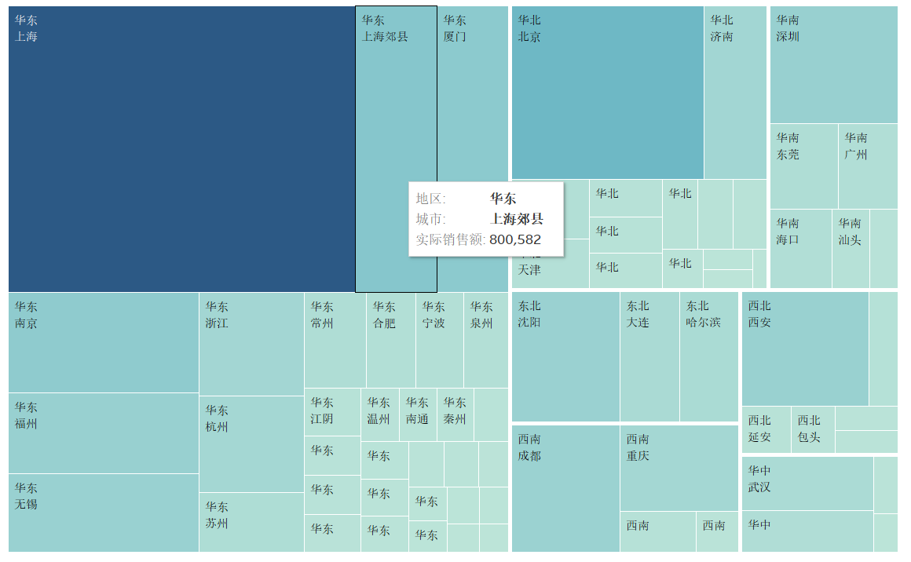

### 散点图

#### 相关数据

```
实际销售额	销售成本
13902.2	4,851.37
15499	4,637.82
19707	6,777.39
22594.1	9,914.22
25843	9,296.13
```

> 描述两行数据的关系，x轴是实际销售额，y轴是销售成本。


#### 图形样式

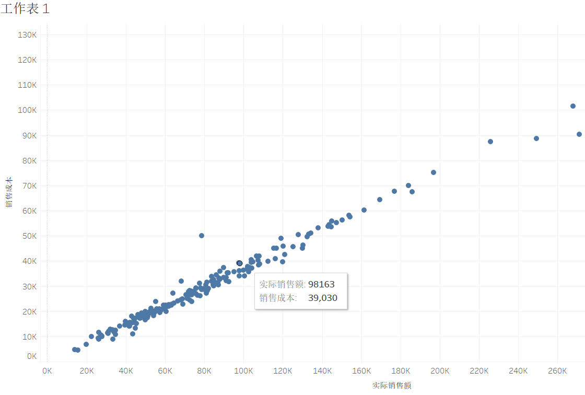

### 盒须图

#### 相关数据

```
产品	分公司	销售
产品04	分公司A	2396.28
产品05	分公司A	20533.76
产品06	分公司A	33303.1
产品03	分公司A	44786.6
产品02	分公司A	48404.65
产品08	分公司A	65322
产品07	分公司A	198538.31
产品01	分公司A	213471.56
产品05	分公司B	199089
产品01	分公司B	383487.95
产品06	分公司B	405466.28
产品08	分公司B	527932.99
产品07	分公司B	578313
产品04	分公司B	676701.42
产品03	分公司B	781494.59
产品02	分公司B	812761.84
产品04	分公司C	21297.24
产品06	分公司C	59660.38
产品01	分公司C	142059.19
产品02	分公司C	177193.34
产品05	分公司C	177719.95
产品08	分公司C	194185.15
产品03	分公司C	890896
产品07	分公司C	1241252.24
产品06	分公司D	8764
产品04	分公司D	8987
产品05	分公司D	11898.44
产品02	分公司D	15466
产品03	分公司D	46402.92
产品08	分公司D	261621
产品07	分公司D	306058.63
产品01	分公司D	337774.05
产品03	分公司E	10533.74
产品05	分公司E	30046.05
产品04	分公司E	127521.11
产品07	分公司E	153984.85
产品01	分公司E	154105.9
产品08	分公司E	157711.08
产品06	分公司E	161178.83
产品02	分公司E	467134.16
产品01	分公司G	81804.08
产品03	分公司G	86728.91
产品04	分公司G	127938.63
产品05	分公司G	169628.73
产品07	分公司G	215788
产品08	分公司G	237614.4
产品02	分公司G	432074.37
产品06	分公司G	813558.13
产品06	分公司H	24055.89
产品03	分公司H	24309.21
产品07	分公司H	58641.01
产品04	分公司H	79449.6
产品05	分公司H	117624
产品08	分公司H	203273.27
产品02	分公司H	230166.59
产品01	分公司H	284556.25
产品05	分公司K	48619.86
产品08	分公司K	53230.2
产品03	分公司K	57065.62
产品04	分公司K	64683.94
产品06	分公司K	139025.51
产品07	分公司K	144056.01
产品02	分公司K	455704.55
产品01	分公司K	493753.07
```

> 根据group by以后查看数据的分布情况。看数据的异常程度。

#### 图形样式

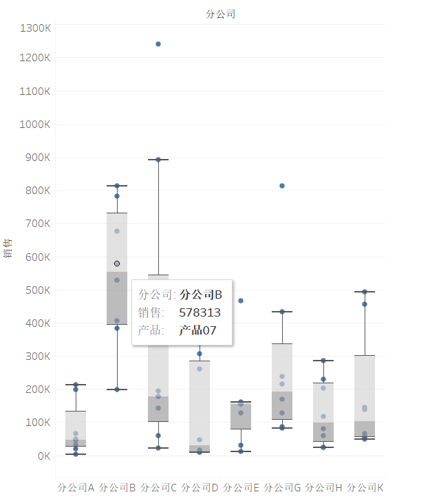

### 标靶图

#### 相关数据

```
区域	发货指标	实际发货
北二区	469	533
北三区	377	489
北一区	359	257
南二区	465	316
南三区	650	411
南一区	184	298
```

> 在达成分析的时候会用到，给一个目标值，还有一个实际值。

#### 图形样式

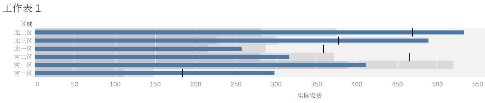

### 甘特图

#### 相关数据

```
日(开始时间)	状况	项目	天数
2021年6月18日	计划	编制可行性方案	4
2021年9月2日	计划	调试	4
2021年6月29日	计划	开会讨论	2
2021年7月7日	计划	确定供货商	5
2021年7月17日	计划	施工安装	45
2021年6月7日	计划	市场调研	10
2021年7月2日	计划	修改方案	3
2021年9月7日	计划	验收	1
2021年6月18日	实际	编制可行性方案	2
2021年8月29日	实际	调试	3
2021年6月27日	实际	开会讨论	4
2021年7月12日	实际	确定供货商	11
2021年7月26日	实际	施工安装	32
2021年6月8日	实际	市场调研	8
2021年7月5日	实际	修改方案	2
2021年9月3日	实际	验收	2
```

> 甘特图，是用来显示项目、进度、活动时间的图示。

#### 图形样式

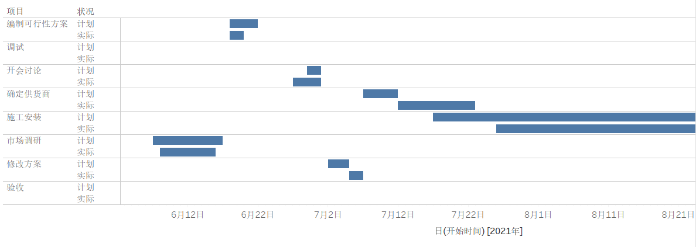

### 旋风图

#### 相关数据

```
所属部门	女	男
财务部	2	6
后勤部	2	4
技术部	5	5
贸易部	2	4
人力资源部	4	5
生产部	1	5
市场部	3	12
销售部	2	9
信息部	1	4
质检部	2	4
总经办	3	2
```

> 对应数据的比较。

#### 图形样式

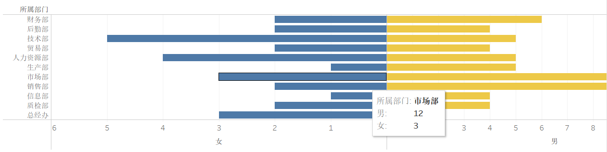

### 帕累托图

#### 相关数据

```
客户	     总计 %	       销售额
客户01		99.663785281%	504
客户02		70.351019628%	19,507
客户03		85.409045322%	4,076
客户04		97.708582072%	1,472
客户05		51.718802235%	22,291
客户06		90.651893596%	2,604
客户07		98.492764697%	821
客户08		30.427432065%	31,856
客户09		94.614833564%	1,839
客户10		88.164668800%	2,885
客户11		99.182386933%	722
客户12		100%	352
客户13		96.302593247%	1,767
客户14		81.515831702%	11,689
客户15		92.858302689%	2,310

```

> 帕累托图，是用来显示数据分布的图示。

#### 图形样式

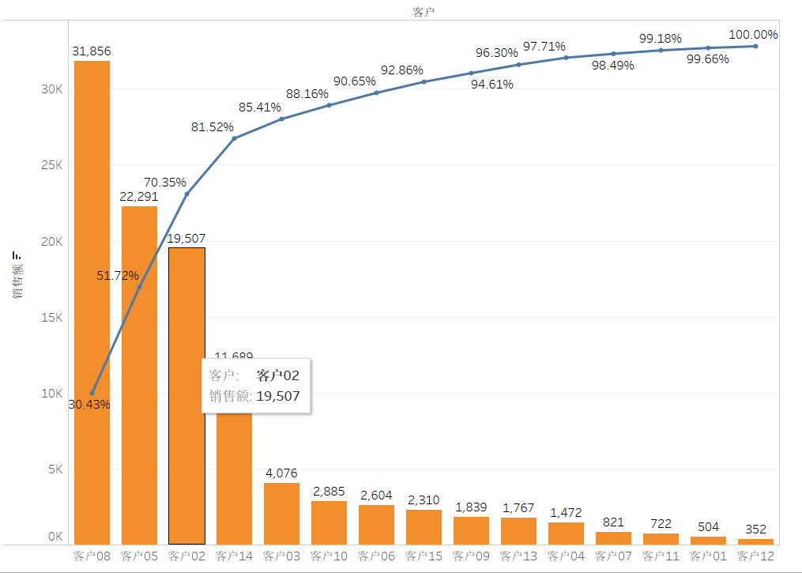

### 地图

#### 相关数据

```
SELECT
    (case site
        when '国家1' then 'US'
        when '国家2' then 'DE'
        when '国家3' then 'FR'
        when '国家4' then 'IT'
        when '国家5' then 'GB'
        when '国家6'  then 'ES'
        end
        ) site,
    brand_price_avg,
    day_id

from 库.表
```

> 在数据库里面地区分析，地区存储业务怎么设置步影响最后的结果分析，关键是要指定下装换的策略就可以制作地图了。

#### 图形样式

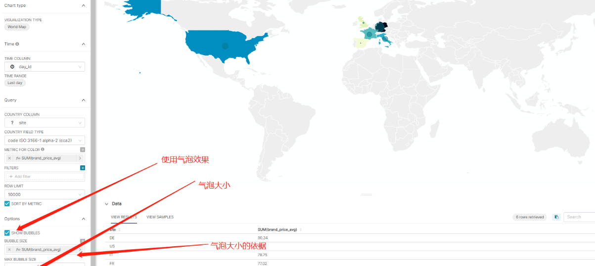
