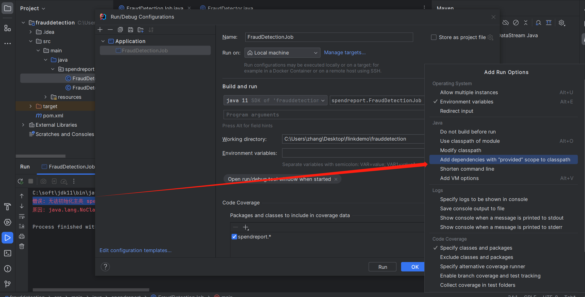

## 地址转换
> geoip2 对应的数据库下载
> https://www.maxmind.com/en/account/sign-in
> java api
> https://maxmind.github.io/GeoIP2-java/
## MySQL

### MySQL超时问题

https://mysql-rtdocs.readthedocs.io/en/latest/%E9%85%8D%E7%BD%AE%E5%8F%82%E6%95%B0/connection%E5%A4%B1%E6%95%88-testOnBorrow/

## Linux问题

### Linux 修改ip地址

**对于的配置文件**

```shell
cd /etc/sysconfig/network-scripts

vi ifcfg-ens33
```

**要修改的配置项**
```
BOOTPROTO="static" | 如果是dhcp获取，BOOTPROTO="dhcp" ,下面的配置都不需要

IPADDR=172.16.7.237
NETMASK=255.255.255.0
GATEWAY=172.16.7.1
DNS1=114.114.114.114
DNS2=8.8.8.8
```

**重启网络服务**
```
systemctl restart network
```

**查看网关地址**

```
[root@localhost network-scripts]# ip route show
default via 172.16.7.1 dev enp0s3 proto dhcp metric 100 
172.16.7.0/24 dev enp0s3 proto kernel scope link src 172.16.7.237 metric 100 

172.16.7.1 就是网关
```

### ssh-copy-id 配置免密以后无效的问题

Authentication refused: bad ownership or modes for directory

参考博客
> https://blog.csdn.net/weixin_42559574/article/details/129943394

> https://blog.csdn.net/andyguan01_2/article/details/100658905

查看安全相关的日志

```shell
sudo cat /var/log/secure
```

发现是免密文件的权限问题引起的，权限的文件是有一定的规定的不是越高越好，这个也算是linux的自我保护机制吧

```shell
chmod 600 /home/bigdata/.ssh/authorized_keys
chown bigdata:bigdata /home/bigdata/.ssh/authorized_keys
ls -l /home/bigdata/.ssh/authorized_keys
chmod 700 /home/bigdata/.ssh
chown bigdata:bigdata /home/bigdata/.ssh
ls -ld /home/bigdata/.ssh
chmod 755 /home/bigdata
chown bigdata:bigdata /home/bigdata
ls -ld /home/bigdata
chmod 600 /home/bigdata/.ssh/id_rsa
ls -l /home/bigdata/.ssh/id_rsa
```
### 知道端口查询进程号

```
sudo lsof -i :9090
```

### linux 百万连接问题

> https://www.ideawu.net/blog/archives/740.html

### linux 修改 yum 源和 epel 源

**修改yum源**

```shell
mkdir /etc/yum.repos.d/backup/
mv /etc/yum.repos.d/CentOS-Base.repo /etc/yum.repos.d/backup/
curl -o /etc/yum.repos.d/CentOS-Base.repo http://mirrors.aliyun.com/repo/Centos-7.repo

sed -i -e '/mirrors.cloud.aliyuncs.com/d' -e '/mirrors.aliyuncs.com/d' /etc/yum.repos.d/CentOS-Base.repo

yum clean all
yum makecache
```

**修改epel源**

```shell
yum --nogpgcheck -y install epel-release

mv /etc/yum.repos.d/epel* /etc/yum.repos.d/backup/

curl -o /etc/yum.repos.d/epel.repo http://mirrors.aliyun.com/repo/epel-7.repo

yum makecache
```

**相关地址**

> https://odinxu.com/post/accelerate-centos-yum-dnf/
## 大数据算法

### Uber H3算法

> https://h3geo.org/docs/highlights/aggregation

**相关博客**

> https://blog.csdn.net/allenlu2008/article/details/103029132

## 民间资料
### 大数据
#### 大数据指标体系

> https://zhuanlan.zhihu.com/p/448733810

#### Flume

> https://segmentfault.com/a/1190000040917955

#### Upsert-kafka-demo

> https://github.com/fsk119/flink-pageviews-demo

> https://www.ververica.com/blog/flink-sql-secrets-mastering-the-art-of-changelog-event-out-of-orderness

> https://cloud.tencent.com/developer/article/1806609

### 后端
#### 技术选型
> https://segmentfault.com/a/1190000023467005?utm_source=sf-similar-article

#### JAVA知识体系
> https://pdai.tech/

#### PostgreSQL

> https://segmentfault.com/a/1190000044048598?utm_source=sf-similar-article

### 机器学习

> https://www.showmeai.tech/tutorials/34?articleId=185

### 零度解说

> https://www.freedidi.com/

### 跨境电商

> https://blog.naibabiji.com/

### 爬虫谷歌驱动安装

> https://cuiqingcai.com/33043.html
> https://googlechromelabs.github.io/chrome-for-testing/
> https://www.cnblogs.com/laoluoits/p/17710501.html

## Flink错误

### 错误: 无法初始化主类 spendreport.FraudDetectionJob



## 若依相关修改

### 前端启动修改
package.json

```json
  "scripts": {
    "dev": "set NODE_OPTIONS=--openssl-legacy-provider && vue-cli-service serve",
    "build:prod": "vue-cli-service build",
    "build:stage": "vue-cli-service build --mode staging",
    "preview": "node build/index.js --preview",
    "lint": "eslint --ext .js,.vue src"
  }
```


### 图标
> https://blog.csdn.net/qq_19343089/article/details/135118373

### mybatisplus

ruoyi-common 的修改

```xml
    <properties>
        <mybatis-plus.version>3.4.3</mybatis-plus.version>
    </properties>
 <!-- mybatis plus -->
 <dependency>
      <groupId>com.baomidou</groupId>
      <artifactId>mybatis-plus-boot-starter</artifactId>
      <version>${mybatis-plus.version}</version>
  </dependency>

  <!-- pagehelper 分页插件 -->
  <dependency>
      <groupId>com.github.pagehelper</groupId>
      <artifactId>pagehelper-spring-boot-starter</artifactId>
      <version>${pagehelper.boot.version}</version>
      <exclusions>
          <exclusion>
              <groupId>org.mybatis</groupId>
              <artifactId>mybatis</artifactId>
          </exclusion>
      </exclusions>
  </dependency>

```

application.yml的修改

```yml
# MyBatis配置
mybatis-plus:
    # 搜索指定包别名
    typeAliasesPackage: com.ruoyi.**.domain
    # 配置mapper的扫描，找到所有的mapper.xml映射文件
    mapperLocations: classpath*:mapper/**/*Mapper.xml
    # 加载全局的配置文件
    configLocation: classpath:mybatis/mybatis-config.xml
```

MyBatisPlusConfig 的修改

```java
@Configuration
public class MybatisPlusConfig {

    /**
     * 新的分页插件,一缓和二缓遵循mybatis的规则,需要设置 MybatisConfiguration#useDeprecatedExecutor = false 避免缓存出现问题(该属性会在旧插件移除后一同移除)
     */
    @Bean
    public MybatisPlusInterceptor mybatisPlusInterceptor() {
        MybatisPlusInterceptor interceptor = new MybatisPlusInterceptor();
        //分页
        interceptor.addInnerInterceptor(new PaginationInnerInterceptor(DbType.MYSQL));
        //乐观锁
        interceptor.addInnerInterceptor(new OptimisticLockerInnerInterceptor());
        return interceptor;
    }
}
```

### 多数据源配置

> https://blog.csdn.net/qq_33312725/article/details/128783009

```xml
<dependency>
  <groupId>com.baomidou</groupId>
  <artifactId>dynamic-datasource-spring-boot-starter</artifactId>
  <version>${version}</version>
</dependency>
```

```yml
spring:
  datasource:
    dynamic:
      primary: master #默认主库名为master
      strict: false #不使用严格模式
      datasource:
        master:
          url: jdbc:mysql://127.0.0.1:3306/master
          username: root
          password: 66668888
          driver-class-name: com.mysql.jdbc.Driver 
        slave_1:
          url: jdbc:mysql://127.0.0.1:3307/slave_1
          username: root
          password: 66668888
          driver-class-name: com.mysql.jdbc.Driver
        slave_2:
          url: ENC(xxxxx) # 内置加密
          username: ENC(xxxxx)
          password: ENC(xxxxx)
          driver-class-name: com.mysql.jdbc.Driver
```

然后mapper加入注解就可以了

```java
@DS("slave")
public interface TFlinkAppMapper extends BaseMapper<TFlinkApp> {

}
```