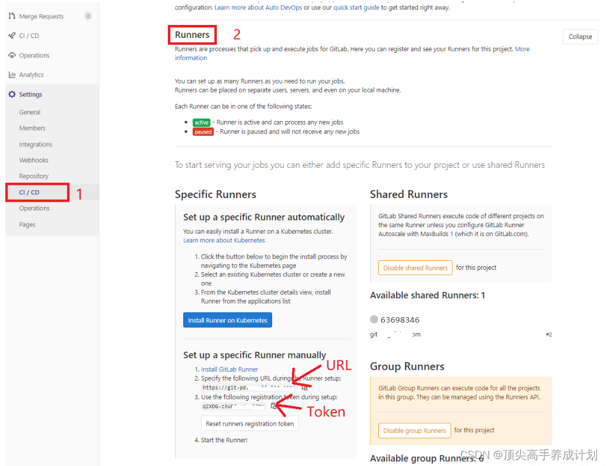
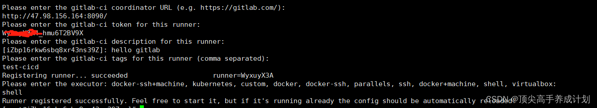
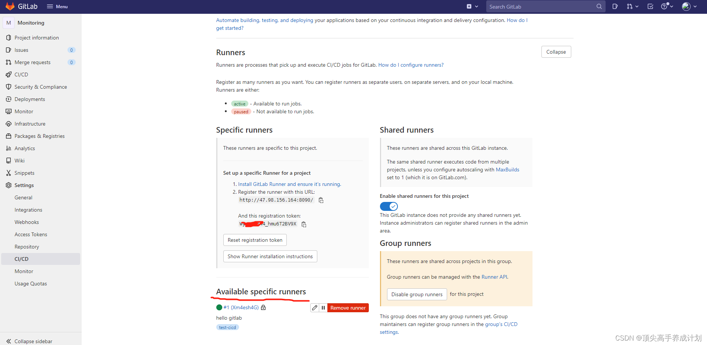

## GitLab

### 官网
> 

### 启动容器
```shell
mkdir -p /data/gitlab/config
mkdir -p /data/gitlab/logs 
mkdir -p /data/gitlab/data

docker run --detach \
  --hostname gitlab.deanit.cn \
  --publish 8443:443 --publish 7902:7902 --publish 8222:22 \
  --name gitlab \
  --restart always \
  --volume /data/gitlab/config:/etc/gitlab \
  --volume /data/gitlab/logs:/var/log/gitlab \
  --volume /data/gitlab/data:/var/opt/gitlab \
  --privileged=true \
  gitlab/gitlab-ce:13.7.3-ce.0
```

### 修改配置

**修改拉去代码时候的端口和地址**
```shell
sudo vi /data/gitlab/config/gitlab.rb
```
```shell
# 配置http拉去代码
external_url 'http://192.168.61.202:7902'
nginx['listen_port'] = 7902
# 配置ssh拉去代码
gitlab_rails['gitlab_ssh_host'] = '192.168.61.202'
gitlab_rails['gitlab_shell_ssh_port'] = 8222 # 此端口是run时22端口映射的222端口，也就是上面的-p 222:22 ，不然会一直要输入密码还不正确
```

```shell
sudo vi /data/gitlab/data/gitlab-rails/etc/gitlab.yml
```

**重启**
```shell
docker restart gitlab
```

### 参数说明
```shell
--hostname gitlab.deanit.cn:  设置主机名或域名
--publish 8443:443：将http：443映射到外部端口8443
--publish 8880:80：将web：80映射到外部端口8880
--publish 8222:22：将ssh：22映射到外部端口8222
--name gitlab: 运行容器名
--restart always: 自动重启
--volume /data/gitlab/config:/etc/gitlab: 挂载目录
--volume /data/gitlab/logs:/var/log/gitlab: 挂载目录
--volume /data/gitlab/data:/var/opt/gitlab: 挂载目录
--privileged=true 使得容器内的root拥有真正的root权限。否则，container内的root只是外部的一个普通用户权限
```

### 访问
> http://192.168.61.202:7902

> 默认用户是root,密码要重新配置。启动容器的时间要等10分钟左右，有点慢。

## 配置gitlabrunner

### 下载

```shell
yum install -y git
wget http://mirrors.tuna.tsinghua.edu.cn/gitlab-runner/yum/el7/gitlab-runner-12.9.0-1.x86_64.rpm
rpm -ivh gitlab-runner-12.9.0-1.x86_64.rpm  --nodeps --force

```
安装好Runner之后，需要向Gitlab进行注册，注册Runner需要GitLab-CI的url和token。可根据需求注册选择所需类型Runner。这里介绍spercific runners为例



### 注册

```shell
sudo gitlab-runner register
```



> runner 左边会有一个小绿点，表示该runner是能正常执行的



### 提高runner的权限变成root用户权限

> 先在界面 Remove Runner

```shell
 ps -ef | grep runner
 gitlab-runner uninstall
 gitlab-runner install --working-directory /root --user root
 gitlab-runner restart
#查看runner的运行状态
 gitlab-runner status
```

重新启动runner的时候要重新注册下

```shell
sudo gitlab-runner register
```
