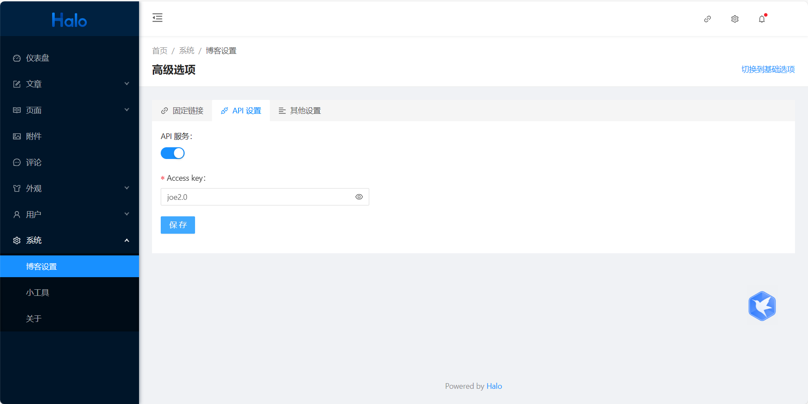

## 原始镜像
```
halohub/halo:1.6.0
```

## 阿里云备用镜像
```shell
mkdir /root/halo
cd /root/halo
vim application.yaml
```
### 准备配置文件
```shell
server:
  port: 8090
  compression:
    enabled: false
spring:
  datasource:
    driver-class-name: com.mysql.cj.jdbc.Driver
    url: jdbc:mysql://halodb:3306/halo?characterEncoding=utf8&useSSL=false&serverTimezone=Asia/Shanghai&allowPublicKeyRetrieval=true
    username: root
    password: o#DwN&JSa56
halo:
  admin-path: admin
  cache: memory

```
### 修改docker-compose.yaml
```shell
vim docker-compose.yaml
```

```yml
version: "3"

services:
  halo:
    image: registry.cn-hangzhou.aliyuncs.com/haloblog/halo:v1
    restart: on-failure:3
    depends_on:
      halodb:
        condition: service_healthy
    networks:
      halo_network:
    ports:
      - "80:8090"
    healthcheck:
      test: ["CMD", "curl", "-f", "http://localhost:8090/actuator/health/readiness"]
      interval: 30s
      timeout: 5s
      retries: 5
      start_period: 30s
    volumes:
      - /root/halo/application.yaml:/root/.halo/application.yaml

  halodb:
    ports:
      - "3311:3306" 
    image: mysql:8.1.0
    restart: on-failure:3
    networks:
      halo_network:
    command: 
      - --default-authentication-plugin=caching_sha2_password
      - --character-set-server=utf8mb4
      - --collation-server=utf8mb4_general_ci
      - --explicit_defaults_for_timestamp=true
    healthcheck:
      test: ["CMD", "mysqladmin", "ping", "-h", "127.0.0.1", "--silent"]
      interval: 3s
      retries: 5
      start_period: 30s
    environment:
      - MYSQL_ROOT_PASSWORD=o#DwN&JSa56
      - MYSQL_DATABASE=halo

networks:
  halo_network:
```

### 启动
```shell
docker-compose up -d
docker-compose logs -f
```

### 安装好主题以后处理问题


## 官网安装方式
```yml
version: "3"

services:
  halo:
    image: halohub/halo:2.14
    restart: on-failure:3
    depends_on:
      halodb:
        condition: service_healthy
    networks:
      halo_network:
    ports:
      - "80:8090"
    healthcheck:
      test: ["CMD", "curl", "-f", "http://localhost:8090/actuator/health/readiness"]
      interval: 30s
      timeout: 5s
      retries: 5
      start_period: 30s
    command:
      - --spring.r2dbc.url=r2dbc:pool:mysql://halodb:3306/halo
      - --spring.r2dbc.username=root
      - --spring.r2dbc.password=o#DwN&JSa56
      - --spring.sql.init.platform=mysql
      - --halo.external-url=http://localhost:8090/

  halodb:
    image: mysql:8.1.0
    restart: on-failure:3
    networks:
      halo_network:
    ports:
      - "3333:3306"
    command: 
      - --default-authentication-plugin=caching_sha2_password
      - --character-set-server=utf8mb4
      - --collation-server=utf8mb4_general_ci
      - --explicit_defaults_for_timestamp=true
    healthcheck:
      test: ["CMD", "mysqladmin", "ping", "-h", "127.0.0.1", "--silent"]
      interval: 3s
      retries: 5
      start_period: 30s
    environment:
      - MYSQL_ROOT_PASSWORD=o#DwN&JSa56
      - MYSQL_DATABASE=halo

networks:
  halo_network:
  
  
docker-compose up -d
docker-compose logs -f
```

## 以后机器维护
```yml
version: "3"

services:
  halo:
    image: registry.cn-hangzhou.aliyuncs.com/haloblog/halo:v1
    restart: on-failure:3
    ports:
      - "8090:8090"
    healthcheck:
      test: ["CMD", "curl", "-f", "http://localhost:8090/actuator/health/readiness"]
      interval: 30s
      timeout: 5s
      retries: 5
      start_period: 30s
    volumes:
      - /root/halo/application.yaml:/root/.halo/application.yaml
```

## 流量监控umami
### 下载
```shell
git clone https://github.com/umami-software/umami.git
```

### 构建镜像
**解压**
```
unzip umami-master.zip
cd umami-master/
```
**修改docker-compose**
```yml
version: '3'
services:
  umami:
    image: ghcr.io/umami-software/umami:postgresql-latest
    ports:
      - "3000:3000"
    environment:
      DATABASE_URL: postgresql://umami:umami@db:5432/umami
      DATABASE_TYPE: postgresql
      APP_SECRET: replace-me-with-a-random-string
    depends_on:
      db:
        condition: service_healthy
    restart: always
    healthcheck:
      test: ["CMD-SHELL", "curl http://localhost:3000/api/heartbeat"]
      interval: 5s
      timeout: 5s
      retries: 5
  db:
    image: postgres:15-alpine
    environment:
      POSTGRES_DB: umami
      POSTGRES_USER: umami
      POSTGRES_PASSWORD: umami
    volumes:
      - umami-db-data:/var/lib/postgresql/data
    restart: always
    healthcheck:
      test: ["CMD-SHELL", "pg_isready -U $${POSTGRES_USER} -d $${POSTGRES_DB}"]
      interval: 5s
      timeout: 5s
      retries: 5
volumes:
  umami-db-data:
```

**启动**
```
docker-compose up -d
```

**账号密码**
admin umami
