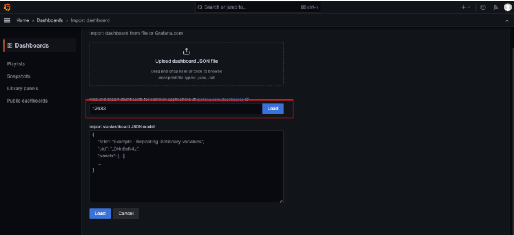
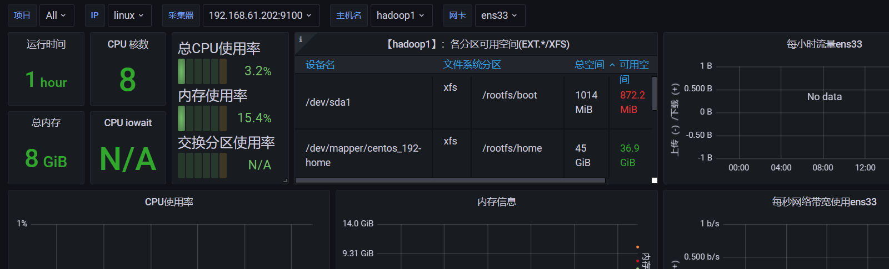

## 运行Grafana

```shell
docker run -d --name=grafana -p 3000:3000 grafana/grafana-enterprise
```

## 安装Prometheus

```shell
docker pull prom/node-exporter
docker pull prom/prometheus
```
```shell
docker run -d -p 9100:9100  -v "/proc:/host/proc:ro" -v "/sys:/host/sys:ro" -v "/:/rootfs:ro"  --net="host"  prom/node-exporter
```

### 修改配置

```shell
mkdir /opt/prometheus
vim /opt/prometheus/prometheus.yml
```

```yml
global:
  scrape_interval: 60s
  evaluation_interval: 60s
scrape_configs:
  - job_name: 'prometheus'
    scrape_interval: 30s
    static_configs:
      - targets: ['192.168.61.202:9090']
  - job_name: 'linux'
    static_configs:
      - targets: ['192.168.61.202:9100']
```

### 运行容器
```shell
docker run -d  -p 9090:9090  -v /opt/prometheus/prometheus.yml:/etc/prometheus/prometheus.yml prom/prometheus
```

### 导入图像模板


## 参考地址

> 12633

> https://mp.weixin.qq.com/s/nmTiergYE8NxJh0RRf8PNQ



## Prometheus及consul服务发现

> https://mp.weixin.qq.com/s/nCrR6FBe7rKxAPhnOXDNfw