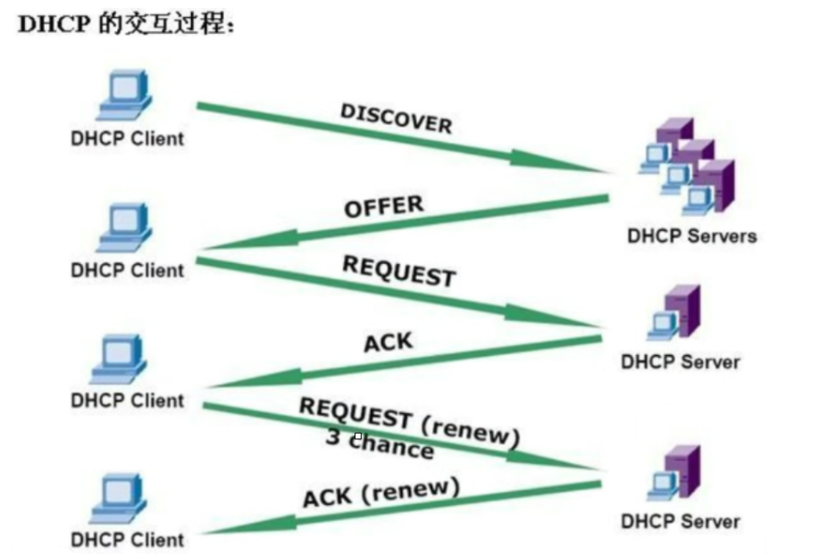

## 简介

DHCP作用就是给PC分配一个IP。在一个局域网里面，你的路由有这个功能的话，**那它就会把PC的MC地址记住，然后给这个PC分配一个IP地址**，然后这个MC地址的PC以后就用这个IP地址上网，作用就是可以防止外来PC上网，和避免IP地址重复使用造成的错误。



## DHCP的分配方式

- 自动分配:
对于用一个客户端,**DHCP服务器将永久分配给它同一个IP地址**。分配到一个IP地址后永久使用。

- 手动分配:
DHCP服务器将会根据预先配置的基于**客户端Mac地址的IP分配表进行分配地址。由DHCP服务器管理员专门指定IP地址**。

- 动态分配:
我们平时最常用的分配方式。管理员划定一个地址池,**DHCP服务器从地址池中任意选取一个地址分配给客户端。使用完后释放该IP，供其他客户机使用**。

## DHCP的租约过程

客户机从DHCP服务器获得IP地址的过程称为DHCP的租约过程。

- 第一步：客户端在网络中搜索服务器。

    客户端通过广播发送DHCP  Discover报文寻找服务器端


- 第二步：服务器向客户端响应服务。

    服务器端通过广播发送DHCP offer 报文向客户端提供IP地址等网络信息，从IP地址池中挑选一个尚未分配的Ip地址分配给客户端


- 第三步：客户端向服务器发出服务请求

    如果有多台DHCP服务器向该客户端发来DHCP-offer报文，**客户端只接受第一个收到的DHCP-offer报文并提取IP地址**，然后客户端**通过广播发送DHCP Request 报文告知服务器端本地选择使用该IP地址**。


- 第四步：服务器向客户端提供服务。

    服务器通过单播发送DHCP Ack报文告知客户端IP地址是合法可用的，并在选项字段中增加IP地址的使用租期信息


- 重新登录

    DHCP 客户机每次重新登录网络时，不需要再发送 DHCP Discover 信息，而是直接发送包含前一次所分配的 IP  地址的 DHCP Request 请求信息。

- 更新租约

    当 DHCP 服务器向客户机出租的 IP  地址租期达到50%时，就需要更新租约。客户机直接向提供租约的服务器发送 DHCP Request 包，要求更新现有的地址租约。

## 实战

### 可分配的信息包括

- 网卡的IP地址、子网掩码。

- 对应的网络地址、广播地址。

- 默认的网关地址。

- DNS服务器地址。

### 设置全局配置

**安装**
```
yum install -y dhcp
```

**修改配置** 
```
进入这个目录以后dhcpd.conf还没有配置
cd /etc/dhcp/

要在这个目录下面找到配置
cd /usr/share/doc/dhcp-4.2.5/
```
```
cp /usr/share/doc/dhcp-4.2.5/dhcpd.conf.example /etc/dhcp/dhcpd.conf
```

**修改配置**
```
vim /etc/dhcp/dhcpd.conf
```
删除掉其他的subnet，留下自己想要的就行了。就是配置下面的东西，配置文件其他的内容保持默认。(还有下面的地址段要和本机的ip地址在一个网段才能启动成功)，比如linux地址是192.168.10.10,那么下面就是用192.168.10.0/24网段才行。

```
#设置全局配置参数
default-lease-time 21600;                                   #默认租约为6小时，单位为秒
max-lease-time 43200;                                       #最大租约为12小时，单位为秒
option domain-name "benet.com";                             #指定默认域名
option domain-name-servers 202.106.0.20,202.106.148.1;     #指定 DNS 服务器地址
ddns-update-style none;                                     #禁用 DNS 动态更新

#subnet网段声明(作用于整个子网段，部分配置参数优先级高于全局配置参数 )
subnet 192.168.10.0 netmask 255.255.255.0 {#声明要分配的网段地址
  range 192.168.10.100 192.168.10.200;#设置地址池
  option routers 192.168.1.254;#指定默认网关地址
}
```

### 启动服务

```
systemctl start dhcpd
```

### 查看服务状态

```
[root@hadoop102 dhcp]# netstat -tulnp | grep 67
udp        0      0 0.0.0.0:67              0.0.0.0:*                           48658/dhcpd
```

```
systemctl status dhcpd
```

## 注意点

1. 笔记本连接实体服务器的时候，需要一个交换机。
2. 然后笔记本开一个虚拟机，用桥接模式启动，然后虚拟机启动一个dhcp服务，服务器的ip地址就自动获取了。

## 局域网内的探活脚本

```
#!/bin/bash
 
#需求：写一个脚本判断一个192.168.1.0/24网段中，哪些主机处于存活状态，哪些处于关闭状态
 
#1.通过ping命令可以判断主机是否处于存活状态
#2.ping 192.168.1.1 一次只能ping一个主机，要ping 一个网段的主机，可以使用循环，反复ping
#3.循环ping所少次呢，一个网段有254个主机，所以需要ping 254次
#4.ping 192.168.1.$i,$i的取值范围是1-254
#5.通过 $? 获取命令的执行结果，为0执行成功，即主机处于存活，否则处于关闭
 
#逻辑实现
for i in `seq 254`
do
        #执行 ping
        ping -c 3 -i 0.3 -W 1 192.168.10.$i &> /dev/null
 
        #判断主机是否存活
        if [ $? == 0 ];then
                echo "192.168.10.$i is up!"
        else
                echo "192.168.10.$i is down!"
        fi
done
```