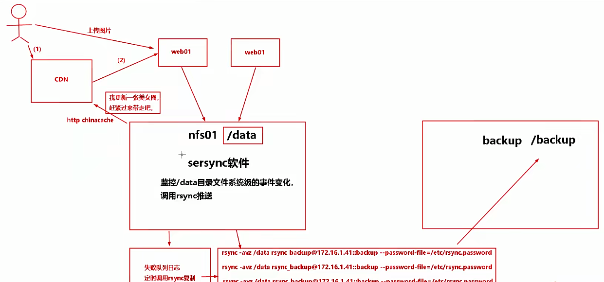

## 脚本修改ip和hostname
下面的128是IP地址的最后一个比如192.168.220.128，那么其他的机器就是根据128进行克隆得到的，然后执行脚本进行替换128。

```
#!/bin/sh
if [ $# -ne 2 ];then
  echo "/bin/sh $0 hostname PartIP"
  exit 1
fi
hostnamectl set-hostname $1 #第一个参数
sed -i "/IPADDR/s#128#$2#g"  /etc/sysconfig/network-scripts/ifcfg-ens33 #<==模板机IP最后8位默认是200。
systemctl restart network
#check
hostname
exit

#sh net.sh hadoop2  129
#sh net.sh hadoop3  130
```

## ssh优化
```
vim /etc/ssh/sshd_config
```

```
Port 52113
ListenAddress 172.16.1.7:52113
PermitRootLogin no
PermitEmptyPasswords no
UseDNS no
GSSAPIAuthentication no

0.0.0.0:22 表示sshd服务监听任意网卡，监听所有IP请求。
```

重启服务
```
systemctl restart sshd
```

## 配置主机域名
```
cat >/etc/hosts<<EOF
127.0.0.1    localhost localhost.localdomain localhost4 localhost4.localdomain4
::1          localhost localhost.localdomain localhost6 localhost6.localdomain6
192.168.220.128 hadoop1
192.168.220.129 hadoop2
192.168.220.130 hadoop3
192.168.220.131 hadoop4
192.168.220.132 hadoop5
EOF
```

## rsync 的使用

### 普通使用

```
yum install -y rsync
```

```
语法：
push,推：从本地推到远端。
rsync	    [OPTION...]   SRC... 	 [USER@]HOST:[DEST]        
rsync命令	参数选项	本地路径 [认证用户]@[主机地址]:[目标路径]

push实践：
没用隧道：
rsync -avz /etc/hosts root@172.16.1.31:/opt/ #加密传输，限制root。
rsync -avz /etc/hosts bigdata@172.16.1.31:/tmp/ #加密传输，限制root。
使用隧道;
rsync -avz /etc/hosts -e "ssh -p 22" root@172.16.1.31:/opt/
rsync -avz /etc -e "ssh -p 22" bigdata@172.16.1.31:/tmp/
#上述命令是等价的。-e 指定通道  ssh ssh服务连接客户端  -p 22指定22端口。

拉的命令：
rsync -avz root@172.16.1.41:/opt/hosts /opt
rsync -avz -e "ssh -p 22" root@172.16.1.41:/opt/hosts /opt
```

配置ssh免密

```
ssh-keygen 
ssh-copy-id hadoop1
ssh-copy-id hadoop2
ssh-copy-id hadoop3
ssh-copy-id hadoop4
ssh-copy-id hadoop5
```

推模式
```
rsync -avz /etc/hosts root@hadoop2:/opt/

rsync -avz /etc/hosts -e "ssh -p 22" root@hadoop2:/opt/
```
拉模式
```
rsync -avz root@hadoop2:/opt/hosts /opt

rsync -avz -e "ssh -p 22" root@hadoop2:/opt/hosts /opt
```

### 本地无差异同步

```
rsync -avz --delete root@hadoop2:/opt/ /opt
```

### 复制限速
```
rsync -avz --bwlimit=1 root@hadoop2:/opt/ /opt
```

## Sersync实时同步
相关网站
> https://www.cnblogs.com/panwenbin-logs/p/7742288.html



rsync+sersync
- sersync可以记录被监听目录中发生变化的（增，删，改）具体某个文件或目录的名字；
- rsync在同步时，只同步发生变化的文件或目录（每次发生变化的数据相对整个同步目录数据来说很小，rsync在遍历查找对比文件时，速度很快），因此效率很高。

### 部署rsync服务(rsync-server服务器上配置)

| ip | 角色 | 
|:--------| :---------:|
| 192.168.220.128 | rsync-client |
| 192.168.220.129 | rsync-server |

- 部署rsync服务(rsync-server服务器上配置)

```
yum install rsync -y #安装rsync，如果嫌yum版本过低也可以源码安装
```

- 默认rsync没有配置文件，创建一个，文件中#和汉字仅为注释，使用中请将所有注释清除

```
vim /etc/rsyncd.conf 
```
```
uid = root
gid = root
use chroot = no                       
max connections = 2000                 
timeout = 600                          
pid file =/var/run/rsyncd.pid          
lock file =/var/run/rsync.lock          
log file = /var/log/rsyncd.log          
ignore errors                           
read only = false                       
list = false                            
hosts allow = 192.168.0.0/16                            
auth users = rsync_backup               
secrets file =/etc/rsync.password      

[www]                                   
comment = www 
path = /data/www/

[bbs]
comment = bbs
path = /data/bbs/

[blog]
comment = blog
path = /data/blog/
#rsync_config____________end
```

```
#Rsync server
uid = root
gid = root
use chroot = no                         # 安全相关
max connections = 2000                  # 并发连接数
timeout = 600                           # 超时时间（秒）
pid file =/var/run/rsyncd.pid           # 指定rsync的pid目录
lock file =/var/run/rsync.lock          # 指定rsync的锁文件【重要】
log file = /var/log/rsyncd.log          # 指定rsync的日志目录
ignore errors                             #忽略一些I/O错误
read only = false                       #设置rsync服务端文件为读写权限
list = false                            #不显示rsync服务端资源列表
hosts allow = 192.168.0.0/16               #允许进行数据同步的客户端IP地址，可以设置多个，用英文状态下逗号隔开
#hosts deny = 0.0.0.0/32                 #禁止数据同步的客户端IP地址，可以设置多个，用英文状态下逗号隔开
auth users = rsync_backup               #执行数据同步的用户名，可以设置多个，用英文状态下逗号隔开
secrets file =/etc/rsync.password       #用户认证配置文件，里面保存用户名称和密码
#################################################
[www]                                   # 模块 
comment = www 
path = /data/www/
#################################################
[bbs]
comment = bbs
path = /data/bbs/
#################################################
[blog]
comment = blog
path = /data/blog/
#rsync_config____________end
```

- 创建用户认证文件

```
echo  "rsync_backup:123456">/etc/rsync.password  #配置文件，添加以下内容
```

- 设置文件权限

```
chmod 600 /etc/rsync.password 
```

- 启动守护进程，并写入开机自启动

```
rsync --daemon  #可以使用--config= 指定非标准路径下的配置文件
vim /etc/rc.local
# rsync server progress
/usr/bin/rsync --daemon
```

- 检查是否启动成功

```
ps -ef | grep sync | grep -v grep 
root       7521      1  0 11:39 ?        00:00:00 /usr/bin/rsync --daemon --no-detach

netstat -lntup | grep rsync
tcp        0      0 0.0.0.0:873             0.0.0.0:*               LISTEN      7521/rsync          
tcp6       0      0 :::873                  :::*                    LISTEN      7521/rsync 
```

- 创建相关待同步的目录

```
mkdir -p /data/{www,bbs,blog}
```

### rsync-client客户端配置

- 安装rsync，方法同上

- 创建rsync配置文件，客户端创建即可，无需内容

```
touch /etc/rsyncd.conf
```

- 配置rsync客户端相关权限认证：

```
 echo "123456">/etc/rsync.password
 chmod 600 /etc/rsync.password 
```

- 创建待同步数据，在客户端创建一些数据

```
mkdir -p /data/{www,bbs,blog}
touch /data/www/www.log /data/bbs/bbs.log  /data/blog/blog.log
```

- 测试rsync是否同步

```
cd /data/www/
touch {1..3}.txt
```
```
#/data/www/表示本地需要同步的数据目录  rsync_backup@192.168.220.129::www表示服务端的指定名称的模块下  本条命令执行的操作为：将第一个路径参数下的文件同步到第二个路径参数下  即:推模式 调换路径则为:拉模式
rsync  -avzP /data/www/ rsync_backup@192.168.220.129::www/   --password-file=/etc/rsync.password   

sending incremental file list
./
1.txt              0 100%    0.00kB/s    0:00:00 (xfr#1, to-chk=2/4)
2.txt              0 100%    0.00kB/s    0:00:00 (xfr#2, to-chk=1/4)
3.txt
              0 100%    0.00kB/s    0:00:00 (xfr#3, to-chk=0/4)
sent 207 bytes  received 84 bytes  582.00 bytes/sec
total size is 0  speedup is 0.00

#rsync  -avzP /data/www rsync://rsync_backup@172.16.150.131/data/www   --password-file=/etc/rsync.password 第二种方法,直接指定路径
#rsync  -avzP /data/www rsync://rsync_backup@172.16.150.131/data/www/   --password-file=/etc/rsync.password #test为服务器上的目录
参数： --delete 无差异同步
          --bwlimit=KB/S  限速
           --exclude=PATTERN       exclude files matching PATTERN
           --exclude-from=FILE     read exclude patterns from FILE
           --include=PATTERN       don’t exclude files matching PATTERN
           --include-from=FILE     read include patterns from FILE
#此步骤必须成功才能进行下一步
```

### 开始部署sersync服务(rsync-client上)
百度网盘链接: https://pan.baidu.com/s/11yL6HtZsblkZR8vSSIvzrw 提取码: tdam 

```
tar -zxvf sersync_64bit_20160928.tar.gz -C /usr/local/  
cd /usr/local/application
```

- 配置sersync

```
cp sersync/conf/confxml.xml  sersync/conf/confxml.xml-bak
vim  sersync/conf/confxml.xml
修改24--28行
 24         <localpath watch="/opt/tongbu">
 25             <remote ip="127.0.0.1" name="tongbu1"/>
 26             <!--<remote ip="192.168.8.39" name="tongbu"/>-->
 27             <!--<remote ip="192.168.8.40" name="tongbu"/>-->
 28         </localpath>
修改后的内容为：192.168.220.129 远程服务地址，www为远程模块名称
     <localpath watch="/data/www">
             <remote ip="192.168.220.129" name="www"/>
     </localpath>

修改29--35行，认证部分(rsync密码认证)
29         <rsync>
30             <commonParams params="-artuz"/>
31             <auth start="false" users="root" passwordfile="/etc/rsync.pas"/>
32             <userDefinedPort start="false" port="874"/><!-- port=874 -->
33             <timeout start="false" time="100"/><!-- timeout=100 -->
34             <ssh start="false"/>
35         </rsync>

修改后的内容如下：
	<rsync>
	    <commonParams params="-artuz"/>
	    <auth start="true" users="rsync_backup" passwordfile="/etc/rsync.password"/>
	    <userDefinedPort start="false" port="873"/>
	    <timeout start="true" time="100"/>
	    <ssh start="false"/>
	</rsync>

```
上面的873是server端的服务端口,rsync_backup是server端的auth users用户

```
netstat -lntup | grep rsync
tcp        0      0 0.0.0.0:873             0.0.0.0:*               LISTEN      7521/rsync          
tcp6       0      0 :::873                  :::*                    LISTEN      7521/rsync
```

- 开启sersync守护进程同步数据

```
/usr/local/application/application/sersync/bin/sersync  -d -r -o /usr/local/application/application/sersync/conf/confxml.xml 
```

执行以后打印如下
```
set the system param
execute：echo 50000000 > /proc/sys/fs/inotify/max_user_watches
execute：echo 327679 > /proc/sys/fs/inotify/max_queued_events
parse the command param
option: -d      run as a daemon
option: -r      rsync all the local files to the remote servers before the sersync work
option: -o      config xml name：  /usr/local/application/application/sersync/conf/confxml.xml
daemon thread num: 10
parse xml config file
host ip : localhost  host port: 8008
daemon start，sersync run behind the console 
use rsync password-file :
user is rsync_backup
passwordfile is      /etc/rsync.password
config xml parse success
please set /etc/rsyncd.conf max connections=0 Manually
sersync working thread 12  = 1(primary thread) + 1(fail retry thread) + 10(daemon sub threads) 
Max threads numbers is: 22 = 12(Thread pool nums) + 10(Sub threads)
please according your cpu ，use -n param to adjust the cpu rate
------------------------------------------
rsync the directory recursivly to the remote servers once
working please wait...
execute command: cd /data/www && rsync -artuz -R --delete ./  --timeout=100 rsync_backup@192.168.220.129::www --password-file=/etc/rsync.password >/dev/null 2>&1 
run the sersync: 
watch path is: /data/www
```

- 测试同步

```
cd /data/www/
echo "zyt66" > anzhanghoa.txt
```
在client端执行以后，在server端就可以看到实时同步结果了。

### 多实例情况
```
1、配置多个confxml.xml文件（比如：www、bbs、blog....等等）
    confxml-bbs.xml  confxml-blog.xml  confxml-www.xml(按照单个实例配置即可)
    2、根据不同的需求同步对应的实例文件
    rsync -avzP /data/www/ rsync_backup@10.1.20.109::www/   --password-file=/etc/rsync.password
    rsync -avzP /data/bbs/ rsync_backup@10.1.20.109::bbs/   --password-file=/etc/rsync.password
    rsync -avzP /data/test/ rsync_backup@10.1.20.109::blog/   --password-file=/etc/rsync.passwor
分别启动即可
```


