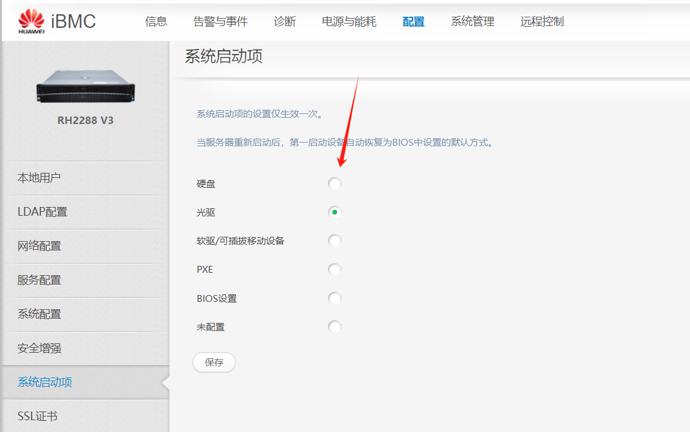
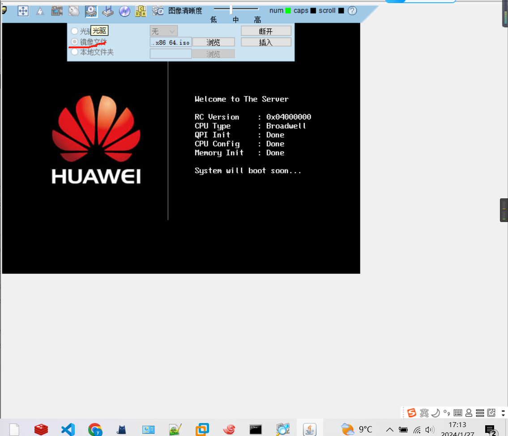
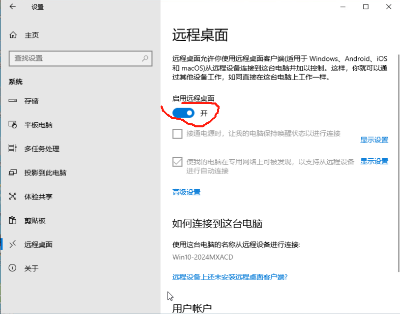
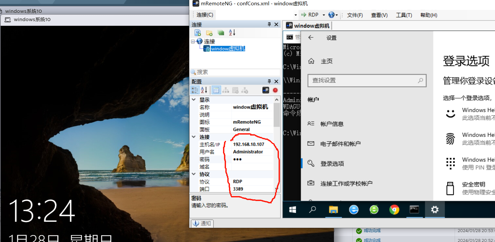

## 下载镜像

## 访问服务器网页

### 选择光驱启动



### 选择镜像



然后点上电就行了（上电就是远程开机）

## 镜像地址下载

### windows
> https://msdn.itellyou.cn/

windows 虚拟化的时候要注意点,配置好iso路径以后，用bios启动才行。

### mac
> https://sysin.org/blog/macOS/

### centos
> http://mirrors.aliyun.com/centos/7/isos/x86_64/

```
     CentOS-7.0-x86_64-DVD-1503-01.iso              标准安装版，一般下载这个就可以了（推荐）
 
     CentOS-7.0-x86_64-NetInstall-1503-01.iso       网络安装镜像（从网络安装或者救援系统）
 
     CentOS-7.0-x86_64-Everything-1503-01.iso     对完整版安装盘的软件进行补充，集成所有软件。（包含centos7的一套完整的软件包，可以用来安装系统或者填充本地镜像）
 
     CentOS-7.0-x86_64-GnomeLive-1503-01.iso   GNOME桌面版
 
     CentOS-7.0-x86_64-KdeLive-1503-01.iso         KDE桌面版
 
     CentOS-7.0-x86_64-livecd-1503-01.iso            光盘上运行的系统，类拟于winpe 
 
     CentOS-7.0-x86_64-minimal-1503-01.iso         精简版，自带的软件最少
```

**相关博客**
> https://blog.csdn.net/weixin_42430824/article/details/81019039

## 远程连接

### centos
直接使用ssh连接就行了

### windows

**连接工具下载地址**
> https://mremoteng.org/download

**开启远程连接**



**查看账户命令**

cmd下，输入net user,远程登录的账户要设置密码才能够登录。

