## 安装

### 配置Yum源
配置yum(安装完centos后默认的yum源+下面zabbix源)

```
vim /etc/yum.repos.d/zabbix.repo
```
所有机器(zabbix服务器和所有被监控端)加上zabbix源

~~~powershell
[zabbix]
name=zabbix
baseurl=https://mirrors.tuna.tsinghua.edu.cn/zabbix/zabbix/3.4/rhel/7/x86_64/
enabled=1
gpgcheck=0
[zabbix_deps]
name=zabbix_deps
baseurl=https://mirrors.tuna.tsinghua.edu.cn/zabbix/non-supported/rhel/7/x86_64/
enabled=1
gpgcheck=0
~~~


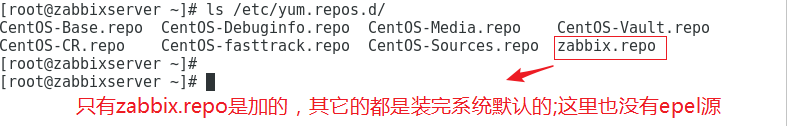

### zabbix服务器安装

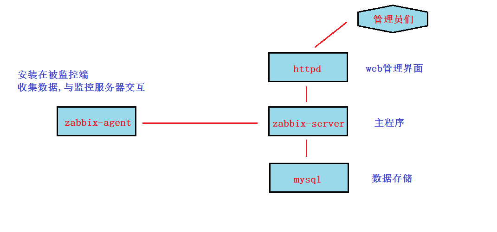

1,安装zabbix和mariadb数据库

~~~powershell
[root@zabbixserver ~]# yum install zabbix-server-mysql zabbix-web-mysql mariadb-server
~~~

2, 在mysql(mariadb)里建立存放数据的库并授权，然后导入zabbix所需要用的表和数据

```
systemctl restart mariadb.service
systemctl enable mariadb.service
```
~~~powershell
安装以后直接执行mysql就可以进入数据库了
[root@zabbixserver ~]# mysql -uroot
~~~

MariaDB [(none)]> create database zabbix default charset utf8;		这里一定要用utf8字符集，否则后面zabbix很多中文用不了(比如创建中文名用户就创建不了)
```
grant all on zabbix.* to zabbix@'localhost' identified by '123';
flush privileges;
quit
```

3, 导入表数据

~~~powershell
下面这条命令不要乱复制粘贴,如果你版本不一样(或者官网yum源版本升级),3.4.15就要改成对应版本
[root@zabbixserver ~]# zcat /usr/share/doc/zabbix-server-mysql-3.4.15/create.sql.gz |mysql -u zabbix -p123 zabbix
~~~

4, 配置zabbix主配置文件，并启动服务,确认端口

找到并确认如下参数（**==默认值正确的不用打开注释==**.默认值不对的，要修改正确并打开注释）

```
vim /etc/zabbix/zabbix_server.conf
```

~~~powershell
我这里只需要改连接数据的密码和socket
ListenPort=10051
DBHost=localhost
DBName=zabbix
DBUser=zabbix
DBPassword=123						--这里要对应上面第2步的授权进行修改
DBSocket=/var/lib/mysql/mysql.sock 	--这里默认的socket路径不对，改成我这个路径
ListenIP=0.0.0.0	
~~~

```
sudo systemctl restart zabbix-server
sudo systemctl enable zabbix-server
sudo yum install -y  lsof
sudo lsof -i:10051
```

5, 配置zabbix的httpd子配置文件,并启动httpd

~~~powershell
打开第20行注释，并修改成你的时区
[root@zabbixserver ~]# vim /etc/httpd/conf.d/zabbix.conf

20 php_value date.timezone Asia/Shanghai

[root@zabbixserver ~]# systemctl restart httpd 
[root@zabbixserver ~]# systemctl enable httpd
~~~

6, 使用浏览器访问http://10.1.1.11/zabbix，并按提示进行安装

~~~powershell
按照图示过程安装
1,welcome
2,Check of pre-requisites
3,Configure DB connection
数据库用户名填zabbix,密码填123（前面授权过的）
4,Zabbix server details
在name选项填上你zabbix服务器的IP或者主机名
5,Pre-Installation summary
6,install

完成后
登陆用户名为:admin
登陆密码为:zabbix
~~~

7,右上角点一个类似小人的图标   --》 语言选 chinese zh-cn  --》 点 update后换成中文件界面

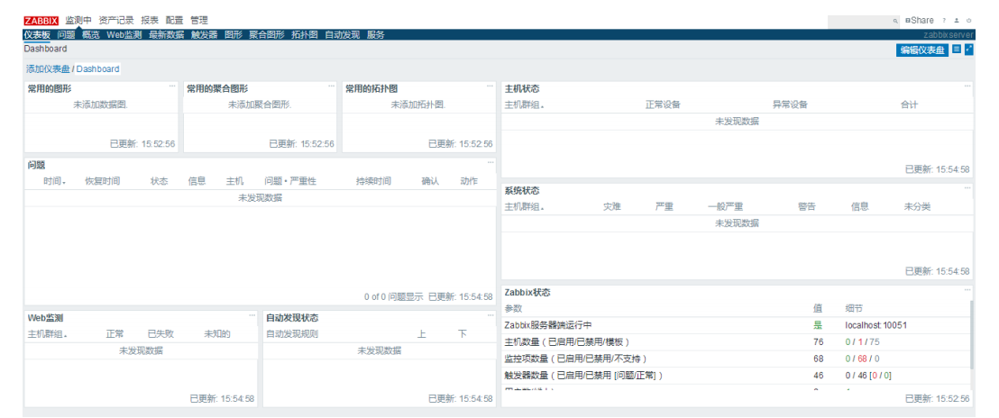

### 监控本机

1.在master上安装zabbix-agent

~~~powershell
[root@zabbixserver ~]# yum install zabbix-agent
~~~

2,启动zabbix-agent服务

```powershell
[root@zabbixserver ~]# rpm -qa | grep zabbix
[root@zabbixserver ~]# rpm -qc zabbix-agent-3.4.15-1.el7.x86_64
[root@zabbixserver ~]# vim /etc/zabbix/zabbix_agentd.conf	
下面两个常见选项都为默认值，不用配置
Server=127.0.0.1		--zabbix服务器的IP，这里是本机
ListenPort=10050		--监控服务器连接被监控客户端的端口
```

```
[root@zabbixserver ~]# systemctl restart zabbix-agent
[root@zabbixserver ~]# systemctl enable  zabbix-agent

[root@zabbixserver ~]# lsof -i:10050
```

**如果启动报错看日志**

tail -1000 /var/log/zabbix/zabbix_agentd.log
Zabbix agent启动报错：cannot create semaphore set
```
vim /etc/sysctl.conf 

kernel.sem =500  64000   64      256

sysctl -p /etc/sysctl.conf 
```

3,回到web管理界面 －－》点配置－－》点主机－－》默认看到叫Zabbix server的本机，但状态是停用的－－》点击并启用


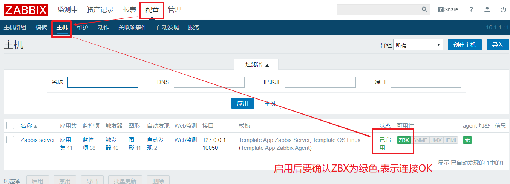


4,点zabbix server里的图形－－》任意选一张图后点预览－－》看到图上有乱码

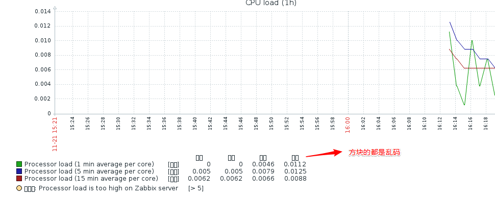

5, 解决乱码方法: 换一个字体
> https://blog.csdn.net/m0_56055257/article/details/131260948?app_version=6.2.7&csdn_share_tail=%7B%22type%22%3A%22blog%22%2C%22rType%22%3A%22article%22%2C%22rId%22%3A%22131260948%22%2C%22source%22%3A%22S1124654%22%7D&utm_source=app

在windows下面选择字体
```
C:\Windows\Fonts

mv /usr/share/zabbix/fonts/graphfont.ttf /usr/share/zabbix/fonts/graphfont.ttf.bak

黑体的可以其他的好像不太行
mv SIMHEI.TTF /usr/share/zabbix/fonts/graphfont.ttf
```

6, 做完后,不用重启服务,回到zabbix的web界面刷新查看图形就会发现没有乱码了

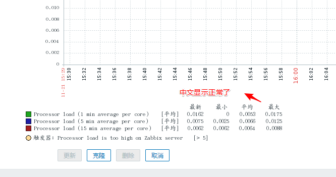

### 通过zabbix-agent监控远程机器

1,在agent1上安装zabbix-agent包

~~~powershell
[root@agent1 ~]# yum install zabbix-agent
~~~

2,配置zabbix-agent端的配置文件,启动服务并做成开机自动启动

~~~powershell
[root@agent1 ~]# vim /etc/zabbix/zabbix_agentd.conf

97 Server=10.1.1.11				修改成zabbix监控服务器的IP

[root@agent1 ~]# systemctl restart zabbix-agent
[root@agent1 ~]# systemctl enable zabbix-agent

[root@agent1 ~]# lsof -i:10050
~~~

3, 回到web管理界面－－》点配置－－》点主机 －－》 点创建主机

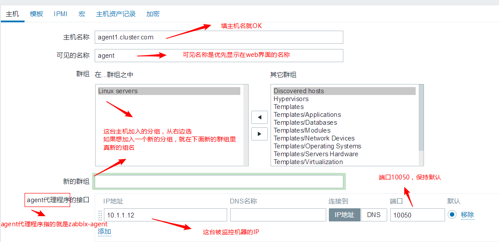

4,为主机添加要监控的模板－－》点模板－－》点选择－－》把 Template OS Linux　前面打勾(其它模板视随意加)－－》点选择 －－》点添加 －－》最后点右下角的添加

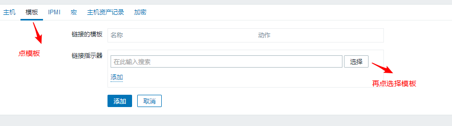


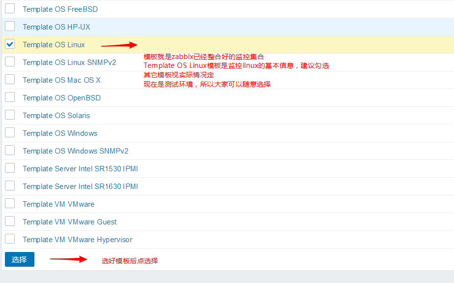


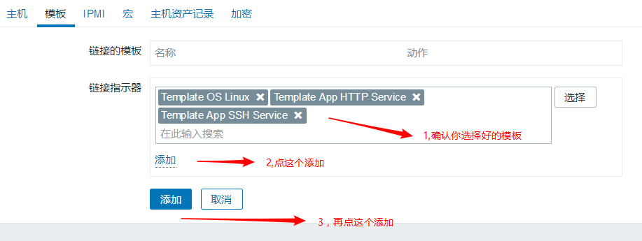

5,确认

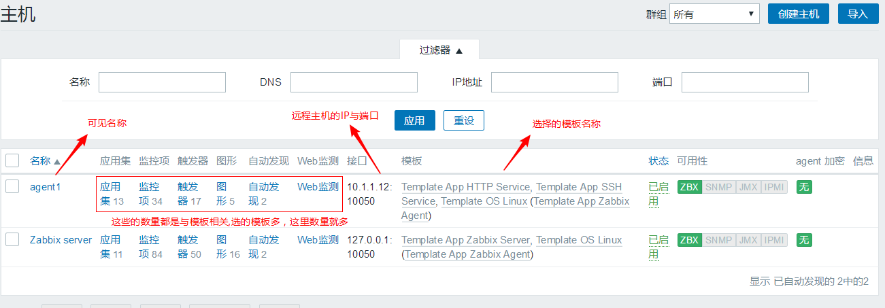


