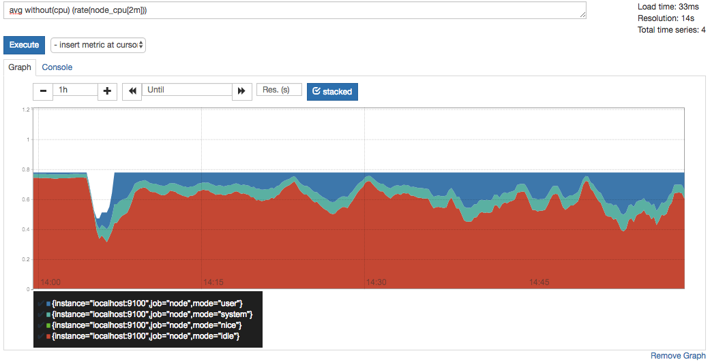
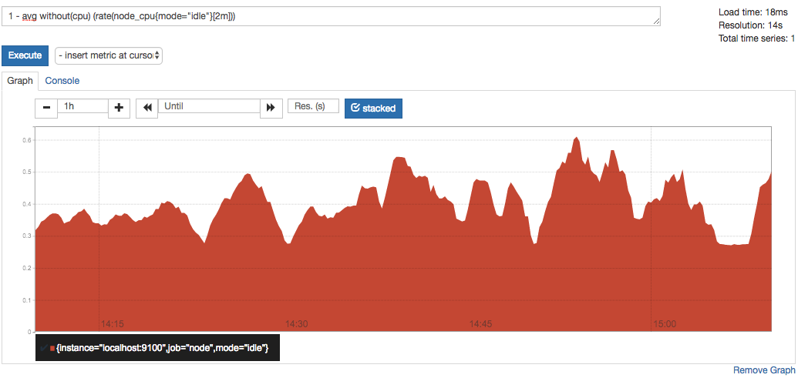
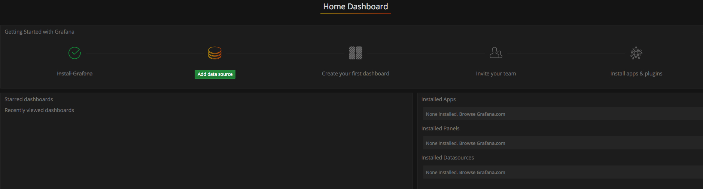

## 安装Prometheus Server

Prometheus基于Golang编写，编译后的软件包，不依赖于任何的第三方依赖。用户只需要下载对应平台的二进制包，解压并且添加基本的配置即可正常启动Prometheus Server。

### 从二进制包安装

对于非Docker用户，可以从```https://prometheus.io/download/```找到最新版本的Prometheus Sevrer软件包：

```shell
export VERSION=2.4.3
curl -LO  https://github.com/prometheus/prometheus/releases/download/v$VERSION/prometheus-$VERSION.darwin-amd64.tar.gz
```

解压，并将Prometheus相关的命令，添加到系统环境变量路径即可：

```shell
tar -xzf prometheus-${VERSION}.darwin-amd64.tar.gz
cd prometheus-${VERSION}.darwin-amd64
```

解压后当前目录会包含默认的Prometheus配置文件promethes.yml:

```yml
# my global config
global:
  scrape_interval:     15s # Set the scrape interval to every 15 seconds. Default is every 1 minute.
  evaluation_interval: 15s # Evaluate rules every 15 seconds. The default is every 1 minute.
  # scrape_timeout is set to the global default (10s).

# Alertmanager configuration
alerting:
  alertmanagers:
  - static_configs:
    - targets:
      # - alertmanager:9093

# Load rules once and periodically evaluate them according to the global 'evaluation_interval'.
rule_files:
  # - "first_rules.yml"
  # - "second_rules.yml"

# A scrape configuration containing exactly one endpoint to scrape:
# Here it's Prometheus itself.
scrape_configs:
  # The job name is added as a label `job=<job_name>` to any timeseries scraped from this config.
  - job_name: 'prometheus'

    # metrics_path defaults to '/metrics'
    # scheme defaults to 'http'.

    static_configs:
    - targets: ['localhost:9090']
```

**简要说明：**

| 配置项                 | 作用                                                                                                                                                                                |
|-----------------------|-----------------------------------------------------------------------------------------------------------------------------------------------------------------------------------|
| global:               | 全局配置部分，设置了整个 Prometheus 的全局参数。                                                                                                                               |
|   ...                 |                                                                                                                                                                                   |
| rule_files:           | 规则文件配置，用于加载和定期评估规则。                                                                                                                                            |
|   - "first_rules.yml" | 指定要加载的第一个规则文件的路径。规则文件包含了监控数据的条件和警报逻辑。                                                                                                     |
|   - "second_rules.yml"| 指定要加载的第二个规则文件的路径。可以根据需求添加更多的规则文件。                                                                                                                 |
|                       |                                                                                                                                                                                   |
| scrape_configs:       | 数据抓取配置部分，用于配置从哪些目标抓取数据。                                                                                                                                     |
|   ...                 |                                                                                                                                                                                   |

Promtheus作为一个时间序列数据库，其采集的数据会以文件的形式存储在本地中，默认的存储路径为data/，因此我们需要先手动创建该目录：

```shell
mkdir data
```
用户也可以通过参数```--storage.tsdb.path="data/"```修改本地数据存储的路径。
启动prometheus服务，其会默认加载当前路径下的prometheus.yaml文件：

**启动**

```shell
./prometheus --storage.tsdb.path="data/"
```

或者

```shell
nohup ./prometheus --web.enable-lifecycle=true --config.file=prometheus.yml --storage.tsdb.path="data/" > ./prometheus.log 2>&1 &
```

**关闭**

```shell
curl -X POST http://localhost:9090/-/quit
```

正常的情况下，你可以看到以下输出内容：

```log
level=info ts=2018-10-23T14:55:14.499484Z caller=main.go:554 msg="Starting TSDB ..."
level=info ts=2018-10-23T14:55:14.499531Z caller=web.go:397 component=web msg="Start listening for connections" address=0.0.0.0:9090
level=info ts=2018-10-23T14:55:14.507999Z caller=main.go:564 msg="TSDB started"
level=info ts=2018-10-23T14:55:14.508068Z caller=main.go:624 msg="Loading configuration file" filename=prometheus.yml
level=info ts=2018-10-23T14:55:14.509509Z caller=main.go:650 msg="Completed loading of configuration file" filename=prometheus.yml
level=info ts=2018-10-23T14:55:14.509537Z caller=main.go:523 msg="Server is ready to receive web requests."
```

Prometheus具有几个配置本地存储的标志。其中最重要的是：

- `--storage.tsdb.path`：Prometheus写入其数据库的路径。默认为 data/。
- `--storage.tsdb.retention.time`：何时删除旧数据。**默认为 15 天**。如果将此标志设置为除 default 以外的任何内容，它将覆盖 storage.tsdb.retention。
- `--storage.tsdb.retention.size`：要保留的存储块的最大字节数。将首先删除最旧的数据。默认为 0 或禁用。支持的单位有：B、KB、MB、GB、TB、PB、EB。例如："512MB"。基于2的幂，因此 1KB 等于 1024B。仅会删除持久块以遵守保留策略，虽然WAL和内存映射块会计入总大小。因此，磁盘的最小要求是WAL（WAL和Checkpoint）和chunks_head（内存映射的Head块）目录的峰值空间（每2小时达到峰值）。
- `--storage.tsdb.retention`：已弃用，建议使用 storage.tsdb.retention.time。
- `--storage.tsdb.wal-compression`：启用写前日志（WAL）的压缩。根据数据情况，您可以预期WAL大小减半，但额外的CPU负载较小。此标志从2.11.0引入，并在2.20.0中默认启用。请注意，启用后，将Prometheus降级到2.11.0以下版本将需要删除WAL。

Prometheus每个样本仅存储平均 1-2 个字节。因此，为了计划Prometheus服务器的容量，可以使用以下粗略公式：

所需的磁盘空间 = 保留时间（以秒为单位）× 每秒摄取的样本数 × 每个样本的字节数

> needed_disk_space = retention_time_seconds \* ingested_samples_per_second \* bytes_per_sample

要降低摄取样本的速率，可以减少抓取的时间序列数量（减少目标数或每个目标的系列数），或者可以增加抓取间隔。然而，由于在系列内对样本进行了压缩，减少系列数量可能更有效。

如果本地存储因任何原因损坏，解决问题的最佳策略是关闭 Prometheus，然后删除整个存储目录。您还可以尝试删除单个块目录或WAL目录以解决问题。请注意，这意味着每个块目录丢失约两小时的数据。再次强调，Prometheus的本地存储不适用于长期持久存储；外部解决方案提供了扩展的保留和数据持久性。

注意：不支持非POSIX兼容的文件系统作为Prometheus的本地存储，可能会发生无法恢复的损坏。不支持NFS文件系统（包括AWS的EFS）。NFS可以是POSIX兼容的，但大多数实现不是。强烈建议使用本地文件系统以确保可靠性。
如果同时指定了时间和大小保留策略，将使用最先触发的策略。

过期块清理在后台进行。可能需要多达两小时才能删除过期块。必须完全过期后才能删除块。

> https://prometheus.io/docs/prometheus/latest/storage/

### 使用容器安装

对于Docker用户，直接使用Prometheus的镜像即可启动Prometheus Server：

```shell
docker run -p 9090:9090 -v /etc/prometheus/prometheus.yml:/etc/prometheus/prometheus.yml prom/prometheus
```

启动完成后，可以通过```http://localhost:9090```访问Prometheus的UI界面：


## 使用Node Exporter采集主机数据

在Prometheus的架构设计中，Prometheus Server并**不直接服务监控特定的目标，其主要任务负责数据的收集，存储并且对外提供数据查询支持**。因此为了能够能够监控到某些东西，如主机的CPU使用率，我们需要使用到Exporter。Prometheus周期性的从Exporter暴露的HTTP服务地址（通常是/metrics）拉取监控样本数据。
从上面的描述中可以看出Exporter可以是一个相对开放的概念，**其可以是一个独立运行的程序独立于监控目标以外，也可以是直接内置在监控目标中**。只要能够向Prometheus提供标准格式的监控样本数据即可。

这里为了能够采集到主机的运行指标如CPU, 内存，磁盘等信息。我们可以使用Node Exporter。
Node Exporter同样采用Golang编写，并且不存在任何的第三方依赖，只需要下载，解压即可运行。可以从```https://prometheus.io/download/```获取最新的node exporter版本的二进制包。

```shell
curl -OL https://github.com/prometheus/node_exporter/releases/download/v0.15.2/node_exporter-0.15.2.darwin-amd64.tar.gz
tar -xzf node_exporter-0.15.2.darwin-amd64.tar.gz
```

运行node exporter:

```shell
cd node_exporter-0.15.2.darwin-amd64
cp node_exporter-0.15.2.darwin-amd64/node_exporter /usr/local/bin/
nohup ./node_exporter  > ./node_exporter.log 2>&1 &
```

启动成功后，可以看到以下输出：

```shell
INFO[0000] Listening on :9100                            source="node_exporter.go:76"
```

访问```http://localhost:9100/```可以看到以下页面：


### 初始Node Exporter监控指标

访问```http://localhost:9100/metrics```，可以看到当前node exporter获取到的当前主机的所有监控数据，如下所示：


每一个监控指标之前都会有一段类似于如下形式的信息：

```
# HELP node_cpu Seconds the cpus spent in each mode.
# TYPE node_cpu counter
node_cpu{cpu="cpu0",mode="idle"} 362812.7890625
# HELP node_load1 1m load average.
# TYPE node_load1 gauge
node_load1 3.0703125
```

其中HELP用于解释当前指标的含义，**TYPE则说明当前指标的数据类型**。在上面的例子中node_cpu的注释表明当前指标是cpu0上idle进程占用CPU的总时间，CPU占用时间是一个只增不减的度量指标，**从类型中也可以看出node_cpu的数据类型是计数器(counter)**，与该指标的实际含义一致。又例如node_load1该指标反映了当前主机在最近一分钟以内的负载情况，系统的负载情况会随系统资源的使用而变化，因此node_load1反映的是当前状态，**数据可能增加也可能减少，从注释中可以看出当前指标类型为仪表盘(gauge)，与指标反映的实际含义一致**。

### 从Node Exporter收集监控数据

为了能够让Prometheus Server能够从当前node exporter获取到监控数据，这里需要修改Prometheus配置文件。编辑prometheus.yml并在scrape_configs节点下添加以下内容:

```yml
scrape_configs:
  - job_name: 'prometheus'
    static_configs:
      - targets: ['localhost:9090']
  # 采集node exporter监控数据
  - job_name: 'node'
    static_configs:
      - targets: ['localhost:9100']
```

重新启动Prometheus Server,访问```http://localhost:9090```，进入到Prometheus Server。如果输入“up”并且点击执行按钮以后，可以看到如下结果：


如果Prometheus能够正常从node exporter获取数据，则会看到以下结果：

```
up{instance="localhost:9090",job="prometheus"}    1
up{instance="localhost:9100",job="node"}    1
```

其中“1”表示正常，反之“0”则为异常。

## 使用PromQL查询监控数据

Prometheus UI是Prometheus内置的一个可视化管理界面，通过Prometheus UI用户能够轻松的了解Prometheus当前的配置，监控任务运行状态等。 **通过Graph面板，用户还能直接使用PromQL实时查询监控数据**：


切换到Graph面板，用户可以使用PromQL表达式查询特定监控指标的监控数据。如下所示，查询主机负载变化情况，可以使用关键字node_load1可以查询出Prometheus采集到的主机负载的样本数据，这些样本数据按照时间先后顺序展示，形成了主机负载随时间变化的趋势图表：


PromQL是Prometheus自定义的一套强大的数据查询语言，除了使用监控指标作为查询关键字以为，还内置了大量的函数，帮助用户进一步对时序数据进行处理。例如使用```rate()```函数，可以计算在**单位时间内样本数据的变化情况即增长率**，因此通过该函数我们可以近似的通过CPU使用时间计算CPU的利用率：

```promql
rate(node_cpu[2m])
```


这时如果要忽略是哪一个CPU的，只需要使用without表达式，将标签CPU去除后聚合数据即可：

```
avg without(cpu) (rate(node_cpu[2m]))
```



那如果需要计算系统CPU的总体使用率，通过排除系统闲置的CPU使用率即可获得:

```
1 - avg without(cpu) (rate(node_cpu{mode="idle"}[2m]))
```



通过PromQL我们可以非常方便的对数据进行**查询，过滤，以及聚合，计算等操作**。通过这些丰富的表达书语句，监控指标不再是一个单独存在的个体，而是一个个能够表达出正式业务含义的语言。

## 监控数据可视化Grafana

### 图表

Prometheus UI提供了快速验证PromQL以及临时可视化支持的能力，而在大多数场景下引入监控系统通常还需要构建可以长期使用的监控数据可视化面板（Dashboard）。这时用户可以考虑使用第三方的可视化工具如Grafana，Grafana是一个开源的可视化平台，并且提供了对Prometheus的完整支持。

```shell
docker run -d -p 3000:3000 grafana/grafana
```

访问```http://localhost:3000```就可以进入到Grafana的界面中，默认情况下使用账户admin/admin进行登录。在Grafana首页中显示默认的使用向导，包括：安装、添加数据源、创建Dashboard、邀请成员、以及安装应用和插件等主要流程:



这里将添加Prometheus作为默认的数据源，如下图所示，指定数据源类型为Prometheus并且设置Prometheus的访问地址即可，在配置正确的情况下点击“Add”按钮，会提示连接成功的信息：


在完成数据源的添加之后就可以在Grafana中创建我们可视化Dashboard了。Grafana提供了对PromQL的完整支持，如下所示，通过Grafana添加Dashboard并且为该Dashboard添加一个类型为“Graph”的面板。 并在该面板的“Metrics”选项下通过PromQL查询需要可视化的数据：


点击界面中的保存选项，就创建了我们的第一个可视化Dashboard了。 当然作为开源软件，Grafana社区鼓励用户分享Dashboard通过```https://grafana.com/dashboards```网站，可以找到大量可直接使用的Dashboard：


Grafana中所有的Dashboard通过JSON进行共享，下载并且导入这些JSON文件，就可以直接使用这些已经定义好的Dashboard：


### 监控

**飞书**

> https://www.feishu.cn/hc/zh-CN/articles/555473130655-%E5%A6%82%E4%BD%95%E4%BD%BF%E7%94%A8%E6%9C%BA%E5%99%A8%E4%BA%BA%E6%8C%87%E4%BB%A4

**钉钉**

> https://blog.csdn.net/zephyr_wang/article/details/126924575

## 参考

### 安装
> https://blog.csdn.net/S1124654/article/details/126159497

> https://yunlzheng.gitbook.io/prometheus-book/parti-prometheus-ji-chu/quickstart/prometheus-quick-start/use-grafana-create-dashboard

> https://www.cnblogs.com/chanshuyi/category/1862951.html

### 启动相关

> https://prometheus.io/docs/prometheus/latest/command-line/prometheus/

> https://prometheus.io/docs/introduction/first_steps/

### 图表相关

> https://blog.csdn.net/S1124654/article/details/132060805

> https://www.51cto.com/article/689315.html

### 告警

**飞书**

> https://www.feishu.cn/hc/zh-CN/articles/555473130655-%E5%A6%82%E4%BD%95%E4%BD%BF%E7%94%A8%E6%9C%BA%E5%99%A8%E4%BA%BA%E6%8C%87%E4%BB%A4

**钉钉**

> https://blog.csdn.net/zephyr_wang/article/details/126924575