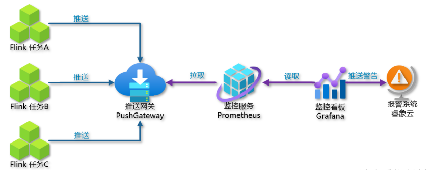

## Prometheus简介

Prometheus受启发于Google的Brogmon监控系统（相似的Kubernetes是从Google的Brog系统演变而来），从2012年开始由前Google工程师在Soundcloud以开源软件的形式进行研发，并且于2015年早期对外发布早期版本。2016年5月继Kubernetes之后成为第二个正式加入CNCF基金会的项目，同年6月正式发布1.0版本。2017年底发布了基于全新存储层的2.0版本，能更好地与容器平台、云平台配合。


Prometheus作为新一代的云原生监控系统，目前已经有超过650+位贡献者参与到Prometheus的研发工作上，并且超过120+项的第三方集成。

## Prometheus架构


### Prometheus Server

Prometheus Server是Prometheus组件中的核心部分，**负责实现对监控数据的获取，存储以及查询**。 **Prometheus Server可以通过静态配置管理监控目标，也可以配合使用Service Discovery的方式动态管理监控目标，并从这些监控目标中获取数据**。其次Prometheus Server需要对采集到的监控数据进行存储，Prometheus Server本身就是一个时序数据库，将采集到的监控数据按照时间序列的方式存储在本地磁盘当中。最后Prometheus Server对外**提供了自定义的PromQL语言，实现对数据的查询以及分析**。

Prometheus Server内置的Express Browser UI，通过这个UI可以直接通过PromQL实现数据的查询以及可视化。

**Prometheus Server的联邦集群能力可以使其从其他的Prometheus Server实例中获取数据**，因此在大规模监控的情况下，可以通过联邦集群以及功能分区的方式对Prometheus Server进行扩展。

### Exporters

Exporter将监控数据**采集的端点通过HTTP服务的形式暴露给Prometheus Server**，Prometheus Server通过访问该Exporter提供的Endpoint端点，即可获取到需要采集的监控数据。
一般来说可以将Exporter分为2类：

- 直接采集：这一类Exporter直接内置了对Prometheus监控的支持，比如cAdvisor，Kubernetes，Etcd，Gokit等，都直接内置了用于向Prometheus暴露监控数据的端点。
- 间接采集：间接采集，**原有监控目标并不直接支持Prometheus，因此我们需要通过Prometheus提供的Client Library编写该监控目标的监控采集程序**。例如： Mysql Exporter，JMX Exporter，Consul Exporter等。

### AlertManager

在Prometheus Server中支持基于PromQL创建告警规则，如果满足PromQL定义的规则，则会产生一条告警，而告警的后续处理流程则由AlertManager进行管理。在AlertManager中我们可以与邮件，Slack等等内置的通知方式进行集成，也可以通过Webhook自定义告警处理方式。AlertManager即Prometheus体系中的告警处理中心。

### PushGateway

由于Prometheus数据采集基于Pull模型进行设计，因此在网络环境的配置上必须要让Prometheus Server能够直接与Exporter进行通信。 **当这种网络需求无法直接满足时，就可以利用PushGateway来进行中转**。可以通过PushGateway将内部网络的监控数据主动Push到Gateway当中。而Prometheus Server则可以采用同样Pull的方式从PushGateway中获取到监控数据。



## Prometheus的优势

Prometheus是一个开源的完整监控解决方案，其对传统监控系统的测试和告警模型进行了彻底的颠覆，形成了基于中央化的规则计算、统一分析和告警的新模型。 相比于传统监控系统Prometheus具有以下优点

### 易于管理

Prometheus核心部分**只有一个单独的二进制文件，不存在任何的第三方依赖(数据库，缓存等等)**。唯一需要的就是本地磁盘，因此不会有潜在级联故障的风险。
**Prometheus基于Pull模型的架构方式**，可以在任何地方（本地电脑，开发环境，测试环境）搭建我们的监控系统。**对于一些复杂的情况，还可以使用Prometheus服务发现(Service Discovery)的能力动态管理监控目标**。

**对于Prometheus这一类基于Pull模式的监控系统**，显然也无法继续使用的static_configs的方式静态的定义监控目标。而对于Prometheus而言其解决方案就是引入一个中间的代理人（服务注册中心），这个代理人掌握着当前所有监控目标的访问信息，Prometheus只需要向这个代理人询问有哪些监控目标即可， 这种模式被称为服务发现。


相较于Push模式，Pull模式的优点可以简单总结为以下几点：

- 只要Exporter在运行，你可以在任何地方（比如在本地），搭建你的监控系统。
- 你可以更容易的查看监控目标实例的健康状态，并且可以快速定位故障。
- 更利于构建DevOps文化的团队。
- 松耦合的架构模式更适合于云原生的部署环境。

### 监控服务的内部运行状态

Pometheus鼓励用户监控服务的内部状态，**基于Prometheus丰富的Client库，用户可以轻松的在应用程序中添加对Prometheus的支持**，从而让用户可以获取服务和应用内部真正的运行状态。


### 强大的数据模型

所有采集的监控数据均**以指标(metric)的形式保存在内置的时间序列数据库当中(TSDB)**。所有的样本除了基本的指标名称以外，还包含一组用于描述该样本特征的标签。

如下所示：

```
http_request_status{code='200',content_path='/api/path', environment='produment'} => [value1@timestamp1,value2@timestamp2...]

http_request_status{code='200',content_path='/api/path2', environment='produment'} => [value1@timestamp1,value2@timestamp2...]
```

每一条时间序列由**指标名称(Metrics Name)以及一组标签(Labels)唯一标识**。**每条时间序列按照时间的先后顺序存储一系列的样本值**。

表示维度的标签可能来源于你的监控对象的状态，比如code=404或者content_path=/api/path。也可能来源于的你的环境定义，比如environment=produment。**基于这些Labels我们可以方便地对监控数据进行聚合，过滤，裁剪**。

### 强大的查询语言PromQL

Prometheus内置了一个强大的数据查询语言PromQL。 通过PromQL可以实现对监控数据的查询、聚合。同时PromQL也被应用于数据可视化(如Grafana)以及告警当中。
通过PromQL可以轻松回答类似于以下问题：
- 在过去一段时间中95%应用延迟时间的分布范围？
- 预测在4小时后，磁盘空间占用大致会是什么情况？
- CPU占用率前5位的服务有哪些？(过滤)

### 高效

对于监控系统而言，大量的监控任务必然导致有大量的数据产生。而Prometheus可以高效地处理这些数据，对于**单一Prometheus Server实例**而言它可以处理：
- 数以百万的监控指标
- 每秒处理数十万的数据点。

### 可扩展

Prometheus是如此简单，因此你可以在每个数据中心、**每个团队运行独立的Prometheus Sevrer**。Prometheus对于联邦集群的支持，**可以让多个Prometheus实例产生一个逻辑集群，当单实例Prometheus Server处理的任务量过大时，通过使用功能分区(sharding)+联邦集群(federation)可以对其进行扩展**。

### 易于集成

使用Prometheus可以快速搭建监控服务，并且可以非常方便地在应用程序中进行集成。目前支持： Java， JMX， Python， Go，Ruby， .Net， Node.js等等语言的客户端SDK，基于这些SDK可以快速让应用程序纳入到Prometheus的监控当中，或者开发自己的监控数据收集程序。同时这些客户端收集的监控数据，不仅仅支持Prometheus，还能支持Graphite这些其他的监控工具。

同时Prometheus还支持与其他的监控系统进行集成：Graphite， Statsd， Collected， Scollector， muini， Nagios等。
Prometheus社区还提供了大量第三方实现的监控数据采集支持：JMX， CloudWatch， EC2， MySQL， PostgresSQL， Haskell， Bash， SNMP， Consul， Haproxy， Mesos， Bind， CouchDB， Django， Memcached， RabbitMQ， Redis， RethinkDB， Rsyslog等等。

### 可视化

Prometheus Server中自带了一个Prometheus UI，通过这个UI可**以方便地直接对数据进行查询，并且支持直接以图形化的形式展示数据**。同时Prometheus还提供了一个独立的基于Ruby On Rails的Dashboard解决方案Promdash。最新的Grafana可视化工具也已经提供了完整的Prometheus支持，**基于Grafana可以创建更加精美的监控图标。基于Prometheus提供的API还可以实现自己的监控可视化UI**。

### 开放性

通常来说当我们需要监控一个应用程序时，一般需要该应用程序提供对相应监控系统协议的支持。因此应用程序会与所选择的监控系统进行绑定。为了减少这种绑定所带来的限制。对于决策者而言要么你就直接在应用中集成该监控系统的支持，要么就在外部创建单独的服务来适配不同的监控系统。

而对于Prometheus来说，使用Prometheus的client library的输出格式不止支持Prometheus的格式化数据，也可以输出支持其它监控系统的格式化数据，比如Graphite。
因此你甚至可以在不使用Prometheus的情况下，采用Prometheus的client library来让你的应用程序支持监控数据采集。
接下来，在本书当中，将带领读者感受Prometheus是如何对监控系统的重新定义。

## 参考

> https://prometheus.io/docs/prometheus/latest/getting_started/

> https://yunlzheng.gitbook.io/prometheus-book/part-ii-prometheus-jin-jie/sd/why-need-service-discovery
