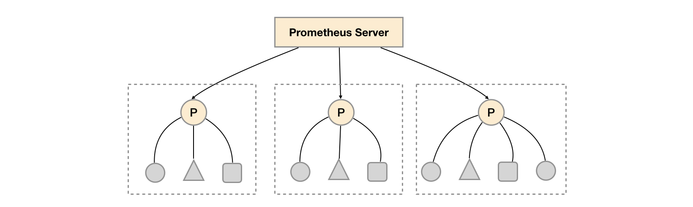
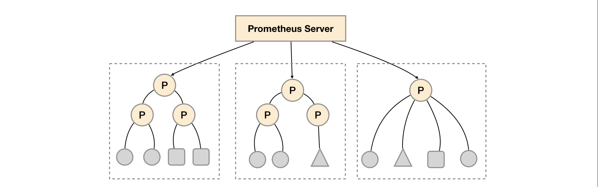
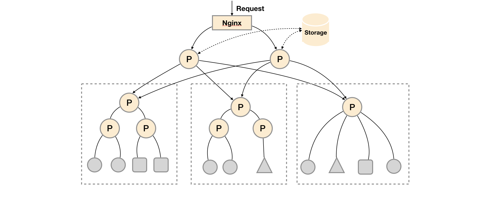

## 联邦集群

对于大部分监控规模而言，我们只需要在**每一个数据中心(例如：EC2可用区，Kubernetes集群)安装一个Prometheus Server实例**，就可以在各个数据中心处理上千规模的集群。同时将Prometheus Server部署到不同的数据中心可以避免网络配置的复杂性。



如上图所示，**在每个数据中心部署单独的Prometheus Server**，用于采集当前数据中心监控数据。**并由一个中心的Prometheus Server负责聚合多个数据中心的监控数据。这一特性在Promthues中称为联邦集群**。

联邦集群的核心在于**每一个Prometheus Server都包含一个用于获取当前实例中监控样本的接口/federate**。**对于中心Prometheus Server而言，无论是从其他的Prometheus实例还是Exporter实例中获取数据实际上并没有任何差异**。

```
scrape_configs:
  - job_name: 'federate'
    scrape_interval: 15s
    honor_labels: true
    metrics_path: '/federate'
    params:
      'match[]':
        - '{job="prometheus"}'
        - '{__name__=~"job:.*"}'
        - '{__name__=~"node.*"}'
    static_configs:
      - targets:
        - '192.168.77.11:9090'
        - '192.168.77.12:9090'
```

为了有效的减少不必要的时间序列，通过params参数可以用于指定只获取某些时间序列的样本数据，例如:

```
"http://192.168.77.11:9090/federate?match[]={job%3D"prometheus"}&match[]={__name__%3D~"job%3A.*"}&match[]={__name__%3D~"node.*"}"
```

通过URL中的match[]参数指定我们可以指定需要获取的时间序列。match[]参数必须是一个瞬时向量选择器，例如up或者{job="api-server"}。配置多个match[]参数，用于获取多组时间序列的监控数据。

horbor_labels配置true可以确保当采集到的监控指标冲突时，能够自动忽略冲突的监控数据。如果为false时，prometheus会自动将冲突的标签替换为”exported_“的形式。

**功能分区**

联邦集群的特性可以帮助用户根据不同的监控规模对Promthues部署架构进行调整。例如如下所示，可以在各个数据中心中部署多个Prometheus Server实例。**每一个Prometheus Server实例只负责采集当前数据中心中的一部分任务(Job)**，例如可以将不同的监控任务分离到不同的Prometheus实例当中，再有中心Prometheus实例进行聚合。




功能分区，即通过联邦集群的特性在任务级别对Prometheus采集任务进行划分，以支持规模的扩展。

## Prometheus高可用

Prometheus的本地存储给Prometheus带来了简单高效的使用体验，可以让Promthues在单节点的情况下满足大部分用户的监控需求。但是本地存储也同时限制了Prometheus的可扩展性，带来了数据持久化等一系列的问题。**通过Prometheus的Remote Storage特性可以解决这一系列问题，包括Promthues的动态扩展，以及历史数据的存储**。

而除了数据持久化问题以外，影响Promthues性能表现的另外一个**重要因素就是数据采集任务量，以及单台Promthues能够处理的时间序列数**。因此当监控规模大到Promthues单台无法有效处理的情况下，可以选择利用Promthues的联邦集群的特性，将Promthues的监控任务划分到不同的实例当中。

这一部分将重点讨论Prometheus的高可用架构，并且根据不同的使用场景介绍了一种常见的高可用方案。

### 基本HA：服务可用性

**由于Promthues的Pull机制的设计，为了确保Promthues服务的可用性，用户只需要部署多套Prometheus Server实例，并且采集相同的Exporter目标即可**。


基本的HA模式只能确保Promthues服务的可用性问题，**但是不解决Prometheus Server之间的数据一致性问题以及持久化问题(数据丢失后无法恢复)**，也无法进行动态的扩展。因此这种部署方式**适合监控规模不大，Promthues Server也不会频繁发生迁移的情况，并且只需要保存短周期监控数据的场景**。

### 基本HA + 远程存储

在基本HA模式的基础上通过添加Remote Storage存储支持，将监控数据保存在第三方存储服务上。


在**解决了Promthues服务可用性的基础上，同时确保了数据的持久化**，当Promthues Server发生宕机或者数据丢失的情况下，可以快速的恢复。 同时Promthues Server可能很好的进行迁移。因此，该方案**适用于用户监控规模不大，但是希望能够将监控数据持久化，同时能够确保Promthues Server的可迁移性的场景**。

### 基本HA + 远程存储 + 联邦集群

当单台Promthues Server无法处理大量的采集任务时，用户可以考虑基于Prometheus联邦集群的方式将监控**采集任务划分到不同的Promthues实例当中即在任务级别功能分区**。



这种部署方式一般适用于两种场景：

- 场景一：单数据中心 + 大量的采集任务
这种场景下Promthues的**性能瓶颈主要在于大量的采集任务**，因此用户需要利用Prometheus联邦集群的特性，将不同类型的采集任务划分到不同的Promthues子服务中，从而实现功能分区。例如一个Promthues Server负责采集基础设施相关的监控指标，另外一个Prometheus Server负责采集应用监控指标。再有上层Prometheus Server实现对数据的汇聚。
- 场景二：多数据中心
这种模式也适合与多数据中心的情况，当Promthues Server无法直接与数据中心中的Exporter进行通讯时，在每一个数据中部署一个单独的Promthues Server负责当前数据中心的采集任务是一个不错的方式。这样可以避免用户进行大量的网络配置，**只需要确保主Promthues Server实例能够与当前数据中心的Prometheus Server通讯即可。 中心Promthues Server负责实现对多数据中心数据的聚合**。

### 按照实例进行功能分区

这时在考虑另外一种极端情况，**即单个采集任务的Target数也变得非常巨大。这时简单通过联邦集群进行功能分区，Prometheus Server也无法有效处理时**。这种情况只能考虑继续在实例级别进行功能划分。


如上图所示，将统一任务的不同实例的监控数据采集任务划分到不同的Prometheus实例。通过relabel设置，**我们可以确保当前Prometheus Server只收集当前采集任务的一部分实例的监控指标**。

```yml
global:
  external_labels:
    slave: 1  # This is the 2nd slave. This prevents clashes between slaves.
scrape_configs:
  - job_name: some_job
    relabel_configs:
    - source_labels: [__address__]
      modulus:       4
      target_label:  __tmp_hash
      action:        hashmod
    - source_labels: [__tmp_hash]
      regex:         ^1$
      action:        keep
```

并且通过当前数据中心的一个中心Prometheus Server将监控数据进行聚合到任务级别。

```yml
- scrape_config:
  - job_name: slaves
    honor_labels: true
    metrics_path: /federate
    params:
      match[]:
        - '{__name__=~"^slave:.*"}'   # Request all slave-level time series
    static_configs:
      - targets:
        - slave0:9090
        - slave1:9090
        - slave3:9090
        - slave4:9090
```


