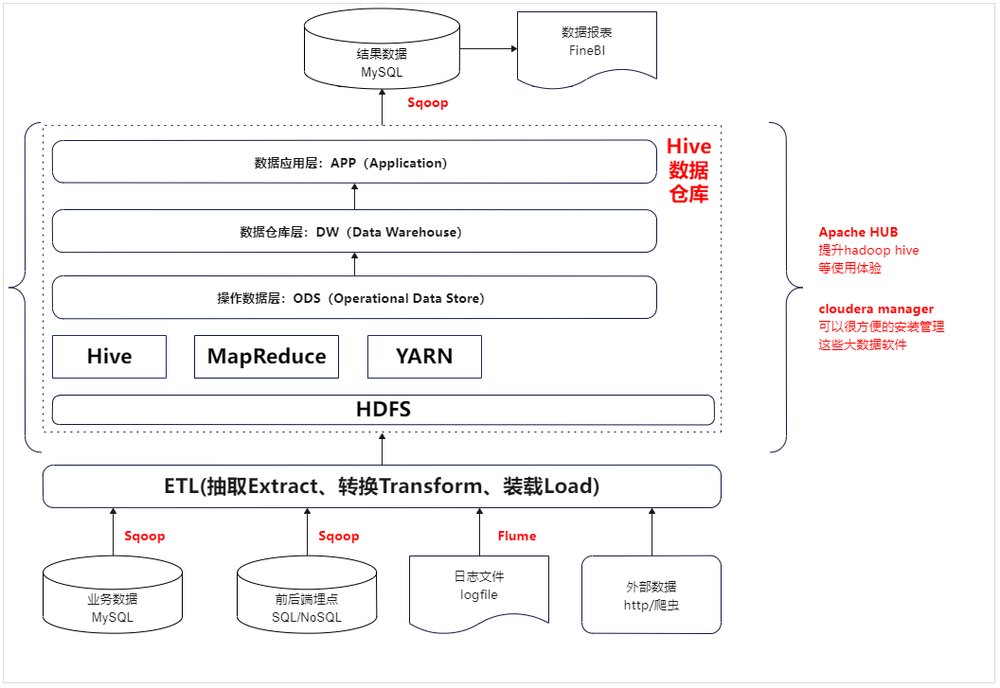

## 数据发展过程概览

## 数据分析型(对比数仓缺少变更数据changelog)

### 数据量小业务不太复杂

在初创公司的情况下，面对有限的数据量（不超过500GB）和有限的资金，业务主要集中在BI数据显示方面。在这种背景下，以下是一些常用的架构和工具选择，以及相关优势的总结：

1. **数据存储选择**：
   - 对于数据量**不大（约100GB左右）**且有一定分析需求的部分，可以考虑使用MySQL来进行数据存储和处理。通过利用MySQL进行数据分析和报表处理，可以满足业务需求。

   - 对于数据量逐渐增大，达到**200GB以上不超过500GB的部分**，可以考虑引入ClickHouse（单机）作为数据仓库。ClickHouse以其优秀的列存储特性，能够更好地处理大型数据集，提供更高的数据压缩率和查询性能。特别是在需要进行数据建模和表格大宽操作时，ClickHouse的优势更为明显。

2. **MySQL和ClickHouse的优势**：
   - **MySQL**：
     - 适用于中小规模的数据存储和处理，能够满足初期数据需求。
     - 提供较好的数据完整性和一致性，适用于事务性处理。
     - 在数据分析报表处理方面，从节点可以分担读取压力，保障主节点的性能。

   - **ClickHouse**：
     - 以列存储的方式，有效提高数据压缩能力和查询性能，特别适合OLAP场景。
     - 针对大宽表的查询操作，ClickHouse表现出色，能够迅速处理复杂的分析查询。
     - 支持分布式架构，可扩展性好，适应数据量增加的情况。

3. **架构综合考虑**：
   - 初始阶段，可以选择在MySQL上建立基本的数据处理流程，满足公司的业务需求，同时通过MySQL从节点支持部分数据分析需求。

   - 随着数据量的增加，可逐步引入ClickHouse，针对需要大宽表操作和复杂分析的情况，提供更高效的数据处理能力。

4. **技术选型注意事项**：
   - **对于初创公司，成本控制至关重要。确保技术选型不需要过度投入**，保持合理的资源配置。
   
   - 随着业务的发展，需定期评估和优化架构，确保能够承受未来的数据增长和业务变化。

5. **相关技术**
   - MySQL、Linux crontab(定时脚本调度) | Apache DolphinScheduler、ClickHouse。

综上所述，根据数据量和资金有限的情况，你可以从MySQL作为初始数据存储开始，逐步引入ClickHouse来处理大数据量和复杂分析的需求。这样能够在保证业务运行的同时，有效地提升数据处理性能和分析能力。

### 数据量适中业务不太复杂

当考虑**HTAP数据库时**，TiDB和PolarDB是两个备受关注的选项。它们均为分布式数据库，支持MySQL协议和语法，具有高可用性和水平扩展性。下面是它们的优点和缺点的简要对比：

| 项目 | TiDB | PolarDB |
| :--- | :--- | :--- |
| 优点 | - 支持混合事务和分析处理（HTAP），适合同时处理OLTP和OLAP场景。 | - 基于共享存储架构，实现秒级扩容和快速备份恢复。 |
|      | - 基于Raft协议实现强一致性和容灾，保障数据的可靠性。 | - 支持Oracle兼容模式，实现与Oracle的高度兼容。 |
|      | - 支持多种云平台和私有云部署，灵活适应不同环境。 | - 提供多版本并发控制（MVCC）和行级锁定，提高并发性能。 |
|      | - 兼容多种开源生态，如TiSpark、TiFlash、TiCDC等，扩展性强。 | - 支持多种引擎，包括MySQL、PostgreSQL和MongoDB，适应不同场景。 |
| 缺点 | - 对于大规模的OLAP查询，可能需要借助其他组件（如TiSpark）来提高效率。 | - 对于跨节点的分布式事务，可能存在性能损失。 |
|      | - 对于一些特殊的SQL语法，可能不完全兼容或支持。 | - 对于一些MySQL的高级特性，如存储过程、触发器等，可能不支持或有限制。 |

综上所述，TiDB适用于强调HTAP、开源生态和高扩展性的场景，而PolarDB则更适合需要快速扩容、Oracle兼容和多引擎支持的需求。根据具体业务需求和技术要求，您可以选择适合您情况的HTAP数据库。

**相关的性能对比**
> https://www.modb.pro/db/109671

### 数据量特大业务不太复杂

1. **数据抽取与加载（ETL）**：
   - 使用Sqoop从数据源（可能是关系型数据库、数据仓库等）获取维度表的每日全量数据和业务增量数据，并将其加载到ODS（Operational Data Store）层。

2. **维度和事实表构建**：
   - 在ODS层，**维度相关的数据进行处理和整合，得到维度相关的表**，进而创建维度层（Dim层）。
   - **业务的每日增量数据经过处理后与维度表关联（个人习惯先处理完DWS轻度聚合以后再关联维度dim数据，解耦，但是表会增多），构建事实表，得到数据仓库详细层（DWD层）**。

3. **数据整合与聚合**：
   - **从DWD层中，进行轻度的聚合和汇总操作，创建数据仓库汇总层（DWS层）**。这有助于提高查询性能，支持对业务数据的多维分析。

4. **应用层构建**：
   - 在DWS层的基础上，构建应用层数据存储（ADS层），可能通过物化视图等技术来进一步优化查询性能，为用户提供更快速的分析体验。

5. **数据质量与监控**：
   - 针对整个流程，实施数据质量控制和监控，确保数据的准确性和一致性，同时跟踪数据的变化。

6. **元数据管理**：
   - 管理数据仓库中的元数据信息，帮助理解数据的来源、转换规则、结构和业务含义。

总的来说，你的描述在数据仓库的构建过程中包括了从原始数据的抽取、转换、加载，到维度和事实表的构建，进而进行聚合和优化，最后提供应用层数据供用户分析。数据仓库的每个层级都有其独特的目标和用途，从维度到事实的逻辑关系和数据流是实现数据仓库中重要的一部分。

### 数据量大业务不太复杂

当构建一个实时数仓系统基于Doris时，以下步骤和组件可以被总结如下：

1. **数据源接入**：
   - 使用Flink CDC将RDS（关系型数据库）中的数据实时同步到Doris。
   - 通过定期加载（routine load）将Kafka等消息系统中的数据实时同步到Doris。

2. **Doris表模型**：
   - 明细模型：在ODS（Operational Data Store）层使用，保留原始数据。
   - 主键模型：用于提高查询性能，根据主键构建索引。
   - 统计模型：用于加速聚合查询，存储预聚合数据。

3. **数据处理流程**：
   - ODS层：**使用明细模型构建，接收原始数据**。
   - DWD层（Data Warehouse Detail）：**通过SQL调度任务从ODS层抽取数据，进行清洗、转换和整合**。
   - DWS层（Data Warehouse Summary）：利用Rollup技术，构建数据的多维聚合，用于提供较高层次的查询性能。
   - ADS层（Analytical Data Store）：**基于物化视图技术**，进一步优化数据的查询性能，支持快速分析。

4. **数据湖服务**：
   - Doris支持数据湖服务，基于Iceberg、Delta Lake和Hudi，提供联邦分析和湖仓加速的能力。这使得数据能够更加灵活地进行处理和分析。

5. **应用构建**：
   - 在实时数仓基础上，可以构建以下应用：
     - BI服务：通过业务智能工具展示和分析数据，支持数据可视化、报表和仪表板。
     - Adhoc查询：允许用户按需查询数据，进行自定义分析。
     - 多维分析：基于DWS和ADS层的聚合数据，支持复杂的多维分析和数据挖掘。

6. **相关技术**
   - Kafka、MySQL、DolphinScheduler、Doris、Hadoop。

综上所述，基于Doris构建实时数仓的过程包括数据源接入、数据模型构建、数据处理流程、数据湖服务以及构建各种数据分析应用。这种架构可以帮助实现数据的实时同步、多维分析和高效查询，从而支持业务决策和数据驱动的应用场景。

### 总结

上面数据分析性都是相当于保存的是**数据的是原始数据的副本，然后每天进行全量的分析**。而数据仓库是一个面向主题的、集成的、**时间变化的（因为上面的架构无法记录变化也就是changelog）**、**非易失的数据集合**，用于支持企业决策制定、业务分析和战略规划，它从不同的数据源中提取、转换和加载数据，经过清洗、整合和加工，为用户提供可靠、一致且易于查询的数据，以帮助用户从中获取有价值的洞察和见解。显然上面的架构不满足数据仓库的定义，可以认为是数据分析更加贴切。

**相关文章**
> https://mp.weixin.qq.com/s/-s4PuuvSROkBTgUsZkuXyw

## 数据仓库型

### Lambda架构（数据量特大，业务复杂，资金比较宽裕）

**Lambda架构优点：**
1. **处理多样性数据**：能够处理来自不同数据源的多样性数据，如电商中的订单、用户活动、广告点击等数据。

2. **实时与批处理结合**：同时支持实时流数据和批处理，**使得电商能够实时监测销售、库存，同时进行历史数据的分析**。

3. **灵活的查询**：分层架构允许在DWS层进行预聚合，提高查询性能，电商可以进行复杂的产品销售趋势分析和用户行为分析。

4. **高可扩展性**：随着用户量和交易量的增长，Lambda架构能够通过水平扩展应对电商平台的数据规模。

**Lambda架构缺点：**
1. **复杂性**：**维护两个处理路径（实时和批处理）可能增加系统的复杂性，需要考虑数据一致性和版本控制等问题**。

2. **重复处理**：数据需要在实时和批处理路径中进行处理，**可能导致处理逻辑的重复**，增加了开发和维护的工作量。

**Lambda架构数据分层示例（电商）：**
1. **实时数据流层**：
   - 监测用户在线活动、广告点击等实时数据。
   - 实时处理用户浏览、购买等行为，以支持个性化推荐和实时广告投放。

2. **批处理层**：
   - 每天对订单数据、用户数据进行批处理，更新维度表和事实表。
   - 计算每日销售额、用户留存率等指标。

3. **维度层（Dim层）**：
   - 存储商品、用户、时间等维度的详细信息，支持多维分析和关联查询。

4. **事实层（DWD层）**：
   - 存储订单、用户活动等详细数据，以便进行复杂的分析和挖掘。

5. **汇总层（DWS层）**：
   - 存储每日销售总额、用户行为统计等预聚合数据，提高查询性能。

6. **应用层（ADS层）**：
   - 构建基于DWS层的报表、仪表板，为商务团队提供销售趋势、用户行为分析等洞察。

综合来看，Lambda架构适用于电商等需要处理实时和历史数据的应用场景。尽管存在一些复杂性，但它能够提供强大的数据处理和分析能力，支持电商平台的业务需求。

### 变体Lambda架构(准实时)

在电商业务中，如果您使用Flink CDC采集MySQL数据库的changelog数据，每一张表对应Kafka的一个分区，并通过Doris的Routine Load将Kafka数据同步到Doris的ODS层按数据的捕获时间分区处理，可以按照以下流程进行：

1. **数据采集与同步：** 使用Flink CDC捕获MySQL数据库的changelog数据，并将数据同步到Kafka中。

2. **ODS数据汇聚原始层：** 在电商场景中，考虑到可能的分库分表情况，您可能会同步用户、订单、产品等数据，在Doris的Routine Load阶段，进行分库分表的数据汇聚操作，将来自不同分库分表的数据整合成一张大表。这个大表可能包含了所有用户、订单和产品的数据。

3. **DWD首次数据处理：** 

    - 对于首次同步的数据，这些数据的时间戳将是同步开始的日期（FlinkCDC全量同步的时候采集的时间戳是程序启动的时间）ODS层，以后的数据就是数据发送的时间了。在将数据从ODS导入DWD时，您可以根据业务需要，将用户、订单和产品数据进行关联和清洗。导入DWD层。为保证数据的唯一性，您可以使用订单ID和时间戳作为UNIQUE KEY。

    - 利用Rollup技术，构建数据的多维聚合，用于提供较高层次的查询性能。

4. **DIM维度层：** 从ODS层将用户和产品数据导入DIM层时，您可能会选择直接导入单表，以保持实时性。在DIM层的建表过程中，可以根据维度ID进行去重，以获取最新的维度数据，如用户信息、产品信息等（单分区id去重，去重的逻辑是保存最后一次到达的数据）。

6. **DWS轻度聚合和关联：** 基于DWD数据，进行轻度聚合，例如计算订单金额、订单数量等。然后，将DWD数据与维度数据进行关联，以支持更具体的分析。

7. **ADS数据生成：** 

    - 基于DWS层中的轻度聚合数据，与维度数据进行关联，生成ADS层中的相关数据。例如，您可以生成销售趋势、用户活跃度、产品类别销售等报告。

    - **基于物化视图技术**，进一步优化数据的查询性能，支持快速分析。

8. **数据调度规则**  根据公司的实时业务，设置调度频率，可以每半个小时进行一次ODS->DWD,ODS->DIM,然后DWD-DIM->DWS->ADS调度，调度时间的范围可以是昨天的数据到今天的数据处理，由于关联以后ODS到DIM、DWD、DWS、ADS都是要么像DWD更具时间和ID进行去重要么是DWS更具时间去重，最后的ADS更具业务需求进行UNIQUE KEY的设置，从而带到准实时的效果。调度频率可以是1分钟也可以是15分钟。

9. **数据丢失处理** Flume消费数据存储到HDFS作为备份，如果当天Routine Load消费到ODS数据异常，可以删除以后从HDFS使用Doris的broke load的方式加载到ODS层，从而带到数据的容灾。

10. **对于日志的处理** 不管是业务数据还是日志数据，数据的统一入口都是从Kafka进入。这要的好处是就算以后有纯实时的需求，所有的数据都能够在kafka里面消费到。

11. **相关技术**
   - Kafka、MySQL、DolphinScheduler、Doris、Hadoop、Flume、Flink CDC、Flink。

适用方案：能够接受相对的延迟情况。

### Kappa架构

**Kappa架构优点：**
1. **简化架构**：相对于Lambda架构，**Kappa架构消除了批处理层，简化了架构和维护**。

2. **实时性**：由于只有实时流处理，Kappa架构能够实时处理数据，适用于对实时性要求较高的场景。

3. **一致性**：由于只有实时流处理路径，不再需要维护数据一致性问题。

4. **更少的延迟**：因为批处理步骤被去除，Kappa架构的实时性能通常比Lambda更高。

**Kappa架构缺点：**
1. **无法处理历史数据**：Kappa架构无法像Lambda架构那样对历史数据进行复杂的批处理分析。

2. **不适合复杂分析**：由于没有批处理层，Kappa架构可能不太适合复杂的多维分析。

3. **数据退化问题**：随着时间的推移，实时数据流可能变得庞大，导致性能下降。

**Kappa架构数据分层示例（电商）：**
1. **实时数据流层**：
   - 监测用户在线活动、广告点击等实时数据。
   - 实时处理用户浏览、购买等行为，以支持个性化推荐和实时广告投放。

2. **维度层（Dim层）**：
   - 存储商品、用户、时间等维度的详细信息，支持多维分析和关联查询。

3. **事实层（DWD层）**：
   - 存储订单、用户活动等详细数据，以便进行复杂的分析和挖掘。

4. **应用层（ADS层）**：
   - 构建基于实时数据流的报表、仪表板，为商务团队提供实时的销售趋势、用户行为分析等洞察。

在Kappa架构下，只有实时流处理层，这使得电商平台能够更加实时地进行数据分析和业务反应。然而，需要权衡无法处理历史数据和复杂分析的局限性。

## 数据湖

### 概述

数据湖（Data Lake）和数据仓库（Data Warehouse）是两种不同的数据存储和管理方法，它们在架构、特点和用途方面有明显的区别。

**数据湖（Data Lake）：**
数据湖是一个**集中存储大规模结构化、半结构化和非结构化数据的存储系统**，通常构建在分布式存储基础设施上。其主要特点包括：
- **多格式支持**：数据湖能够接纳多种数据格式，**无论是关系型数据、文本、图像、日志还是其他形式的数据**。
- **架构灵活性**：数据湖**不要求提前定义数据结构和模式，因此可以存储原始、未加工的数据，为灵活的数据分析提供了基础**。
- **数据探索**：数据湖允许用户**以"探索性"方式查询数据，支持在需要时对数据进行加工和整理（简单的理解就是不需要提前建模，直接在原始数据进行即席查询）**。
- **大数据处理**：数据湖适用于大规模的数据处理、机器学习和深度学习等任务。
- **原始数据保留**：数据湖通常**保留原始数据，以满足不同时间尺度和分析需求**。

**数据仓库（Data Warehouse）：**
数据仓库是一个用于集成、清洗和存储企业内部数据的中央存储系统，用于支持企业决策制定和业务分析。其主要特点包括：
- **结构化数据**：数据仓库**主要存储结构化数据，需要预先定义数据模式和结构**。
- **数据整合**：数据仓库需要**经过ETL（Extract, Transform, Load）过程，将数据从不同的源提取、清洗和整合，以便进行分析**。
- **历史数据分析**：数据仓库通常**用于历史数据分析，支持复杂的多维分析和查询**。
- **查询性能优化**：数据仓库**通过预聚合、索引等技术来优化查询性能，以提供快速的分析响应**。

**区别：**
1. **数据格式和灵活性**：
   - 数据湖可以容纳**多种数据格式，无需事先定义结构，具有更大的灵活性。数据仓库主要存储结构化数据，需要定义结构**。

2. **数据处理方式**：
   - 数据湖通常适用于大规模数据存储和处理，而**数据仓库更侧重于经过清洗和整合的历史数据分析**。

3. **数据整合和ETL**：
   - 数据湖不要求预先整合数据，而数据仓库需要进行ETL过程，将数据从多个源整合。

4. **查询性能**：
   - 数据仓库通过优化查询性能来支持复杂分析，**而数据湖的查询性能可能更受数据的结构和存储方式影响**。

5. **用途**：
   - 数据湖适用于大规模数据分析、机器学习等任务。数据仓库适用于历史数据分析、业务报表等任务。

综上所述，数据湖和数据仓库在数据存储、处理方式、查询性能和用途等方面存在明显差异，可以根据实际需求选择适合的数据管理方法。

### 数据湖相关技术

**Apache Paimon**

> https://paimon.apache.org/docs/master/concepts/overview/

**Delta Lake**

> https://delta.io/

**Apache Hudi**

> https://hudi.apache.org/

**Apache Hudi**

> https://hudi.apache.org/

**Apache Iceberg**

> https://iceberg.apache.org/

**数据湖深度分析**

> https://zhuanlan.zhihu.com/p/145545852

**字节跳动数据湖探索**

> https://developer.volcengine.com/articles/7219211751483506745

## 湖仓一体
提到湖仓一体，就不得不从上世纪80年代说起。当时市场还是数据仓库的天下，主要用来处理BI、仪表盘、报表等结构化数据，用于分析企业的内部的业务数据。**这种状态一直持续到2010年前后，越来越多企业产生对语音、视频等数据的处理分析需求，非结构化数据、半结构化数据的增长促使企业提升了高多样性，高速度和高容量的数据分析要求，数据仓库慢慢不能满足用户的需求**。随着数据仓库局限性的逐步显现，数据湖的概念也随之衍生出来，它能够存储各式各样的原始数据，解决了数据仓库的局限性。但相比于优势来讲，**湖的短板也同样明显，比如不支持事务，SQL性能差，无法支撑报表需求**。虽然数据湖和数据仓都各自有各自的优势和不足，但不难发现，二者在某些层面是非常互补的。于是乎，是否有一种能兼具两者优点的架构出现，于是诞生了“湖仓一体”。

### 湖仓一体1.0

早期的湖仓一体，**更多是一种处理思想，处理上直接将数据湖和数据仓库互相“打通”**。数据湖从各类数据源获得**原始数据，存储在廉价存储上，不删除**。数据保持原始**简单格式、机构，无数据治理，也没有数仓丰富的功能及高性能统一数据模型**。当需要**支持分析场景在成熟时从数据湖到数据仓库的迁移**。这种架构优点在于可充分利用先前的数据湖和数据仓库资源，**利用ETL将二者“打通”，数据湖用来存储各种原始数据，分析报表交给数据仓库来完成，这也可以算是湖仓一体的一个雏形**，但湖和仓基本上还是处于各自一体的状态，架构仍然较为复杂，在满足需求的同时也持续提高了企业的运维成本。

### 湖仓一体2.0

为了解决湖仓一体1.0的诸多问题，2.0应运而生。目前这一架构还在快速发展之中，尚无明确统一的技术框架。总的来说，可按照上图划分多层次，并在每层解决对应问题。从底层数据源，需对接多种数据源（包括结构化、半结构化及非结构化数据）。之上的数据集成需提供针对不同特征数据的集成能力（包括批量、流式）。处理过后的数据放入统一存储层，为面对不同结构的数据，需提供多模态存储能力，甚至为满足性能要求提供不同存储引擎。再之上是统一的元数据、安全、管控层，通过对全局数据的完整视角管理。为满足不同加工需求的统一处理层，层内提供多种加工能力。上面是数据应用层。从技术上看，云原生数据仓库，为湖仓一体2.0提供有利支持，其技术上天然具备的存算分离、弹性扩展、多租户、可插拔存储、多计算引擎、分级资源管理等众多特性可满足上述要求。功能上兼具数据仓库的标准SQL、ACID能力，数据湖的大规模原始数据存储等。对上提供多种接入方式，包括标准数据库接入方式，支持高并发读写；对下支持多云、混合云及跨云部署，防止厂商绑定。其技术架构可简化为类似如下架构：

展开说明下，其底层依旧是低成本、开放的存储，上层基于类似 Delta lake/ Iceberg/ Hudi 建设数据系统，**提供数据管理特性和高效访问性能，支持多样数据分析和计算，综合了数据仓库以及数据湖的优点形成了新的架构。**存算分离架构可以进行灵活扩展；减少数据搬迁，数据可靠性、一致性和实时性得到了保障；支持丰富的计算引擎和范式；此外，支持数据组织和索引优化，查询性能更优。当前湖仓一体还处于快速发展期，关键技术迭代快且成熟的产品和系统少。与之前架构的对比，这里借用《DataFunCon 2021》大会上的一张图片加以说明。

## 流批一体

### 数据流转图

### 优点

- 主要的优点是弥补Kappa架构数据治理还有批处理的问题，实时还是在消息系统里面，但是数据的存储是保存在了Paimon数据湖中，这样流计算完以后，还能保存下来提供给批处理执行。

- 处理速度相对上面的几种架构要快，因为批处理是在数据湖里面，数据湖里面有大量的数据，批处理可以利用这些数据，所以速度会快一些。

- 批处理和流处理可以同时进行，批处理的结果可以作为流处理的输入，这样就形成了流批一体。

### 缺点

- 对于数据湖来说，按现在的情况还是对于数据仓库的支持有一些欠缺，数据仓库的一个重点是保存历史数据，**但是数据湖是保存原始数据的副本，那么相对来说就会少了一些数据变更的数据存储**，这样数据湖的数据存储，相对于数据仓库来说，会少一些。

### 技术选型

- Flink CDC 实现数据实时采集。
- Flink SQL 实现数据实时计算。
- StarRocks 实现数据实时分析。
- Paimon 实现数据实时入湖。
- Data V数据可视化。

### 架构

- Flink CDC 实现数据实时采集。
- 基于FlinkSQL流批一体架构。
- Kafka和Paimon的数据下沉。
- StarRocks与DataV数据可视化。

**快手湖仓一体探索**

> http://blog.itpub.net/28285180/viewspace-2952638/

## 数据中台

### 概述

数据中台（Data Mid-End）是一种**数据管理和服务架构，旨在实现数据的标准化、集中化、共享化和智能化**，以满足企业内部各个业务部门和应用系统的数据需求。数据中台强调数据的**一致性、质量和可用性**，通过构建统一的数据服务平台，支持数据的整合、分析、挖掘和交付，促进数据驱动的业务创新和决策制定。

**数据中台的特点和要点包括：**
- **数据整合和标准化**：数据中台致力于将**分散的、多源的数据整合和标准化**，构建通用的数据模型和规范，以提供一致性的数据视图。

- **数据共享和开放**：数据中台提供统一的**数据访问接口和服务，支持内部各部门和应用系统之间的数据共享和交换**。

- **数据质量和治理**：数据中台注重**数据质量控制、数据安全和数据治理，确保数据的准确性、一致性和可信度**。

- **数据分析和洞察**：数据中台为**业务部门和分析团队提供数据分析工具、报表和仪表板**，帮助发现业务洞察。

- **数据智能和应用**：数据中台将**数据智能化，通过数据挖掘、机器学习等技术，为业务应用提供智能推荐、预测等功能**。

- **开放平台和生态系统**：数据中台可以构建**为开放平台，吸引内外部合作伙伴接入，促进数据生态系统的建设**。

**数据仓库（Data Warehouse）和数据中台的区别：**
数据仓库和数据中台都是用于数据管理和支持决策的解决方案，但它们在**架构、范围和重点方面**存在一些区别：

1. **数据范围**：
   - 数据仓库通常是用于**存储、整合和分析历史数据**，**主要用于支持复杂的多维分析、报表和查询**。
   - 数据中台更加广泛，旨在**整合和管理企业内部的各种数据，包括历史数据和实时数据，以满足业务部门的数据需求**。

2. **数据整合**：
   - 数据仓库需要进行ETL（Extract, Transform, Load）过程，将数据从不同来源整合、清洗和转换，以构建一个一致的数据视图。
   - 数据中台也进行数据整合，但更强调数据标准化、质量和共享，以满足不同业务部门的需求。

3. **数据服务和智能**：
   - 数据中台**更注重数据服务的构建，为不同部门和应用提供数据访问接口，支持数据的复用和共享**。
   - 数据中台还强调数据智能化，通过数据挖掘、机器学习等技术，为业务应用提供智能功能。
   
4. **数据生态系统**：
   - 数据中台可以构建为开放的平台，吸引内外部合作伙伴接入，促进数据生态系统的建设。
   - 数据仓库通常是为内部业务部门提供数据分析和洞察，较少涉及生态系统的构建。

综上所述，数据中台相对于**数据仓库更加广泛，强调数据的标准化、整合、共享和智能化**，旨在为企业提供更**全面的数据服务和支持**。

### 数据中台关键知识概述

**OneClick**

在阿里巴巴数据中台，**"OneClick"（一键）是指一种简化的操作方式，通过点击一次按钮或执行一次操作**，可以完成复杂的流程或任务。在数据中台的上下文中，"OneClick"通常用于描述一种自动化的、简单的数据操作，以提高效率并减少人工干预。

例如，在阿里巴巴的数据中台中，"OneClick"操作可能涉及到以下场景：
- **数据接入：** 通过一键操作，数据从不同源头自动抽取、转换、加载到数据湖或数据仓库中，**减少手动干预和数据集成的复杂性**。
- **数据质量检测：** 通过一键操作，自动执行数据质量检测流程，**包括数据清洗、重复项检测、异常值检测等，确保数据质量**。
- **数据分析和报告生成：** 通过一键操作，可以**自动生成特定数据分析报告，避免手动处理和数据提取的繁琐过程**。
- **元数据管理：** 一键操作可以帮助**自动记录和管理数据的元数据，包括数据来源、更新时间、数据字典**等信息。

总之，"OneClick"在阿里巴巴的数据中台中代表了通过**简单的点击操作，实现复杂数据操作的自动化和高效性**。这有助于提高数据操作的效率，并减少人工干预带来的潜在问题。

**OneData**

"OneData"是阿里巴巴数据中台中的一个概念，它代表着数据的集中管理和一体化服务。在阿里巴巴的数据中台战略中，**"OneData"的核心理念是实现数据的标准化、共享、治理和智能化**，以提供更高效的数据服务和数据驱动的决策。

具体来说，"OneData"涵盖了以下几个方面：

1. **数据标准化：** "OneData"致力于**建立一套数据标准和规范，包括数据命名、数据定义、数据格式等，以确保数据的一致性和可信度**。

2. **数据共享：** "OneData"推动数据的共享与开放，使不同部门和团队能够**共享同一份数据，减少重复采集和冗余存储**。

3. **数据治理：** "OneData"倡导数据的**全生命周期治理，包括数据质量、数据安全、数据隐私等方面的管理，保障数据的合规性和可靠性**。

4. **数据智能化：** "OneData"利用人工智能和数据分析技术，实现对数据的**自动化分析、洞察和预测，提供智能化的数据服务**。

5. **数据服务：** "OneData"提供统一的数据服务平台，包括数据接入、数据查询、数据分析、数据可视化等功能，为各个业务部门提供便捷的数据服务。

总之，"OneData"是阿里巴巴数据中台的核心理念，旨在通过标准化、共享、治理和智能化，**构建一个统一、高效、可信的数据服务体系**，为业务决策和创新提供有力支持。

**OneID**

在阿里巴巴数据中台中，"OneID"是指一个**统一的身份标识，用于将不同业务系统中的数据关联起来，从而实现数据的整合和共享**。"OneID"的核心概念是将不同系统中的数据映射到一个唯一的标识符，以便于数据在不同系统之间的流动和关联。

具体来说，"OneID"有以下几个关键特点和用途：

1. **唯一标识：** "OneID"**是一个唯一的身份标识符，用于识别不同业务系统中的同一实体或对象，如顾客、产品等**。

2. **数据整合：** 通过使用"OneID"，不同业务系统中的数据可以关联起来，实现数据的整合和共享。这有助于**消除数据孤岛，提供更全面的数据视图**。

3. **数据融合：** "OneID"可以将不同系统中的多源数据融合在一起，为用户提供更丰富的信息。这有助于提高数据的质量和价值。

4. **个性化服务：** 基于"OneID"，**可以实现个性化的服务和推荐，根据用户的行为和偏好进行定制化的业务交互**。

5. **数据分析：** "OneID"可以为数据分析提供更完整的数据基础，从而支持更准确的洞察和决策。

总之，"OneID"在阿里巴巴数据中台中是一个重要的概念，**通过统一身份标识，实现数据的整合、共享和关联，为业务决策和用户体验提供更好的支持**。

**OneService**

"OneService"是阿里巴巴数据中台的一个概念，指的是将多个业务系统中的服务进行整合和集成，**以提供统一的数据服务和功能**。"OneService"旨在通过**集中管理和共享不同业务系统中的服务，简化业务操作**，提高效率并实现更好的数据驱动决策。

具体来说，"OneService"具有以下特点和作用：

1. **服务整合：** "OneService"整合了不同业务系统中的服务，将它们**统一暴露给用户和应用程序，避免重复开发和维护**。

2. **数据一致性：** "OneService"可以确保不同业务系统中的数据保持一致，避免数据孤岛和不一致性。

3. **统一接口：** "OneService"**提供统一的接口和API，使得用户和开发人员能够更轻松地访问和调用不同系统的功能**。

4. **数据治理：** 通过"OneService"，可以实现对数据的统一管理和治理，包括数据质量、数据安全等方面。

5. **业务流程优化：** "OneService"可以将多个业务系统中的流程整合为一个流程，从而优化业务操作和处理。

总的来说，"OneService"在**阿里巴巴数据中台中是指整合和统一不同业务系统中的服务**，为用户和开发人员提供更便捷、高效的数据服务和功能。请注意，具体实现和用法可能因时间和具体内部实践而有所不同，建议您查阅阿里巴巴官方文档或与公司内部的相关人员进行沟通，以获取更详细和准确的信息。