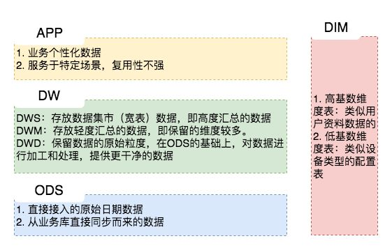

## 数仓分层原则

目前市场上主流的分层方式眼花缭乱，不过看事情不能只看表面，还要看到内在的规律，不能为了分层而分层，**没有最好的，只有适合的**。

分层是以解决当前业务快速的数据支撑为目的，为未来抽象出共性的框架并能够赋能给其他业务线，同时为业务发展提供稳定、准确的数据支撑，并能够按照已有的模型为新业务发展提供方向，也就是数据驱动和赋能。

1. **可维护性和可扩展性**：分层架构将系统按功能模块进行划分，并通过明确定义接口和依赖关系，使得各层之间的耦合度降低。这样，当需要修改或增加新的功能时，只需要关注特定的层，而不会影响其他部分，从而提高了系统的可维护性和可扩展性。
2. **代码复用**：分层架构鼓励将通用的功能模块放在底层或中间层，这样其他上层模块可以重复使用这些功能，减少重复编写代码，提高了代码的复用性。
3. **团队协作**：分层架构将系统拆分成不同的层，每个层都有明确的职责和接口。这样，不同的团队成员可以专注于自己负责的层，使得团队之间的协作更加高效。
4. **易于测试**：由于各层之间有清晰的接口，可以更容易地对每个层进行单元测试和集成测试，保证系统的稳定性和质量。
5. **安全性增强**：通过在各个层次上实施安全措施，例如在应用层和数据层分别进行身份验证和数据访问控制，可以提高系统的安全性。

总的来说，一个好的分层架构可以提供更**灵活**、**可扩展**、**易维护**和**高性能**的软件系统，帮助开发团队构建出更具**质量**和**可靠性**的软件产品。

一般采用如下分层结构：

**ODS(数据源层)**：ODS (Operational Data Store) 订单表（Orders）, 订单详情表（Order Details）, 支付记录表（Payment Records）,商品表（Products）等等**最原始的表数据**。

**DWD(数据明细层)**：DWD（Data Warehouse Detail）。举个例子，在电商业务中，比如下单业务可能有订单表、订单详情表、支付记录表等。在DWD层，可以将这些表进行关联和合并，生成一个最细粒度的事实表，其中包含了订单的所有细节信息，包括订单号、用户ID、商品ID、销售数量（**单件商品，得到最少粒度**）、销售金额、订单日期等。这样的事实表将提供电商**业务最全面的、最细致的数据视图**。

**DWM(数据中间层)**：DWM（Data Warehouse Middle），数据通常是**面向主题**（主题是指一类相关的业务数据或信息，例如销售、客户、库存、产品等）和**周期性**的，用于支持业务的中期决策。举一个电商业务中的DWM层的例子，假设我们正在建立一个电商数据仓库，其中DWM层用于存储每日销售数据的中间汇总。

| Date       | Total Orders | Total Sales Amount | Total Customers | Total Products Sold |
|------------|--------------|--------------------|-----------------|---------------------|
| 2023-08-01 | 1200         | $50,000            | 900             | 1500                |
| 2023-08-02 | 1350         | $55,000            | 1000            | 1800                |
| 2023-08-03 | 1100         | $48,000            | 800             | 1400                |

在上面的例子中，DWM层存储了**每日的销售数据的中间汇总**。表中包含了日期、总订单数、总销售金额、总顾客数以及总销售产品数量等指标。这些数据是根据DWD层（最细粒度数据层）的原始数据进行计算和汇总得到的。这样的中间汇总数据将支持电商业务中期的销售趋势分析、每日销售报表等业务需求。

**DWS(数据服务层)**：DWS（Data Warehouse Summary）层是数据仓库中的另一个重要层次，用于存储经过进一步聚合、汇总和计算后的数据。DWS层的数据通常是面向主题和周期性的，用于支持业务的高级别决策和报表。
举一个电商业务中的DWS层的例子，假设我们正在建立一个电商数据仓库，其中DWS层用于存储每月销售数据的汇总。

| Month     | Total Orders | Total Sales Amount | Total Customers | Total Products Sold |
|-----------|--------------|--------------------|-----------------|---------------------|
| 2023-08   | 3650         | $153,000           | 2700            | 4700                |
| 2023-09   | 4200         | $180,000           | 3200            | 5500                |
| 2023-10   | 3850         | $165,000           | 2800            | 4900                |

**也就是说DWM是DWS的轻度汇聚，DWM是每日,DWS保存的就是每个月**。DWM（Data Warehouse Middle）层是DWS（Data Warehouse Summary）层的下一层，它对数据进行了较轻度的汇聚。DWM层通常存储了周期性的中间数据，比如每日、每周或每月的数据汇总。这些汇总数据是从DWD（Data Warehouse Detail）层获取的，经过进一步的聚合、计算和加工而得到的。DWM层的数据通常用于支持业务的中期决策和报表。

而DWS层则是数据仓库中的更高级别的层次，它存储了更加汇总和聚合的数据，通常是面向主题和更大的时间周期，如每月、每季度或每年的数据。DWS层的数据是从DWM层获取的，经过更深层次的汇总和计算得到的。DWS层的数据通常用于支持业务的高级别决策、报表和可视化分析。

**DIM(数据维度层)**：DIM（Dimension Table）在数据仓库中，ODS到DIM的数据处理方式会因离线和实时数据仓库而异。在离线场景中，将ODS层的商品、SKU、SPU等数据关联生成大的商品维度表，然后进行后续处理。在实时场景中，为保持DIM层的实时性，会分别实时关联独立的商品、SKU和SPU表，确保数据始终是最新的。这样的灵活处理满足不同数据仓库的需求。

**ADS(数据应用层)**：ADS（Aggregate Data Store）它是数据仓库中的一个层次，用于存储经过高级别聚合和计算后的数据。ADS层的数据通常是面向主题和周期性的，用于支持业务的高级别报表、分析和决策。

举一个电商业务中ADS层的例子，假设我们正在建立一个电商数据仓库，其中ADS层用于存储每月销售数据的聚合。

| Month     | Total Sales Amount | Total Orders | Total Customers | Average Order Amount |
|-----------|--------------------|--------------|-----------------|----------------------|
| 2023-08   | $153,000           | 3650         | 2700            | $41.92               |
| 2023-09   | $180,000           | 4200         | 3200            | $42.86               |
| 2023-10   | $165,000           | 3850         | 2800            | $42.86               |

在上面的例子中，ADS层存储了每月销售数据的聚合结果。表中包含了月份、总销售金额、总订单数、总顾客数以及平均订单金额等指标。这些数据是从DWS层（Data Warehouse Summary）层获取的，经过更深层次的汇总和计算得到的。这样的聚合数据将支持电商业务高级别的销售趋势分析、每月销售报表等业务需求。

ADS层的数据通常是周期性的，比如每月、每季度或每年的数据。这些高级别的聚合数据可以用于生成各种业务报表、可视化图表和指标分析，为企业高级别决策提供重要参考。数据通常是从多个DWS（Data Warehouse Summary）层的数据进行进一步聚合和计算得到的。

## 主题域划分原则
在数据仓库中，电商领域的主题域划分可以按照不同方面和业务需求来进行。以下是一个简化的电商主题域划分的例子：

1. 订单管理主题：
    - 订单信息：包括订单ID、顾客ID、订单日期、订单状态等。
    - 订单明细：订单中每个商品的详细信息，包括商品ID、数量、单价等。
    - 顾客信息：与订单相关的顾客信息，包括顾客ID、姓名、联系方式等。
    - 支付信息：订单支付方式、支付状态、支付金额等。

2. 产品管理主题：
    - 产品信息：产品ID、名称、描述、品牌等。
    - 产品分类：对产品进行分类，如电子产品、服装、食品等。
    - 产品库存：包括产品库存数量、入库时间、出库时间等。

3. 用户行为分析主题：
    - 点击记录：用户点击商品、广告等的记录，用于分析用户兴趣。
    - 购买行为：用户购买商品的记录，用于分析购买习惯和趋势。
    - 浏览记录：用户浏览商品、页面的记录，用于分析用户行为路径。

4. 物流与仓储主题：
    - 物流信息：订单发货、运输状态等物流信息。
    - 仓储信息：商品入库、出库等仓储记录。

5. 营销活动主题：
    - 促销活动：记录各种促销活动，如折扣、满减等。
    - 优惠券：优惠券的信息和使用情况。

6. 客户服务主题：
    - 客户反馈：记录客户的投诉、建议等反馈信息。
    - 售后服务：记录客户的售后服务请求和处理过程。

总得来说，主题域的划分是将**相关的业务过程**、**信息**或**数据**按照一定的规则和准则**进行分类和组织**的过程。这样的划分有助于更好地管理和利用数据，使得信息更易于查找、理解和应用。
## 数据流向原则

1. ODS（操作数据存储）：存储原始数据，保留数据完整性。
2. DWD（数据仓库明细层）：清洗、融合和转换原始数据，形成明细层数据。
3. DWS（数据仓库汇总层）：对DWD层的数据进行汇总和聚合，形成汇总层数据。
4. APP（应用层）：将DWS层的数据应用于业务应用和展现。

对于非稳定业务或探索性需求，可采用以下模型数据流：

1. ODS -> DWD -> DWS-> APP：直接将清洗后的数据应用于业务应用层。
2. ODS -> DWD -> DWM -> DWS -> APP：引入中间层DWM，处理复杂的分析需求。
3. **禁止出现反向依赖**，例如DWM的表依赖DWS的表。
4. **同一主题域内对于DWM生成DWM的表应尽量避免**，以保证ETL效率。
5. DWM、DWS和APP中禁止直接使用ODS的表，只能被DWD引用。

