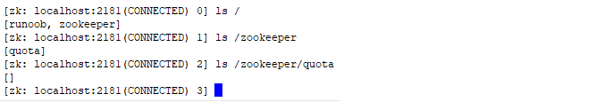
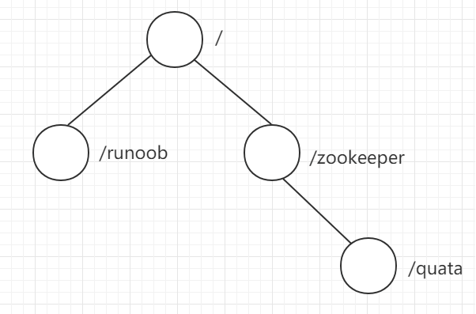
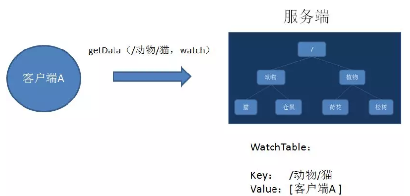
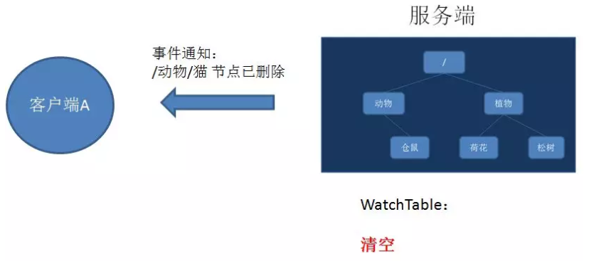
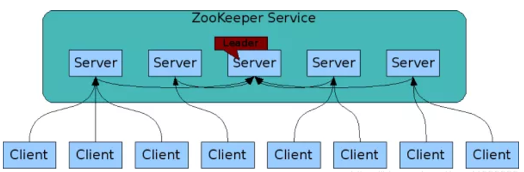
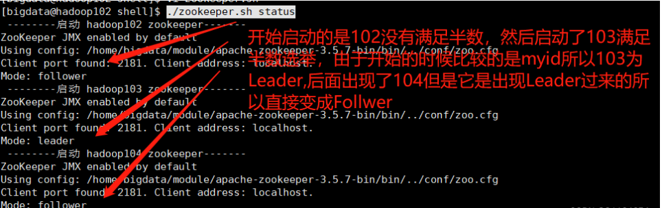
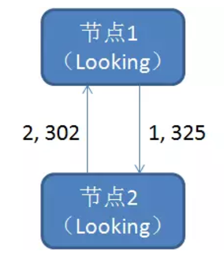
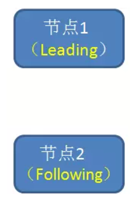

## Znode

### Znode 基本概念

在 zookeeper 中，可以说 zookeeper 中的所有存储的数据是由 znode 组成的，**节点也称为 znode，并以 key/value 形式存储数据**。

整体结构类似于 linux 文件系统的模式以树形结构存储。其中根路径以 / 开头。

进入 zookeeper 安装的 bin 目录，通过sh zkCli.sh打开命令行终端，执行 "ls /" 命令显示：

```
set /runoob 0
ls /
ls /zookeeper
ls /zookeeper/quota
```



我们直观的看到此时存储的数据在根目录下存在 runoob 和 zookeeper 两个节点，zookeeper 节点下存在 quota 这个节点。



```
get -s /runoob
```

```
[zk: localhost:2181(CONNECTED) 3] get -s /runoob
0
cZxid = 0x100000008
ctime = Fri Oct 27 11:16:26 CST 2023
mZxid = 0x100000008
mtime = Fri Oct 27 11:16:26 CST 2023
pZxid = 0x100000008
cversion = 0
dataVersion = 0
aclVersion = 0
ephemeralOwner = 0x0
dataLength = 1
numChildren = 0
```

其中第一行显示的 0 是该节点的 value 值。

### Znode 的状态属性

您提供的信息可以整理成如下的表格：

| 属性             | 描述                                               |
|------------------|---------------------------------------------------|
| cZxid            | 创建节点时的事务ID                                |
| ctime            | 创建节点时的时间                                   |
| mZxid            | 最后修改节点时的事务ID                            |
| mtime            | 最后修改节点时的时间                               |
| pZxid            | 表示该节点的子节点列表最后一次修改的事务ID，添加子节点或删除子节点就会影响子节点列表，但是修改子节点的数据内容则不影响该ID（注意，只有子节点列表变更了才会变更pzxid，子节点内容变更不会影响pzxid） |
| cversion         | 子节点版本号，子节点每次修改版本号加1             |
| dataversion      | 数据版本号，数据每次修改该版本号加1               |
| aclversion       | 权限版本号，权限每次修改该版本号加1               |
| ephemeralOwner   | 创建该临时节点的会话的sessionID。（如果该节点是持久节点，那么这个属性值为0） |
| dataLength       | 该节点的数据长度                                   |
| numChildren      | 该节点拥有子节点的数量（只统计直接子节点的数量）  |


了解上面状态属性值，我们对 /runoob 节点做一次修改，执行命令 set /runoob 1 ，如所示:

```
set /runoob 1
```

```
[zk: localhost:2181(CONNECTED) 3] get -s /runoob                                [zk: localhost:2181(CONNECTED) 5] get -s /runoob
0                                                                               1
cZxid = 0x100000008                                                             cZxid = 0x100000008
ctime = Fri Oct 27 11:16:26 CST 2023                                            ctime = Fri Oct 27 11:16:26 CST 2023
mZxid = 0x100000008                                                             mZxid = 0x100000009
mtime = Fri Oct 27 11:16:26 CST 2023                                            mtime = Fri Oct 27 11:27:47 CST 2023
pZxid = 0x100000008                                                             pZxid = 0x100000008
cversion = 0                                                                    cversion = 0
dataVersion = 0                                                                 dataVersion = 1
aclVersion = 0                                                                  aclVersion = 0
ephemeralOwner = 0x0                                                            ephemeralOwner = 0x0
dataLength = 1                                                                  dataLength = 1
numChildren = 0                                                                 numChildren = 0
```

对比上面结果，可以看到 mZxid、mtime、dataVersion 都发生了变化。

在 /runoob 节点下，我们再添加一子节点，执行：

```
create  /runoob/child  0
get -s /runoob
```

```
[zk: localhost:2181(CONNECTED) 5] get -s /runoob                                [zk: localhost:2181(CONNECTED) 8] get -s /runoob
1                                                                               1
cZxid = 0x100000008                                                             cZxid = 0x100000008
ctime = Fri Oct 27 11:16:26 CST 2023                                            ctime = Fri Oct 27 11:16:26 CST 2023
mZxid = 0x100000009                                                             mZxid = 0x100000009
mtime = Fri Oct 27 11:27:47 CST 2023                                            mtime = Fri Oct 27 11:27:47 CST 2023
pZxid = 0x100000008                                                             pZxid = 0x10000000a
cversion = 0                                                                    cversion = 1
dataVersion = 1                                                                 dataVersion = 1
aclVersion = 0                                                                  aclVersion = 0
ephemeralOwner = 0x0                                                            ephemeralOwner = 0x0
dataLength = 1                                                                  dataLength = 1
numChildren = 0                                                                 numChildren = 1
```

可见 /runoob 节点的 pZxid、cversion、numChildren 都发生了相应的改变。

> 需要注意的是：zookeeper是为读多写少的场景设计的，Znode并不是用来存储大规模业务数据，而是用于存储少量的状态和配置信息，每个节点的数据最大不能超过1MB。

## Watch

是注册在特点Znode上的触发器，当这个Znode发生改变，也就调用了create，delete，setData时，将会触发Znode上注册的对应事件，请求的Watch的客户端会接收到 <异步通知>。

具体交互过程：
- 客户端调用getData方法，watch参数是true。服务端接到请求，返回节点数据，**并且在对应的哈希表里插入被Watch的Znode路径，以及Watcher列表**。



- 当被Watch的Znode已删除，服务端会查找哈希表，**找到该Znode对应的所有Watcher，异步通知客户端，并且删除哈希表中对应的Key-Value**。



## Zookeeper的一致性

### 概述

Zookeeper作为注册中心，通常将维护一个集群：



- Zookeeper集群是一主多从结构,在更新数据时，首先更新到主节点（这里的节点指的是服务器，不是Znode），再同步到从节点，在读取数据时，直接读取任意从节点的数据，为了保证主从节点的数据一致性，zookeeper采用了ZAB协议，类似于一致性算法Paxos和Raft。

### 选举流程演示

- SID：服务器ID。用来唯一标识一台ZooKeeper集群中的机器，每台机器不能重复，和myid一致。
- ZXID：事务ID。ZXID是一个事务ID，用来标识一次服务器状态的变更。
- Epoch：每个Leader任期的代号。没有Leader时同一轮投票过程中的逻辑时钟值是相同的。每投完一次票这个数据就会增加。



#### 第一次选举

上面已经演示

#### 非第一次选举

zookeeper集群正常启动之后，leader挂了之后的选举。而当一台机器进入Leader选举流程时，当前集群也可能会处于以下两种状态：

- 集群中本来就已经存在一个Leader。

对于第一种已经存在Leader的情况，机器试图去选举Leader时，会被告知当前服务器的Leader信息，对于该机器来说，仅仅需要和Leader机器建立连接，并进行状态同步即可，自动变成 Follower 。

- 集群中确实不存在Leader。

例如

SID为1、2、3的机器投票情况：

以下是您提供的数据以表格形式呈现：

| （EPOCH，ZXID，SID ） | （EPOCH，ZXID，SID ） | （EPOCH，ZXID，SID ） |
|-------|------|-----|
| （1，6，1）    | （1，6，2）    | （1，5，3）  |

选举Leader规则：

- EPOCH大的直接胜出。
- EPOCH相同，事务id大的胜出。
- 事务id相同，服务器id大的胜出。

### ZAB协议

ZAB即zookeeper Atomic Broadcast，用于解决zookeeper集群崩溃恢复，以及主从同步数据的问题,ZAB协议所定义的三种节点状态。

- Looking：选举状态。
- Following：从节点所处的状态。
- Leading：主节点所处的状态。

最大ZXID的概念：最大ZXID也就是节点本地的最新事务编号，包含epoch和计数两部分。

假如zookeeper当前的主节点挂了，集群会进行崩溃恢复，ZAB的恢复分为三个阶段：

- **Leader election：**选举阶段，**此时集群的节点都处于Looking状态**，他们会各自向其他节点发起投票，**投票当中包含自己的服务器ID和最新的事务ZXID**。

    
    
    - 接下来，节点会用自身的ZXID和从其他节点接收到的ZXID比较，如果发现别人的ZXID比自己大，也就是数据比自己新，**那么就重新发起投票，把票投给目前已知最大的ZXID所属节点**。
    
    - 每次投票后，**服务器都会统计投票数量，判断是否有某个节点得到半数以上的投票**。如果存在这样的节点，该节点将会成为准Leader，状态变为Leading。其他节点的状态变为Following。

    

- **Discovery：**发现阶段，用于在从节点中发现最新的ZXID和事务日志。

    > 或许有人会问：既然Leader被选为主节点，已经是集群里数据最新的了，为什么还要从节点中寻找最新事务呢？这是为了防止某些意外情况，比如因网络原因在上一阶段产生多个Leader的情况。

    - 所以这一阶段，Leader集思广益，接收所有Follower发来各自的最新epoch值。Leader从中选出最大的epoch，基于此值加1，生成新的epoch分发给各个Follower。

    - 各个Follower收到全新的epoch后，返回ACK给Leader，带上各自最大的ZXID和历史事务日志。Leader选出最大的ZXID，并更新自身历史日志。


- **Synchronization：**同步阶段，把Leader刚才收集得到的最新历史事务日志，同步给集群中的所有Follower。只有当半数Follower同步成功，这个准Leader才能真正成为Leader。


所以 epoch 的值是为了防止多个 Leader 出现的问题，自此，故障恢复正式完成。


		


