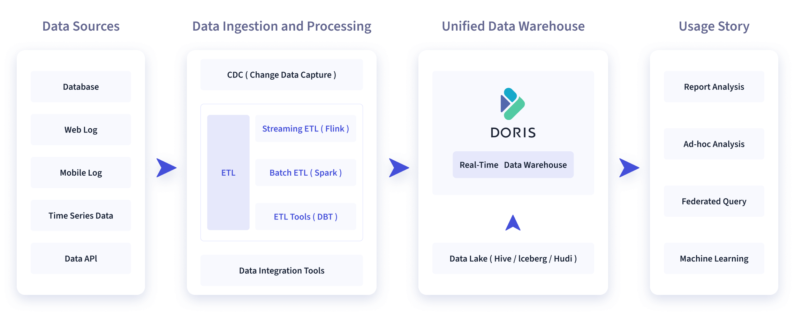
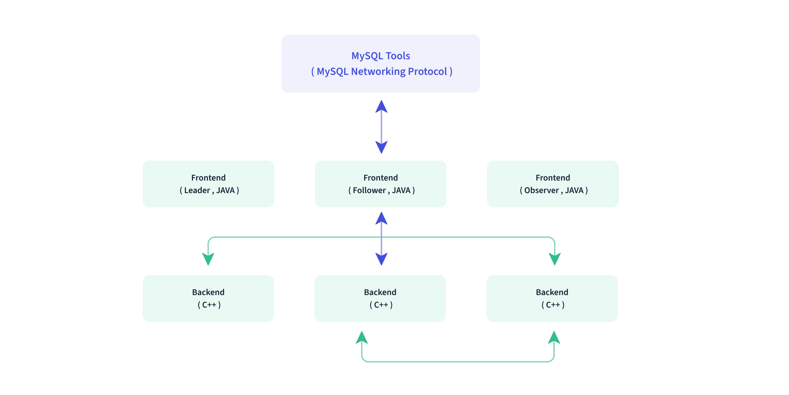
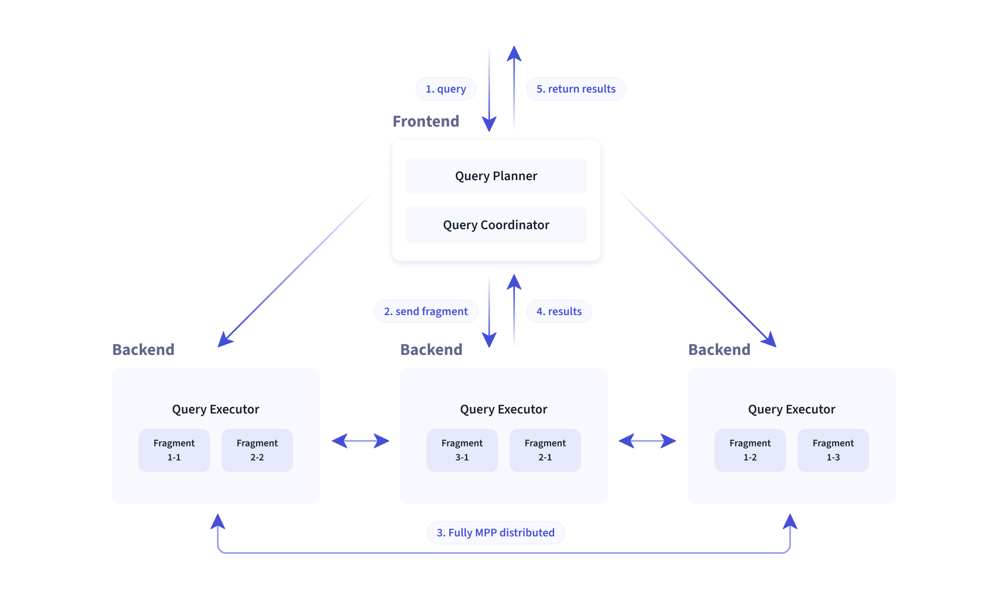
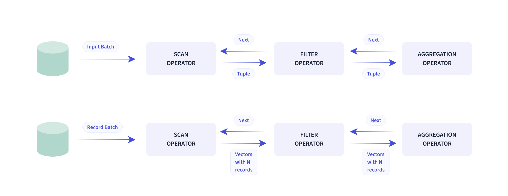

## Doris 介绍

### 使用场景

如下图所示，数据源经过各种数据集成和加工处理后，通常会入库到实时数仓 Doris 和离线湖仓（Hive, Iceberg, Hudi 中），Apache Doris 被广泛应用在以下场景中。

- 报表分析

    - 实时看板 （Dashboards）
    - 面向企业内部分析师和管理者的报表
    - 面向用户或者客户的高并发报表分析（Customer Facing Analytics）。比如面向网站主的站点分析、面向广告主的广告报表，并发通常要求成千上万的 QPS ，查询延时要求毫秒级响应。著名的电商公司京东在广告报表中使用 Apache Doris ，每天写入 100 亿行数据，查询并发 QPS 上万，99 分位的查询延时 150ms。
- 即席查询（Ad-hoc Query）：面向分析师的自助分析，查询模式不固定，要求较高的吞吐。小米公司基于 Doris 构建了增长分析平台（Growing Analytics，GA），利用用户行为数据对业务进行增长分析，平均查询延时 10s，95 分位的查询延时 30s 以内，每天的 SQL 查询量为数万条。

- 统一数仓构建 ：一个平台满足统一的数据仓库建设需求，简化繁琐的大数据软件栈。海底捞基于 Doris 构建的统一数仓，替换了原来由 Spark、Hive、Kudu、Hbase、Phoenix 组成的旧架构，架构大大简化。

- 数据湖联邦查询：通过外表的方式联邦分析位于 Hive、Iceberg、Hudi 中的数据，在避免数据拷贝的前提下，查询性能大幅提升。

### 技术概述

Doris整体架构如下图所示，Doris 架构非常简单，只有两类进程

- Frontend（FE），主要负责用户请求的接入、查询解析规划、元数据的管理、节点管理相关工作。
- Backend（BE），主要负责数据存储、查询计划的执行。

这两类进程都是可以横向扩展的，单集群可以支持到数百台机器，数十 PB 的存储容量。并且这两类进程通过一致性协议来保证服务的高可用和数据的高可靠。这种高度集成的架构设计极大的降低了一款分布式系统的运维成本。

在使用接口方面，**Doris 采用 MySQL 协议，高度兼容 MySQL 语法，支持标准 SQL，用户可以通过各类客户端工具来访问 Doris，并支持与 BI 工具的无缝对接。Doris 当前支持多种主流的 BI 产品，包括不限于 SmartBI、DataEase、FineBI、Tableau、Power BI、SuperSet 等**，只要支持 MySQL 协议的 BI 工具，Doris 就可以作为数据源提供查询支持。

在存储引擎方面，Doris 采用列式存储，按列进行数据的编码压缩和读取，能够实现极高的压缩比，同时减少大量非相关数据的扫描，从而更加有效利用 IO 和 CPU 资源。

Doris 也支持比较丰富的索引结构，来减少数据的扫描：

- Sorted Compound Key Index，可以最多指定三个列组成复合排序键，通过该索引，能够有效进行数据裁剪，从而能够更好支持高并发的报表场景**自动创建**

- Z-order Index ：使用 Z-order 索引，可以高效对数据模型中的任意字段组合进行范围查询**自动创建**

- Min/Max ：有效过滤数值类型的等值和范围查询**自动创建**

- Bloom Filter ：对高基数列的等值过滤裁剪非常有效**手动创建**

- Invert Index ：能够对任意字段实现快速检索**自动创建**

在存储模型方面，Doris 支持多种存储模型，针对不同的场景做了针对性的优化：

- Aggregate Key 模型：相同 Key 的 Value 列合并，通过提前聚合大幅提升性能

- Unique Key 模型：Key 唯一，相同 Key 的数据覆盖，实现行级别数据更新

- Duplicate Key 模型：明细数据模型，满足事实表的明细存储

Doris 也支持强一致的物化视图，物化视图的更新和选择都在系统内自动进行，不需要用户手动选择，从而大幅减少了物化视图维护的代价。

在查询引擎方面，Doris 采用 MPP 的模型，节点间和节点内都并行执行，也支持多个大表的分布式 Shuffle Join，从而能够更好应对复杂查询。

Doris 查询引擎是向量化的查询引擎，所有的内存结构能够按照列式布局，能够达到大幅减少虚函数调用、提升 Cache 命中率，高效利用 SIMD 指令的效果。在宽表聚合场景下性能是非向量化引擎的 5-10 倍。

Doris 采用了 Adaptive Query Execution 技术， 可以根据 Runtime Statistics 来动态调整执行计划，比如通过 Runtime Filter 技术能够在运行时生成 Filter 推到 Probe 侧，并且能够将 Filter 自动穿透到 Probe 侧最底层的 Scan 节点，从而大幅减少 Probe 的数据量，加速 Join 性能。Doris 的 Runtime Filter 支持 In/Min/Max/Bloom Filter。

在优化器方面 Doris 使用 CBO 和 RBO 结合的优化策略，RBO 支持常量折叠、子查询改写、谓词下推等，CBO 支持 Join Reorder。目前 CBO 还在持续优化中，主要集中在更加精准的统计信息收集和推导，更加精准的代价模型预估等方面。

> https://doris.apache.org/zh-CN/docs/dev/get-starting/what-is-apache-doris