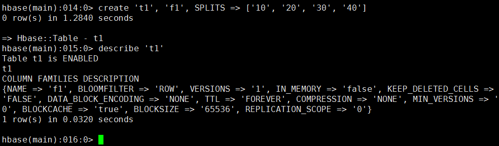
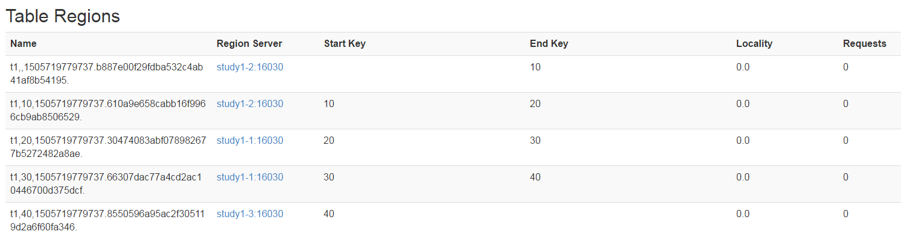
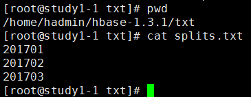
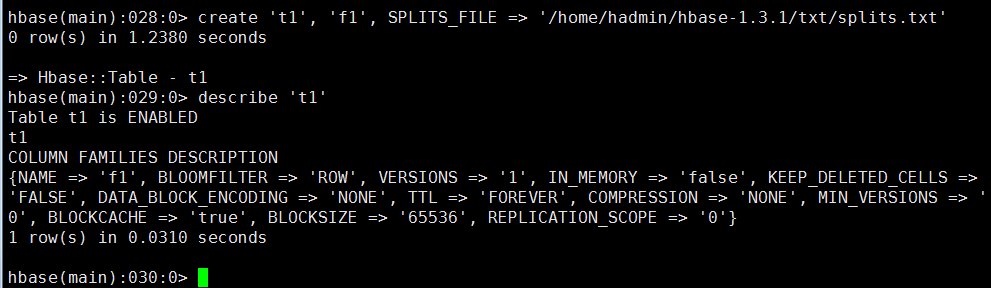
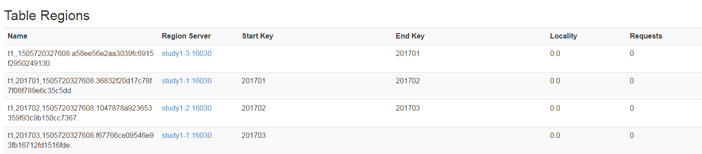

## （what）什么是预分区？
HBase表在刚刚被创建时，只有1个分区（region），当一个region过大（达到hbase.hregion.max.filesize属性中定义的阈值，默认10GB）时，

```xml
<configuration>
    <!-- 其他配置项 -->

    <!-- 设置 Region 中 HStore 的最大文件大小为 20 GB -->
    <property>
        <name>hbase.hregion.max.filesize</name>
        <value>21474836480</value> <!-- 20 GB -->
    </property>
</configuration>

```

表将会进行split，分裂为2个分区。表在进行split的时候，会耗费大量的资源，频繁的分区对HBase的性能有巨大的影响。

HBase提供了预分区功能，即用户可以在创建表的时候对表按照一定的规则分区。

## （why）预分区的目的是什么？
减少由于region split带来的资源消耗。从而提高HBase的性能。

## （how）如何预分区？
===方法1===

通过HBase shell来创建。命令样例如下：

```shell
create 'person1','info',{NUMREGIONS => 15, SPLITALGO => 'HexStringSplit'}
```

```shell
create 'te:te',{NAME => 'f1', BLOOMFILTER => 'ROW', IN_MEMORY => 'false', VERSIONS => '1', KEEP_DELETED_CELLS => 'FALSE', DATA_BLOCK_ENCODING => 'NONE', COMPRESSION => 'LZ4', TTL => 'FOREVER', MIN_VERSIONS => '0', BLOCKCACHE => 'true', BLOCKSIZE => '65536', REPLICATION_SCOPE => '0'},{NUMREGIONS => 5, SPLITALGO => 'HexStringSplit'}
```

```shell
create 't1', 'f1', SPLITS => ['10', '20', '30', '40']
```

```shell
create 't1', {NAME =>'f1', TTL => 180}, SPLITS => ['10', '20', '30', '40']
```

```shell
create 't1', {NAME =>'f1', TTL => 180}, {NAME => 'f2', TTL => 240}, SPLITS => ['10', '20', '30', '40']
```

```shell
create 'person1', {NAME => 'f1', COMPRESSION => 'LZ4'}, {NAME => 'f2', COMPRESSION => 'LZ4'}, {NAME => 'f3', COMPRESSION => 'LZ4'},SPLITS => ['10000000','20000000','30000000','40000000','50000000','60000000','70000000','80000000','90000000','a0000000','b0000000','c0000000','d0000000','e0000000','f0000000']
```

命令截图：



从Web界面查看表结构



===方法2===

仍然是通过HBase shell来创建，不过是通过读取文件

1、在任意路径下创建一个保存分区key的文件，我这里如下

路径：/home/hadmin/hbase-1.3.1/txt/splits.txt

内容如下图



2、通过HBase shell命令创建表

命令样例：

```shell
create 't1', 'f1', SPLITS_FILE => '/home/hadmin/hbase-1.3.1/txt/splits.txt'
```

```shell
create 't1', {NAME =>'f1', TTL => 180}, SPLITS_FILE => '/home/hadmin/hbase-1.3.1/txt/splits.txt'
```

```shell
create 't1', {NAME =>'f1', TTL => 180}, {NAME => 'f2', TTL => 240}, SPLITS_FILE => '/home/hadmin/hbase-1.3.1/txt/splits.txt'
```

操作截图：



Web界面结果：



====方法3==

通过java api创建，代码样例如下：

```java
package api;

import org.apache.hadoop.conf.Configuration;
import org.apache.hadoop.hbase.HBaseConfiguration;
import org.apache.hadoop.hbase.HColumnDescriptor;
import org.apache.hadoop.hbase.HTableDescriptor;
import org.apache.hadoop.hbase.TableName;
import org.apache.hadoop.hbase.client.Admin;
import org.apache.hadoop.hbase.client.Connection;
import org.apache.hadoop.hbase.client.ConnectionFactory;
import org.apache.hadoop.hbase.util.Bytes;

public class create_table_sample2 {
    public static void main(String[] args) throws Exception {
        Configuration conf = HBaseConfiguration.create();
        conf.set("hbase.zookeeper.quorum", "192.168.1.80,192.168.1.81,192.168.1.82");
        Connection connection = ConnectionFactory.createConnection(conf);
        Admin admin = connection.getAdmin();

        TableName table_name = TableName.valueOf("TEST1");
        if (admin.tableExists(table_name)) {
            admin.disableTable(table_name);
            admin.deleteTable(table_name);
        }

        HTableDescriptor desc = new HTableDescriptor(table_name);
        HColumnDescriptor family1 = new HColumnDescriptor(constants.COLUMN_FAMILY_DF.getBytes());
        family1.setTimeToLive(3 * 60 * 60 * 24);     //过期时间
        family1.setMaxVersions(3);                   //版本数
        desc.addFamily(family1);

        byte[][] splitKeys = {
            Bytes.toBytes("row01"),
            Bytes.toBytes("row02"),
        };

        admin.createTable(desc, splitKeys);
        admin.close();
        connection.close();
    }
}
```