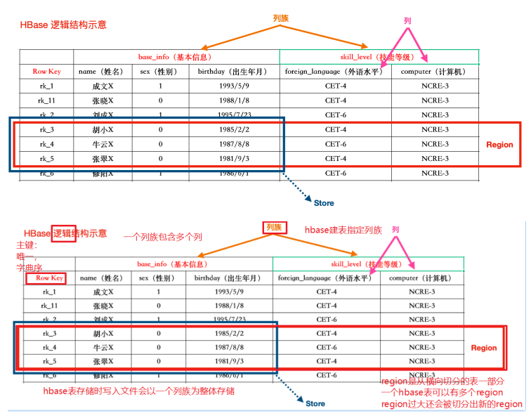
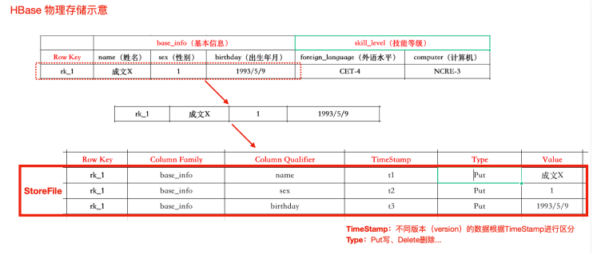
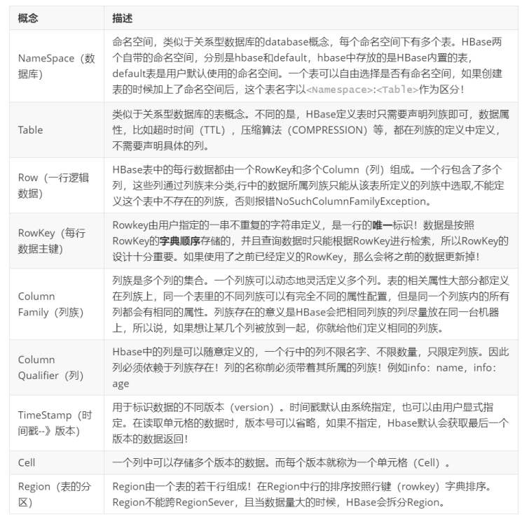
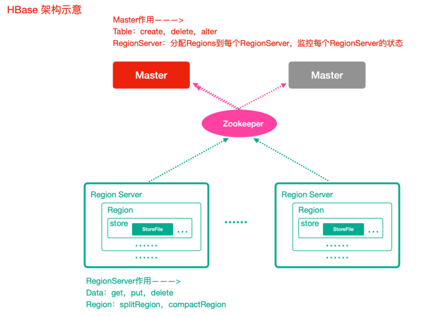
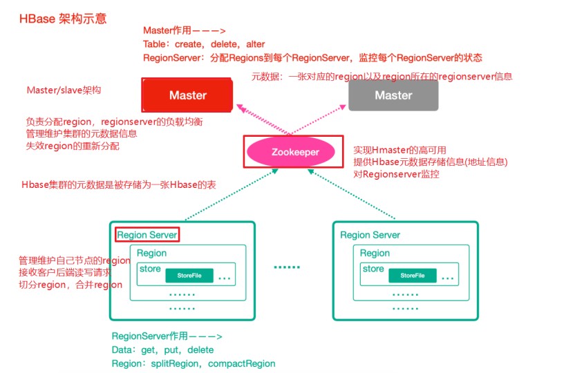
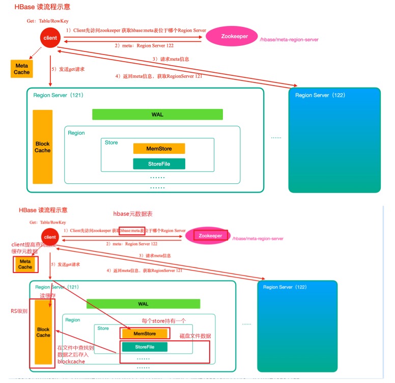
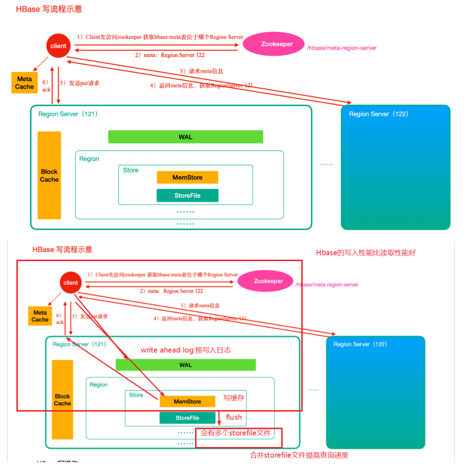

## HBase是什么
HBase 基于 Google的BigTable论文而来，**是一个分布式海量列式非关系型数据库系统**，可以提供超大规模数据集的实时随机读写。接下来，通过一个场景初步认识HBase列存储,如下MySQL存储机制，空值字段浪费存储空间。

如下MySQL存储机制，空值字段浪费存储空间

id  | NAME | AGE | SALARY | JOB 
-------- | ----- | -----| -----| -----
1 | 小明| 23| | 学生
2 | 小红| | 10w| 律师

如果是列存储的话，可以这么玩......

rowkey：1 name：小明

rowkey：1 age：23

rowkey：1 job：学生

rowkey：2 name ：小红

rowkey：2 salary：10w

rowkey：2 job：律师

列存储的优点：
- 1）减少存储空间占用。
- 2）支持好多列

##  HBase的特点

- **海量存储：** 底层基于HDFS存储海量数据 
- **列式存储：**HBase表的数据是基于列族进行存储的，一个列族包含若干列
- **极易扩展：**底层依赖HDFS，**当磁盘空间不足的时候，只需要动态增加DataNode服务节**点就可以
- **高并发：**支持高并发的读写请求
- **稀疏：**稀疏主要是针对HBase列的灵活性，在列族中，你可以指定任意多的列，在列数据为空的情况下，是不会占用存储空间的。
- **数据的多版本：**HBase表中的数据可以有多个版本值，默认情况下是根据版本号去区分，版本号就是插入数据的时间戳
- **数据类型单一：**所有的数据在HBase中是以字节数组进行存储

## HBase的应用

- 交通方面：船舶GPS信息，每天有上千万左右的数据存储。
- 金融方面：消费信息、贷款信息、信用卡还款信息等
- 电商方面：电商网站的交易信息、物流信息、游览信息等
- 电信方面：通话信息

总结：HBase适合海量明细数据的存储，**并且后期需要有很好的查询性能（单表超千万、上亿，且并发要求高）**

## HBase数据模型

HBase的数据也是以表（有行有列）的形式存储

HBase物理存储

相关概念

## HBase整体架构

Zookeeper

- 实现了HMaster的高可用
- 保存了HBase的元数据信息，**是所有HBase表的寻址入口**
- **对HMaster和HRegionServer实现了监控**

HMaster（Master）

- 为HRegionServer分配Region
- **维护整个集群的负载均衡**
- 维护集群的元数据信息
- 发现失效的Region，并将失效的Region分配到正常的HRegionServer上

HRegionServer（RegionServer）

- 负责管理Region
- 接受客户端的读写数据请求
- 切分在运行过程中变大的Region

Region

- 每个HRegion由多个Store构成，
- **每个Store保存一个列族（Columns Family），表有几个列族，则有几个Store**，
- **每个Store由一个MemStore和多个StoreFile组成**，MemStore是Store在内存中的内容，写到文件
- 后就是StoreFile。S**toreFile底层是以HFile的格式保存**。

## HBase原理

###  HBase读数据流程

读取数据原理

**HBase读操作**

- 1）**首先从zk找到meta表的region位置**，然后读取meta表中的数据，meta表中存储了用户表的region信息
- 2）根据要查询的namespace、表名和rowkey信息。找到写入数据对应的region信息
- 3）**找到这个region对应的regionServer，然后发送请求**
- 4）查找对应的region
- 5）**先从memstore查找数据，如果没有，再从BlockCache上读取**,HBase上Regionserver的内存分为两个部分一部分作为Memstore，主要用来写；另外一部分作为BlockCache，主要用于读数据；
- 6）如果BlockCache中也没有找到，再到StoreFile上进行读取从storeFile中读取到数据之后，不是直接把结果数据返回给客户端，而是把数据先写入到BlockCache中，目的是为了加快后续的查询；然后在返回结果给客户端。

### HBase写数据流程

**HBase写操作**

- 1）**首先从zk找到meta表的region位置，然后读取meta表中的数**据，meta表中存储了用户表的region信息
- 2）根据namespace、表名和rowkey信息。找到写入数据对应的region信息
- 3）找到这个region对应的regionServer，然后发送请求
- 4）**把数据分别写到HLog（write ahead log）和memstore各一份**
- 5）memstore达到阈值后把数据刷到磁盘，生成storeFile文件
- 6）删除HLog中的历史数

