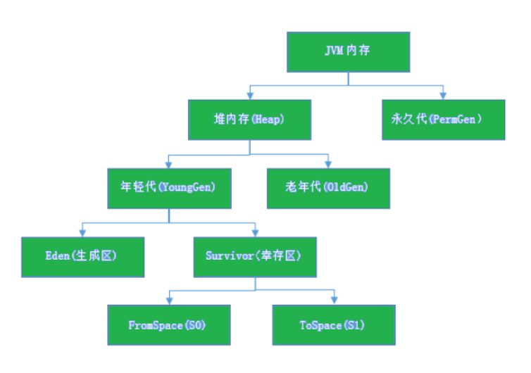
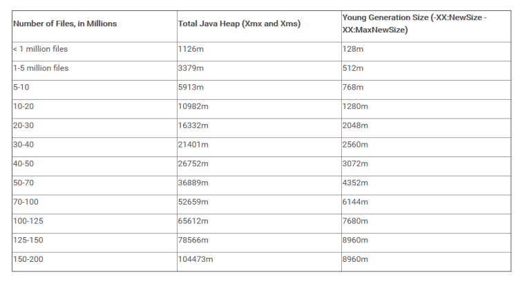

## NM配置

### 可用内存

刨除分配给操作系统、其他服务的内存外，剩余的资源应尽量分配给YARN。默认情况下，Map或Reduce container会使用1个虚拟CPU内核和1024MB内存，ApplicationMaster使用1536MB内存。

```
yarn.nodemanager.resource.memory-mb 默认是8192
```

### CPU虚拟核数
建议将此配置设定在逻辑核数的1.5～2倍之间。如果CPU的计算能力要求不高，可以配置为2倍的逻辑CPU。

```
yarn.nodemanager.resource.cpu-vcores
该节点上YARN可使用的虚拟CPU个数，默认是8。
目前推荐将该值设值为逻辑CPU核数的1.5～2倍之间
```

### Container启动模式

YARN的NodeManager提供2种Container的启动模式。

默认，**YARN为每一个Container启动一个JVM，JVM进程间不能实现资源共享**，导致资源本地化的时间开销较大。针对启动时间较长的问题，新增了基于线程资源本地化启动模式，能够有效提升container启动效率。

```
yarn.nodemanager.container-executor.class
```

- 设置为“org.apache.hadoop.yarn.server.nodemanager.DefaultContainerExecutor”，则每次启动container将会启动一个线程来实现资源本地化。该模式下，启动时间较短，但无法做到资源（CPU、内存）隔离。

- 设置为“org.apache.hadoop.yarn.server.nodemanager.LinuxContainerExecutor” ，则每次启container都会启动一个JVM进程来实现资源本地化。该模式下，启动时间较长，但可以提供较好的资源（CPU、内存）隔离能力。

## AM调优

运行的一个大任务，map总数达到了上万的规模，任务失败，发现是ApplicationMaster（以下简称
AM）反应缓慢，最终超时失败。失败原因是Task数量变多时，AM管理的对象也线性增长，因此就需要更多的内存来管理。AM默认分配的内存大小是1.5GB。

建议：
任务数量多时增大AM内存

```
yarn.app.mapreduce.am.resource.mb
```

## Namenode Full GC

### JVM堆内存



- JVM内存划分为堆内存和非堆内存，堆内存分为年轻代（Young Generation）、老年代（Old Generation），非堆内存就一个永久代（Permanent Generation）。

- 年轻代又分为Eden和Survivor区。Survivor区由FromSpace和ToSpace组成。Eden区占大容量，Survivor两个区占小容量，默认比例是8:1:1。

- 堆内存用途：存放的是对象，垃圾收集器就是收集这些对象，然后根据GC算法回收。

- 非堆内存用途：永久代，也称为方法区，存储程序运行时长期存活的对象，比如类的元数据、方法、常量、属性等。

补充：
JDK1.8版本废弃了永久代，替代的是元空间（MetaSpace），元空间与永久代上类似，都是方法区的实现，他们最大区别是：元空间并不在JVM中，而是使用本地内存。

### 对象分代

- 新生成的对象首先放到年轻代Eden区。
- 当Eden空间满了，触发Minor GC，存活下来的对象移动到Survivor0区。
- Survivor0区满后触发执行Minor GC，Survivor0区存活对象移动到Suvivor1区，这样保证了一段时间内总有一个survivor区为空。
- 经过多次Minor GC仍然存活的对象移动到老年代。
- 老年代存储长期存活的对象，占满时会触发Major GC（Full GC），GC期间会停止所有线程等待GC完成，所以对响应要求高的应用尽量减少发生Major GC，避免响应超时。

Minor GC ： 清理年轻代
Major GC(Full GC) ： 清理老年代，清理整个堆空间，会停止应用所有线程。

### Jstat
查看当前jvm内存使用以及垃圾回收情况

```
jstat -gc -t 58563 1s #显示pid是58563的垃圾回收堆的行为统计
Timestamp S0C S1C S0U S1U EC EU OC OU
MC MU CCSC CCSU YGC YGCT FGC FGCT GCT
9751.8 12288.0 12288.0 0.0 0.0 158208.0 8783.6 54272.0
23264.6 35496.0 34743.9 4144.0 3931.8 9 0.231 2 0.123 0.354
9752.8 12288.0 12288.0 0.0 0.0 158208.0 8783.6 54272.0
23264.6 35496.0 34743.9 4144.0 3931.8 9 0.231 2 0.123 0.354
9753.8 12288.0 12288.0 0.0 0.0 158208.0 8783.6 54272.0
23264.6 35496.0 34743.9 4144.0 3931.8 9 0.231 2 0.123 0.354
9754.8 12288.0 12288.0 0.0 0.0 158208.0 8783.6 54272.0
23264.6 35496.0 34743.9 4144.0 3931.8 9 0.231 2 0.123 0.354
9755.8 12288.0 12288.0 0.0 0.0 158208.0 8783.6 54272.0
23264.6 35496.0 34743.9 4144.0 3931.8 9 0.231 2 0.123 0.354
9756.9 12288.0 12288.0 0.0 0.0 158208.0 8783.6 54272.0
23264.6 35496.0 34743.9 4144.0 3931.8 9 0.231 2 0.123 0.354
```

结果解释：

```
#C即Capacity 总容量，U即Used 已使用的容量
S0C: 当前survivor0区容量（kB）。
S1C: 当前survivor1区容量（kB）。
S0U: survivor0区已使用的容量（KB）
S1U: survivor1区已使用的容量（KB）
EC: Eden区的总容量（KB）
EU: 当前Eden区已使用的容量（KB）
OC: Old空间容量（kB）。
OU: Old区已使用的容量（KB）
MC: Metaspace空间容量（KB）
MU: Metacspace使用量（KB）
CCSC: 压缩类空间容量（kB）。
CCSU: 压缩类空间使用（kB）。
YGC: 新生代垃圾回收次数
YGCT: 新生代垃圾回收时间
FGC: 老年代 full GC垃圾回收次数
FGCT: 老年代垃圾回收时间
GCT: 垃圾回收总消耗时间
```

开启HDFS GC详细日志输出
编辑hadoop-env.sh

```
export HADOOP_LOG_DIR=/hadoop/logs/
```
增加JMX配置打印详细GC信息,指定一个日志输出目录；注释掉之前的ops,增加新的打印配置。

```shell
#JMX配置
export HADOOP_JMX_OPTS="-Dcom.sun.management.jmxremote.authenticate=false -Dcom.sun.management.jmxremote.ssl=false"

export NAMENODE_OPTS="-verbose:gc -XX:+PrintGCDetails -Xloggc:${HADOOP_LOG_DIR}/logs/hadoop-gc.log -XX:+PrintGCDateStamps -XX:+PrintGCApplicationConcurrentTime -XX:+PrintGCApplicationStoppedTime -server -Xms150g -Xmx150g -Xmn20g -XX:SurvivorRatio=8 -XX:MaxTenuringThreshold=15 -XX:ParallelGCThreads=18 -XX:+UseConcMarkSweepGC -XX:+UseParNewGC -XX:+UseCMSCompactAtFullCollection -XX:+DisableExplicitGC -XX:+CMSParallelRemarkEnabled -XX:+CMSClassUnloadingEnabled -XX:CMSInitiatingOccupancyFraction=70 -XX:+UseFastAccessorMethods -XX:+UseCMSInitiatingOccupancyOnly -XX:CMSMaxAbortablePrecleanTime=5000 -XX:+UseGCLogFileRotation -XX:GCLogFileSize=20m -XX:ErrorFile=${HADOOP_LOG_DIR}/logs/hs_err.log.%p -XX:+HeapDumpOnOutOfMemoryError -XX:HeapDumpPath=${HADOOP_LOG_DIR}/logs/%p.hprof"

export DATENODE_OPTS="-verbose:gc -XX:+PrintGCDetails -Xloggc:${HADOOP_LOG_DIR}/hadoop-gc.log -XX:+PrintGCDateStamps -XX:+PrintGCApplicationConcurrentTime -XX:+PrintGCApplicationStoppedTime -server -Xms15g -Xmx15g -Xmn4g -XX:SurvivorRatio=8 -XX:MaxTenuringThreshold=15 -XX:ParallelGCThreads=18 -XX:+UseConcMarkSweepGC -XX:+UseParNewGC -XX:+UseCMSCompactAtFullCollection -XX:+DisableExplicitGC -XX:+CMSParallelRemarkEnabled -XX:+CMSClassUnloadingEnabled -XX:CMSInitiatingOccupancyFraction=70 -XX:+UseFastAccessorMethods -XX:+UseCMSInitiatingOccupancyOnly -XX:CMSMaxAbortablePrecleanTime=5000 -XX:+UseGCLogFileRotation -XX:GCLogFileSize=20m -XX:ErrorFile=${HADOOP_LOG_DIR}/logs/hs_err.log.%p -XX:+HeapDumpOnOutOfMemoryError -XX:HeapDumpPath=${HADOOP_LOG_DIR}/logs/%p.hprof"

export HADOOP_NAMENODE_OPTS="-Dhadoop.security.logger=${HADOOP_SECURITY_LOGGER:-INFO,RFAS} -Dhdfs.audit.logger=${HDFS_AUDIT_LOGGER:-INFO,NullAppender} $HADOOP_NAMENODE_OPTS"

export HADOOP_DATANODE_OPTS="-Dhadoop.security.logger=ERROR,RFAS $HADOOP_DATANODE_OPTS"

export HADOOP_NAMENODE_OPTS="$NAMENODE_OPTS $HADOOP_NAMENODE_OPTS"
export HADOOP_DATANODE_OPTS="$DATENODE_OPTS $HADOOP_DATANODE_OPTS"

```

- Xms150g -Xmx150g ：堆内存大小最大和最小都是150g
- -Xmn20g ：新生代大小为20g，等于eden+2*survivor，意味着老年代为150-20=130g。
- -XX:SurvivorRatio=8 ：Eden和Survivor的大小比值为8，意味着两个Survivor区和一个Eden区
- 的比值为2：8，一个Survivor占整个年轻代的1/10
- -XX:ParallelGCThreads=10 ：设置ParNew GC的线程并行数，默认为 8 +
- (Runtime.availableProcessors - 8) * 5/8 ，24核机器为18。
- -XX:MaxTenuringThreshold=15 ：设置对象在年轻代的最大年龄，超过这个年龄则会晋升到老年
- 代
- -XX:+UseParNewGC ：设置新生代使用Parallel New GC
- -XX:+UseConcMarkSweepGC ：设置老年代使用CMS GC，当此项设置时候自动设置新生代为
- ParNew GC
- -XX:CMSInitiatingOccupancyFraction=70 ：
- 老年代第一次占用达到该百分比时候，就会引发CMS的第一次垃圾回收周期。后继CMS GC由
- HotSpot自动优化计算得到。

## 总结：

### 合理配置JVM
在HDFS Namenode内存中的对象大都是文件，目录和blocks，这些数据只要不被程序或者数据的拥有者人为的删除，就会在Namenode的运 行生命期内一直存在，所以这些对象通常是存在在old区中，所以，如果整个hdfs文件和目录数多，blocks数也多，内存数据也会很大，如何降低Full GC的影响？

计算NN所需的内存大小，合理配置JVM



### 使用低卡顿G1收集器

为什么会有G1呢？
因为并发、并行和CMS垃圾收集器都有2个共同的问题：

- 老年代收集器大部分操作都必须扫描整个老年代空间（标记，清除和压缩）。这就导致了GC随着Java堆空间而线性增加或减少
年轻代和老年代是独立的连续内存块，所以要先决定年轻代和年老代放在虚拟地址空间的位置。

- G1垃圾收集器利用分而治之的思想将堆进行分区，划分为一个个的区域。
G1垃圾收集器将堆拆成一系列的分区，这样的话，大部分的垃圾收集操作就只在一个分区内执行，从而避免很多GC操作在整个Java堆或者整个年轻代进行。
编辑hadoop-env.sh

```shell
export HADOOP_NAMENODE_OPTS="-server -Xmx220G -Xms200G -XX:+UseG1GC -XX:MaxGCPauseMillis=200 -XX:+UnlockExperimentalVMOptions -XX:+ParallelRefProcEnabled -XX:-ResizePLAB -XX:+PerfDisableSharedMem -XX:-
OmitStackTraceInFastThrow -XX:G1NewSizePercent=2 -XX:ParallelGCThreads=23 -XX:InitiatingHeapOccupancyPercent=40 -XX:G1HeapRegionSize=32M -XX:G1HeapWastePercent=10 -XX:G1MixedGCCountTarget=16 -verbose:gc -XX:+PrintGCDetails -XX:+PrintGCDateStamps -XX:+PrintGCTimeStamps -
XX:+UseGCLogFileRotation -XX:NumberOfGCLogFiles=5 -XX:GCLogFileSize=100M -Xloggc:/var/log/hbase/gc.log -Dhadoop.security.logger=${HADOOP_SECURITY_LOGGER:-INFO,RFAS} -Dhdfs.audit.logger=${HDFS_AUDIT_LOGGER:-INFO,NullAppender} $HADOOP_NAMENODE_OPTS"
```
