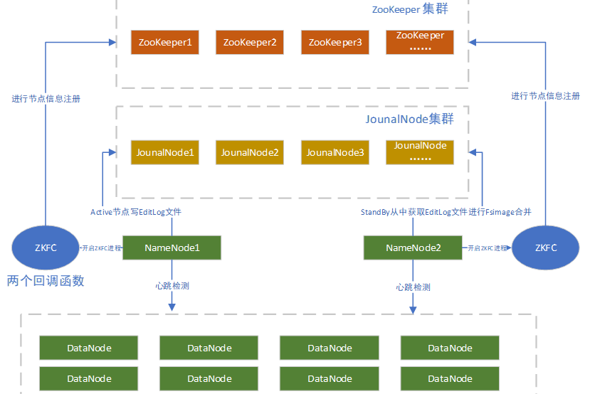
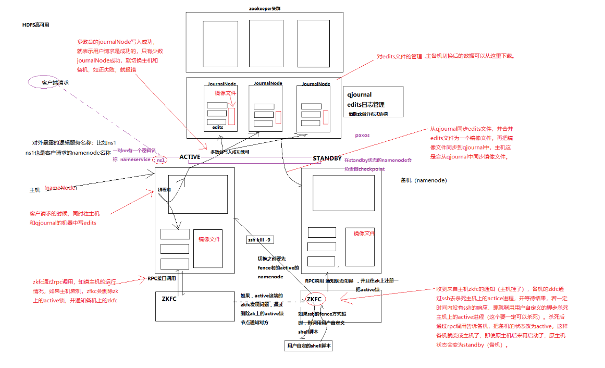
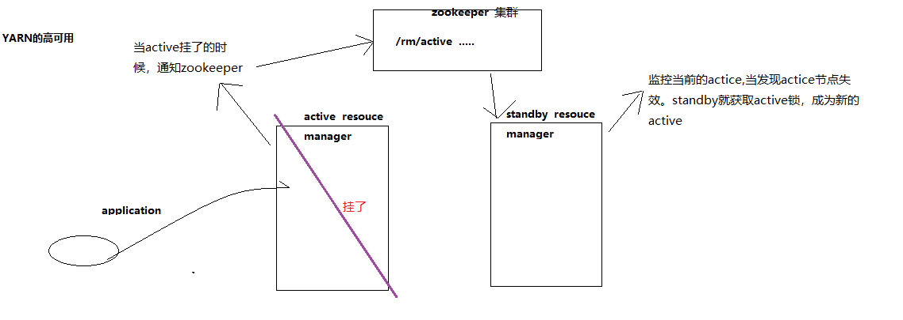

# 概述

> https://blog.csdn.net/S1124654/article/details/125513240

## Hadoop高可用架构图

## 高可用简图

 

## 高可用详细图

### HDFS 高可用



### YARN 高可用



## namenode 扩容（联邦）


## 查看yarn任务的脚本
```python
#!/usr/bin/env python3
import json
import requests
import os

# 替换为你的YARN ResourceManager地址
yarn_rm_address = "http://bigdata:8088/ws/v1/cluster/apps"

def get_running_tasks():
    headers = {'Accept': 'application/json'}
    response = requests.get(yarn_rm_address, headers=headers)

    if response.status_code == 200:
        apps_info = json.loads(response.text)['apps']['app']

        if isinstance(apps_info, list):
            running_apps = [(app['name'], app['id']) for app in apps_info if app['state'] not in ('FINISHED', 'FAILED', 'KILLED')]
            return running_apps
        else:
            print("Unexpected data format from YARN API.")
            return []

    else:
        print(f"Failed to fetch YARN applications info. Status code: {response.status_code}")
        return []

if __name__ == "__main__":
    running_tasks = get_running_tasks()
    flag=False

    if running_tasks:
        for task_name, app_id in running_tasks:
            if(task_name=="com.bigdata.bj.offline.job.test"):
                flag=True
    else:
        print("No running tasks found.")

    if flag==True:
        print("任务正在运行")
    else:
        os.system("hadoop jar /home/bj-offline-0.0.1.jar com.bigdata.bj.offline.job.test -Dmapreduce.job.maps=16")
        os.system("echo '启动了1' >> /home/count.txt")
```

