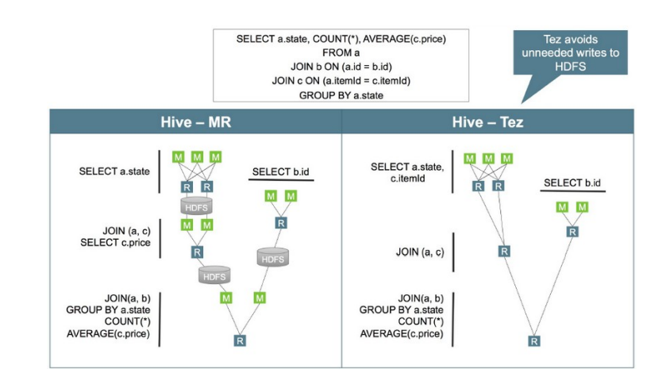
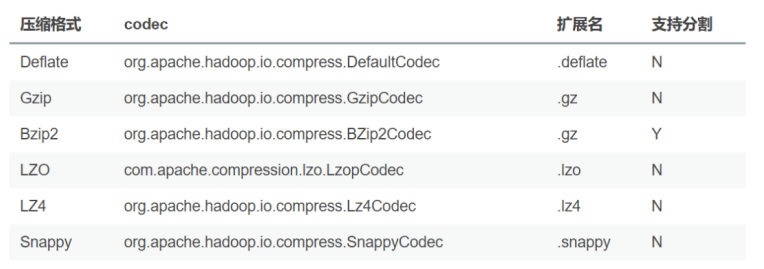
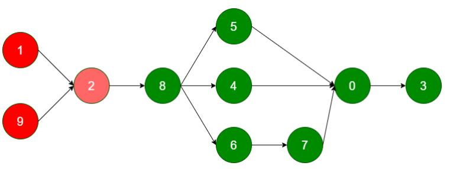

## 架构优化

### 执行引擎

Hive支持多种执行引擎，分别是 MapReduce、Tez、Spark、Flink。可以通过hive的site.xml文件中的hive.execution.engine属性控制。Tez是一个构建YARN之上的支持复杂的DAG（有向无环图）任务的数据处理框架。由Hontonworks开源，**将MapReduce的过程拆分成若干个子过程，同时可以把多个mapreduce任务组合成一个较大的DAG任务，减少了MapReduce之间的文件存储**，同时合理组合其子过程从而大幅提升MR作业的性能。



### 优化器

与关系型数据库类似，Hive会在真正执行计算之前，生成和优化逻辑执行计划与物理执行计划。Hive有两种优化器：Vectorize(向量化优化器) 与 Cost-Based
Optimization (CBO 成本优化器)。

- **矢量化查询执行**

**矢量化查询(要求执行引擎为Tez)执行通过一次批量执行1024行而不是每行一行来提高扫描**，聚合，过滤器和连接等操作的性能，这个功能一显着缩短查询执行时间。

```sql
set hive.vectorized.execution.enabled = true;
-- 默认 false
set hive.vectorized.execution.reduce.enabled = true;
-- 默认 false
```

> 备注：要使用矢量化查询执行，必须用ORC格式存储数据

- **成本优化器**

Hive的CBO是基于apache Calcite的，**Hive的CBO通过查询成本(有analyze收集的统计信息)会生成有效率的执行计划**，最终会减少执行的时间和资源的利用，使用CBO的配置如下：

```sql
SET hive.cbo.enable=true; --从 v0.14.0默认
true
SET hive.compute.query.using.stats=true; -- 默认false
SET hive.stats.fetch.column.stats=true; -- 默认false
SET hive.stats.fetch.partition.stats=true; -- 默认true
```
> 定期执行表（analyze）的分析，分析后的数据放在元数据库中。

### 分区表

对于一张比较大的表，将其设计成分区表可以提升查询的性能，对于一个特定分区的查询，**只会加载对应分区路径的文件数据，所以执行速度会比较快**。
分区字段的选择是影响查询性能的重要因素，尽量避免层级较深的分区，这样会造成太多的子文件夹。一些常见的分区字段可以是：

- 日期或时间。如year、month、day或者hour，当表中存在时间或者日期字段时
- 地理位置。如国家、省份、城市等
- 业务逻辑。如部门、销售区域、客户等等

### 分桶表

与分区表类似，**分桶表的组织方式是将HDFS上的文件分割成多个文件**。分桶可以加快数据采样，也可以提升join的性能(join的字段是分桶字段)，**因为分桶可以确保某个key对应的数据在一个特定的桶内(文件)，巧妙地选择分桶字段可以大幅度提升join的性能**。通常情况下，分桶字段可以选择经常用在过滤操作或者join操作的字段。

### 文件格式

在HiveQL的create table语句中，可以使用 stored as ... 指定表的存储格式。**Hive表支持的存储格式有TextFile、SequenceFile、RCFile、ORCParquet**等。存储格式一般需要根据业务进行选择，**生产环境中绝大多数表都采用TextFile、ORC、Parquet存储格式之一**。TextFile是最简单的存储格式，它是纯文本记录，也是Hive的默认格式。其磁盘开销大，查询效率低，更多的是作为跳板来使用。**RCFile、ORC、Parquet等格式的表都不能由文件直接导入数据，必须由TextFile来做中转**。Parquet和ORC都是Apache旗下的开源列式存储格式。列式存储比起传统的行式存储更适合批量OLAP查询，并且也支持更好的压缩和编码。**选择Parquet的原因主要是它支持Impala查询引擎，并且对update、delete和事务性操作需求很低**。

### 数据压缩

压缩技术可以减少map与reduce之间的数据传输，从而可以提升查询性能，关于压缩的配置可以在hive的命令行中或者hive-site.xml文件中进行配置。

```sql
SET hive.exec.compress.intermediate=true
```

开启压缩之后，可以选择下面的压缩格式：



关于压缩的编码器可以通过mapred-site.xml, hive-site.xml进行配置，也可以通过命令行进行配置，如：

```sql
-- 中间结果压缩
SET hive.intermediate.compression.codec=org.apache.hadoop.io.compress.SnappyCodec ;
-- 输出结果压缩
SET hive.exec.compress.output=true;
SET mapreduce.output.fileoutputformat.compress.codec = org.apache.hadoop.io.compress.SnappyCodc
```

### 设计阶段

```
执行引擎
优化器
分区、分桶
文件格式
数据压缩
```

## 参数优化

### 本地模式

当Hive处理的数据量较小时，启动分布式去处理数据会有点浪费，因为可能启动的时间比数据处理的时间还要长。Hive支持将作业动态地转为本地模式，需要使用下面的配置：

```sql
SET hive.exec.mode.local.auto=true; -- 默认 false
SET hive.exec.mode.local.auto.inputbytes.max=50000000;
SET hive.exec.mode.local.auto.input.files.max=5; -- 默认 4
```

一个作业只要满足下面的条件，会启用本地模式

- 输入文件的大小小于 hive.exec.mode.local.auto.inputbytes.max 配置的大小
- map任务的数量小于 hive.exec.mode.local.auto.input.files.max 配置的大小
- reduce任务的数量是1或者0

### 严格模式

所谓严格模式，就是强制不允许用户执行3种有风险的HiveQL语句，一旦执行会直接失败。这3种语句是：

- 查询分区表时不限定分区列的语句；
- 两表join产生了笛卡尔积的语句；
- 用order by来排序，但没有指定limit的语句。

要开启严格模式，需要将参数 hive.mapred.mode 设为strict(缺省值)。该参数可以不在参数文件中定义，在执行SQL之前设置(set hive.mapred.mode=nostrict )

### JVM重用

默认情况下，**Hadoop会为为一个map或者reduce启动一个JVM，这样可以并行执行map和reduce。当map或者reduce是那种仅运行几秒钟的轻量级作业时，JVM启动进程所耗费的时间会比作业执行的时间还要长**。Hadoop可以重用JVM，通过共享JVM以串行而非并行的方式运行map或者reduce。JVM的重用适用于同一个作业的map和reduce，对于不同作业的task不能够共享JVM。如果要开启JVM重用，需要配置一个作业最大task数量，默认值为1，如果设置为-1，则表示不限制：

```sql
# 代表同一个MR job中顺序执行的5个task重复使用一个JVM，减少启动和关闭的开销
SET mapreduce.job.jvm.numtasks=5;
```

这个功能的缺点是，开启JVM重用将一直占用使用到的task插槽，以便进行重用，直到任务完成后才能释放。如果某个“不平衡的”job中有某几个reduce task执行的时间要比其他Reduce task消耗的时间多的多的话，那么保留的插槽就会一直空闲着却无法被其他的job使用，直到所有的task都结束了才会释放。

### 并行执行

Hive的查询通常会被转换成一系列的stage，这些stage之间并不是一直相互依赖的，可以并行执行这些stage，通过下面的方式进行配置：

```sql
SET hive.exec.parallel=true; -- 默认false
SET hive.exec.parallel.thread.number=16; -- 默认8
```

并行执行可以增加集群资源的利用率，如果集群的资源使用率已经很高了，那么并行执行的效果不会很明显。

### 推测执行

在分布式集群环境下，因为程序Bug、负载不均衡、资源分布不均等原因，会造成同一个作业的多个任务之间运行速度不一致，有些任务的运行速度可能明显慢于其他任务（比如一个作业的某个任务进度只有50%，而其他所有任务已经运行完毕），则这些任务会拖慢作业的整体执行进度。为了避免这种情况发生，Hadoop采用了推测执行机制，**它根据一定的规则推测出“拖后腿”的任务，并为这样的任务启动一个备份任务，让该任务与原始任务同时处理同一份数据**，并最终选用最先成功运行完成任务的计算结果作为最终结果。

```sql
set mapreduce.map.speculative=true
set mapreduce.reduce.speculative=true
set hive.mapred.reduce.tasks.speculative.execution=true
```
### 合并小文件

- 在map执行前合并小文件，减少map数

```sql
# 缺省参数
set hive.input.format=org.apache.hadoop.hive.ql.io.CombineHiveInputFormat;
```

- 在Map-Reduce的任务结束时合并小文件

```sql
# 在 map-only 任务结束时合并小文件，默认true
SET hive.merge.mapfiles = true;
# 在 map-reduce 任务结束时合并小文件，默认false
SET hive.merge.mapredfiles = true;
# 合并文件的大小，默认256M
SET hive.merge.size.per.task = 268435456;
# 当输出文件的平均大小小于该值时，启动一个独立的map-reduce任务进行文件merge
SET hive.merge.smallfiles.avgsize = 16777216;
```

### Fetch模式

Fetch模式是指Hive中对某些情况的查询可以不必使用MapReduce计算。select col1, col2 from tab ;可以简单地读取表对应的存储目录下的文件，然后输出查询结果到控制台。在开启fetch模式之后，在全局查找、字段查找、limit查找等都不启动 MapReduce 。

```sql
# Default Value: minimal in Hive 0.10.0 through 0.13.1, more in
Hive 0.14.0 and later
hive.fetch.task.conversion=more
```

### 参数调整：
```
本地模式
严格模式
JVM重用
并行执行
推测还行
合并小文件
Fetch模式
```
参数说明文档
> https://cwiki.apache.org/confluence/display/Hive/Configuration+Properties

## SQL优化

### 列裁剪和分区裁剪

**列裁剪是在查询时只读取需要的列；分区裁剪就是只读取需要的分区**。简单的说：select 中不要有多余的列，坚决避免 select * from tab; 查询分区表，不读多余的数据；

```sql
select uid, event_type, record_data
from calendar_record_log
where pt_date >= 20190201 and pt_date <= 20190224
and status = 0;
```

### sort by 代替 order by

HiveQL中的order by与其他关系数据库SQL中的功能一样，是将结果按某字段全局排序，这会导致所有map端数据都进入一个reducer中，在数据量大时可能会长时间计算不完。如果使用sort by，那么还是会视情况启动多个reducer进行排序，并且保证每个reducer内局部有序。为了控制map端数据分配到reducer的key，往往还要配合distribute by 一同使用。如果不加 distribute by 的话，map端数据就会随机分配到reducer。

### group by 代替 count(distinct)
当要统计某一列的去重数时，如果数据量很大，count(distinct) 会非常慢。原因与order by类似，count(distinct)逻辑只会有很少的reducer来处理。此时可以用group by 来改写：

```sql
-- 原始SQL
select count(distinct uid)
from tab;
-- 优化后的SQL
select count(1)
from (select uid
from tab
group by uid) tmp;
```

**这样写会启动两个MR job（单纯distinct只会启动一个）**，所以要确保数据量大到启动job的overhead远小于计算耗时，才考虑这种方法。当数据集很小或者key的倾斜比较明显时，group by还可能会比distinct慢。

### group by 配置调整

- map端预聚合
group by时，如果先起一个combiner在map端做部分预聚合，可以有效减少shuffle数据量。

```sql
-- 默认为true
set hive.map.aggr = true
```

Map端进行聚合操作的条目数

```sql
set hive.groupby.mapaggr.checkinterval = 100000
```

通过 hive.groupby.mapaggr.checkinterval 参数也可以设置map端预聚合的行数阈值，超过该值就会分拆job，默认值10W。

- 倾斜均衡配置项

group by时如果某些key对应的数据量过大，就会发生数据倾斜。Hive自带了一个均衡数据倾斜的配置项 hive.groupby.skewindata ，默认值false。

其实现方法是在group by时启动两个MR job。**第一个job会将map端数据随机输入reducer，每个reducer做部分聚合，相同的key就会分布在不同的reducer中。第二个job再将前面预处理过的数据按key聚合并输出结果**，这样就起到了均衡的效果。但是，配置项毕竟是死的，单纯靠它有时不能根本上解决问题，建议了解数据倾斜的细节，并优化查询语句。

## join 基础优化

### common join

普通连接，在SQL中不特殊指定连接方式使用的都是这种普通连接。
- 缺点：性能较差(要将数据分区，有shuffle)
- 优点：操作简单，普适性强

### map join

map端连接，与普通连接的区别是这个连接中不会有reduce阶段存在，连接在map端完成适用场景：大表与小表连接，小表数据量应该能够完全加载到内存，否则不适用
- 优点：在大小表连接时性能提升明显，

>备注：Hive 0.6 的时候默认认为写在select 后面的是大表，前面的是小表， 或者使用 /*+mapjoin(map_table) / 提示进行设定。select a., b.* from a join b on a.id =b.id【要求小表在前，大表之后】hive 0.7 的时候这个计算是自动化的，它首先会自动判断哪个是小表，哪个是大表，这个参数由（hive.auto.convert.join=true）来控制，然后控制小表的大小由（hive.smalltable.filesize=25000000）参数控制（默认是25M），当小表超过这个大小，hive 会默认转化成common join。Hive 0.8.1，hive.smalltable.filesize => hive.mapjoin.smalltable.filesize缺点：使用范围较小，只针对大小表且小表能完全加载到内存中的情况。

### bucket map join

分桶连接：Hive 建表的时候支持hash 分区通过指定clustered by (col_name,xxx )into number_buckets buckets 关键字.当连接的两个表的join key 就是bucket column 的时候，就可以通过设置hive.optimize.bucketmapjoin= true 来执行优化。
- 原理：通过两个表分桶在执行连接时会将小表的每个分桶映射成hash表，每个task节点都需要这个小表的所有hash表，但是在执行时只需要加载该task所持有大表分桶对应的小表部分的hash表就可以，所以对内存的要求是能够加载小表中最大的hash块即可。注意点：小表与大表的分桶数量需要是倍数关系，这个是因为分桶策略决定的，分桶时会根据分桶字段对桶数取余后决定哪个桶的，所以要保证成倍数关系。
- 优点：比map join对内存的要求降低，能在逐行对比时减少数据计算量（不用比对小表全量）
- 缺点：只适用于分桶表

### 处理空值或无意义值

日志类数据中往往会有一些项没有记录到，其值为null，或者空字符串、-1等。如果缺失的项很多，**在做join时这些空值就会非常集中，拖累进度**【备注：这个字段是连接字段】。若不需要空值数据，就提前写 where 语句过滤掉。需要保留的话，将空值key用随机方式打散，例如将用户ID为null的记录随机改为负值：

## 调整 Map 数

```
computeSliteSize(max(minSize, min(maxSize, blocksize))) =
blocksize
minSize : mapred.min.split.size （默认值1）
maxSize : mapred.max.split.size （默认值256M）
调整maxSize最大值。让maxSize最大值低于blocksize就可以增加map的个数。
建议用set的方式，针对SQL语句进行调整。
```

## 调整 Reduce 数

reducer数量的确定方法比mapper简单得多。使用参数 mapred.reduce.tasks 可以直接设定reducer数量。如果未设置该参数，Hive会进行自行推测，逻辑如下：

- 参数 hive.exec.reducers.bytes.per.reducer 用来设定每个reducer能够处理的最大数据量，默认值256M
- 参数 hive.exec.reducers.max 用来设定每个job的最大reducer数量，默认值999（1.2版本之前）或1009（1.2版本之后）
- 得出reducer数： reducer_num = MIN(total_input_size / reducers.bytes.per.reducer, reducers.max)

即： min(输入总数据量 / 256M, 1009)reducer数量与输出文件的数量相关。如果reducer数太多，会产生大量小文件，对HDFS造成压力。如果reducer数太少，每个reducer要处理很多数据，容易拖慢运行时间或者造成OOM。

## 优化实战

### 数据说明

学生信息表（student_txt）定义如下：

```sql
-- 创建数据库
create database tuning;
use tuning;
-- 创建表
create table if not exists tuning.student_txt(
s_no string comment '学号',
s_name string comment '姓名',
s_birth string comment '出生日期',
s_age int comment '年龄',
s_sex string comment '性别',
s_score int comment '综合得分',
s_desc string comment '自我介绍'
)
row format delimited
fields terminated by '\t';
-- 数据加载
load data local inpath '/root/hive/student/*.txt' into table tuning.student_txt;
```

数据文件位置：/root/hive/student，50个文件，每个文件平均大小 40M 左右，包含4W条左右的信息；

### SQL案例

查询 student_txt 表，每个年龄最晚出生和最早出生的人的出生日期，并将其存入表student_stat 中。student_stat 表结构如下：

```sql
create table student_stat
(age int,
brith string)
partitioned by (tp string);
```

需要执行的SQL如下：

```sql
-- 开启动态分区
set hive.exec.dynamic.partition=true;
```

```sql
set hive.exec.dynamic.partition.mode=nonstrict;
-- 插入数据
insert overwrite table student_stat partition(tp)
select s_age, max(s_birth) stat, 'max' tp
from student_txt
group by s_age
union all
select s_age, min(s_birth) stat, 'min' tp
from student_txt
group by s_age;
-- 备注：union all 重复的行不会被删除
```
- 静态分区：若分区的值是确定的，新增分区或者是加载分区数据时，指定分区名

- 动态分区：分区的值是非确定的，由输入数据来确定

- hive.exec.dynamic.partition（默认值true），是否开启动态分区功能，默认开启

- hive.exec.dynamic.partition.mode（默认值strict），动态分区的模式

    - strict 至少一个分区为静态分区
    - nonstrict 允许所有的分区字段都可以使用动态分区

```
问题1：SQL执行过程中有多少个Stage(job)
问题2：为什么在Stage-1、Stage-9中有9个Map Task、9个Reduce Task
问题3：SQL语句是否能优化，如何优化
```

### 执行计划

一条 Hive SQL 语句会包含一个或多个Stage，不同的 Stage 间会存在着依赖关系。越复杂的查询有越多的Stage，Stage越多就需要越多的时间时间来完成。
一个Stage可以是：Mapreduce任务（最耗费资源）、Move Operator（数据移动）、Stats-Aggr Operator（搜集统计数据）、Fetch Operator（读取数据）等；默认情况下，Hive一次只执行一个stage。

- 执行计划关键词信息说明：
    - Map Reduce：表示当前任务所用的计算引擎是 MapReduce
    - Map Operator Tree：表示当前描述的 Map 阶段执行的操作信息
    - Reduce Operator Tree：表示当前描述的 Reduce 阶段执行的操作信息
- Map/Reduce Operator Tree 关键信息说明：

    - TableScan：表示对关键字 alias 声明的结果集进行扫描
    - Statistics：表示当前 Stage 的统计信息，这个信息通常是预估值
    - Filter Operator：表示在数据集上进行过滤
    - predicate：表示在 Filter Operator 进行过滤时，所用的谓词
    - Select Operator：表示对结果集上对列进行投影，即筛选列
    - expressions：表示需要投影的列，即筛选的列
    - outputColumnNames：表示输出的列名
    - Group By Operator：表示在结果集上分组聚合
    - aggregations：表示分组聚合使用的算法
    - keys：分组的列
    - Reduce Output Operator：表示当前描述的是对之前结果聚合后的信息
    - key expressions / value expressions：Map阶段输出key、value所用的数据列
    - sort order：是否进行排序，+ 正序，- 倒序
    - Map-reduce partition columns：Map 阶段输出到 Reduce 阶段的分区列
    - compressed：文件输出的结果是否进行压缩
    - input format / output format：输入输出的文件类型
    - serde：数据序列化、反序列化的方式

### 问题解答

- **问题1：SQL执行过程中有多少个job（Stage）**

借助SQL的执行计划可以解答这个问题

```sql
explain
insert overwrite table student_stat partition(tp)
select s_age, max(s_birth) stat, 'max' tp
from student_txt
group by s_age
union all
select s_age, min(s_birth) stat, 'min' tp
from student_txt
group by s_age;
```



    - 整个SQL语句分为 10 个Stage
    - 其中Stage-1、Stage-9包含 Map Task、Reduce Task
    - Stage-2 完成数据合并
    - Stage 8、5、4、6、7、0 组合完成数据的插入（动态分区插入）
    - Stage-3 收集SQL语句执行过程中的统计信息
    - Stage-1、Stage-9、Stage-2 最为关键，占用了整个SQL绝大部分资源

- **问题2：为什么在 Stage-1、Stage-9 中都有 9个 Map task、9个 Reduce task**

    - 决定map task、reduce task的因素比较多，包括文件格式、文件大小（关键因素）、文件数量、参数设置等。下面是两个重要参数：
    - mapred.max.split.size=256000000
    - hive.exec.reducers.bytes.per.reducer=256000000
    - 在Map Task中输入数据大小：2193190840 / 256000000 = 9

如何调整Map task、Reduce task的个数？将这两个参数放大一倍设置，观察是否生效：
```sql
set mapred.max.split.size=512000000;
set hive.exec.reducers.bytes.per.reducer=512000000;
insert overwrite table student_stat partition(tp)
select s_age, max(s_birth) stat, 'max' tp
from student_txt
group by s_age
union all
select s_age, min(s_birth) stat, 'min' tp
from student_txt
group by s_age;
```
此时 Map Task、Reduce Task的个数均为5个，执行时间 80S 左右。


### SQL语句是否能优化，如何优化

**方法一：减少Map、Reduce Task 数**

```sql
set mapred.max.split.size=1024000000;
set hive.exec.reducers.bytes.per.reducer=1024000000;
insert overwrite table student_stat partition(tp)
select s_age, max(s_birth) stat, 'max' tp
from student_txt
group by s_age
union all
select s_age, min(s_birth) stat, 'min' tp
from student_txt
group by s_age;
```

参数从 256M => 512M ，有效果
参数从 512M => 1024M，效果不明显
有效果，说明了一个问题：设置合理的Map、Reduce个数

**方法二：减少Stage**

使用Hive多表插入语句。可以在同一个查询中使用多个 insert 子句，**这样的好处是只需要扫描一次源表就可以生成多个不相交的输出**。如：
```sql
from tab1
insert overwrite table tab2 partition (age)
select name,address,school,age
insert overwrite table tab3
select name,address
where age>24;
```
多表插入的关键点：
- 从同一张表选取数据，**可以将选取的数据插入其他不同的表中（也可以是相同的表）**
- 将 "from 表名"，放在SQL语句的头部

按照这个思路改写以上的SQL语句：

```sql
-- 开启动态分区插入
set hive.exec.dynamic.partition=true;
set hive.exec.dynamic.partition.mode=nonstrict;
-- 优化后的SQL
from student_txt
insert overwrite table student_stat partition(tp)
select s_age, max(s_birth) stat, 'max' tp
group by s_age
insert overwrite table student_stat partition(tp)
select s_age, min(s_birth) stat, 'min' tp
group by s_age;
-- 执行计划
explain
from student_txt
insert overwrite table student_stat partition(tp)
select s_age, max(s_birth) stat, 'max' tp
group by s_age
insert overwrite table student_stat partition(tp)
select s_age, min(s_birth) stat, 'min' tp
group by s_age;
```

减少 stage，最关键的是减少了一次数据源的扫描，性能得到了提升。

**文件格式**

```sql
-- 创建表插入数据，改变表的存储格式
create table student_parquet
stored as parquet
as
select * from student_txt;
select count(1) from student_parquet;
-- 仅创建表结构，改变表的存储格式，但是分区的信息丢掉了
create table student_stat_parquet
stored as parquet
as
select * from student_stat where 1>2;
-- 重新创建表
drop table student_stat_parquet;
create table student_stat_parquet
(age int,
b string)
partitioned by (tp string)
stored as parquet;

from student_parquet
insert into table student_stat_parquet partition(tp)
select s_age, min(s_birth) stat, 'min' tp
group by s_age
insert into table student_stat_parquet partition(tp)
select s_age, max(s_birth) stat, 'max' tp
group by s_age;
-- 禁用本地模式
set hive.exec.mode.local.auto=false;
```

使用parquet文件格式再执行SQL语句，此时符合本地模式的使用条件，执行速度非常快，仅 20S 左右；
禁用本地模式后，执行时间也在 40S 左右。


## 实战

### 参数优化
```sql
----- 调优前
set hive.execution.engine=spark;
set mapreduce.job.name=hotword;
set spark.executor.instances=8;
set spark.executor.memory=10g;
set hive.exec.dynamic.partition.mode=nonstrict;
set hive.exec.max.dynamic.partitions=10000;
set hive.exec.max.dynamic.partitions.pernode = 100000;
set hive.merge.sparkfiles=true;
set hive.merge.mapredfiles=true;
set spark.dynamicAllocation.enabled=true;
set hive.merge.size.per.task=2684354560;
set hive.merge.smallfiles.avgsize=2684354560;
set hive.map.aggr=true;
set hive.auto.convert.join=false;
set hive.groupby.skewindata=true;
set spark.shuffle.io.maxRetries=5;


----- 调优后
-- 执行引擎
set hive.execution.engine=mr;
-- 推测执行
set mapreduce.map.speculative=true;
set mapreduce.reduce.speculative=true;
set hive.mapred.reduce.tasks.speculative.execution=true;
-- map执行的时候小文件合并
set hive.input.format=org.apache.hadoop.hive.ql.io.CombineHiveInputFormat;
set hive.merge.sparkfiles=true;
set hive.merge.mapredfiles=true;
set hive.merge.mapfiles=true;
set hive.merge.size.per.task=256000000;
set hive.merge.smallfiles.avgsize=256000000;
set hive.map.aggr=true;
set mapred.max.split.size=256000000;
set hive.exec.reducers.bytes.per.reducer=512000000;
-- 监控所有的map和reduce任务
set yarn.scheduler.maximum-allocation-mb=16384;
-- jvm重用
set mapreduce.job.jvm.numtasks=5;
set spark.dynamicAllocation.enabled=true;
-- 增加并行度
set hive.exec.parallel=true;
set hive.exec.parallel.thread.number=16;
-- 执行超时
set mapreduce.task.timeout=1200000;
set mapreduce.job.timeout=3600000;
-- 增加内存
set mapreduce.map.memory.mb=5120;
set mapreduce.reduce.memory.mb=5120;
set spark.executor.instances=8;
set spark.executor.memory=10g;
-- 中间结果压缩
set hive.exec.compress.intermediate=true;
set mapreduce.job.name=hotword;
-- 配置分区
set hive.exec.dynamic.partition.mode=nonstrict;
set hive.exec.max.dynamic.partitions=10000;
set hive.exec.max.dynamic.partitions.pernode = 100000;
set hive.auto.convert.join=false;
-- 启用group by 优化
set hive.groupby.skewindata=true;
-- 最大失败重试
set spark.shuffle.io.maxRetries=5;
set mapreduce.map.maxattempts=5;
set mapreduce.reduce.maxattempts=5;
```

## 数据倾斜

COALESCE(tab2.device_id,CONCAT('device_id:',UUID()))=tab3.device_id;

## mapjoin
```sql
SET hive.auto.convert.join = true;
SET hive.mapjoin.smalltable.filesize=25000000;

SET mapreduce.input.fileinputformat.split.maxsize = 16000000;
SET mapred.reduce.tasks = 200;
```

## 动态分区
```sql
set hive.exec.dynamic.partition=true;
set hive.exec.dynamic.partition.mode=nonstrick;
set hive.exec.max.dynamic.partitions=10000;
set hive.exec.max.dynamic.partitions.pernode=10000;
```

## 分桶表
```
CREATE EXTERNAL TABLE IF NOT EXISTS applydata_bi_dwl.dwl_cc_label_compare_bucket(
  unify_id struct<id:string,id_type:string> COMMENT '唯一标识和标识类型',
  bucket_key string COMMENT '分桶key_拼接id和id_type',
  label_id string COMMENT '标签id',
  value string COMMENT '标签值', 
  `timestamp` int COMMENT '更新时间戳',
  status string COMMENT '增量状态位：insert/update/keep/delete')
COMMENT '标签表状态对比表'
PARTITIONED BY (dates int)
CLUSTERED BY (bucket_key) SORTED BY(bucket_key) INTO 500 BUCKETS
;
SET hive.enforce.bucketing=true;
SET hive.auto.convert.join=false;
SET hive.auto.convert.sortmerge.join=true;
SET hive.optimize.bucketmapjoin=true;
SET hive.optimize.bucketmapjoin.sortedmerge=true;
SET hive.input.format=org.apache.hadoop.hive.ql.io.BucketizedHiveInputFormat;

INSERT OVERWRITE TABLE applydata_bi_dwl.dwl_cc_label_compare_bucket PARTITION(dates = {today-1,yyyyMMdd})


-- 第三步:关联设备标签表获取设备信息并构建最终结果
SET hive.auto.convert.join=true;
SET hive.optimize.bucketmapjoin=true;
SET hive.optimize.bucketmapjoin.sortedmerge=true;

-- 创建设备信息中间表
SET hive.auto.convert.join=true;
SET hive.optimize.bucketmapjoin=true;
SET hive.optimize.bucketmapjoin.sortedmerge=true;
SET hive.enforce.bucketing=true;
SET hive.enforce.sorting=true;


强制分桶：

PARTITIONED BY (dates int)
CLUSTERED BY (bucket_key) SORTED BY(bucket_key) INTO 500 BUCKETS
STORED AS ORC

SET hive.enforce.bucketing=true;
SET hive.enforce.sorting = true;

强制关联：
SET hive.enforce.bucketing=true;
SET hive.auto.convert.join=false;
SET hive.auto.convert.sortmerge.join=true;
SET hive.optimize.bucketmapjoin=true;
SET hive.optimize.bucketmapjoin.sortedmerge=true;
SET hive.input.format=org.apache.hadoop.hive.ql.io.BucketizedHiveInputFormat;
```


```
SET hive.merge.mapfiles = false;
SET hive.merge.mapredfiles = true;
SET hive.merge.size.per.task = 256000000;
SET hive.merge.smallfiles.avgsize = 256000000;
SET hive.merge.orcfile.stripe.level=false;
```