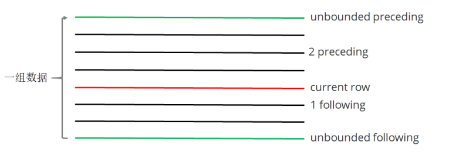

## 简介

窗口函数又名开窗函数，属于分析函数的一种。用于解决复杂报表统计需求的功能强大的函数，很多场景都需要用到。窗口函数用于计算基于组的某种聚合值，它和聚合函数的不同之处是：对于每个组返回多行，而聚合函数对于每个组只返回一行。**窗口函数指定了分析函数工作的数据窗口大小，这个数据窗口大小可能会随着行的变化而变化**。

## 窗口函数
### over 关键字

使用窗口函数之前一般要要通过over()进行开窗

```sql
-- 查询emp表工资总和
select sum(sal) from emp;
-- 不使用窗口函数，有语法错误
select ename, sal, sum(sal) salsum from emp;
-- 使用窗口函数，查询员工姓名、薪水、薪水总和
select ename, sal, sum(sal) over() salsum,concat(round(sal / sum(sal) over()*100, 1) || '%') ratiosal from emp;
```

> 注意：窗口函数是针对每一行数据的；如果over中没有参数，默认的是全部结果集；

### partition by子句
在over窗口中进行分区，对某一列进行分区统计，窗口的大小就是分区的大小

```sql
-- 查询员工姓名、薪水、部门薪水总和
select ename, sal, sum(sal) over(partition by deptno) salsum from emp;
```

### order by 子句
order by 子句对输入的数据进行排序

```sql
-- 增加了order by子句；sum：从分组的第一行到当前行求和
select ename, sal, deptno, sum(sal) over(partition by deptno order by sal) salsum from emp;
```

### Window子句
```sql
rows between ... and ...
```

如果要对窗口的结果做更细粒度的划分，使用window子句，有如下的几个选项：

- unbounded preceding。组内第一行数据
- n preceding。组内当前行的前n行数据
- current row。当前行数据
- n following。组内当前行的后n行数据
- unbounded following。组内最后一行数据



```sql
-- rows between ... and ... 子句
-- 等价。组内，第一行到当前行的和
select ename, sal, deptno,
sum(sal) over(partition by deptno order by ename) from
emp;

select ename, sal, deptno,
sum(sal) over(partition by deptno order by ename rows between unbounded preceding and current row)
from emp;
-- 组内，第一行到最后一行的和
select ename, sal, deptno,
sum(sal) over(partition by deptno order by ename rows between unbounded preceding and unbounded following)
from emp;
-- 组内，前一行、当前行、后一行的和
select ename, sal, deptno,
sum(sal) over(partition by deptno order by ename rows between 1 preceding and 1 following )
from emp;
```
### 排名函数
都是从1开始，生成数据项在分组中的排名。

- row_number()。排名顺序增加不会重复；如1、2、3、4、... ...
- RANK()。 排名相等会在名次中留下空位；如1、2、2、4、5、... ...
- DENSE_RANK()。 排名相等会在名次中不会留下空位 ；如1、2、2、3、4、... ...

```sql
-- row_number / rank / dense_rank
100 1 1 1
100 2 1 1
100 3 1 1
99 4 4 2
98 5 5 3
98 6 5 3
97 7 7 4
-- 数据准备
class1 s01 100
class1 s03 100
class1 s05 100
class1 s07 99
class1 s09 98
class1 s02 98
class1 s04 97
class2 s21 100
class2 s24 99
class2 s27 99
class2 s22 98

class2 s25 98
class2 s28 97
class2 s26 96

-- 创建表加载数据
create table t2(
cname string,
sname string,
score int
) row format delimited fields terminated by '\t';
load data local inpath '/home/hadoop/data/t2.dat' into table t2;
-- 按照班级，使用3种方式对成绩进行排名
select cname, sname, score, 
row_number() over (partition by cname order by score desc) rank1,
rank() over (partition by cname order by score desc) rank2,
dense_rank() over (partition by cname order by score desc) rank3
from t2;
-- 求每个班级前3名的学员--前3名的定义是什么--假设使用dense_rank
select cname, sname, score, rank
from (select cname, sname, score, dense_rank() over (partition by cname order by score desc) rank
from t2) tmp
where rank <= 3;

```

### 序列函数

- lag。返回当前数据行的上一行数据
- lead。返回当前数据行的下一行数据
- first_value。取分组内排序后，截止到当前行，第一个值
- last_value。分组内排序后，截止到当前行，最后一个值
- ntile。将分组的数据按照顺序切分成n片，返回当前切片值

```sql
-- 测试数据 userpv.dat。cid ctime pv
cookie1,2019-04-10,1
cookie1,2019-04-11,5
cookie1,2019-04-12,7
cookie1,2019-04-13,3
cookie1,2019-04-14,2
cookie1,2019-04-15,4
cookie1,2019-04-16,4
cookie2,2019-04-10,2
cookie2,2019-04-11,3
cookie2,2019-04-12,5
cookie2,2019-04-13,6
cookie2,2019-04-14,3
cookie2,2019-04-15,9
cookie2,2019-04-16,7
-- 建表语句
create table userpv(
cid string,
ctime date,
pv int
)
row format delimited fields terminated by ",";
-- 加载数据
Load data local inpath '/home/hadoop/data/userpv.dat' into table userpv;
-- lag。返回当前数据行的上一行数据
-- lead。功能上与lag类似
select cid, ctime, pv,
lag(pv) over(partition by cid order by ctime) lagpv,
lead(pv) over(partition by cid order by ctime) leadpv
from userpv;
-- first_value / last_value
select cid, ctime, pv,
first_value(pv) over (partition by cid order by ctime
rows between unbounded preceding and unbounded following) as
firstpv,
last_value(pv) over (partition by cid order by ctime
rows between unbounded preceding and unbounded following) as
lastpv
from userpv;
-- ntile。按照cid进行分组，每组数据分成2份
select cid, ctime, pv,
ntile(2) over(partition by cid order by ctime) ntile
from userpv;
```

## SQL面试题

### 连续7天登录的用户

```sql
-- 数据。uid dt status(1 正常登录，0 异常)
1 2019-07-11 1
1 2019-07-12 1
1 2019-07-13 1
1 2019-07-14 1
1 2019-07-15 1
1 2019-07-16 1
1 2019-07-17 1
1 2019-07-18 1
2 2019-07-11 1
2 2019-07-12 1
2 2019-07-13 0
2 2019-07-14 1
2 2019-07-15 1
2 2019-07-16 0
2 2019-07-17 1
2 2019-07-18 0
3 2019-07-11 1
3 2019-07-12 1
3 2019-07-13 1
3 2019-07-14 0
3 2019-07-15 1
3 2019-07-16 1
3 2019-07-17 1
3 2019-07-18 1
-- 建表语句
create table ulogin(
uid int,
dt date,
status int
)
row format delimited fields terminated by ' ';
-- 加载数据
load data local inpath '/home/hadoop/data/ulogin.dat' into
table ulogin;

-- 连续值的求解，面试中常见的问题。这也是同一类，基本都可按照以下思路进行
-- 1、使用 row_number 在组内给数据编号(rownum)
-- 2、某个值 - rownum = gid，得到结果可以作为后面分组计算的依据
-- 3、根据求得的gid，作为分组条件，求最终结果
select uid, dt,
date_sub(dt, row_number() over (partition by uid order by dt)) gid
from ulogin
where status=1;
select uid, count(*) logincount
from (select uid, dt,
date_sub(dt, row_number() over (partition by
uid order by dt)) gid
from ulogin
where status=1) t1
group by uid, gid
having logincount>=7;
```

### 编写sql语句实现每班前三名，分数一样并列，同时求出前三名按名次排序的分差

```sql
-- 数据。sid class score
1 1901 90
2 1901 90
3 1901 83
4 1901 60
5 1902 66
6 1902 23
7 1902 99
8 1902 67
9 1902 87
-- 待求结果数据如下：
class score rank lagscore
1901 90 1 0
1901 90 1 0
1901 83 2 -7
1901 60 3 -23
1902 99 1 0
1902 87 2 -12
1902 67 3 -20
-- 建表语句
create table stu(
sno int,
class string,
score int
)row format delimited fields terminated by ' ';
-- 加载数据
load data local inpath '/home/hadoop/data/stu.dat' into table
stu;
-- 求解思路：
-- 1、上排名函数，分数一样并列，所以用dense_rank
-- 2、将上一行数据下移，相减即得到分数差
-- 3、处理 NULL
with tmp as (
select sno, class, score,
dense_rank() over (partition by class order by score
desc) as rank
from stu
)
select class, score, rank,
nvl(score - lag(score) over (partition by class order
by score desc), 0) lagscore
from tmp
where rank<=3;
```

## 行 <=> 列

### 行转列

案例一
```sql
-- 数据：id course
1 java
1 hadoop
1 hive
1 hbase
2 java
2 hive
2 spark
2 flink
3 java
3 hadoop
3 hive
3 kafka
-- 建表加载数据
create table rowline1(
id string,
course string
)row format delimited fields terminated by ' ';
load data local inpath '/root/data/data1.dat' into table
rowline1;
-- 编写sql，得到结果如下(1表示选修，0表示未选修)
id java hadoop hive hbase spark flink kafka
1 1 1 1 1 0 0 0
2 1 0 1 0 1 1 0
3 1 1 1 0 0 0 1
-- 使用case when；group by + sum
select id,
sum(case when course="java" then 1 else 0 end) as java,
sum(case when course="hadoop" then 1 else 0 end) as hadoop,
sum(case when course="hive" then 1 else 0 end) as hive,
sum(case when course="hbase" then 1 else 0 end) as hbase,
sum(case when course="spark" then 1 else 0 end) as spark,
sum(case when course="flink" then 1 else 0 end) as flink,
sum(case when course="kafka" then 1 else 0 end) as kafka
from rowline1
group by id;

```

案例二
```sql
-- 数据。id1 id2 flag
a b 2
a b 1
a b 3
c d 6
c d 8
c d 8
-- 编写sql实现如下结果
id1 id2 flag
a b 2|1|3
c d 6|8

-- 创建表 & 加载数据
create table rowline2(
id1 string,
id2 string,
flag int
) row format delimited fields terminated by ' ';
load data local inpath '/root/data/data2.dat' into table
rowline2;

-- 第一步 将元素聚拢
select id1, id2, collect_set(flag) flag from rowline2 group by id1, id2;
select id1, id2, collect_list(flag) flag from rowline2 group by id1, id2;
select id1, id2, sort_array(collect_set(flag)) flag from rowline2 group by id1, id2;
-- 第二步 将元素连接在一起
select id1, id2, concat_ws("|", collect_set(flag)) flag from rowline2 group by id1, id2;
-- 这里报错，CONCAT_WS must be "string or array<string>"。加一个类型转换即可
select id1, id2, concat_ws("|", collect_set(cast (flag as string))) flag from rowline2 group by id1, id2;
-- 创建表 rowline3
create table rowline3 as
select id1, id2, concat_ws("|", collect_set(cast (flag as string))) flag from rowline2
group by id1, id2;
-- 第一步：将复杂的数据展开
select explode(split(flag, "\\|")) flat from rowline3;
-- 第二步：lateral view 后与其他字段关联
select id1, id2, newflag
from rowline3 lateral view explode(split(flag, "\\|")) t1 as
newflag;

lateralView: LATERAL VIEW udtf(expression) tableAlias AS
columnAlias (',' columnAlias)*
fromClause: FROM baseTable (lateralView) *
```

### 小结

```
case when + sum + group by
collect_set、collect_list、concat_ws
sort_array
explode + lateral view
```