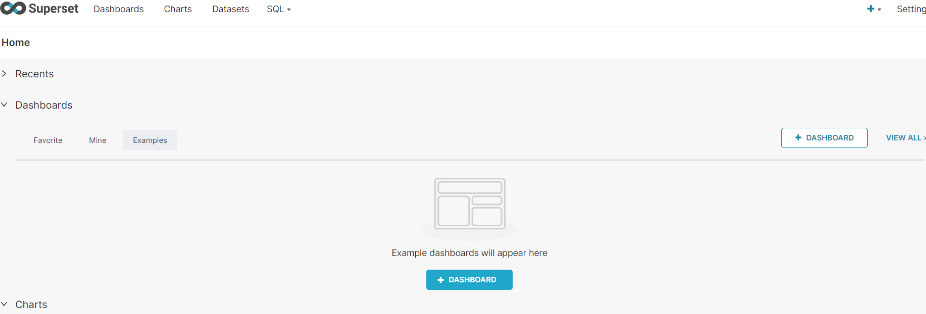

## 安装Apache Superset

> https://hub.docker.com/r/apache/superset

记得配置下镜像加速（比如阿里云容器镜像服务）

## 安装docker&superset

```shell
yum install -y docker
```

```shell
docker pull apache/superset
```

```shell
docker run -d -p 8085:8088 --name superset apache/superset
```

创建admin用户 

```shell
docker exec -it superset superset fab create-admin  --username admin  --firstname Superset  --lastname Admin  --email admin@sina.com  --password xxx
```

跟新本地数据库 

```shell
docker exec -it superset superset db upgrade
```

加载一个样例（这一步不是必须的）

```shell
docker exec -it superset superset load_examples
```

初始化

```shell
docker exec -it superset superset init
```

访问8085端口



## 安装clickhouse连接驱动

```shell
docker exec -it superset pip install clickhouse-sqlalchemy
```

```shell
docker restart superset
```

连接Clickhouse

```
clickhouse+native://用户名:密码@ip地址/default
```