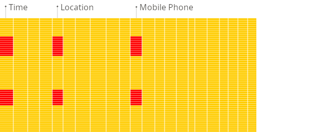

## 什么是ClickHouse
ClickHouse® 是一种用于在线分析处理 (OLAP) 的高性能、面向列的 SQL 数据库管理系统 (DBMS)。它既可以作为开源软件也可以作为云产品提供。

## 什么是 OLAP 
OLAP 场景需要在大型数据集之上实时响应复杂的分析查询，具有以下特征：

- 数据集可能非常庞大 - 数十亿或数万亿行
- 数据组织在包含许多列的表中
- 仅选择几列来回答任何特定查询
- 结果必须以毫秒或秒为单位返回

## 面向列与面向行的
在面向行的 DBMS 中，**数据存储在行中，与行相关的所有值物理上彼此相邻存储**。

在面向列的 DBMS 中，数据存储在列中，**同一列中的值存储在一起**。

## 为什么列式数据库在 OLAP
面向列的数据库更适合 OLAP 场景：它们处理大多数查询的速度至少快 100 倍。下面详细解释了原因，但事实更容易直观地展示：

面向行的数据库管理系统

面向列的数据库管理系统

## 为什么 ClickHouse 这么快？
它被设计得很快。在开发过程中，查询执行性能始终是重中之重，但也考虑了用户友好性、可扩展性和安全性等其他重要特性，以便 ClickHouse 能够成为真正的生产系统。

- 面向列的存储： 源数据通常包含数百甚至数千列，而报表只能使用其中的几个列。**系统需要避免读取不必要的列，以避免昂贵的磁盘读取操作**。

- 索引： 内存驻留的 ClickHouse 数据结构允许仅读取必要的列，以及这些列的必要的行范围。

- 数据压缩： **将同一列的不同值存储在一起通常会带来更好的压缩比（与面向行的系统相比）**，因为在实际数据中，列的相邻行通常具有相同或没有那么多不同的值。除了通用压缩之外，**ClickHouse 还支持专用编解码器，可以使数据更加紧凑**。

- 向量化查询执行： ClickHouse不仅按列存储数据，还按列处理数据。这会带来更好的 **CPU 缓存利用率并允许使用SIMD CPU 指令**。

- 可扩展性： ClickHouse 可以利用**所有可用的 CPU 核心和磁盘来执行单个查询**。不仅在单个服务器上，**而且在集群的所有 CPU 核心和磁盘上**。

## ClickHouse的特色

### 真正的面向列的数据库管理

在真正的面向列的 DBMS 中，**没有额外的数据与值一起存储。这意味着必须支持恒定长度值**，以避免将其长度“数字”存储在值旁边。例如，十亿个 UInt8 类型的值在未压缩的情况下应该消耗大约 1 GB 的空间，否则这会严重影响 CPU 的使用。即使未压缩，也必须紧凑地存储数据（没有任何“垃圾”），因为解压缩的速度（CPU 使用率）主要取决于未压缩数据的量。

这与HBase、BigTable、Cassandra、HyperTable等系统不同，这些系统可以单独存储不同列的值，**但由于针对其他场景的优化而无法有效处理分析查询**。在这些系统中，您将获得每秒大约十万行的吞吐量，但每秒不会达到数亿行。

### 数据存储特性

**通过主键对数据进行物理排序，可以在不到几十毫秒的时间内以低延迟提取基于特定值或值范围的数据**。一些面向列的 DBMS，例如 SAP HANA 和 Google PowerDrill，只能在 RAM 中工作。这种方法需要分配比实时分析所需的更大的硬件预算。

ClickHouse 设计用于在常规硬盘上运行，**这意味着每 GB 数据存储的成本较低**，但如果可用，SSD 和额外的 RAM 也会得到充分利用。

### 分布式处理

上面提到的列式 DBMS 几乎都不支持分布式查询处理。

在 ClickHouse 中，数据可以驻留在不同的分片上。每个分片可以是一组用于容错的副本。**所有分片都用于并行运行查询，对用户透明**，也就是说多个副本能够提高查询的速度。

### 自适应Join
ClickHouse 自适应地选择如何JOIN多个表，如果有多个大表，则优先选择哈希连接算法，并回退到合并连接算法。