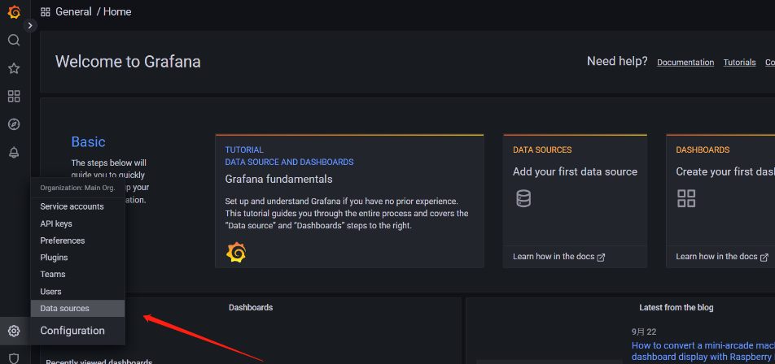
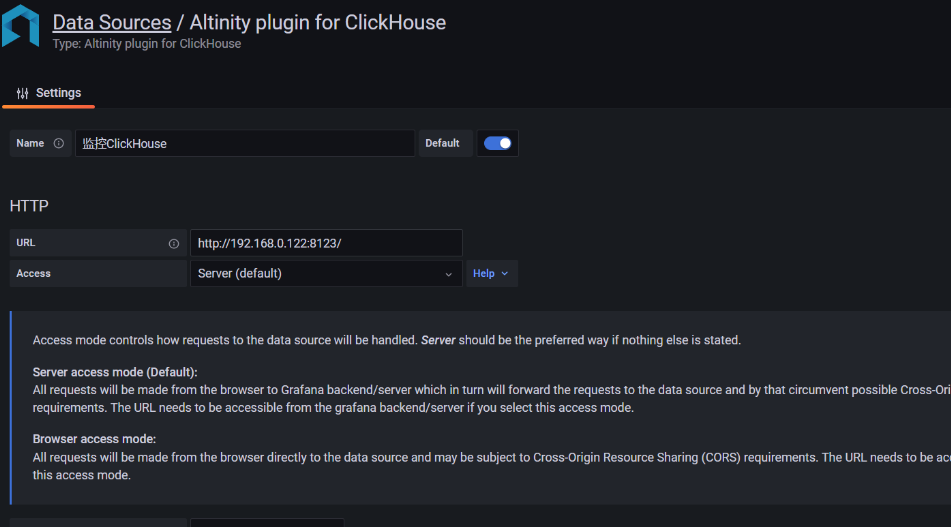
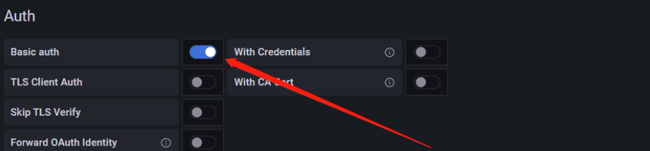
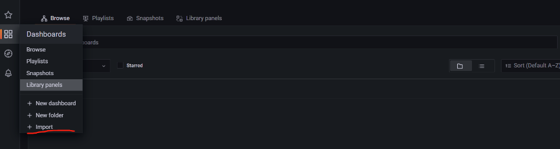

## Docker安装Grafana

```shell 
yum install -y docker
``` 

```shell 
docker pull grafana/grafana
```

```shell 
docker run -d -p 23000:3000 grafana/grafana
```

## 监控ClickHouse

```shell 
docker exec -it nifty_jennings grafana-cli plugins install vertamedia-clickhouse-datasource
```

```shell 
docker restart nifty_jennings
```

访问主机对应的端口,运行以后初始的账号密码为admin/admin。





下面输入账号密码 



监控配置的json

>https://grafana.com/grafana/dashboards/13606-clickhouse-performance-monitor-xm-uat/


