## DSL查询分类

Elasticsearch提供了基于JSON的DSL（Domain Specific Language）来定义查询。常见的查询类型包括：

- 查询所有：查询出所有数据，一般测试用。例如：match_all

- 全文检索（full text）查询：利用分词器对用户输入内容分词，然后去倒排索引库中匹配。例如：
    - match_query
    - multi_match_query

- 精确查询：根据精确词条值查找数据，一般是查找keyword、数值、日期、boolean等类型字段。例如：

    - ids
    - range
    - term

- 地理（geo）查询：根据经纬度查询。例如：

    - geo_distance
    - geo_bounding_box
- 复合（compound）查询：复合查询可以将上述各种查询条件组合起来，合并查询条件。例如：

    - bool
    - function_score

查询的语法基本一致：

```
GET /indexName/_search
{
  "query": {
    "查询类型": {
      "查询条件": "条件值"
    }
  }
}
```

我们以查询所有为例，其中：

- 查询类型为match_all
- 没有查询条件

```
// 查询所有
GET /indexName/_search
{
  "query": {
    "match_all": {
    }
  }
}
```

其它查询无非就是查询类型、查询条件的变化。

## 全文检索查询

match和multi_match的区别是什么？

- match：根据一个字段查询【推荐：使用copy_to构造all字段】
- multi_match：根据多个字段查询，参与查询字段越多，查询性能越差

> 注：搜索字段越多，对查询性能影响越大，因此建议采用copy_to，然后单字段查询的方式。

### 使用场景

全文检索查询的基本流程如下：

- 对用户搜索的内容做分词，得到词条
- 根据词条去倒排索引库中匹配，得到文档id
- 根据文档id找到文档，返回给用户

比较常用的场景包括：

- 商城的输入框搜索
- 百度输入框搜索
例如京东：


因为是拿着词条去匹配，因此参与搜索的字段也必须是可分词的text类型的字段。

常见的全文检索查询包括：

- match查询：单字段查询
- multi_match查询：多字段查询，任意一个字段符合条件就算符合查询条件

### match查询

match查询语法如下：

```
GET /indexName/_search
{
  "query": {
    "match": {
      "FIELD": "TEXT"
    }
  }
}
```

match查询示例：

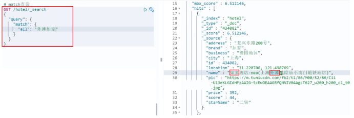

### mulit_match查询

mulit_match语法如下：

```
GET /indexName/_search
{
  "query": {
    "multi_match": {
      "query": "TEXT",
      "fields": ["FIELD1", " FIELD12"]
    }
  }
}
```

multi_match查询示例：

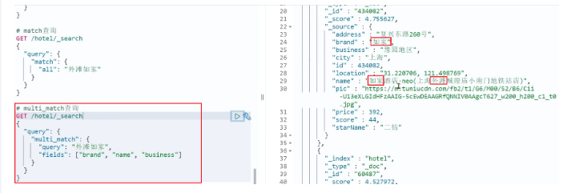

## 精准查询

精准查询类型：

- term查询：根据词条精确匹配，一般搜索keyword类型、数值类型、布尔类型、日期类型字段
- range查询：根据数值范围查询，可以是数值、日期的范围

精确查询一般是查找keyword、数值、日期、boolean等类型字段。所以不会对搜索条件分词。常见的有：

- term：根据词条精确值查询
- range：根据值的范围查询

### term查询

因为精确查询的字段搜时不分词的字段，因此查询的条件也必须是不分词的词条。查询时，用户输入的内容跟自动值完全匹配时才认为符合条件。如果用户输入的内容过多，反而搜索不到数据。

语法说明：

```
// term查询
GET /indexName/_search
{
  "query": {
    "term": {
      "FIELD": {
        "value": "VALUE"
      }
    }
  }
}
```

示例：

当我搜索的是精确词条时，能正确查询出结果：

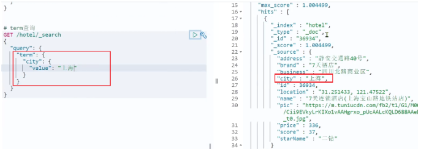

但是，当我搜索的内容不是词条，而是多个词语形成的短语时，反而搜索不到：

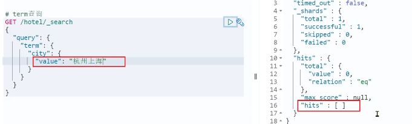

### range查询

> 范围查询，一般应用在对数值类型做范围过滤的时候。比如做价格范围过滤。

基本语法：

```
// range查询
GET /indexName/_search
{
  "query": {
    "range": {
      "FIELD": {
        "gte": 10, // 这里的gte代表大于等于，gt则代表大于
        "lte": 20 // lte代表小于等于，lt则代表小于
      }
    }
  }
}
```

示例：

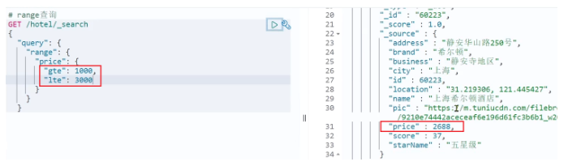

## 地理坐标查询

所谓的地理坐标查询，其实就是根据经纬度查询，官方文档：https://www.elastic.co/guide/en/elasticsearch/reference/current/geo-queries.html

常见的使用场景包括：

- 携程：搜索我附近的酒店
- 滴滴：搜索我附近的出租车
- 微信：搜索我附近的人

附近的车：


语法如下：

```
// geo_bounding_box查询
GET /indexName/_search
{
  "query": {
    "geo_bounding_box": {
      "FIELD": {
        "top_left": { // 左上点
          "lat": 31.1,
          "lon": 121.5
        },
        "bottom_right": { // 右下点
          "lat": 30.9,
          "lon": 121.7
        }
      }
    }
  }
}
```

## 复合查询

复合（compound）查询：复合查询可以将其它简单查询组合起来，实现更复杂的搜索逻辑。常见的有两种：

- fuction score：算分函数查询，可以控制文档相关性算分，控制文档排名
- bool query：布尔查询，利用逻辑关系组合多个其它的查询，实现复杂搜索

### 复合查询归纳

```
GET /hotel/_search
{
  "query": {
    "function_score": {           
      "query": { // 原始查询，可以是任意条件
          "bool": {
              "must": [
                  {"term": {"city": "上海" }}
              ],
              "should": [
                  {"term": {"brand": "皇冠假日" }},
                  {"term": {"brand": "华美达" }}
              ],
              "must_not": [
                  { "range": { "price": { "lte": 500 } }}
              ],
              "filter": [
                  { "range": {"score": { "gte": 45 } }}
              ]
          }
      },
      "functions": [ // 算分函数
        {
          "filter": { // 满足的条件，品牌必须是如家【品牌是如家的才加分，这里是加分条件】
            "term": {
              "brand": "如家"
            }
          },
          "weight": 2 // 算分权重为2
        }
      ],
      "boost_mode": "sum" // 加权模式，求和
    }
  }  
}
```

### 相关性算分

elasticsearch会根据词条和文档的相关度做打分，算法由两种：

- TF-IDF算法
- BM25算法，elasticsearch5.1版本后采用的算法

当我们利用match查询时，文档结果会根据与搜索词条的关联度打分（_score），返回结果时按照分值降序排列。

例如，我们搜索 "虹桥如家"，结果如下：

```
[
  {
    "_score" : 17.850193,
    "_source" : {
      "name" : "虹桥如家酒店真不错",
    }
  },
  {
    "_score" : 12.259849,
    "_source" : {
      "name" : "外滩如家酒店真不错",
    }
  },
  {
    "_score" : 11.91091,
    "_source" : {
      "name" : "迪士尼如家酒店真不错",
    }
  }
]
```

在elasticsearch中，早期使用的打分算法是TF-IDF算法，公式如下：

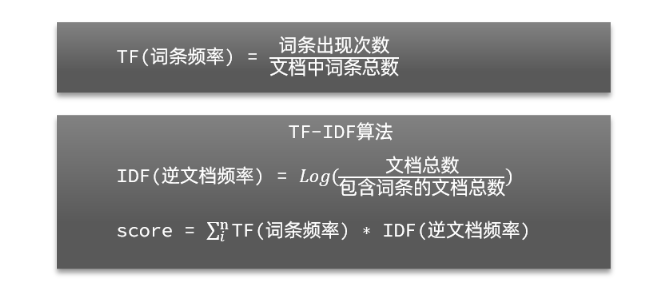

在后来的5.1版本升级中，elasticsearch将算法改进为BM25算法，公式如下：

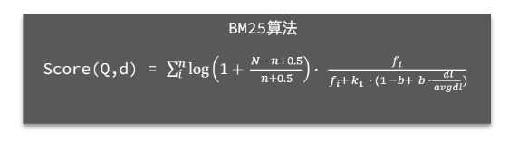

TF-IDF算法有一各缺陷，就是词条频率越高，文档得分也会越高，单个词条对文档影响较大。而BM25则会让单个词条的算分有一个上限，曲线更加平滑：

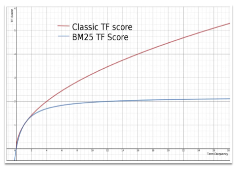

### 算分函数查询(function score 查询)

在搜索出来的结果的分数基础上，**再手动与指定的数字进行一定运算来改变算分**，从而改变结果的排序。

function score query定义的三要素是什么？

- 过滤条件：哪些文档要加分
- 算分函数：如何计算function score
- 加权方式：function score 与 query score如何运算

根据相关度打分是比较合理的需求，但合理的不一定是产品经理需要的。

以百度为例，你搜索的结果中，并不是相关度越高排名越靠前，而是谁掏的钱多排名就越靠前。如图：


要想认为控制相关性算分，就需要利用elasticsearch中的function score 查询了。

function score 查询

语法说明

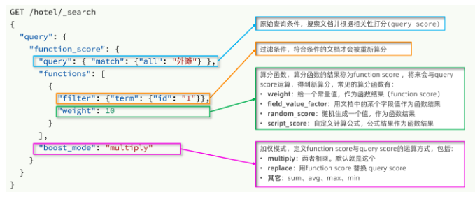

function score 查询中包含四部分内容：

- 原始查询条件：query部分，基于这个条件搜索文档，并且基于BM25算法给文档打分，原始算分（query score)
- 过滤条件：filter部分，符合该条件的文档才会重新算分
- 算分函数：符合filter条件的文档要根据这个函数做运算，得到的函数算分（function score），有四种函数
    - weight：函数结果是常量
    - field_value_factor：以文档中的某个字段值作为函数结果
    - random_score：以随机数作为函数结果
    - script_score：自定义算分函数算法

- 运算模式：算分函数的结果、原始查询的相关性算分，两者之间的运算方式，包括：
    - multiply：相乘
    - replace：用function score替换query score
    - 其它，例如：sum、avg、max、min

function score的运行流程如下：

- 根据原始条件查询搜索文档，并且计算相关性算分，称为原始算分（query score）
- 根据过滤条件，过滤文档
- 符合过滤条件的文档，基于算分函数运算，得到函数算分（function score）
- 将原始算分（query score）和函数算分（function score）基于运算模式做运算，得到最终结果，作为相关性算分。

**举例**
需求：给“如家”这个品牌的酒店排名靠前一些

翻译一下这个需求，转换为之前说的四个要点：

- 原始条件：不确定，可以任意变化
- 过滤条件：brand = "如家"
- 算分函数：可以简单粗暴，直接给固定的算分结果，weight
- 运算模式：比如求和

因此最终的DSL语句如下：

```json
GET /hotel/_search
{
  "query": {
    "function_score": {
      "query": {  .... }, // 原始查询，可以是任意条件
      "functions": [ // 算分函数
        {
          "filter": { // 满足的条件，品牌必须是如家【品牌是如家的才加分，这里是加分条件】
            "term": {
              "brand": "如家"
            }
          },
          "weight": 2 // 算分权重为2
        }
      ],
      "boost_mode": "sum" // 加权模式，求和
    }
  }
}
```

测试，在未添加算分函数时，如家得分如下：

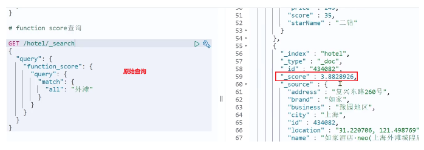

添加了算分函数后，如家得分就提升了：

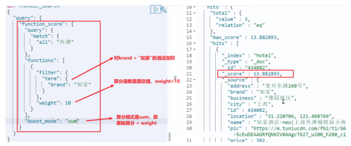

## 布尔查询

布尔查询是一个或多个查询子句的组合，每一个子句就是一个子查询。子查询的组合方式有：

- must：必须匹配每个子查询，类似“与”
- should：选择性匹配子查询，类似“或”
- must_not：必须不匹配，不参与算分，类似“非”
- filter：必须匹配，不参与算分

注意：尽量在筛选的时候多使用不参与算分的must_not和filter，以保证性能良好

比如在搜索酒店时，除了关键字搜索外，我们还可能根据品牌、价格、城市等字段做过滤：

每一个不同的字段，其查询的条件、方式都不一样，必须是多个不同的查询，而要组合这些查询，就必须用bool查询了。

需要注意的是，搜索时，参与打分的字段越多，查询的性能也越差。因此这种多条件查询时，建议这样做：

- 搜索框的关键字搜索，是全文检索查询，**使用must查询，参与算分**
- 其它过滤条件，**采用filter查询。不参与算分**

### bool查询

语法

```json
GET /hotel/_search
{
  "query": {
    "bool": {
      "must": [
        {"term": {"city": "上海" }}
      ],
      "should": [
        {"term": {"brand": "皇冠假日" }},
        {"term": {"brand": "华美达" }}
      ],
      "must_not": [
        { "range": { "price": { "lte": 500 } }}
      ],
      "filter": [
        { "range": {"score": { "gte": 45 } }}
      ]
    }
  }
}
```

示例
需求：搜索名字包含“如家”，价格不高于400，在坐标31.21,121.5周围10km范围内的酒店。

分析：

- 名称搜索，属于全文检索查询，应该参与算分。放到must中
- 价格不高于400，用range查询，属于过滤条件，不参与算分。放到must_not中
- 周围10km范围内，用geo_distance查询，属于过滤条件，不参与算分。放到filter中

## 设置搜索结果

搜索的结果可以按照用户指定的方式去处理或展示。

2.0 搜索结果种类
查询的DSL是一个大的JSON对象，包含下列属性：

- query：查询条件
- from和size：分页条件
- sort：排序条件
- highlight：高亮条件
- aggs：定义聚合

示例：

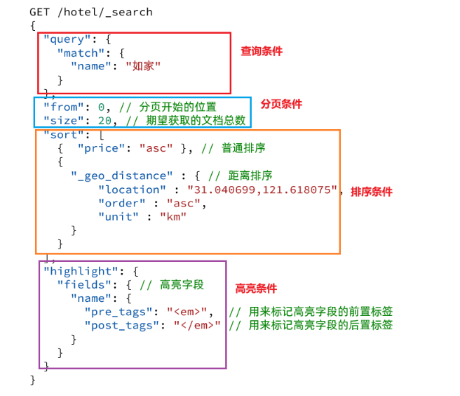

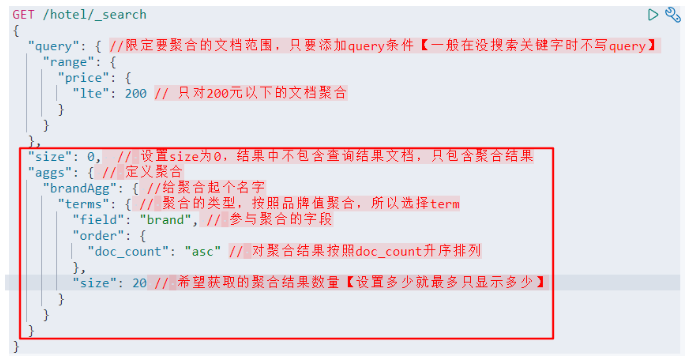

### 排序

- 在使用排序后就不会进行算分了，根据排序设置的规则排列
- 普通字段是根据字典序排序 
- 地理坐标是根据举例远近排序


普通字段排序

keyword、数值、日期类型排序的排序语法基本一致。

语法：

排序条件是一个数组，也就是可以写多个排序条件。按照声明的顺序，当第一个条件相等时，再按照第二个条件排序，以此类推

```json
GET /indexName/_search
{
  "query": {
    "match_all": {}
  },
  "sort": [
    {
      "FIELD": "desc"  // 排序字段、排序方式ASC、DESC
    }
  ]
}
```

示例：

需求描述：酒店数据按照用户评价（score)降序排序，评价相同的按照价格(price)升序排序

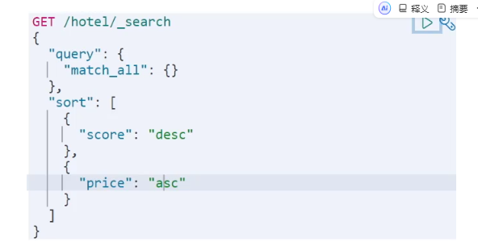

### 地理坐标排序

地理坐标排序略有不同。

语法说明：

```
GET /indexName/_search
{
  "query": {
    "match_all": {}
  },
  "sort": [
    {
      "_geo_distance" : {
          "FIELD" : "纬度，经度", // 文档中geo_point类型的字段名、目标坐标点
          "order" : "asc", // 排序方式
          "unit" : "km" // 排序的距离单位
      }
    }
  ]
}
```

这个查询的含义是：

- 指定一个坐标，作为目标点
- 计算每一个文档中，指定字段（必须是geo_point类型）的坐标 到目标点的距离是多少
- 根据距离排序

示例：

需求描述：实现对酒店数据按照到你的位置坐标的距离升序排序

提示：获取你的位置的经纬度的方式：https://lbs.amap.com/demo/jsapi-v2/example/map/click-to-get-lnglat/

假设我的位置是：31.034661，121.612282，寻找我周围距离最近的酒店。

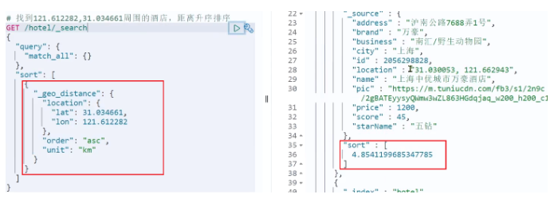

## 分页

> elasticsearch会禁止from+ size 超过10000的请求

elasticsearch 默认情况下只返回top10的数据。而如果要查询更多数据就需要修改分页参数了。elasticsearch中通过修改from、size参数来控制要返回的分页结果：

- from：从第几个文档开始
- size：总共查询几个文档

类似于mysql中的limit ?, ?

### 基本分页

分页的基本语法如下：

```json
GET /hotel/_search
{
  "query": {
    "match_all": {}
  },
  "from": 0, // 分页开始的位置，默认为0
  "size": 10, // 期望获取的文档总数
  "sort": [
    {"price": "asc"}
  ]
}
```

### 深度分页

> 原理：elasticsearch内部分页时，必须先查询 0~1000条，然后截取其中的990 ~ 1000的这10条

现在，我要查询990~1000的数据，查询逻辑要这么写：

```json
GET /hotel/_search
{
  "query": {
    "match_all": {}
  },
  "from": 990, // 分页开始的位置，默认为0
  "size": 10, // 期望获取的文档总数
  "sort": [
    {"price": "asc"}
  ]
}
```

这里是查询990开始的数据，也就是 第990~第1000条 数据。

集群情况的深度分页

针对深度分页，ES提供了两种解决方案，官方文档：

- search after：分页时需要排序，原理是从上一次的排序值开始，查询下一页数据。【官方推荐】
- scroll：原理将排序后的文档id形成快照，保存在内存。

不过，elasticsearch内部分页时，必须先查询 0~1000条，然后截取其中的990 ~ 1000的这10条：


查询TOP1000，如果es是单点模式，这并无太大影响。

但是elasticsearch将来一定是集群，例如我集群有5个节点，我要查询TOP1000的数据，并不是每个节点查询200条就可以了。

因为节点A的TOP200，在另一个节点可能排到10000名以外了。

因此要想获取整个集群的TOP1000，**必须先查询出每个节点的TOP1000，汇总结果后，重新排名，重新截取TOP1000。**

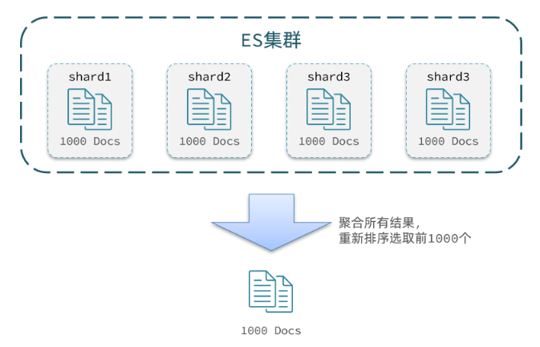

那如果我要查询9900~10000的数据呢？是不是要先查询TOP10000呢？那每个节点都要查询10000条？汇总到内存中？

当查询分页深度较大时，汇总数据过多，对内存和CPU会产生非常大的压力，**因此elasticsearch会禁止from+ size 超过10000的请求**。

## 高亮

注意：

- 高亮是对关键字高亮，因此搜索条件必须带有关键字，而不能是范围这样的查询。
- 默认情况下，高亮的字段，必须与搜索指定的字段一致，否则无法高亮
- 如果要对非搜索字段高亮，则需要添加一个属性：required_field_match=false

使用场景：在百度等搜索后，会对结果中出现搜索字段的部分进行高亮处理。

高亮原理
高亮显示的实现分为两步：

- 给文档中的所有关键字都添加一个标签，例如 em 标签
- 页面给 em 标签编写CSS样式

### 实现高亮

语法

```json
GET /hotel/_search
{
  "query": {
    "match": {
      "FIELD": "TEXT" // 查询条件，高亮一定要使用全文检索查询
    }
  },
  "highlight": {
    "fields": { // 指定要高亮的字段
      "FIELD": { //【要和上面的查询字段FIELD一致】
        "pre_tags": "<em>",  // 用来标记高亮字段的前置标签
        "post_tags": "</em>" // 用来标记高亮字段的后置标签
      }
    }
  }
}
```

示例：组合字段all的案例

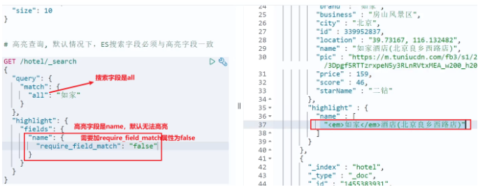

## 数据聚合

> 类似于mysql中的【度量（Metric）聚合】聚合语句实现AVG，MAX，MIN；以及【桶（Bucket）聚合】GroupBy实现分组

聚合（aggregations）可以让我们极其方便的实现对数据的统计、分析、运算。例如：

- 什么品牌的手机最受欢迎？
- 这些手机的平均价格、最高价格、最低价格？
- 这些手机每月的销售情况如何？

实现这些统计功能的比数据库的sql要方便的多，而且查询速度非常快，可以实现近实时搜索效果。

aggs代表聚合，与query同级，此时query的作用是？

- 限定聚合的的文档范围

聚合必须的三要素：

- 聚合名称
- 聚合类型
- 聚合字段

聚合可配置属性有：

- size：指定聚合结果数量
- order：指定聚合结果排序方式
- field：指定聚合字段

### 聚合种类

> 注意：参加聚合的字段必须是keyword、日期、数值、布尔类型

聚合常见的有三类：

- 桶（Bucket）聚合：用来对文档做分组

    - TermAggregation：按照文档字段值分组，例如按照品牌值分组、按照国家分组
    - Date Histogram：按照日期阶梯分组，例如一周为一组，或者一月为一组

- 度量（Metric）聚合：用以计算一些值，比如：最大值、最小值、平均值等

    - Avg：求平均值
    - Max：求最大值
    - Min：求最小值
    - Stats：同时求max、min、avg、sum等

- 管道（pipeline）聚合：其它聚合的结果为基础做聚合

如：用桶聚合实现种类排序，然后使用度量聚合实现各个桶的最大值、最小值、平均值等

### 桶(Bucket)聚合

以统计酒店品牌种类，并对其进行数据分组

```json
GET /hotel/_search
{
  "query": { //限定要聚合的文档范围，只要添加query条件【一般在没搜索关键字时不写query】
    "range": {
      "price": {
        "lte": 200 // 只对200元以下的文档聚合
      }
    }
  }, 
  "size": 0,  // 设置size为0，结果中不包含查询结果文档，只包含聚合结果
  "aggs": { // 定义聚合
    "brandAgg": { //给聚合起个名字
      "terms": { // 聚合的类型，按照品牌值聚合，所以选择term
        "field": "brand", // 参与聚合的字段
        "order": {
          "doc_count": "asc" // 对聚合结果按照doc_count升序排列
        },
        "size": 20 // 希望获取的聚合结果数量【设置多少就最多只显示多少】
      }
    }
  }
}
```
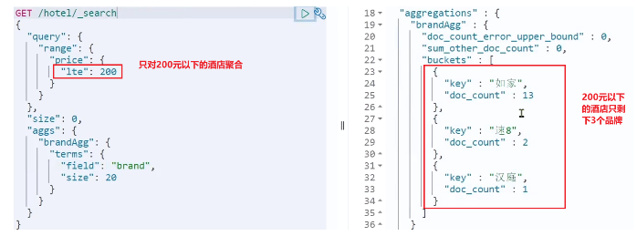

### 度量(Metric) and 管道(pipeline)聚合

> 度量聚合很少单独使用，一般是和桶聚合一并结合使用

我们对酒店按照品牌分组，形成了一个个桶。现在我们需要对桶内的酒店做运算，获取每个品牌的用户评分的min、max、avg等值。

这就要用到Metric聚合了，例如stat聚合：就可以获取min、max、avg等结果。

语法如下：

这次的score_stats聚合是在brandAgg的聚合内部嵌套的子聚合。因为我们需要在每个桶分别计算。

```json
GET /hotel/_search
{
  "size": 0, 
  "aggs": {
    "brandAgg": { 
      "terms": { 
        "field": "brand", 
        "order": {
          "scoreAgg.avg": "desc" // 对聚合结果按照指定字段降序排列
        },
        "size": 20
      },
      "aggs": { // 是brands聚合的子聚合，也就是分组后对每组分别计算
        "score_stats": { // 聚合名称
          "stats": { // 聚合类型，这里stats可以计算min、max、avg等
            "field": "score" // 聚合字段，这里是score
          }
        }
      }
    }
  }
}
```

另外，我们还可以给聚合结果做个排序，例如按照每个桶的酒店平均分做排序：

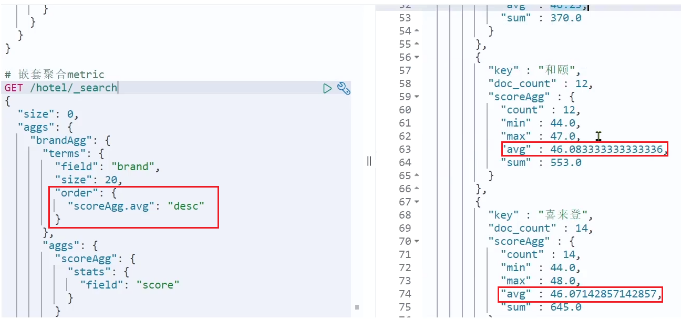


