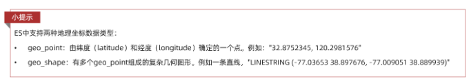
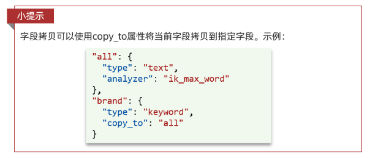

## 介绍

ES官方提供了各种不同语言的客户端，用来操作ES。这些客户端的本质就是组装DSL语句，通过http请求发送给ES。官方文档地址：https://www.elastic.co/guide/en/elasticsearch/client/index.html

其中的Java Rest Client又包括两种：

- Java Low Level Rest Client
- Java High Level Rest Client

我们使用的是Java HighLevel Rest Client客户端API

## API操作索引库

JavaRestClient操作elasticsearch的流程基本类似。**核心是client.indices()方法来获取索引库的操作对象**。

索引库操作的基本步骤：【可以根据发送请求那步的第一个参数，发过来判断需要创建什么XXXXRequest】

- 初始化RestHighLevelClient
- 创建XxxIndexRequest。XXX是Create、Get、Delete
- 准备DSL（ Create时需要，其它是无参）
- 发送请求。调用RestHighLevelClient#indices().xxx()方法，xxx是create、exists、delete

### mapping映射分析

> 根据MySQL数据库表结构（建表语句），去写索引库结构JSON。表和索引库一一对应 
> 注意：地理坐标、组合字段。索引库里的地理坐标是一个字段：```坐标：维度,精度``` 。copy_to组合字段作用是供用户查询（输入关键字可以查询多个字段）

创建索引库，最关键的是mapping映射，而mapping映射要考虑的信息包括：

- 字段名
- 字段数据类型
- 是否参与搜索
- 是否需要分词
- 如果分词，分词器是什么？

其中：

- 字段名、字段数据类型，可以参考数据表结构的名称和类型
- 是否参与搜索要分析业务来判断，例如图片地址，就无需参与搜索
- 是否分词呢要看内容，内容如果是一个整体就无需分词，反之则要分词
- 分词器，我们可以统一使用ik_max_word

来看下酒店数据的索引库结构:

```
PUT /hotel
{
  "mappings": {
    "properties": {
      "id": {
        "type": "keyword"
      },
      "name":{
        "type": "text",
        "analyzer": "ik_max_word",
        "copy_to": "all"
      },
      "address":{
        "type": "keyword",
        "index": false
      },
      "price":{
        "type": "integer"
      },
      "score":{
        "type": "integer"
      },
      "brand":{
        "type": "keyword",
        "copy_to": "all"
      },
      "city":{
        "type": "keyword",
        "copy_to": "all"
      },
      "starName":{
        "type": "keyword"
      },
      "business":{
        "type": "keyword"
      },
      "location":{
        "type": "geo_point"
      },
      "pic":{
        "type": "keyword",
        "index": false
      },
      "all":{
        "type": "text",
        "analyzer": "ik_max_word"
      }
    }
  }
}
```

几个特殊字段说明：

- location：地理坐标，里面包含精度、纬度
- all：一个组合字段，其目的是将多字段的值 利用copy_to合并，提供给用户搜索
地理坐标说明：



copy_to说明：



### 初始化RestClient

在elasticsearch提供的API中，与elasticsearch一切交互都封装在一个名为RestHighLevelClient的类中，必须先完成这个对象的初始化，建立与elasticsearch的连接。

分为三步：

- 引入es的RestHighLevelClient依赖：

```
<dependency>
    <groupId>org.elasticsearch.client</groupId>
    <artifactId>elasticsearch-rest-high-level-client</artifactId>
</dependency>
```

- 因为SpringBoot默认的ES版本是7.6.2，所以我们需要覆盖默认的ES版本：

```
<properties>
    <java.version>1.8</java.version>
    <elasticsearch.version>7.12.1</elasticsearch.version>
</properties>
```

- 初始化RestHighLevelClient：这里一般在启动类或者配置类里注入该Bean，用于告诉Java 访问ES的ip地址

初始化的代码如下：

```
@Bean
public RestHighLevelClient client(){
    return new RestHighLevelClient(RestClient.builder(
        HttpHost.create("http://192.168.150.101:9200")
	));
}
```

- 这里为了单元测试方便，我们创建一个测试类HotelIndexTest，然后将初始化的代码编写在@BeforeEach方法中：

```
package cn.itcast.hotel;

import org.apache.http.HttpHost;
import org.elasticsearch.client.RestHighLevelClient;
import org.junit.jupiter.api.AfterEach;
import org.junit.jupiter.api.BeforeEach;
import org.junit.jupiter.api.Test;

import java.io.IOException;

public class HotelIndexTest {
    private RestHighLevelClient client;

    @BeforeEach
    void setUp() {
        this.client = new RestHighLevelClient(RestClient.builder(
                HttpHost.create("http://192.168.150.101:9200")
        ));
    }

    @AfterEach
    void tearDown() throws IOException {
        this.client.close();
    }
}
```


