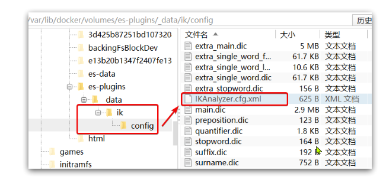
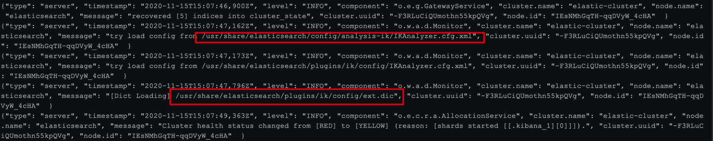

## 扩展词词典

随着互联网的发展，“造词运动”也越发的频繁。出现了很多新的词语，**在原有的词汇列表中并不存在**。比如：“奥力给”，“白嫖” 等。

所以我们的词汇也需要不断的更新，IK分词器提供了扩展词汇的功能。

- 打开IK分词器config目录：



- 在IKAnalyzer.cfg.xml配置文件内容添加：

```
<?xml version="1.0" encoding="UTF-8"?>
<!DOCTYPE properties SYSTEM "http://java.sun.com/dtd/properties.dtd">
<properties>
        <comment>IK Analyzer 扩展配置</comment>
        <!--用户可以在这里配置自己的扩展字典 *** 添加扩展词典-->
        <entry key="ext_dict">ext.dic</entry>
</properties>
```

- 新建一个 ext.dic，可以参考config目录下复制一个配置文件进行修改

```
白嫖
奥力给
```

- 重启elasticsearch



日志中已经成功加载ext.dic配置文件

- 测试效果：

```
GET /_analyze
{
  "analyzer": "ik_max_word",
  "text": "超过90%,奥力给！"
}
```

## 停用词词典

在互联网项目中，在网络间传输的速度很快，所以很多语言是不允许在网络上传递的，如：关于宗教、政治等敏感词语，那么我们在搜索时也应该忽略当前词汇。

IK分词器也提供了强大的停用词功能，让我们在索引时就直接忽略当前的停用词汇表中的内容。

- IKAnalyzer.cfg.xml配置文件内容添加：

```
<?xml version="1.0" encoding="UTF-8"?>
<!DOCTYPE properties SYSTEM "http://java.sun.com/dtd/properties.dtd">
<properties>
        <comment>IK Analyzer 扩展配置</comment>
        <!--用户可以在这里配置自己的扩展字典-->
        <entry key="ext_dict">ext.dic</entry>
         <!--用户可以在这里配置自己的扩展停止词字典  *** 添加停用词词典-->
        <entry key="ext_stopwords">stopword.dic</entry>
</properties>
```

- 在 stopword.dic 添加停用词

```
大帅逼
```

- 重启elasticsearch

```
GET /_analyze
{
  "analyzer": "ik_max_word",
  "text": "大帅逼都点赞白嫖,奥力给！"
}
```


