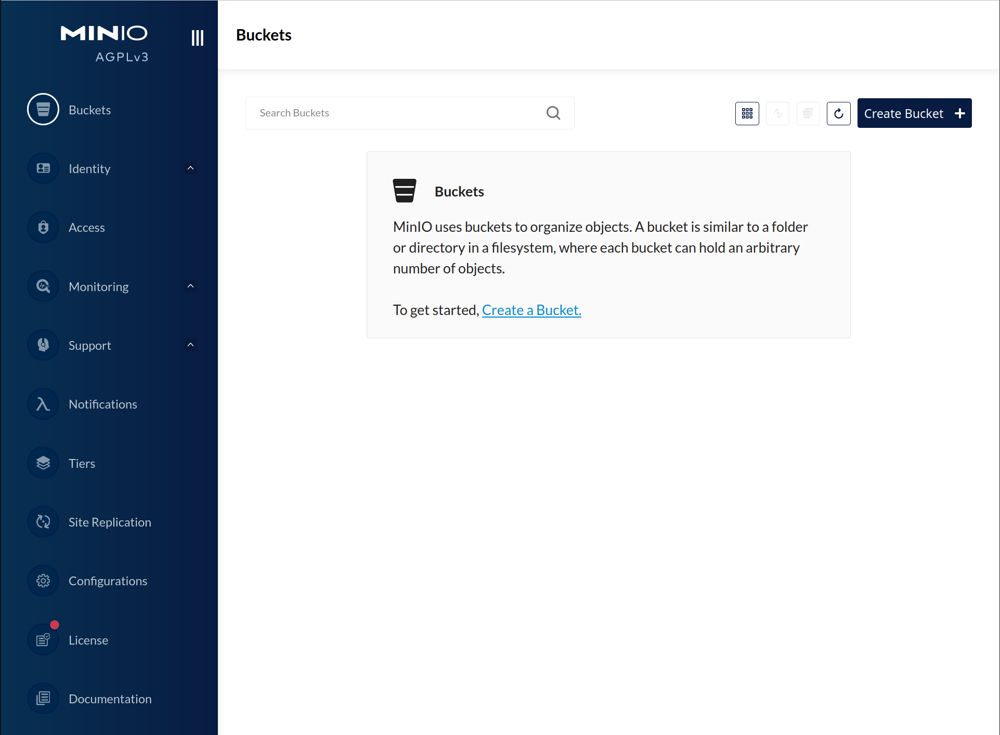

从```https://github.com/minio/minio/releases/tag/RELEASE.2022-06-02T02-11-04Z```开始，MinIO 为单节点单驱动部署实现了零奇偶校验纠删码后端。此功能允许访问纠删码相关功能，而无需多个磁盘。

> 分布式Minio自动引入了纠删码功能。从 MinIO 版本 RELEASE.2022-06-02T02-11-04Z 开始，MinIO 默认情况下是开启零奇偶校验（Zero Parity）功能的。这意味着在这个版本及以后的版本中，单节点单驱动部署将自动启用零奇偶校验纠删码后端。

## 安装

### 关闭防火墙

```
systemctl stop firewalld
systemctl disable firewalld
systemctl status firewalld
```

### 修改系统限制

```
// 设置用户可以同时运行的进程数的最大限制和文件打开限制（系统级别的配置）
sudo vim /etc/security/limits.conf

root soft nofile 65536
root hard nofile 65536
root soft nproc 131072
root hard nproc 131072
* soft nofile 65536
* hard nofile 65536
* soft nproc 131072
* hard nproc 131072


// 设置用户可以同时运行的进程数的最大限制和文件打开限制（个性化的配置）
sudo vim /etc/security/limits.d/20-nproc.conf

root soft nofile 65536
root hard nofile 65536
root soft nproc 131072
root hard nproc 131072
* soft nofile 65536
* hard nofile 65536
* soft nproc 131072
* hard nproc 131072

ulimit -n #查看最大连接数
ulimit -a
```

### 创建minio数据目录

下面的data目录不要使用系统盘，推荐重新挂载一个新的磁盘。如果 MinIO 启动并检测到现有的文件系统后端文件，则会返回错误。

```shell
mkdir -p /data/minio
```

## 安装

### 下载MinIO服务器

RPM 和 DEB 包会自动将 MinIO 安装到必要的系统路径并minio为systemctl. **MinIO 强烈建议使用 RPM 或 DEB 安装路径**。要更新使用 管理的部署systemctl。

```shell
wget https://dl.min.io/server/minio/release/linux-amd64/archive/minio-20230809233022.0.0.x86_64.rpm -O minio.rpm
sudo rpm -ivh minio.rpm
```

### 创建systemd服务文件

.deb或软件包.rpm将以下systemd服务文件安装到```/usr/lib/systemd/system/minio.service```. 对于二进制安装，请在所有 MinIO 主机上手动创建此文件，由于上面使用的是RPM安装创建的步骤就省去了,```/usr/lib/systemd/system/minio.service```里面有对应的配置信息对应的位置，可以查看具体的信息。

**查看对应启动服务的配置**

```shell
vi /usr/lib/systemd/system/minio.service
```

默认情况下，该minio.service文件作为minio-user用户和组运行。groupadd您可以使用和命令创建用户和组useradd 。以下示例创建用户、组并设置访问供 MinIO 使用的文件夹路径的权限。这些命令通常需要 root ( sudo) 权限。

```shell
groupadd -r minio-user
useradd -M -r -g minio-user minio-user
chown minio-user:minio-user /data/minio
```

### 创建环境变量文件

创建一个环境变量文件```/etc/default/minio```。对于 Windows 主机，指定类似于 的 Windows 样式路径C:\minio\config。MinIO Server 容器可以使用该文件作为所有环境变量的源。

**修改配置文件**

```shell
vi /etc/default/minio
```

以下示例提供了一个启动环境文件：

```ini
# MINIO_ROOT_USER and MINIO_ROOT_PASSWORD sets the root account for the MinIO server.
# This user has unrestricted permissions to perform S3 and administrative API operations on any resource in the deployment.
# Omit to use the default values 'minioadmin:minioadmin'.
# MinIO recommends setting non-default values as a best practice, regardless of environment

#账号密码，这里的密码不要太短，不然启动的时候会报错，可以根据journalctl -f -u minio.service来动态的查看错误，就是一个窗口journalctl -f -u minio.service，一个窗口sudo systemctl start minio.service，就能够查看到启动的错误
MINIO_ROOT_USER=myminioadmin
MINIO_ROOT_PASSWORD=minio-secret-key-change-me

# MINIO_VOLUMES sets the storage volume or path to use for the MinIO server.

MINIO_VOLUMES="/data/minio"

# MINIO_SERVER_URL sets the hostname of the local machine for use with the MinIO Server
# MinIO assumes your network control plane can correctly resolve this hostname to the local machine

# Uncomment the following line and replace the value with the correct hostname for the local machine and port for the MinIO server (9000 by default).

# 这是对象存储要分享出来的地址
MINIO_SERVER_URL="http://公网ip或者是内网自己能够访问的ip:9000"
```

包括本地部署所需的任何其他环境变量。

### 启动MinIO服务

```shell
sudo systemctl start minio.service
```

使用以下命令确认服务在线且正常运行：

```shell
sudo systemctl status minio.service
journalctl -f -u minio.service
```

输出journalctl应类似于以下内容：

```
Status:         1 Online, 0 Offline.
API: http://192.168.2.100:9000  http://127.0.0.1:9000
RootUser: myminioadmin
RootPass: minio-secret-key-change-me
Console: http://192.168.2.100:9090 http://127.0.0.1:9090
RootUser: myminioadmin
RootPass: minio-secret-key-change-me

Command-line: https://min.io/docs/minio/linux/reference/minio-mc.html
   $ mc alias set myminio http://10.0.2.100:9000 myminioadmin minio-secret-key-change-me

Documentation: https://min.io/docs/minio/linux/index.html
```

该API块列出了客户端可以访问 MinIO S3 API 的网络接口和端口。该Console块列出了客户端可以访问 MinIO Web 控制台的网络接口和端口。

### 连接到MinIO服务

您可以通过在首选浏览器中输入 MinIO 服务器块中的任何主机名或 IP 地址来访问 MinIO 控制台Console，例如http://localhost:9090。访问地址要看```journalctl -f -u minio.service```打印出来什么。

使用为容器指定的环境文件中的```MINIO_ROOT_USER```和配置进行登录。```MINIO_ROOT_PASSWORD```。



您可以使用 MinIO 控制台执行一般管理任务，例如身份和访问管理、指标和日志监控或服务器配置。每个 MinIO 服务器都包含其自己的嵌入式 MinIO 控制台。

如果您的本地主机防火墙允许外部访问控制台端口，则同一网络上的其他主机可以使用本地主机的 IP 或主机名访问控制台。


## JAVA操作Minio

> https://cloud.tencent.com/developer/article/1618622

## 部署的详细页面

> https://min.io/docs/minio/linux/operations/install-deploy-manage/deploy-minio-single-node-single-drive.html#id1


