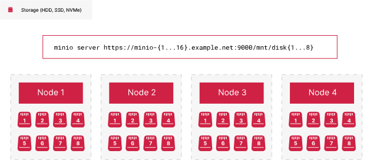

## 分布式 MinIO 部署

MinIO 将纠删码实现为在磁盘或节点级故障事件期间提供可用性和弹性的核心组件。**MinIO 将每个对象划分为数据和奇偶校验分片**，并将这些分片分布在单个擦除集中。


这一小型单节点部署在**一个擦除集中有 16 个驱动器**。假设默认奇偶校验为EC:4，MinIO 将对象划分为 4（四个）奇偶校验分片和 12（十二）个数据分片。**MinIO 将这些分片均匀分布在擦除集中的每个驱动器上**。

**MinIO 使用确定性算法来为给定对象选择擦除集**。对于每个唯一的对象命名空间```BUCKET/PREFIX/[PREFIX/...]/OBJECT.EXTENSION```，MinIO 总是选择相同的擦除集进行读/写操作。这包括同一对象的所有版本。


MinIO 使用完整的对象命名空间计算目标擦除集。

MinIO 需要读写仲裁来针对擦除集执行读写操作。仲裁取决于为部署配置的奇偶校验。读取仲裁始终等于配置的奇偶校验，这样 MinIO 就可以针对丢失的驱动器数量不超过奇偶校验的任何擦除集执行读取操作。


该节点有两个故障驱动器。**MinIO 使用奇偶校验分片自动替换丢失的数据分片，并将重建的对象提供给请求客户端**。

使用默认奇偶校验EC:4，部署可以容忍每个擦除集丢失 4（四）个驱动器，并且仍然提供读取操作。

写入仲裁取决于配置的奇偶校验和擦除集的大小。
如果奇偶校验小于擦除集驱动器数量的 1/2（一半），则写入仲裁等于奇偶校验，并且功能与读取仲裁类似。

MinIO 自动增加写入降级擦除集中的对象的奇偶校验，以确保该对象能够满足与健康擦除集中的对象相同的SLA 。奇偶校验升级行为提供了额外的风险缓解层，但不能取代修复或更换损坏的驱动器以使擦除集恢复到完全健康状态的长期解决方案。


该节点有两个故障驱动器。MinIO 使用升级后的奇偶校验写入对象，EC:6以确保该对象满足与其他对象相同的 SLA。

使用默认奇偶校验EC:4，部署可以容忍每个擦除集丢失 4 个驱动器，并且仍然提供写入操作。

如果奇偶校验等于擦除集驱动器数量的 1/2（一半），则写入仲裁数等于奇偶校验 + 1（一），以避免由于“脑裂”情况导致数据不一致。
例如，如果擦除集中正好有一半的驱动器由于网络故障而被隔离，MinIO 将认为仲裁丢失，因为它无法为写入操作建立 N+1 组驱动器。


**该节点有 50% 的驱动器故障。如果奇偶校验为EC:8，则该擦除集无法满足写入仲裁，并且 MinIO 会拒绝对该集的写入操作**。由于擦除集仍然保持读取仲裁，**因此对现有对象的读取操作仍然可以成功**。

永久丢失的驱动器数量多于配置的奇偶校验的擦除集已遭受数据丢失。对于最大奇偶校验配置，如果驱动器损耗等于奇偶校验，则擦除集将进入“只读”模式。**对于最大擦除集大小 16 和最大奇偶校验 8，这将需要丢失 9 个驱动器才会发生数据丢失**。


此擦除集丢失的驱动器数量多于配置的奇偶校验数量EC:4，因此丢失了读取和写入仲裁。MinIO 无法恢复存储在此擦除集上的任何数据。


暂时或暂时的驱动器故障（例如由于存储控制器或连接硬件故障）可能会恢复到擦除集中的正常操作状态。

MinIO 通过在池中的每个节点上对称地“条带化”擦除集驱动器，进一步降低了擦除集故障的风险。
**MinIO 根据节点和驱动器的数量自动计算最佳擦除集大小，其中最大擦除集大小为 16（十六）**。然后，它为每个擦除集选择一个穿过池的驱动器，如果擦除集条带大小大于节点数，则循环进行。此拓扑提供了针对单个节点甚至该节点上的存储控制器丢失的恢复能力。



在此 16 x 8 部署中，MinIO 将计算 8 个擦除集，每个擦除集有 16 个驱动器。它在可用节点上为每个节点分配一个驱动器来填充每个擦除集。**如果有 8 个节点，MinIO 需要为每个擦除集为每个节点选择 2 个驱动器**。

在上述拓扑中，池有 8 个擦除集，每个擦除集有 16 个驱动器，每个擦除集分布在 16 个节点上。每个节点将为每个擦除集分配一个驱动器。虽然从技术上讲，丢失一个节点会导致丢失 8 个驱动器，但每个擦除集只会丢失一个驱动器。尽管节点停机，这仍能维持法定人数。

每个擦除集独立于同一池中的所有其他擦除集。如果一个擦除集完全降级，MinIO 仍然可以对其他擦除集执行读/写操作。


然而，丢失的数据仍可能影响依赖于 100% 数据可用性假设的工作负载。此外，每个擦除集完全独立于其他擦除集，因此您无法使用其他擦除集将数据恢复到完全降级的擦除集。您必须使用站点或存储桶复制来创建BC/DR就绪的远程部署以恢复丢失的数据。

对于多池 MinIO 部署，每个池需要至少一个擦除集来维护读/写仲裁才能继续执行操作。
如果一个池丢失了所有擦除集，MinIO 将无法再确定给定的读/写操作是否会路由到该池。因此，即使其他池仍保持运行，MinIO 也会停止部署的所有 I/O。


此部署中的一个池完全失败。MinIO 无法再确定将 I/O 路由到哪个池或擦除集。持续的操作可能会产生不一致的状态，其中对象和/或其版本驻留在不同的擦除集中。因此，**MinIO 会停止部署中的所有I/O，直到池恢复**。

## 复制 MinIO 部署

MinIO 将站点复制作为在 MinIO 部署中发生小规模和大规模数据丢失时确保业务连续性和灾难恢复 (BC/DR) 的主要措施。


每个对等站点都部署到独立的数据中心，以提供针对大规模故障或灾难的保护。如果一个数据中心完全离线，客户端可以故障转移到另一站点。

MinIO 复制可以自动修复因短暂或持续停机而导致部分或全部数据丢失的站点。


数据中心 2 已关闭，站点 B 需要重新同步。**负载均衡器处理数据中心 1 中站点 A 的路由操作。站点 A 不断地将数据复制到站点 B**。

所有数据同步后，您可以恢复与该站点的正常连接。根据复制滞后量、站点之间的延迟和总体工作负载I/O，您可能需要暂时停止写入操作以使站点完全赶上。

如果对等站点完全失败，您可以从配置中完全删除该站点。负载均衡器配置还应删除该站点，以避免将客户端请求路由到脱机站点。

然后，您可以在修复原始硬件或完全更换它之后，通过将其添加回站点复制配置来恢复对等站点。MinIO 自动开始重新同步现有数据，同时不断复制新数据。

GET/HEAD通过将请求代理到健康的对等站点，站点可以在重新同步期间继续处理操作


站点 B 没有请求的对象，可能是由于复制滞后。它将请求GET代理到站点 A。站点 A 返回对象，站点 B 然后将该对象返回给发出请求的客户端。

客户端从第一个对等站点接收结果以返回所请求对象的任何版本。

PUT和DELETE操作使用常规复制过程进行同步。 LIST操作不代理，并要求客户专门针对健康的同行发布它们。


