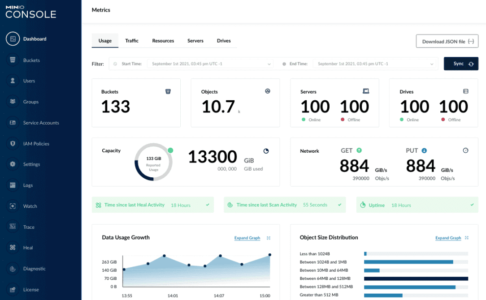

随着数字化时代的到来，数据的存储和管理变得至关重要。在这个背景下，**MinIO作为一款开源的对象存储解决方案迅速崭露头角**。MinIO不仅在数据存储领域取得了显著的成就，还在其独特的特点和丰富的功能集上获得了极大的关注。本文将介绍MinIO的主要特点和功能，带您深入了解这个引领存储技术创新的平台。

## 主要特点：

1. **开源性质：** MinIO 是一款完全开源的对象存储系统，这意味着任何人都可以访问其源代码、定制和修改以适应特定需求。这种开放性鼓励了创新和合作，推动了整个存储领域的发展。

2. **高度可扩展：** MinIO 设计了一种分布式架构，允许用户轻松地扩展存储能力以适应不断增长的数据需求。无论是单个服务器还是跨多个数据中心，MinIO 都能够无缝扩展，确保高可用性和高性能。

3. **云原生兼容性：** MinIO 旨在与云原生生态系统完美集成。它提供了对容器化、Kubernetes 和微服务架构的强大支持，使其成为现代应用程序开发的理想选择。

4. **强大的安全性：** 数据安全是MinIO设计的重要一环。它支持SSL/TLS加密以及多种身份验证机制，确保数据在传输和存储过程中得到充分的保护。

## 主要功能

1. **对象存储：** MinIO 提供了强大的对象存储能力，允许用户以无限的方式存储和检索数据。无论是大文件、多媒体内容还是结构化数据，MinIO 都可以高效地处理。

2. **分布式存储：** MinIO 的分布式架构使数据可以在多个节点上存储，实现数据冗余和负载均衡，从而提供了高可用性和可靠性。

3. **数据共享和访问控制：** 用户可以轻松地在MinIO上创建数据桶，并通过灵活的访问控制策略管理数据的共享和访问权限。

4. **事件触发和通知：** MinIO 允许用户设置触发器，以在特定事件发生时触发通知。这使得用户可以更好地监控和管理存储中的数据变化。

5. **S3兼容性：** MinIO 完全兼容Amazon S3 API，使其成为现有使用S3存储的应用程序的理想迁移目标。

## 结论

MinIO 作为一款开源的对象存储系统，在其强大的特点和丰富的功能支持下，已经在数据存储领域引起了广泛的关注。其可扩展性、安全性、云原生兼容性以及与S3 API的兼容性，使得MinIO成为了应对不断增长的数据挑战的有力工具。无论是大型企业还是初创公司，MinIO都能够为其提供灵活、高效的存储解决方案，助力其在数字化时代取得成功。

## 官网

> https://min.io/docs/minio/linux/operations/concepts/erasure-coding.html

## 民间文章

> https://www.cnblogs.com/crazymakercircle/p/15408581.html