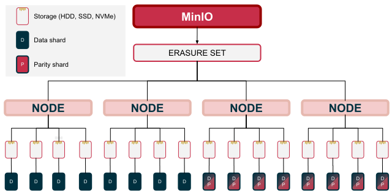
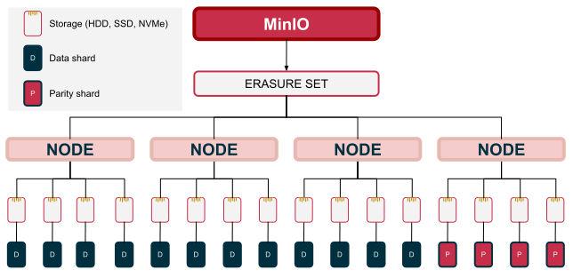

## 纠删码基础知识

MinIO 将每个服务器池中的驱动器分组为一个或多个相同大小的擦除集。

上述示例部署由 4 个节点组成，每个节点有 4 个驱动器。MinIO 使用单个擦除集进行初始化，该擦除集由所有四个节点上的所有 16 个驱动器组成。

MinIO 在初始化服务器池时确定擦除集的最佳数量和大小。初始设置后您无法修改这些设置。

对于每个写入操作，MinIO 将对象分区为数据和奇偶校验分片。
擦除集条带大小决定了部署的最大可能奇偶校验。确定要生成的数据和奇偶校验分片数量的公式为：

> N (ERASURE SET SIZE) = K (DATA) + M (PARITY)

上述示例部署具有 16 个驱动器的擦除集。这可以支持EC:01/2 擦除集驱动器之间的奇偶校验，或EC:8

您可以将奇偶校验值设置在 0 到 1/2 擦除集大小之间。

MinIO 使用 Reed-Solomon 纠删码实现并对对象进行分区以便在纠删集上进行分发。上面的示例部署的擦除集大小为 16，奇偶校验为EC:4

如果您稍后更改奇偶校验值，则使用给定奇偶校验设置写入的对象不会自动更新。

MinIO 需要最少的K任何类型的分片才能读取对象。
此处的值K构成部署的读取仲裁数。因此，擦除集必须至少具有K健康的驱动器以支持读取操作。

此部署有 1 个脱机节点，导致只剩下 12 个正常运行的驱动器。该对象是用 的EC:4读取法定人数写入的K=12。因此，该对象维护读取仲裁，并且 MinIO 可以重建它以进行读取操作。

MinIO 无法重建已丢失读取仲裁的对象。此类对象可以通过其他方式（例如复制重新同步）来恢复。

MinIO 需要最少的K擦除集驱动器来写入对象。
此处的值K构成部署的写入仲裁。因此，擦除集必须至少具有K可用的在线驱动器来支持写入操作。

## 详细查看

> https://min.io/docs/minio/linux/operations/concepts/erasure-coding.html

此部署有 1 个脱机节点，导致只剩下 12 个正常运行的驱动器。客户端使用EC:4奇偶校验设置写入一个对象，其中擦除集的写入仲裁数为K=12。该擦除集维护写入仲裁，MinIO 可以使用它进行写入操作。

如果奇偶校验EC:M恰好是擦除集大小的 1/2，则写入仲裁为K+1
这可以防止脑裂类型的情况，例如网络问题将一半的擦除集驱动器与另一个驱动器隔离。

该K+1逻辑确保客户端不可能将同一个对象写入两次 - 一次写入擦除集的每个“一半”。

对于维持读取仲裁的对象，MinIO 可以使用任何数据或奇偶校验分片来修复损坏的分片。

EC:4由于驱动器故障，对象丢失了 12 个数据分片中的 4 个。由于对象保持了读取仲裁，MinIO 可以使用可用的奇偶校验分片来修复那些丢失的数据分片。

## 擦除奇偶校验和存储效率

设置部署的奇偶校验是可用性和总可用存储之间的平衡。较高的奇偶校验值可提高对驱动器或节点故障的恢复能力，但会牺牲可用存储空间，而较低的奇偶校验值可提供最大的存储空间，但会降低对驱动器/节点故障的容忍度。使用 MinIO纠删码计算器来探索奇偶校验对规划的集群部署的影响。

下表列出了由 1 个节点和 16 个 1TB 驱动器组成的 MinIO 部署上不同纠删码奇偶校验级别的结果：

16 驱动器 MinIO 集群上奇偶校验设置的结果

| Erasure Coding | 总存储空间    | 存储比例 | 用于读取的最小驱动器 | 用于写入的最小驱动器 |
| -------------- | ------------ | -------- | ------------------ | ------------------ |
| EC: 4（默认）  | 12 太字节    | 0.750    | 12                 | 12                 |
| EC: 6         | 10 太字节    | 0.625    | 10                 | 10                 |
| EC: 8         | 8 太字节     | 0.500    | 8                  | 9                  |

## 位腐保护

位腐是存储介质级别随机更改造成的静默数据损坏。对于数据驱动器，它通常是代表数据的电荷或磁方向衰减的结果。这些来源的范围可以从断电期间的小电流尖峰到导致翻转位的随机宇宙射线。由此产生的“位腐烂”可能会在数据介质上造成细微的错误或损坏，而不会触发监控工具或硬件。

MinIO 对HighwayHash 算法的优化实现确保它能够动态捕获和修复损坏的对象。通过在读取时计算哈希值并在从应用程序、跨网络到内存或驱动器的写入时验证哈希值，从头到尾确保完整性。该实现专为提高速度而设计，可在 Intel CPU 的单核上实现超过 10 GB/秒的哈希速度。