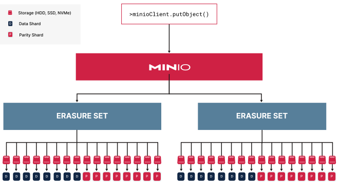

## 分布式 MinIO 部署

生产 MinIO 部署由至少 4 个具有同构存储和计算资源的 MinIO 主机组成。MinIO 将这些资源聚合在一起作为一个池，并将其自身呈现为单个对象存储服务。


该池中的每个 MinIO 主机都具有**匹配的计算、存储和网络配置**。使用本地连接存储（例如连接到主机 PCI-E 控制器板的 NVMe 或 SSD 驱动器）时，MinIO 可提供最佳性能。
**存储控制器应以“Just a Bunch of Drives”（JBOD）配置提供 XFS 格式的驱动器，不带 RAID、池或其他硬件/软件弹性层。MinIO 建议不要在驱动器层或控制器层进行缓存**。任何类型的缓存都可能在缓存填充和清除时导致I/O峰值，从而导致不可预测的性能。


**MinIO 自动将池中的驱动器分组为擦除集**。擦除集是 MinIO可用性和弹性的基本组成部分。MinIO 在池中的节点上对称地条带擦除集，以保持擦除集驱动器的均匀分布。然后，MinIO 根据部署奇偶校验将对象划分为数据和奇偶校验分片，并将它们分布在擦除集中。

有关 MinIO 冗余和修复的更完整讨论，请参阅纠删码。

- Erasure sets（擦除集）。
- Data Shard是数据块。
- Parity Shard是奇偶校验块。



MinIO 使用基于**对象名称和路径的确定性哈希算法来为给定对象选择擦除集**。对于每个唯一的对象命名空间```BUCKET/PREFIX/[PREFIX/...]/OBJECT.EXTENSION```，MinIO 总是选择相同的擦除集进行读/写操作。**MinIO 处理池和擦除集中的所有路由，使选择/读/写过程对应用程序完全透明**。


> **Erasure sets简介**：**MinIO 根据节点和驱动器的数量自动计算最佳擦除集大小，其中最大擦除集大小为 16（十六）**，在此 16 x 8 部署中，MinIO 将计算 8 个擦除集，每个擦除集有 16 个驱动器。它在可用节点上为每个节点分配一个驱动器来填充每个擦除集。**如果有 8 个节点，MinIO 需要为每个擦除集为每个节点选择 2 个驱动器**，也就是说Erasure sets是Node上面的一层抽象，擦除集还是 MinIO可用性和弹性的基本组成部分。


MinIO 在将对象返回给请求客户端之前，**透明地从数据或奇偶校验分片中重建对象**。

每个 MinIO 服务器都有分布式拓扑的完整视图，以便应用程序可以连接并指导部署中任何节点的操作。MinIO 响应节点自动处理将内部请求路由到部署中的其他节点并将最终响应返回给客户端。

应用程序通常不应管理这些连接，因为对部署拓扑的任何更改都需要应用程序更新。生产环境应该部署负载均衡器或类似的网络控制平面组件来管理与 MinIO 部署的连接。例如，您可以部署 NGINX 负载均衡器来针对部署中的可用节点执行“最少连接”或“循环”负载均衡。


负载均衡器将请求路由到部署中的任何节点。此后接收节点处理任何节点间请求。

您可以通过池扩展来扩展 MinIO 部署的可用存储。每个池由一组具有自己的擦除集的独立节点组成。MinIO 必须查询每个池以确定其将读写操作定向到的正确擦除集，以便每个附加池都会增加每次调用的节点间流量。然后，包含正确擦除集的池响应该操作，对应用程序保持完全透明。

如果通过池扩展修改 MinIO 拓扑，则可以通过修改负载均衡器以包含新池的节点来更新应用程序。应用程序可以继续使用 MinIO 部署的负载均衡器地址，而无需进行任何更新或修改。这确保了请求在所有池中均匀分布，同时应用程序继续使用单个负载均衡器 URL 进行 MinIO 操作。


PUT 请求需要检查每个池的正确擦除集。一旦识别出来，MinIO 就会对对象进行分区，并将数据和奇偶校验分片分布在适当的集合中。

客户端应用程序可以使用任何与 S3 兼容的 SDK 或库与 MinIO 部署进行交互。MinIO 发布了自己的SDK，专门用于与 S3 兼容的部署。


MinIO 使用严格的 S3 API 实现，包括要求客户端使用 AWS Signature V4或旧版 Signature V2 对所有操作进行签名。AWS 签名计算使用客户端提供的标头，因此负载均衡器、代理、安全程序或其他组件对这些标头的任何修改都将导致签名不匹配错误和请求失败。确保任何此类中间组件都支持将未更改的标头从客户端传递到服务器。

虽然 S3 API 的所有操作都使用 HTTP 方法GET，POST但应用程序通常使用 SDK 来执行 S3 操作。特别是，签名计算的复杂性通常使得通过curl或类似的 REST 客户端进行接口是不切实际的。MinIO 建议使用与 S3 兼容的 SDK 或库，它们会在操作过程中自动执行签名计算。

## 复制 MinIO 部署

MinIO站点复制提供对同步不同独立部署的支持。您可以在不同的机架、数据中心或地理区域中部署对等站点，以支持全球分布式 MinIO 对象存储中的BC/DR或地理本地读/写性能等功能。


具有三个对等点的 MinIO 多站点部署。**一个对等点上的写入操作会自动复制到配置中的所有其他对等点**。

复制性能主要取决于每个对等站点之间的网络延迟。**对于地理上分布的对等站点，站点之间的高延迟可能会导致显着的复制延迟**。这可能会与接近或达到部署整体性能容量的工作负载混合在一起，因为复制过程本身需要足够的空闲I/O来同步对象。


在此对等配置中，站点 A 与其对等站点之间的延迟为 100 毫秒。对象完全同步到所有站点的最快时间至少为 110 毫秒。

部署支持站点到站点故障转移协议的全局负载均衡器或类似网络设备对于多站点部署的功能至关重要。**负载均衡器应支持运行状况探测/检查设置，以检测一个站点的故障，并自动将应用程序重定向到任何剩余的运行状况对等点**。


负载均衡器应满足与单站点部署有关连接平衡和标头保留的相同要求。MinIO 复制通过对复制对象进行排队来处理瞬时故障。


