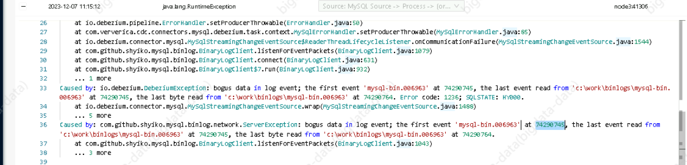

在 MySQL 中，与二进制日志（binlog）刷盘（flush）相关的参数可以通过以下 SQL 查询来查看：

```sql
SHOW VARIABLES LIKE 'innodb_flush_log_at_trx_commit';
SHOW VARIABLES LIKE 'sync_binlog';
```

这些变量影响 MySQL 对 binlog 的刷写行为。解释如下：

1. **`innodb_flush_log_at_trx_commit`：**
   这个参数控制 InnoDB 存储引擎的 binlog 刷写策略。可能的取值包括：

   - `0`: 每秒将 binlog 缓冲区刷到磁盘，但不保证每个事务都刷到磁盘。
   - `1`: 每个事务都将 binlog 缓冲区刷到磁盘，这是默认值，也是最可靠的设置。
   - `2`: 每秒将 binlog 缓冲区刷到磁盘，但只在提交事务时刷到磁盘。

   例如：

   ```sql
   SHOW VARIABLES LIKE 'innodb_flush_log_at_trx_commit';
   ```

   输出可能类似于：

   ```
   +--------------------------------+-------+
   | Variable_name                  | Value |
   +--------------------------------+-------+
   | innodb_flush_log_at_trx_commit | 1     |
   +--------------------------------+-------+
   ```

   这表示 `innodb_flush_log_at_trx_commit` 的值为 `1`。

2. **`sync_binlog`：**
   这个参数用于控制 binlog 同步刷写的频率。可能的取值包括：

   - `0`: 不同步 binlog 刷写，而是由操作系统来处理。
   - `1`: 每个事务都同步刷写 binlog。
   - `N`（N 大于 1）: 每 N 个事务同步刷写 binlog。

   例如：

   ```sql
   SHOW VARIABLES LIKE 'sync_binlog';
   ```

   输出可能类似于：

   ```
   +---------------+-------+
   | Variable_name | Value |
   +---------------+-------+
   | sync_binlog   | 1     |
   +---------------+-------+
   ```

   这表示 `sync_binlog` 的值为 `1`，即每个事务都同步刷写 binlog。

通过查看这些参数的值，你可以了解 MySQL 当前的 binlog 刷写策略。

**相关文档**

> https://misfra.me/2017/08/02/recovering-mysql-replication-after-error-1236/

**flinkcdc 同步数据 binlog 损坏问题**



> https://medium.com/@a.tambakouzadeh/checklist-to-troubleshoot-kafka-connect-issues-using-debezium-platform-for-cdc-and-mysql-data-b4d517d152a4