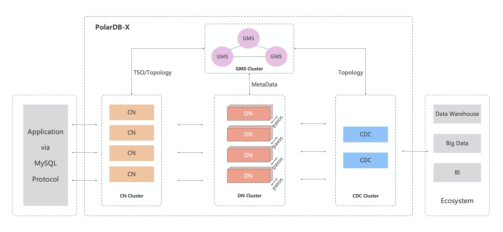

PolarDB-X 最初为解决阿里巴巴天猫“双十一”核心交易系统数据库扩展性瓶颈而生，之后伴随阿里云一路成长，是一款经过多种核心业务场景验证的、成熟稳定的数据库系统。 PolarDB-X 的核心特性如下：

- 水平扩展

PolarDB-X 采用 Shared-nothing 架构进行设计，支持多种 Hash 和 Range 数据拆分算法，通过隐式主键拆分和数据分片动态调度，实现系统的透明水平扩展。

- 分布式事务

PolarDB-X 采用 MVCC + TSO 方案及 2PC 协议实现分布式事务。事务满足 ACID 特性，支持 RC/RR 隔离级别，并通过一阶段提交、只读事务、异步提交等优化实现事务的高性能。

- 混合负载

PolarDB-X 通过原生 MPP 能力实现对分析型查询的支持，通过 CPU quota 约束、内存池化、存储资源分离等实现了 OLTP 与 OLAP 流量的强隔离。

- 企业级

PolarDB-X 为企业场景设计了诸多内核能力，例如 SQL 限流、SQL Advisor、TDE、三权分立、Flashback Query 等。

- 云原生

PolarDB-X 在阿里云上有多年的云原生实践，支持通过 K8S Operator 管理集群资源，支持公有云、混合云、专有云等多种形态进行部署，并支持国产化操作系统和芯片。

- 高可用

通过多数派 Paxos 协议实现数据强一致，支持两地三中心、三地五副本等多种容灾方式，同时通过 Table Group、Geo-locality 等提高系统可用性。

- 兼容 MySQL 系统及生态

PolarDB-X 的目标是完全兼容 MySQL ，目前兼容的内容包括 MySQL 协议、MySQL 大部分语法、Collation、事务隔离级别、Binlog 等。

## 架构

PolarDB-X 采用 Shared-nothing 与存储计算分离架构进行设计，系统由4个核心组件组成。

- 计算节点（CN, Compute Node）

**计算节点是系统的入口，采用无状态设计，包括 SQL 解析器、优化器、执行器等模块**。负责数据分布式路由、计算及动态调度，负责分布式事务 2PC 协调、全局二级索引维护等，同时提供 SQL 限流、三权分立等企业级特性。

- 存储节点（DN, Data Node）

**存储节点负责数据的持久化，基于多数派 Paxos 协议提供数据高可靠、强一致保障，同时通过 MVCC 维护分布式事务可见性**。

- 元数据服务（GMS, Global Meta Service）

元数据服务负责维护全局强一致的 Table/Schema, Statistics **等系统 Meta 信息，维护账号、权限等安全信息，同时提供全局授时服务（即 TSO）**。

- 日志节点（CDC, Change Data Capture）

日志节点提供完全兼容 MySQL Binlog 格式和协议的增量订阅能力，**提供兼容 MySQL Replication 协议的主从复制能力**。

## PolarDB 相关文档

> https://doc.polardbx.com/features/topics/x-paxos.html

