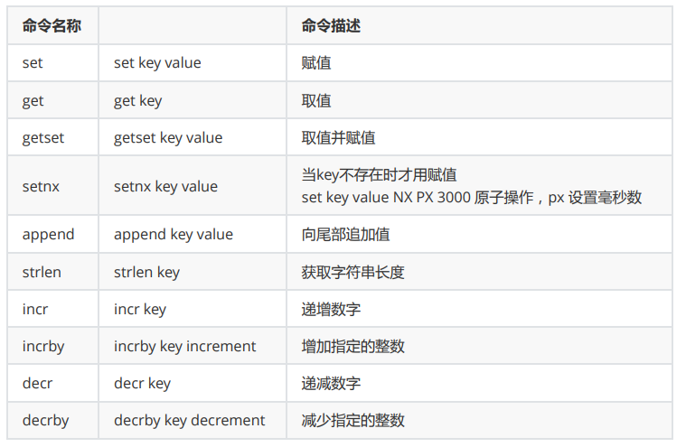
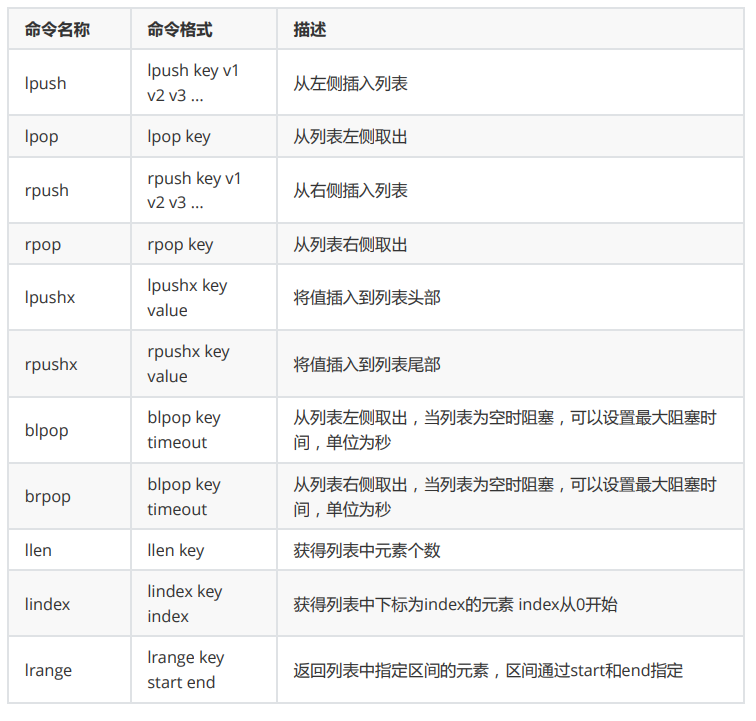
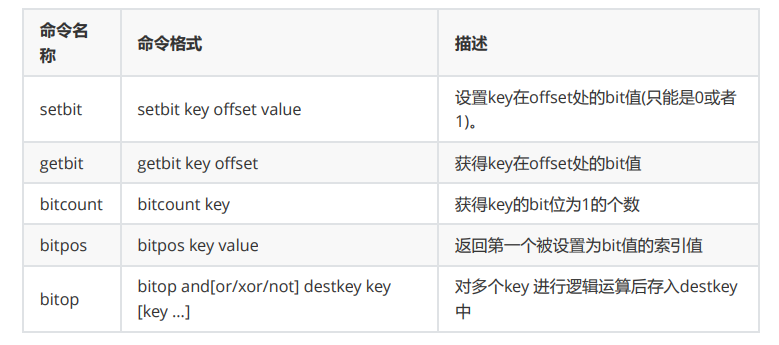

Redis是一个Key-Value的存储系统，使用ANSI C语言编写。key的类型是字符串。
value的数据类型有：
- 常用的：string字符串类型、list列表类型、set集合类型、sortedset（zset）有序集合类型、hash类型。
- 不常见的：bitmap位图类型、geo地理位置类型。
- Redis5.0新增一种：stream类型

> 注意：Redis中命令是忽略大小写，（set SET），key是不忽略大小写的 （NAME name）

## Redis的Key的设计
1. 用:分割
2. 把表名转换为key前缀, 比如: user:
3. 第二段放置主键值
4. 第三段放置列名

比如：用户表user, 转换为redis的key-value存储,username 的 key： user:9:username ,{userid:9,username:zhangf},email的key user:9:email
表示明确：看key知道意思。

## string字符串类型
Redis的String能表达3种值的类型：字符串、整数、浮点数 100.01 是个六位的串
常见操作命令如下表：



应用场景：
1. key和命令是字符串
2. 普通的赋值
3. incr用于乐观锁,incr：递增数字，可用于实现乐观锁 watch(事务)
4. setnx用于分布式锁,当value不存在时采用赋值，可用于实现分布式锁
```shell
/home/bigdata/module/redis/bin/redis-cli -h 127.0.0.1 -p 6379
```

```
setnx name zhangf
```
```
setnx name zhaoyun
```
```
get name
```

## list列表类型
- list列表类型可以存储有序、可重复的元素
- 获取头部或尾部附近的记录是极快的
- list的元素个数最多为2^32-1个（40亿）

常见操作命令如下表：



## bitmap位图类型

- bitmap是进行位操作的
- 通过一个bit位来表示某个元素对应的值或者状态,其中的key就是对应元素本身。
- bitmap本身会极大的节省储存空间。



应用场景：
1. 用户每月签到，用户id为key ， 日期作为偏移量 1表示签到
2. 统计活跃用户, 日期为key，用户id为偏移量 1表示活跃
3. 查询用户在线状态， 日期为key，用户id为偏移量 1表示在线

```shell
127.0.0.1:6379> setbit user:sign:1000 20200101 1 #id为1000的用户20200101签到
(integer) 0
127.0.0.1:6379> setbit user:sign:1000 20200103 1 #id为1000的用户20200103签到
(integer) 0
127.0.0.1:6379> getbit user:sign:1000 20200101 #获得id为1000的用户20200101签到状态
1 表示签到
(integer) 1
127.0.0.1:6379> getbit user:sign:1000 20200102 #获得id为1000的用户20200102签到状态
0表示未签到
(integer) 0
127.0.0.1:6379> bitcount user:sign:1000 # 获得id为1000的用户签到次数
(integer) 2
127.0.0.1:6379> bitpos user:sign:1000 1 #id为1000的用户第一次签到的日期
(integer) 20200101
127.0.0.1:6379> setbit 20200201 1000 1 #20200201的1000号用户上线
(integer) 0
127.0.0.1:6379> setbit 20200202 1001 1 #20200202的1000号用户上线
(integer) 0
127.0.0.1:6379> setbit 20200201 1002 1 #20200201的1002号用户上线
(integer) 0
127.0.0.1:6379> bitcount 20200201 #20200201的上线用户有2个
(integer) 2
127.0.0.1:6379> bitop or desk1 20200201 20200202 #合并20200201的用户和20200202上线
了的用户
(integer) 126
127.0.0.1:6379> bitcount desk1 #统计20200201和20200202都上线的用
户个数
(integer) 3
```

