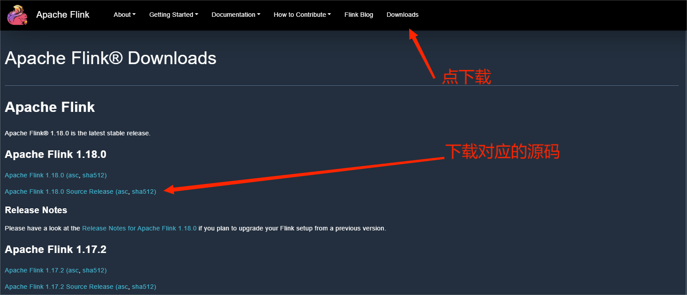
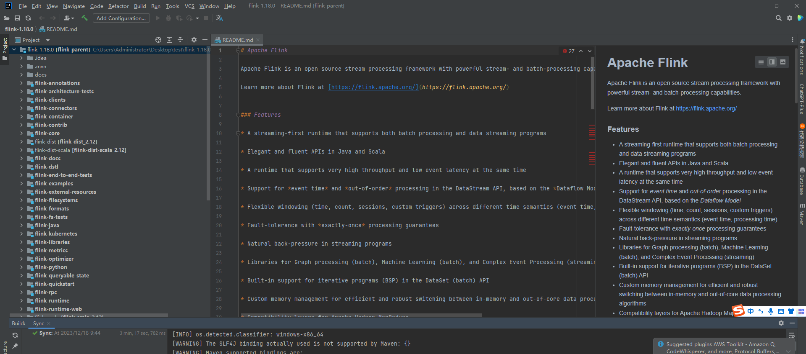
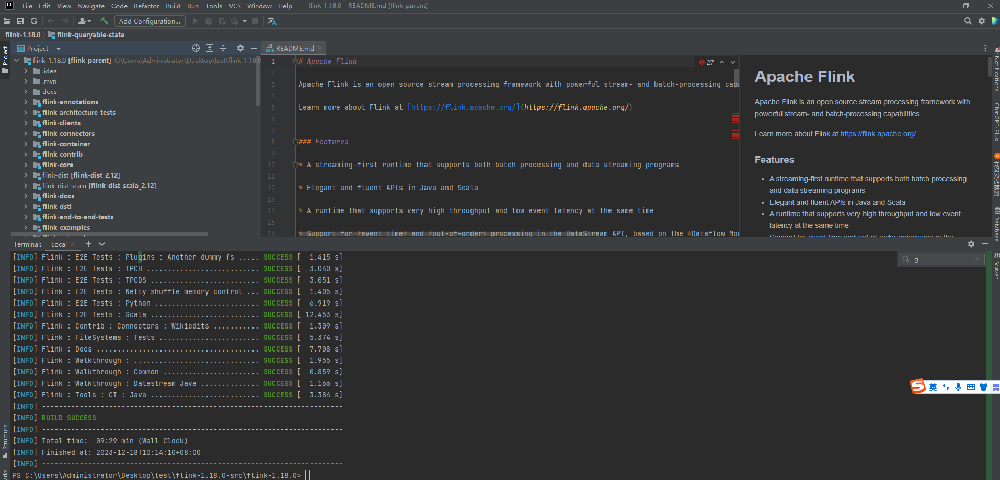
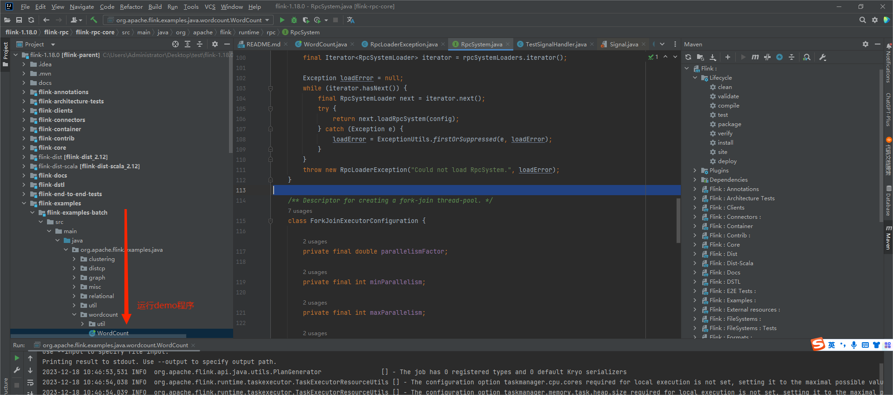
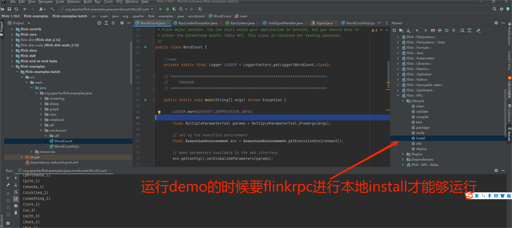
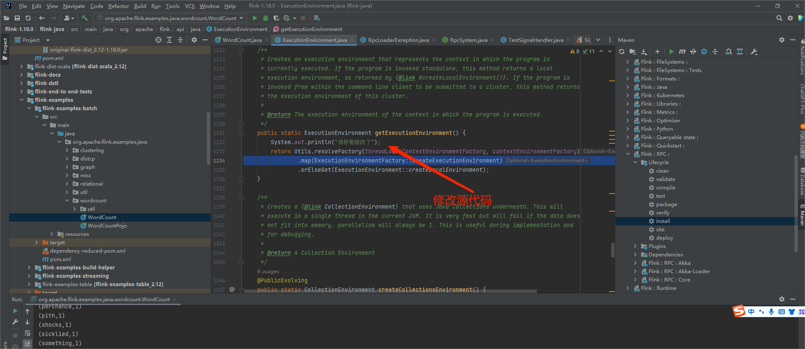
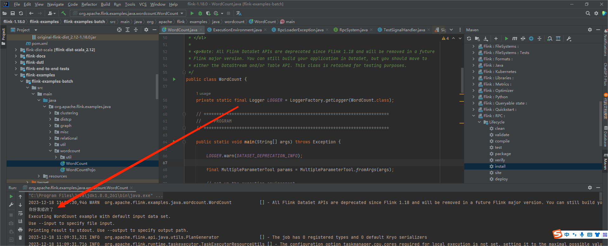
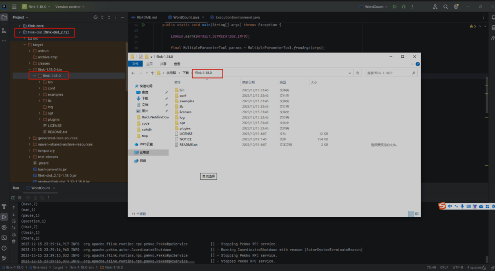

## 下载 Flink 源码

### 进入官网

> https://flink.apache.org/downloads/



### 源码导入 idea



### 编译源码

```shell
mvn clean install -DskipTests -Dfast -Pskip-webui-build -T 1C
```



## 运行 Flink demo

### 运行 Wordcount



### 运行 demo 程序可能遇到的错误

1. 程序包sun.misc不存在。

    > file->project Structure->project 原为11 修改版本为1.8 解决。

2. Could not load RpcSystem。

    

## 修改flink代码

### 修改源代码

1. 修改ExecutionEnvironment.getExecutionEnvironment()。

    

2. 修改代码以后的的执行效果。

    

## 修改以后代码编译

### 代码格式化

```shell
mvn spotless:apply
```

### 编译代码

```shell
mvn clean install -DskipTests -Dfast -Pskip-webui-build -T 1C
```

### 编译以后代码位置



> flink-dist->target->flink-1.18.0-bin->flink-1.18.0,这个目录跟从官网下载下来的二进制安装包解压后的目录结构是不是一样的，我们把这个目录压缩成tar.gz包上传到服务器就可以使用了。
