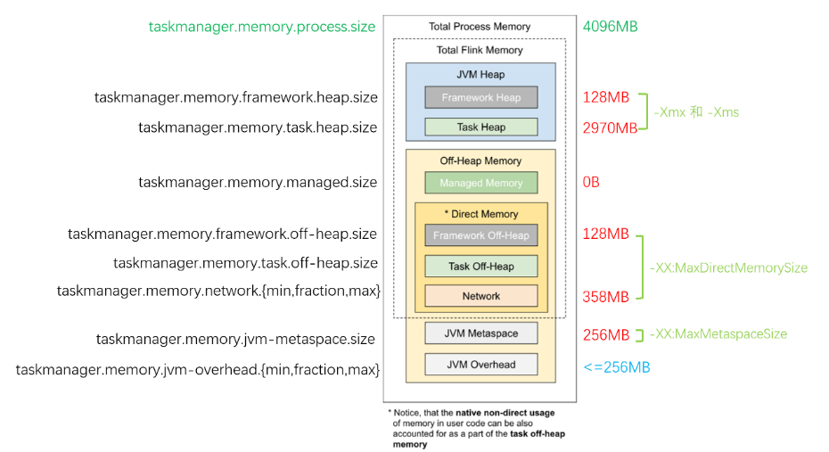

## 内存图



## JVM 进程总内存（Total Process Memory）

该区域表示在容器环境下，TaskManager 所在 JVM 的最大可用的内存配额，包含了本文后续介绍的所有内存区域，超用时可能被强制结束进程。我们可以通过 ```taskmanager.memory.process.size``` 参数控制它的大小。对于 YARN，如果 yarn.nodemanager.pmem-check-enabled 设为 true, 则也会在运行时定期检查容器内的进程是否超用内存。


