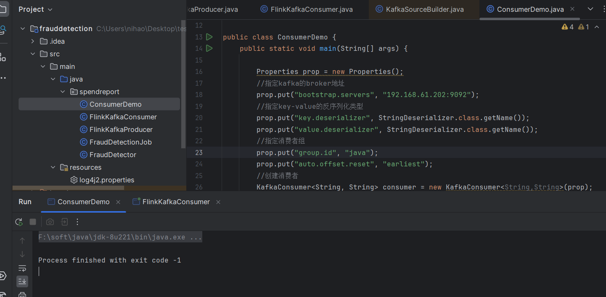
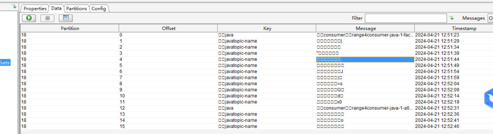
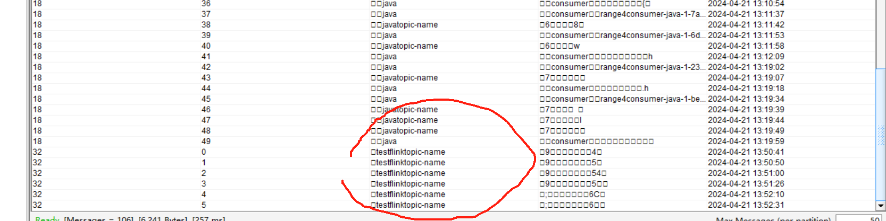

## 常用配置
```
#environment
batchSize=200
batchDelay=500
parallel=3
environment=dev

#kafka
topics=test
group=test
startFrom=earliest

#broker list
bootstrap.servers=ip:9092,ip:9092

key.deserializer=org.apache.kafka.common.serialization.StringDeserializer
value.deserializer=org.apache.kafka.common.serialization.StringDeserializer

#kafka commit
enable.auto.commit=true
auto.commit.interval.ms=1000
session.timeout.ms=240000
max.poll.interval.ms=600000
#max.partition.fetch.bytes=10485760
fetch.message.max.bytes=10485760
```

## 读取配置类
```java
public final class PropertyUtil {

    public static Properties loadProperty(String configFile) {
        Properties prop = new Properties();
        try(InputStream in = PropertyUtil.class.getClassLoader().getResourceAsStream(configFile)) {
            prop.load(in);
        } catch(IOException e) {
            e.printStackTrace();
            log.info("load property file with error:{}", e);
        }
        return prop;
    }

    public static HashMap<String,String> loadPropertyToMap(String configFile) {
        HashMap<String, String> subscriberToNameMap = new HashMap<>();
        Properties prop = PropertyUtil.loadProperty("common-config/subscriber_name.properties");
        prop.forEach((k, v) -> subscriberToNameMap.put(k.toString(), v.toString()));
        return subscriberToNameMap;
    }

    public static void printParas(Map map){
        System.out.println("------------------------------------------------------------");
        map.forEach(
                (k, v) -> System.out.println("| " + k + " : " + v)
        );
        System.out.println("------------------------------------------------------------");
    }

    public static Map<String,String> getAndPrintParas(ParameterTool parameterTool){
        return getAndPrintParas(parameterTool, new Properties());
    }

    public static Map<String,String> getAndPrintParas(ParameterTool parameterTool, Properties prop){
        HashMap<String,String> paraMap = new HashMap<String, String>();
        prop.forEach((k, v) -> paraMap.put(k.toString(), v.toString()));
        Properties paraProp = parameterTool.getProperties();
        Set<String> paraPropNames = paraProp.stringPropertyNames();

        // 遍历Properties对象的键
        paraPropNames.forEach((propName)->{
            String value = paraProp.getProperty(propName);
            paraMap.put(propName, value);
        });
        printParas(paraMap);
        return paraMap;
    }

    public static void main(String[] args) {
        Properties properties = loadProperty(StreamConstants.KAFKA_CONSUMER_CONFIG_URL);
        System.out.println(properties.getProperty("group.id"));
    }
}
```
### 配置工具类的使用
```java
       // 读取kafka消费的主题和flink窗口触发器的条件配置
        Properties kafkaProp = PropertyUtil.loadProperty(KafkaConsumerConfConstants.BJ_GOODS_CONSUMER_CONFIG_URL);
        ParameterTool parameterTool = ParameterTool.fromArgs(args);
        // 合并配置文件的参数和命令行的参数
        Map<String, String> paraMap = PropertyUtil.getAndPrintParas(parameterTool, kafkaProp);
```

## Flink消费Kafka和直接java消费kafka的不同
### flink没有开启checkpoint的情况
#### 
1. 普通Java方法启动一次以后（earliest），它会在Kafka的__consume_offset记录消费者的offset,如下图：
    
所以再次使用earliest消费的时候，就**不会**和flink一样从最开始的位置消费了。

2. 但是在Flink消费Kafka的时候，不管是OffsetsInitializer.latest()，还是OffsetsInitializer.earliest()都不会在__consume_offset主题里面记录信息，也就是OffsetsInitializer.earliest()没有记录消费者的offset，所以每一次都从最新的位置消费了。

#### 总结
1. 如果是普通的Java消费Kafka,不管是earliest还是latest，**只有是新的group的时候才会**按照最开始的位置消费（earliest），和最新的位置消费（latest）。如果是相同的groupid那么都会从kafka里面__consume_offset**记录消费者的offset开始消费**。
2. flink消费Kafka消息的时候，如果是earliest，那么就会一直从最开始的位置消费，因为它没有在__consume_offset里面记录信息，如果设置的是latest那么就会一直从最新的位置消费，如果是committedOffsets，那么它就会从记录的offset开始消费。
3. 也就是在flink消费kafka的时候要配合committedOffsets才能和指定offset消费。

### flink开启checkpoint的情况
#### 开启checkpoint以后和常规java消费kafka消息一样（offset会提交到__consume_offset）


如果所示，开启checkpoint以后，那么就会在__consume_offset进行了记录。那么再次消费的时候会从已经提交的offset进行消费，而不是最开始的earliest，同样如果是latest也会是从__consume_offset进行了记录继续消费。
```java
public class FlinkKafkaEndToEnd {
    private static  String taskName=FlinkKafkaEndToEnd.class.getSimpleName();

    public static void main(String[] args) throws Exception {
        final StreamExecutionEnvironment env = StreamExecutionEnvironment.getExecutionEnvironment();
        //restart策略
        env.setRestartStrategy(RestartStrategies.noRestart());
        //本地checkpoint配置
        env.enableCheckpointing(1000*10L);
        CheckpointConfig checkpointConf = env.getCheckpointConfig();
        // flink开启CheckpointingMode.EXACTLY_ONCE以后kafka的默认自动提交offset会关闭。
        checkpointConf.setCheckpointingMode(CheckpointingMode.EXACTLY_ONCE);
        checkpointConf.setMinPauseBetweenCheckpoints(1000*5L);
        checkpointConf.setCheckpointTimeout(1000*60L);
        checkpointConf.enableExternalizedCheckpoints(CheckpointConfig.ExternalizedCheckpointCleanup.RETAIN_ON_CANCELLATION);
        env.setStateBackend(new FsStateBackend("file:///C:/Users/nihao/Desktop/testflink/"+taskName));
        //kafka source配置
        Properties sourceProperties = new Properties();
        sourceProperties.setProperty("bootstrap.servers", "192.168.61.202:9092");
        sourceProperties.setProperty("group.id", "testflink");
        sourceProperties.put("auto.offset.reset", "latest");
//        sourceProperties.setProperty("client.id", "flinkclent");
        FlinkKafkaConsumer<String> kafkaSource = new FlinkKafkaConsumer<String>("topic-name", new SimpleStringSchema(), sourceProperties);
        env.addSource(kafkaSource).name("kafkaSource").uid("kafkaSource").print();
        env.execute(taskName);
    }
}
```

## 注意点
```java
//从最开始的位置消费
        kafkaSource.setStartFromEarliest();
//从最新的位置消费
        kafkaSource.setStartFromLatest();
//从已经提交的offset消费
        kafkaSource.setStartFromGroupOffsets();
```

> 上面的方法加到开启checkpoint以后，会影响到的效果是和默认的不同，如果默认使用了sourceProperties.put("auto.offset.reset", "latest");这种方式，就是如果有offset提交到了__consume_offset里面以后那么就直接在offset开始消费，但是上面的3个方法会实际影响到offset。也就是如果调用了```kafkaSource.setStartFromEarliest();```,那么就从最开始的地方消费，如果```kafkaSource.setStartFromLatest();```,那么就改变偏移量从最新的地方消费。用下面的命令可以看到消费偏移量的改变。

```shell
bin/kafka-consumer-groups.sh --describe --group testflink --bootstrap-server 192.168.61.202:9092
```
### 生产者
```java
public class FlinkKafkaProducerTest {
    private static  String taskName= FlinkKafkaProducerTest.class.getSimpleName();
    public static final Random random = new Random();
    public static void main(String[] args) throws Exception {
        StreamExecutionEnvironment env = StreamExecutionEnvironment.getExecutionEnvironment();
        //kafka sink配置
        Properties sinkProperties = new Properties();
        KafkaSink<String> sink = KafkaSink.<String>builder()
                .setBootstrapServers("192.168.61.202:9092")
                .setRecordSerializer(KafkaRecordSerializationSchema.builder()
                        .setTopic("topic-name")
                        .setValueSerializationSchema(new SimpleStringSchema())
                        .build()
                )
                .setDeliverGuarantee(DeliveryGuarantee.AT_LEAST_ONCE)
                .build();
        env.addSource(new SourceFunction<String>() {
            @Override
            public void run(SourceContext<String> context) throws Exception {
                while (true) {
                    TimeZone tz = TimeZone.getTimeZone("Asia/Shanghai");
                    Instant instant = Instant.ofEpochMilli(System.currentTimeMillis() + tz.getOffset(System.currentTimeMillis()));
                    String outline = String.format(
                            "{\"ts\": \"%s\",\"user_id\": \"%s\", \"item_id\":\"%s\", \"category_id\": \"%s\"}",
                            instant.toString(),
                            random.nextInt(10),
                            random.nextInt(100),
                            random.nextInt(1000)
                    );
                    System.out.println(outline);
                    context.collect(outline);
                    Thread.sleep(1000);
                }
            }

            @Override
            public void cancel() {

            }
        }).sinkTo(sink).name("kafkaSink");

        env.execute(taskName);
    }
}
```
### 消费者
```java
public class FlinkKafkaEndToEndTest2 {
    private static  String taskName= FlinkKafkaEndToEndTest.class.getSimpleName();

    public static void main(String[] args) throws Exception {
        final StreamExecutionEnvironment env = StreamExecutionEnvironment.getExecutionEnvironment();
        //restart策略
        env.setRestartStrategy(RestartStrategies.noRestart());
        //本地checkpoint配置
        env.enableCheckpointing(1000*10L);
        CheckpointConfig checkpointConf = env.getCheckpointConfig();
        checkpointConf.setCheckpointingMode(CheckpointingMode.EXACTLY_ONCE);
        checkpointConf.setMinPauseBetweenCheckpoints(1000*5L);
        checkpointConf.setCheckpointTimeout(1000*60L);
        checkpointConf.enableExternalizedCheckpoints(CheckpointConfig.ExternalizedCheckpointCleanup.RETAIN_ON_CANCELLATION);
        env.setStateBackend(new FsStateBackend("file:///C:/Users/nihao/Desktop/testflink/"+taskName));
//        //kafka source配置
        Properties sourceProperties = new Properties();
        sourceProperties.setProperty("bootstrap.servers", "192.168.61.202:9092");
        sourceProperties.setProperty("group.id", "testflink");
//        sourceProperties.put("auto.offset.reset", "earliest");
//        sourceProperties.setProperty("client.id", "flinkclent");
        FlinkKafkaConsumer<String> kafkaSource = new FlinkKafkaConsumer<String>("topic-name", new SimpleStringSchema(), sourceProperties);
        kafkaSource.setStartFromLatest();
        env.addSource(kafkaSource).name("kafkaSource").uid("kafkaSource").print();
        env.execute(taskName);
    }
}
```