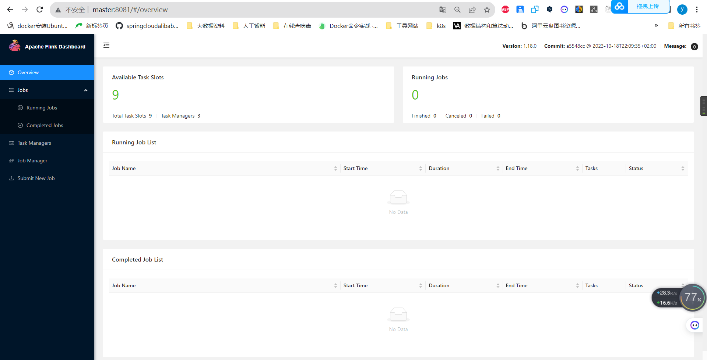
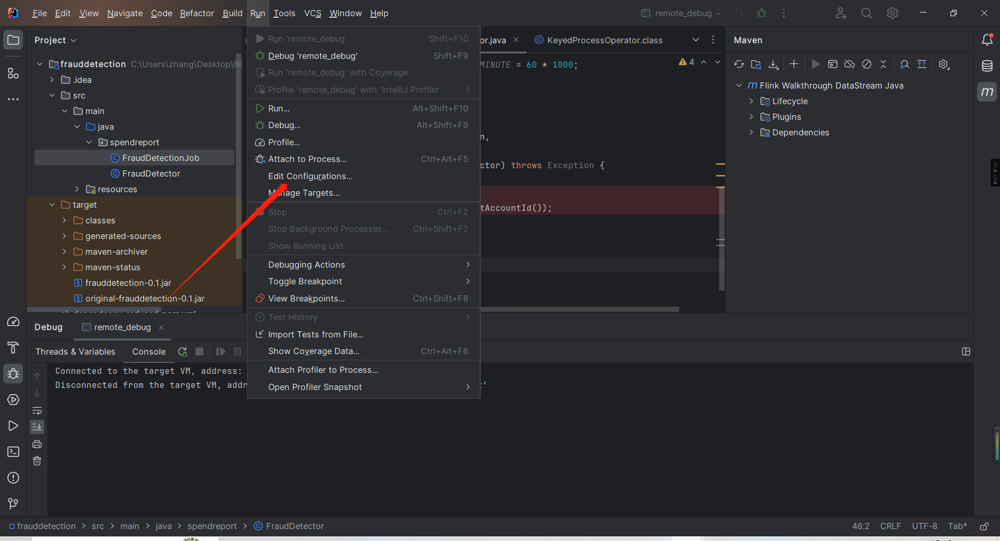
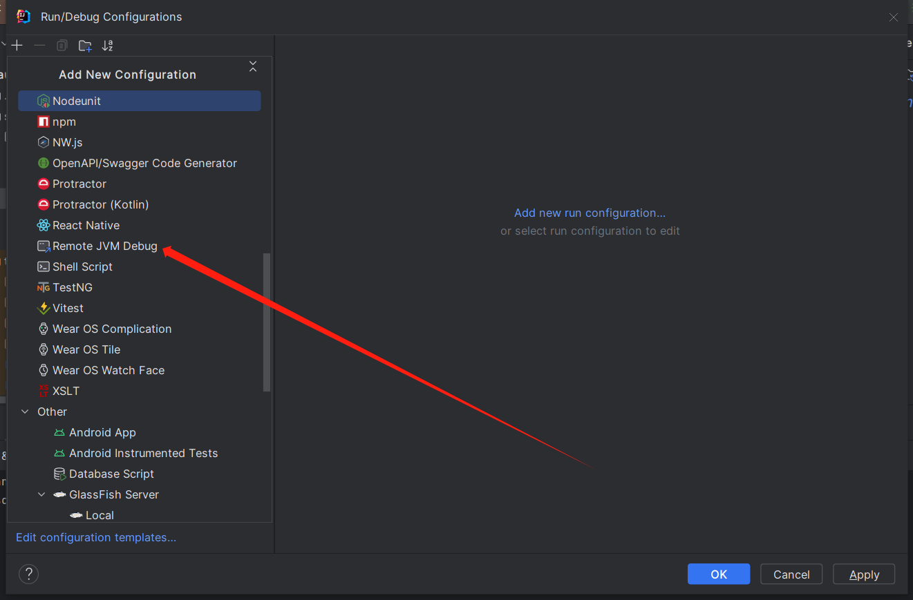
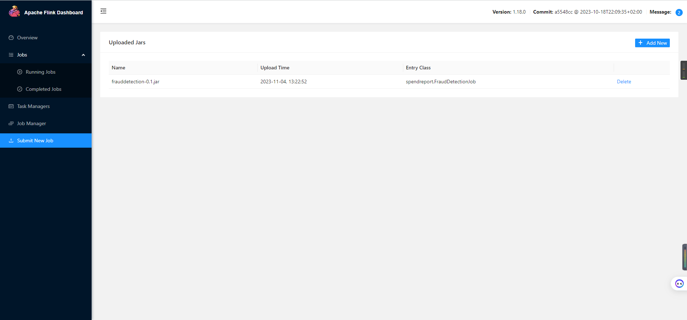
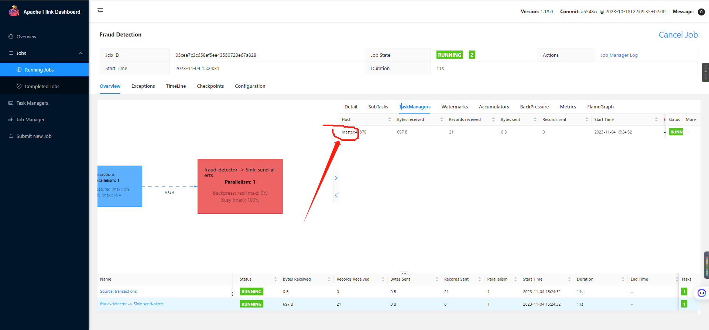
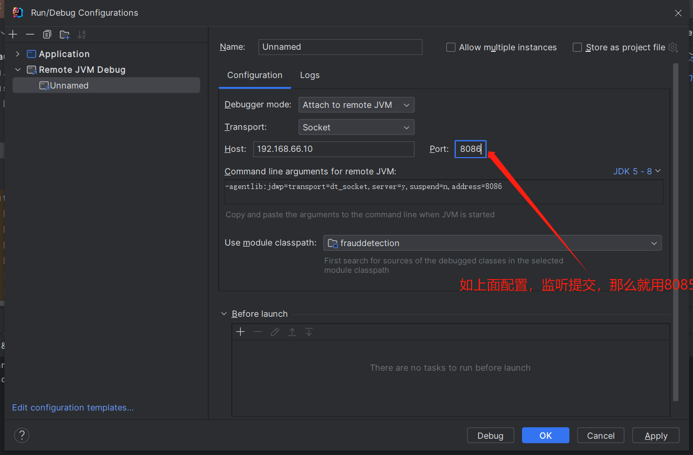
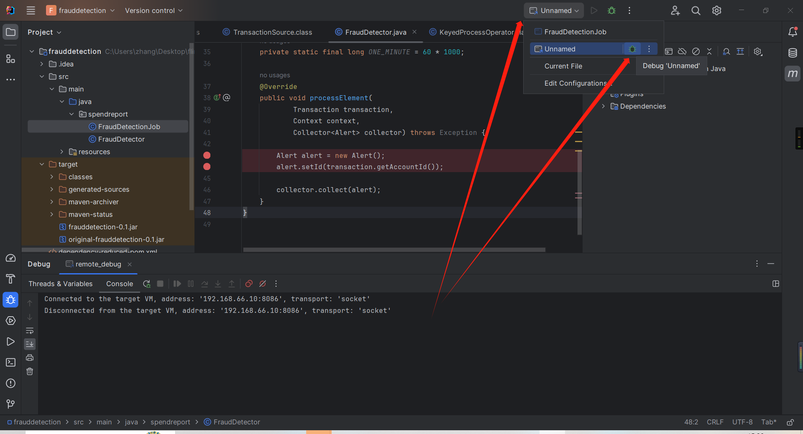
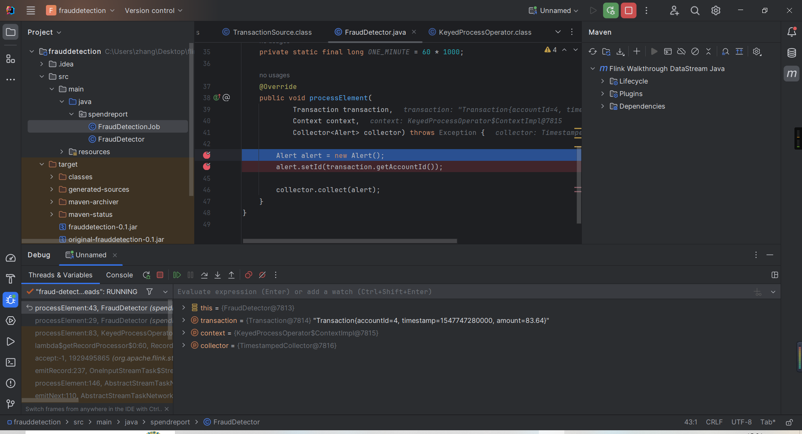
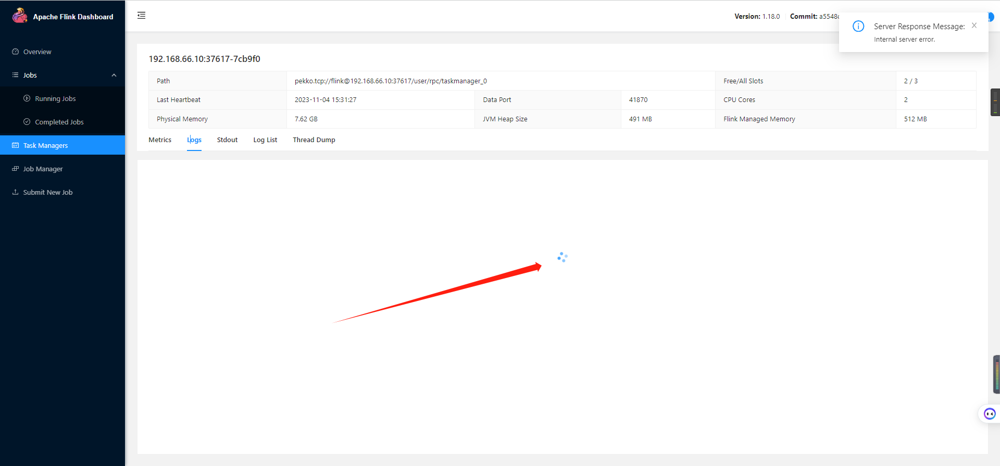

## 环境准备

### 时间同步

```
sudo yum -y install ntp
```

```
sudo systemctl start  ntpd
```

```
sudo systemctl enable  ntpd
```

```
sudo systemctl status ntpd
```

修改配置文件

```
sudo vi /etc/ntp.conf
```
添加下面的配置
```
server ntp.aliyun.com iburst
```

重启服务

```
sudo systemctl restart ntpd
```

查看同步状态

```
ntpq -p
```

如果上面的命令无效，那么执行下面的
```
sudo systemctl stop  ntpd

sudo ntpdate ntp.aliyun.com
```

```
date
```

## 安装flink

### 下载
```
链接：https://pan.baidu.com/s/1hzaq4MSQ4_-nY6kY96BLOw 
提取码：yyds 
--来自百度网盘超级会员V5的分享
```

```
tar -zxvf flink-1.18.0-bin-scala_2.12.tgz
```

### 修改配置文件
```
sudo yum install -y vim
```
```
vim flink-conf.yaml
```

JobManager节点地址(公共部分)

```
jobmanager.rpc.address: 192.168.66.10
jobmanager.bind-host: 0.0.0.0
rest.address: 192.168.66.10
rest.bind-address: 0.0.0.0
taskmanager.numberOfTaskSlots: 3
```
修改workers

```
vi workers
```
```
192.168.66.10
192.168.66.20
192.168.66.21
```

修改masters

```
vi masters
```

```
192.168.66.10:8081
```

同步安装包多所有的集群

```
./xsync flink-1.18.0
```

TaskManager节点地址.需要配置为当前机器名(不同的work节点配置的host不一样就行了)
```
vim flink-conf.yaml
```

```
taskmanager.bind-host: 0.0.0.0
taskmanager.host: 192.168.66.10
```

### 启动

然后启动集群

```
./start-cluster.sh
```



## 远程debug flink案例

### 准备编程案例
创建官方编程案例
```
mvn archetype:generate \
    -DarchetypeGroupId=org.apache.flink \
    -DarchetypeArtifactId=flink-walkthrough-datastream-java \
    -DarchetypeVersion=1.18.0 \
    -DgroupId=frauddetection \
    -DartifactId=frauddetection \
    -Dversion=0.1 \
    -Dpackage=spendreport \
    -DinteractiveMode=false
```

### 修改flink集群配置文件

Java 的远程调试方法很简单，只需要在 java 命令的启动参数上加入 。
```
-agentlib:jdwp=transport=dt_socket,server=y,suspend=n,address=[调试端口]
```
的参数即可。

对于 Flink 而言，可以修改 flink-conf.yaml 里面的 env.java.opts.taskmanager 和 env.java.opts.jobmanager 两个配置项，分别对应着 TaskManager 和 JobManager 的运行参数。

1. **修改配置文件**

所有相关的flink机器都要添加下面的配置，比如flink standone集群，那么所有的机器都要加，如果是yarn集群，那么就是提交的那个机器加上下面的配置就可以了。
```
vim flink-conf.yaml
```
```
env.java.opts.jobmanager: -agentlib:jdwp=transport=dt_socket,server=y,suspend=n,address=8085
env.java.opts.taskmanager: -agentlib:jdwp=transport=dt_socket,server=y,suspend=n,address=8086
```


### 配置idea

1. 配置run。



2. 选择对应的类别。



3. 上传案例jar包



4. 查看在那台机器运行的。



5. 配置远程调试的ip和端口。

下面填写的ip对应上面运行程序机器的地址，代码在那个节点运行，远程debug才能连接过去。如果下面的端口为8085，那么debug的就是任务提交的过程也就是debug jobmanage,下面是8086那么就是taskmanage。



6. 选择对应的debug程序开始调试。




可以看到下面debug成功




## 其他

### 远程调试springboot程序

> https://blog.csdn.net/ThinkWon/article/details/123365722


### 比较好的flink文章

> https://cloud.tencent.com/developer/article/1653407

### 博客园远程调试flink文章

> https://www.cnblogs.com/qiu-hua/p/14711302.html