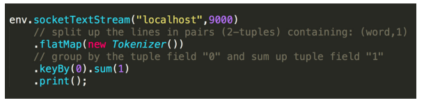

## Checkpoint 与 state 的关系

Checkpoint 是从 source 触发到下游所有节点完成的一次全局操作。下图可以有一个对 Checkpoint 的直观感受，红框里面可以看到一共触发了 569K 次 Checkpoint，然后全部都成功完成，没有 fail 的。


state 其实就是 Checkpoint 所做的主要持久化备份的主要数据，看下图的具体数据统计，其 state 也就 9kb 大小 。


## 什么是 state

我们接下来看什么是 state。先看一个非常经典的 word count 代码，这段代码会去监控本地的 9000 端口的数据并对网络端口输入进行词频统计，我们本地行动 netcat，然后在终端输入 hello world，执行程序会输出什么？



答案很明显，(hello, 1) 和 (word,1)

那么问题来了，如果再次在终端输入 hello world，程序会输入什么？

**答案其实也很明显，(hello, 2) 和 (world, 2)。为什么 Flink 知道之前已经处理过一次 hello world，这就是 state 发挥作用了**，这里是被称为 keyed state 存储了之前需要统计的数据，所以帮助 Flink 知道 hello 和 world 分别出现过一次。

回顾一下刚才这段 word count 代码。keyby 接口的调用会创建 keyed stream 对 key 进行划分，这是使用 keyed state 的前提。在此之后，sum 方法会调用内置的 StreamGroupedReduce 实现。


### 什么是 keyed state

对于 keyed state，有两个特点：

- 只能应用于 KeyedStream 的函数与操作中，例如 Keyed UDF, windowstate。

- keyed state 是已经分区 / 划分好的，**每一个 key 只能属于某一个 keyedstate**。

对于如何理解已经分区的概念，我们需要看一下 keyby 的语义，大家可以看到下图左边有三个并发，右边也是三个并发，左边的词进来之后，通过 keyby 会进行相应的分发。**例如对于 hello word，hello 这个词通过 hash 运算永远只会到右下方并发的 task 上面去**。


### 什么是 operator state

> https://blog.51cto.com/u_15155081/2720571

- 又称为 non-keyed state，每一个 operator state 都仅与一个 operator 的实例绑定。

- 常见的 operator state 是 source state，例如记录当前 source 的 offset。

再看一段使用 operator state 的 word count 代码：


这里的 fromElements 会调用 FromElementsFunction 的类，其中就使用了类型为 list state 的 operator state。根据 state 类型做一个分类如下图：


除了从这种分类的角度，还有一种分类的角度是从 Flink 是否直接接管：

- Managed State： 由 Flink 管 理 的 state， 刚 才 举 例 的 所 有 state 均 是 managed state。

- Raw State： Flink 仅提供 stream 可以进行存储数据，对 Flink 而言 raw state 只是一些 bytes。

在实际生产中，都只推荐使用 managed state，本文将围绕该话题进行讨论。

## 如何在 Flink 中使用 state

下图就前文 word count 的 sum 所使用的 StreamGroupedReduce 类为例讲解了如何在代码中使用 keyed state：


> https://nightlies.apache.org/flink/flink-docs-release-1.17/docs/dev/datastream/fault-tolerance/state/

下图则对 word count 示例中的 FromElementsFunction 类进行详解并分享如何在代码中使用 operator state：


## Checkpoint 的执行机制

在介绍 Checkpoint 的执行机制前，我们需要了解一下 state 的存储，因为 state 是 Checkpoint 进行持久化备份的主要角色。

### Statebackend 的分类

下图阐释了目前 Flink 内置的三类 ```state backend```，**其中``` MemoryStateBackend```和 ```FsStateBackend``` 在运行时都是存储在 java heap 中的，只有在执行 Checkpoint 时，FsStateBackend 才 会 将 数 据 以 文 件 格 式 持 久 化 到 远程 存 储 上**。 而RocksDBStateBackend 则借用了 RocksDB（内存磁盘混合的 LSM DB）对 state 进行存储。


对于 HeapKeyedStateBackend，有两种实现：

- 支持异步 Checkpoint（默认）：存储格式 CopyOnWriteStateMap。

- 仅支持同步 Checkpoint：存储格式 NestedStateMap。

特别在 MemoryStateBackend 内使用 HeapKeyedStateBackend 时，Checkpoint 序列化数据阶段默认有最大 5 MB 数据的限制。

对于 RocksDBKeyedStateBackend，**每个 state 都存储在一个单独的 columnfamily 内**，其中 keyGroup，Key 和 Namespace 进行序列化存储在 DB 作为 key。


相关优化文章

> https://cloud.tencent.com/developer/article/1592441

### Checkpoint 执行机制详解

本小节将对 Checkpoint 的执行流程逐步拆解进行讲解，**下图左侧是 Checkpoint Coordinator，是整个 Checkpoint 的发起者**，中间是由两个 source，一个 
sink 组成的 Flink 作业，最右侧的是持久化存储，在大部分用户场景中对应 HDFS。

1. 第一步，Checkpoint Coordinator **向所有 source 节点 trigger Checkpoint**。

    

2. 第二步，source 节点向下游广播 barrier，这个 barrier 就是实现 Chandy-Lamport 分布式快照算法的核心，下游的 task 只有收到所有 input 的 barrier 才会执行相应的 Checkpoint。

    

3. 第三步，**当 task 完成 state 备份后，会将备份数据的地址（state handle）通知给 Checkpoint coordinator**。

    

4. 第四步，下游的 sink 节点收集齐上游两个 input 的 barrier 之后，会执行本地快照，这里特地展示了 RocksDB incremental Checkpoint 的流程，首先 RocksDB 会全量刷数据到磁盘上（红色大三角表示），然后 Flink 框架会从中选择没有上传的文件进行持久化备份（紫色小三角）。

    

5. 同样的，sink 节点在完成自己的 Checkpoint 之后，会将 state handle 返回通知 Coordinator。

    

6. 最后，当 Checkpoint coordinator 收集齐所有 task 的 state handle，就认为这一次的 Checkpoint 全局完成了，向持久化存储中再备份一个 Checkpoint meta 文件。

    


