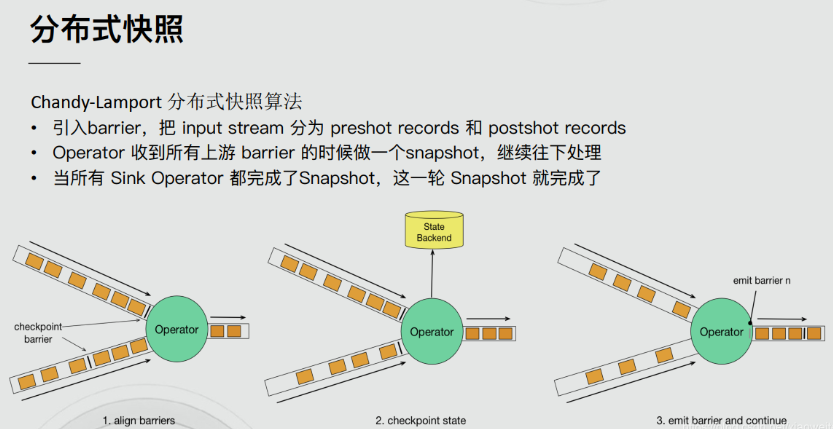

Flink 在1.4.0 版本引入『exactly-once』并号称支持『End-to-End Exactly-Once』“端到端的精确一次”语义。

## 流处理的数据处理语义
对于**批处理，fault-tolerant（容错性）很容易做，失败只需要replay**，就可以完美做到容错。
对于流处理，数据流本身是动态，没有所谓的开始或结束，**虽然可以replay buffer的部分数据，但fault-tolerant做起来会复杂的多**
流处理（有时称为事件处理）可以**简单地描述为是对无界数据或事件的连续处理**。流或事件处理应用程序可以或多或少地被描述为有向图，并且通常被描述为有向无环图（DAG）。在这样的图中，每个边表示数据或事件流，每个顶点表示运算符，会使用程序中定义的逻辑处理来自相邻边的数据或事件。**有两种特殊类型的顶点，通常称为 sources 和 sinks**。sources读取外部数据/事件到应用程序中，而 sinks 通常会收集应用程序生成的结果。下图是流式应用程序的示例。有如下特点：

- 分布式情况下是由多个Source(读取数据)节点、多个Operator(数据处理)节点、多个Sink(输出)节点构成

- 每个节点的并行数可以有差异，且每个节点都有可能发生故障

- 对于数据正确性最重要的一点，就是当发生故障时，是怎样容错与恢复的。


流处理引擎通常为应用程序提供了三种数据处理语义：最多一次、至少一次和精确一次。

**如下是对这些不同处理语义的宽松定义(一致性由弱到强)：**

- At most noce < At least once < Exactly once < End to End Exactly once

### At-most-once 最多一次
有可能会有数据丢失，这意味着如果数据在被流应用程序完全处理之前发生丢失，则不会进行其他重试或者重新发送。


### At-least-once 至少一次
有可能重复处理数据，这通常意味着如果事件在流应用程序完全处理之前丢失，则将从源头重放或重新传输事件。然而，由于事件是可以被重传的，因此一个事件有时会被处理多次(至少一次)。


### Exactly-once 精确一次

这种语义会保证每一条消息只被流处理系统处理一次。即使是在各种故障的情况下，流应用程序中的所有算子都保证事件只会被『精确一次』的处理。（也有文章将 Exactly-once 翻译为：完全一次，恰好一次）

Flink实现『精确一次』的分布式快照/状态检查点方法受到 Chandy-Lamport 分布式快照算法的启发。通过这种机制，流应用程序中每个算子的所有状态都会定期做 checkpoint。如果是在系统中的任何地方发生失败，每个算子的所有状态都回滚到最新的全局一致 checkpoint 点。在回滚期间，将暂停所有处理。源也会重置为与最近 checkpoint 相对应的正确偏移量。**整个流应用程序基本上是回到最近一次的一致状态，然后程序可以从该状态重新启动**。


### End-to-End Exactly-Once 端到端的精确一次
Flink 在1.4.0 版本引入『exactly-once』并号称支持『End-to-End Exactly-Once』“端到端的精确一次”语义。

它指的是 Flink 应用从 Source 端开始到 Sink 端结束，数据必须经过的起始点和结束点。

注意：

『exactly-once』和『End-to-End Exactly-Once』的区别:

**简单来说，"Exactly-once"关注自己的数据处理，而"End-to-End Exactly-Once"关注整个数据处理链路的保证。**

### 精确一次? 有效一次!

有些人可能认为『精确一次』描述了事件处理的保证，其中流中的每个事件只被处理一次。实际上，没有引擎能够保证正好只处理一次。在面对任意故障时，**不可能保证每个算子中的用户定义逻辑在每个事件中只执行一次，因为用户代码被部分执行的可能性是永远存在的**。

那么，当引擎声明『精确一次』处理语义时，它们能保证什么呢？如果不能保证用户逻辑只执行一次，那么什么逻辑只执行一次？当引擎声明『精确一次』处理语义时，**它们实际上是在说，它们可以保证引擎管理的状态更新只提交一次到持久的后端存储**。

**事件的处理可以发生多次，但是该处理的效果只在持久后端状态存储中反映一次**。因此，我们认为有效地描述这些处理语义最好的术语是『有效一次』（effectively once）

**流计算系统如何支持一致性语义**

- 去重保证End-to-End Exactly-Once

    

- 分布式快照

    

## ​​​​​​​End-to-End Exactly-Once的实现

通过前面的学习，我们了解到，**Flink内部借助分布式快照Checkpoint已经实现了内部的Exactly-Once**，但是Flink 自身是无法保证外部其他系统“精确一次”语义的，所以 **Flink 若要实现所谓“端到端（End to End）的精确一次”的要求，那么外部系统必须支持“精确一次”语义；**然后借助一些其他手段才能实现。如下：

### ​​​​Source

**发生故障时需要支持重设数据的读取位置**，如Kafka可以通过offset来实现（其他的没有offset系统，我们可以自己实现累加器计数）

### ​​​​​​​Transformation

也就是Flink内部，已经通过Checkpoint保证了，如果发生故障或出错时，**Flink应用重启后会从最新成功完成的checkpoint中恢复——重置应用状态并回滚状态到checkpoint中输入流的正确位置**，之后再开始执行数据处理，就好像该故障或崩溃从未发生过一般。

- 分布式快照机制

    我们在之前的课程中讲解过 Flink 的容错机制，Flink 提供了失败恢复的容错机制，而这个容错机制的核心就是持续创建分布式数据流的快照来实现。

    

- Barrier

    Flink 分布式快照的核心元素之一是 Barrier（数据栅栏），我们也可以把 Barrier 简单地理解成一个标记，该标记是严格有序的，并且随着数据流往下流动，**经过那个算子那么就会把对应算子的状态开始保存下来，如果出现错误恢复的时候，那么它就能够从最近一次保存的成功的地方恢复，如果Barrier经过的算子状态都保存成功，那么就会通知jobmanager这一次ck成功了**。每个 Barrier 都带有自己的 ID，Barrier 极其轻量，并不会干扰正常的数据处理。

    

    具体过程如下，JobManager 向 SourceTask 发送 CheckPointTrigger，SourceTask 会在数据流中安插 CheckPoint barrier。

    

    Source Task 自身做快照，并保存到状态后端。

    

    Source Task 将 barrier 跟数据流一块往下游发送。

    

    当下游的 Operator 实例接收到 CheckPointbarrier 后，对自身做快照。

    

    如下图，有 4 个带状态的 Operator 实例，相应的状态后端就可以想象成填 4 个格子。整个 CheckPoint 的过程可以当做 Operator 实例填自己格子的过程，Operator 实例将自身的状态写到状态后端中相应的格子，当所有的格子填满可以简单的认为一次完整的 CheckPoint 做完了。

    

    多 Operator 状态恢复

    

- 什么是 barrier 对齐？

    

    如上图，**当一个 Operator 接收到 Checkpoint barrier n 时，它会暂停处理来自该输入流的任何数据记录，直到其他所有输入流也接收到 barrier n 为止**。这样做是为了避免混合属于当前快照 n 和下一个快照 n + 1 的数据记录。在等待其他输入流都接收到 barrier n 后，Operator 会先处理缓冲区中的待处理数据记录，然后再继续处理所有输入流的数据记录。处理完成后，它会将 Checkpoint barrier n 继续传递给下游，并对自身进行快照，以保证数据处理的一致性和容错性。

- 什么是 barrier 不对齐？
    
    "barrier 对齐" 意味着当有其他输入流的 barrier 尚未到达时，Operator 会将已经到达的 barrier 之后的数据（例如1、2、3）搁置在缓冲区中，等待其他流的 barrier 到达后才一起处理。**"barrier 不对齐" 意味着在处理过程中不需要等待所有输入流的 barrier 对齐，而可以直接处理已到达的 barrier 之后的数据。直到所有输入流的 barrier 齐全后，Operator 才会执行 Checkpoint 操作**，对当前状态进行快照，以保证数据处理的一致性和容错性。这样的机制能够在不影响性能的情况下进行高效的流式处理。

- 为什么要进行 barrier 对齐？不对齐到底行不行？
    
    在实现 Exactly Once 语义时，必须保证 barrier 对齐，否则会降级为 At Least Once 语义。CheckPoint 的目的是为了保存状态快照，在不对齐的情况下，已经处理的快照之后的数据会在恢复任务后被再次处理，导致数据重复消费。

### ​​​​​​​Sink

需要支持幂等写入或事务写入(Flink的两阶段提交需要事务支持)
- ​​​​​​​幂等写入（Idempotent Writes）

    幂等写操作是指：任意多次向一个系统写入数据，只对目标系统产生一次结果影响。

    例如，重复向一个HashMap里插入同一个Key-Value二元对，第一次插入时这个HashMap发生变化，后续的插入操作不会改变HashMap的结果，这就是一个幂等写操作。

- ​​​​​​​事务写入（Transactional Writes）

    Flink借鉴了数据库中的事务处理技术，同时结合自身的Checkpoint机制来保证Sink只对外部输出产生一次影响。大致的流程如下:

    **Flink先将待输出的数据保存下来暂时不向外部系统提交，等到Checkpoint结束时，Flink上下游所有算子的数据都是一致的时候，Flink将之前保存的数据全部提交（Commit）到外部系统**。换句话说，只有经过Checkpoint确认的数据才向外部系统写入。

    如下图所示，如果使用事务写，那只把时间戳3之前的输出提交到外部系统，时间戳3以后的数据（例如时间戳5和8生成的数据）暂时保存下来，等待下次Checkpoint时一起写入到外部系统。这就避免了时间戳5这个数据产生多次结果，多次写入到外部系统，**简单点说就是在写入外部系统之前先写入一个缓冲区，用户是不可见的，当Checkpoint成功以后那么数据对于用户才是可见的**。

    

    - 在事务写的具体实现上，Flink目前提供了两种方式：

        1. 预写日志（Write-Ahead-Log，WAL）

            WAL方式通用性更强，适合几乎所有外部系统。

        2. 如果外部系统自身就支持事务（比如MySQL、Kafka），可以使用2PC方式，可以提供百分百端到端的Exactly-Once

            事务写的方式能提供端到端的Exactly-Once一致性，它的代价也是非常明显的，就是牺牲了延迟。输出数据不再是实时写入到外部系统，而是分批次地提交。目前来说，没有完美的故障恢复和Exactly-Once保障机制，对于开发者来说，需要在不同需求之间权衡。

## ​​​​​​​Flink+Kafka的End-to-End Exactly-Once

### 版本说明

Flink 1.4版本之前，支持Exactly Once语义，仅限于应用内部。Flink 1.4版本之后，通过两阶段提交(TwoPhaseCommitSinkFunction)支持End-To-End Exactly Once，而且要求Kafka 0.11+。利用TwoPhaseCommitSinkFunction是通用的管理方案，只要实现对应的接口，即可实现端到端的划一性语义。

### ​​​​​​​两阶段提交-API

在 Flink 中的Two-Phase-Commit-2PC两阶段提交的实现方法被封装到了 TwoPhaseCommitSinkFunction 这个抽象类中，只需要实现其中的beginTransaction、preCommit、commit、abort 四个方法就可以实现“精确一次”的处理语义，如FlinkKafkaProducer就实现了该类并实现了这些方法。

1. beginTransaction，在开启事务之前，我们在目标文件系统的临时目录中创建一个临时文件，后面在处理数据时将数据写入此文件。

2. preCommit，在预提交阶段，刷写（flush）文件，然后关闭文件，之后就不能写入到文件了，我们还将为属于下一个检查点的任何后续写入启动新事务。

3. commit，在提交阶段，我们将预提交的文件原子性移动到真正的目标目录中，请注意，这会增加输出数据可见性的延迟。

4. abort，在中止阶段，我们删除临时文件。

###  ​​​​​​​两阶段提交-详细流程

接下来将介绍两阶段提交协议，以及它如何在一个读写Kafka的Flink程序中实现端到端的Exactly-Once语义。Kafka经常与Flink一起使用，且Kafka在最近的0.11版本中添加了对事务的支持。这意味着现在通过Flink读写Kafaka，并提供端到端的Exactly-Once语义有了必要的支持。


- 预提交-内部状态

    在checkpoint开始的时候，即两阶段提交协议的“预提交”阶段。当checkpoint开始时，Flink的JobManager会将checkpoint barrier注入数据流。brarrier在operator之间传递。对于每一个operator，它触发operator的状态快照写入到state backend。

    

    **数据源保存了消费Kafka的偏移量(offset)，之后将checkpoint barrier传递给下一个operator。这种方式仅适用于operator具有『内部』状态。所谓内部状态，是指Flink state backend保存和管理的** 

    

- 预提交-外部状态

    但是，当进程具有『外部』状态时，需要作些额外的处理。外部状态通常以写入外部系统（如Kafka）的形式出现。在这种情况下，为了提供Exactly-Once保证，外部系统必须支持事务，这样才能和两阶段提交协议集成。

    在该示例中的数据需要写入Kafka，因此数据输出端（Data Sink）有外部状态。在这种情况下，在预提交阶段，**除了将其状态写入state backend之外，数据输出端还必须预先提交其外部事务**。

    

    **当checkpoint barrier在所有operator都传递了一遍，并且触发的checkpoint回调成功完成时，预提交阶段就结束了**。所有触发的状态快照都被视为该checkpoint的一部分。checkpoint是整个应用程序状态的快照，包括预先提交的外部状态。如果发生故障，我们可以回滚到上次成功完成快照的时间点。

- 提交阶段

    下一步是通知所有operator，checkpoint已经成功了。这是两阶段提交协议的提交阶段，JobManager为应用程序中的每个operator发出checkpoint已完成的回调。

    数据源和widnow operator没有外部状态，因此在提交阶段，这些operator不必执行任何操作。但是，数据输出端（Data Sink）拥有外部状态，此时应该提交外部事务。

    

### 代码例子

```JAVA
/**
 * Desc
 * Kafka --> Flink-->Kafka  的End-To-End-Exactly-once
 * 直接使用
 * FlinkKafkaConsumer  +  Flink的Checkpoint  +  FlinkKafkaProducer
 */
public class Kafka_Flink_Kafka_EndToEnd_ExactlyOnce {
    public static void main(String[] args) throws Exception {
        //1.env
        StreamExecutionEnvironment env = StreamExecutionEnvironment.getExecutionEnvironment();
        //===========Checkpoint参数设置====
        //===========类型1:必须参数=============

        //ck保存的地方可以设置在flink.conf里面
        //设置Checkpoint的时间间隔为1000ms做一次Checkpoint/其实就是每隔1000ms发一次Barrier!
        env.enableCheckpointing(1000);

        //===========类型2:建议参数===========
        //设置两个Checkpoint 之间最少等待时间,如设置Checkpoint之间最少是要等 500ms(为了避免每隔1000ms做一次Checkpoint的时候,前一次太慢和后一次重叠到一起去了)
        //如:高速公路上,每隔1s关口放行一辆车,但是规定了两车之前的最小车距为500m
        env.getCheckpointConfig().setMinPauseBetweenCheckpoints(500);//默认是0

        //设置是否清理检查点,表示 Cancel 时是否需要保留当前的 Checkpoint，默认 Checkpoint会在作业被Cancel时被删除
        //ExternalizedCheckpointCleanup.DELETE_ON_CANCELLATION：true,当作业被取消时，删除外部的checkpoint(默认值)
        //ExternalizedCheckpointCleanup.RETAIN_ON_CANCELLATION：false,当作业被取消时，保留外部的checkpoint
        env.getCheckpointConfig().enableExternalizedCheckpoints(CheckpointConfig.ExternalizedCheckpointCleanup.RETAIN_ON_CANCELLATION);

        //===========类型3:直接使用默认的即可===============
        //设置checkpoint的执行模式为EXACTLY_ONCE(默认)
        env.getCheckpointConfig().setCheckpointingMode(CheckpointingMode.EXACTLY_ONCE);

        //设置checkpoint的超时时间,如果 Checkpoint在 60s内尚未完成说明该次Checkpoint失败,则丢弃。
        env.getCheckpointConfig().setCheckpointTimeout(60000);//默认10分钟

        //设置同一时间有多少个checkpoint可以同时执行
        env.getCheckpointConfig().setMaxConcurrentCheckpoints(1);//默认为1

        //=============重启策略===========
        env.setRestartStrategy(RestartStrategies.fixedDelayRestart(3, Time.of(10, TimeUnit.SECONDS)));

        //2.Source
        Properties props_source = new Properties();
        props_source.setProperty("bootstrap.servers", "node1:9092");
        props_source.setProperty("group.id", "flink");
        props_source.setProperty("auto.offset.reset", "latest");
        props_source.setProperty("flink.partition-discovery.interval-millis", "5000");//会开启一个后台线程每隔5s检测一下Kafka的分区情况


        FlinkKafkaConsumer<String> kafkaSource = new FlinkKafkaConsumer<>("flink_kafka", new SimpleStringSchema(), props_source);
        //kafkaSource.setStartFromGroupOffsets();//设置从记录的offset开始消费,如果没有记录从auto.offset.reset配置开始消费
        //kafkaSource.setStartFromEarliest();//设置直接从Earliest消费,和auto.offset.reset配置无关
        kafkaSource.setStartFromLatest();

        kafkaSource.setCommitOffsetsOnCheckpoints(true);//执行Checkpoint的时候提交offset到Checkpoint(Flink用),并且提交一份到默认主题:__consumer_offsets(外部其他系统想用的话也可以获取到)
        DataStreamSource<String> kafkaDS = env.addSource(kafkaSource);

        //3.​​​​​​​Transformation ......


        //4.sink

        Properties properties = new Properties();
        //在和kafka精确一次整合的时候，记得事务的超时时间要是检查点触发时间和超时时间之和才行不然会出错，还有就是，也就是事务超时的时间要大于ck的时间
        properties.put(ProducerConfig.TRANSACTION_TIMEOUT_CONFIG,CommonString.CHECKPOINT_TIMEOUT+CommonString.CHECKPOINT_TIME*2);

        //properties.setProperty(ProducerConfig.LINGER_MS_CONFIG, "2000"); 不能使用默认值，不然事务运行会出错,因为用事务预提交的时候有一个缓冲过程
        properties.setProperty(ProducerConfig.LINGER_MS_CONFIG, "2000");

        KafkaSink sink = KafkaSink.<String>builder()
                .setBootstrapServers(kafka_servsers)
                .setRecordSerializer(CustomKafkaRecordSerializationSchema.buildCustomKafkaRecordSerializationSchema())
                .setDeliverGuarantee(DeliveryGuarantee.EXACTLY_ONCE)
                //设置事务前缀
                .setTransactionalIdPrefix(kafka_transactionalIdprefix)
                .setKafkaProducerConfig(properties)
                .build();
        env
                .fromSource(mySqlSource, WatermarkStrategy.noWatermarks(), "CustomMySQL Source")
                .setParallelism(3).sinkTo(sink);

        //5.execute
        env.execute();
    }
}

```

详细代码细节查看官网

> https://nightlies.apache.org/flink/flink-docs-release-1.17/docs/connectors/datastream/kafka/#fault-tolerance

### 总结

1. 一旦所有operator完成预提交，就提交一个commit。

2. 如果只要有一个预提交失败，则所有其他提交都将中止，我们将回滚到上一个成功完成的checkpoint。

3. 在预提交成功之后，提交的commit需要保证最终成功 – operator和外部系统都需要保障这点。如果commit失败（例如，由于间歇性网络问题），整个Flink应用程序将失败，应用程序将根据用户的重启策略重新启动，还会尝试再提交。这个过程至关重要，因为如果commit最终没有成功，将会导致数据丢失。

4. 完整的实现两阶段提交协议可能有点复杂，这就是为什么Flink将它的通用逻辑提取到抽象类TwoPhaseCommitSinkFunction中的原因。