## Flink 四层转化流程

Flink 有 四 层 转 换 流 程， **第 一 层 为 Program 到 StreamGraph； 第 二 层 为 StreamGraph 到 JobGraph；第三层为 JobGraph 到 ExecutionGraph；第四层为 ExecutionGraph 到物理执行计划。**通过对 Program 的执行，能够生成一个 DAG 执行图，即逻辑执行图。如下：

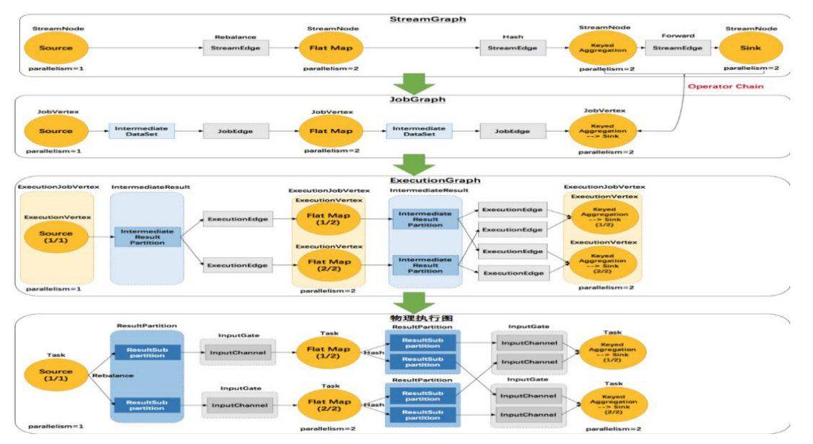

第一部分将先讲解四层转化的流程，然后将以详细案例讲解四层的具体转化。

- 第一层 StreamGraph 从 Source 节点开始，每一次 transform 生成一个 StreamNode， **两 个 StreamNode 通 过 StreamEdge 连 接 在 一 起 , 形 成 StreamNode 和 StreamEdge 构成的 DAG**。

- 第二层 JobGraph，依旧从 Source 节点开始，然后去遍历寻找能够嵌到一起的 operator，如果能够嵌到一起则嵌到一起，不能嵌到一起的单独生成 jobVertex，通过 JobEdge 链接上下游 JobVertex，最终形成 JobVertex 层面的 DAG。

- JobVertex DAG 提交到任务以后，从 Source 节点开始排序 , 根据 JobVertex 生 成 ExecutionJobVertex， 根 据 jobVertex 的 IntermediateDataSet 构建 **IntermediateResult，然后 IntermediateResult 构建上下游的依赖关系，形成 ExecutionJobVertex 层面的 DAG 即 ExecutionGraph**。

- 最后通过 ExecutionGraph 层到物理执行层。

### Program 到 StreamGraph 的转化

Program 转换成 StreamGraph 具体分为三步：

- 从 StreamExecutionEnvironment.execute 开始执行程序，将 transform 添加到 StreamExecutionEnvironment 的 transformations。

- 调用 StreamGraphGenerator 的 generateInternal 方法，遍历 transformations 构建 StreamNode 及 StreamEage。

- 通过 StreamEdge 连接 StreamNode。

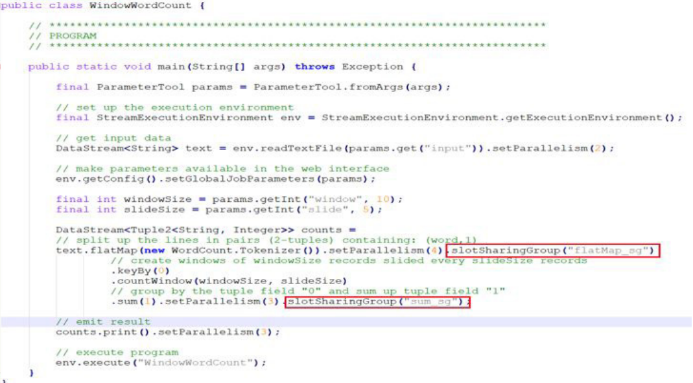

通过 WindowWordCount 来看代码到 StreamGraph 的转化，在 flatMap transform 设置 slot 共享组为 flatMapsg，并发设置为 4，**在聚合的操作中设置 slot 共享组为 sumsg**， sum() 和 counts() 并发设置为 3，这样设置主要是为了演示后面如何嵌到一起的，跟上下游节点的并发以及上游的共享组有关。

WindowWordCount 代码中可以看到，在 readTextFile() 中会生成一个 transform，且 transform 的 ID 是 1；然后到 flatMap() 会生成一个 transform， transform 的 ID 是 2；接着到 keyBy() 生成一个 transform 的 ID 是 3；再到 sum() 生成一个 transform 的 ID 是 4；最后到 counts() 生成 transform 的 ID 是 5。

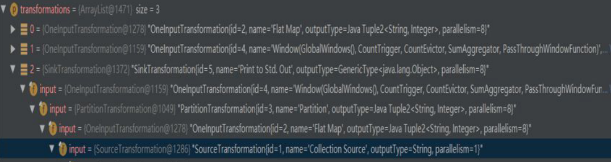

transform 的结构如图所示，第一个是 flatMap 的 transform，第二个是 window的 transform， 第 三 个 是 SinkTransform 的 transform。 除 此 之 外， 还 能 在 
transform 的结构中看到每个 transform 的 input 是什么。

接下来介绍一下 StreamNode 和 StreamEdge。

- StreamNode 是用来描述 operator 的逻辑节点，其关键成员变量有 slotSharingGroup、jobVertexClass、inEdges、outEdges 以 及 transformationUID。

- StreamEdge 是用来描述两个 operator 逻辑的链接边，其关键变量有 sourceVertex、targetVertex。

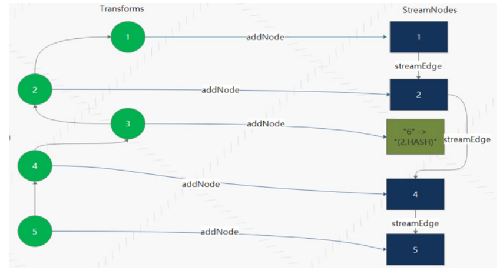

WindowWordCount transform 到 StreamGraph 转化如图所示，StreamExecutionEnvironment 的 transformations 存在 3 个 transform，分别是 Flat Map
（Id 2）、Window（Id 4）、Sink（Id 5）。

transform 的时候首先递归处理 transform 的 input，**生成 StreamNode，然后通过 StreamEdge 链接上下游 StreamNode。需要注意的是，有些 transform 操作并不会生成 StreamNode 如 PartitionTransformtion，而是生成个虚拟节点**。

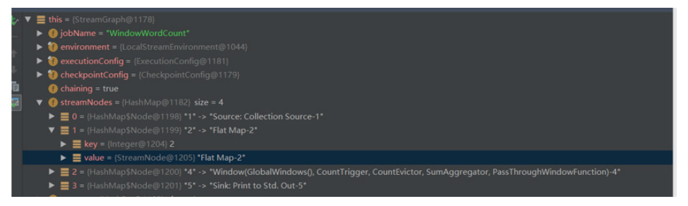

在转换完成后可以看到，streamNodes 有四种 transform 形式，分别为 Source、Flat Map、Window、Sink。

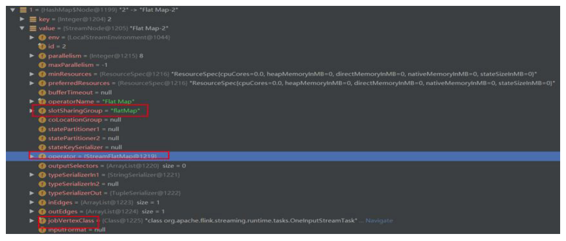

**每个 streamNode 对象都携带并发个数、slotSharingGroup、执行类等运行信息**。

### StreamGraph 到 JobGraph 的转化

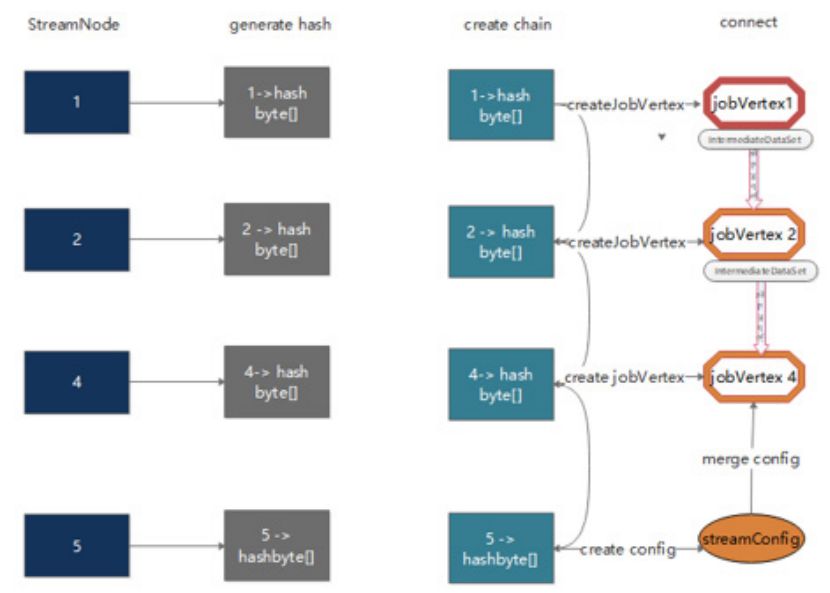

StreamGraph 到 JobGraph 的转化步骤：

- 设置调度模式，Eager 所有节点立即启动。

- 广度优先遍历 StreamGraph，**为每个 streamNode 生成 byte 数组类型的 hash 值**。

- 从 source 节点开始递归寻找嵌到一起的 operator，不能嵌到一起的节点单独生成 jobVertex，能够嵌到一起的开始节点生成 jobVertex，其他节点以序列化的形式写入到 StreamConfig，然后 merge 到 CHAINEDTASKCONFIG，再通过 JobEdge 链接上下游 JobVertex。

- 将每个 JobVertex 的入边 (StreamEdge) 序列化到该 StreamConfig。

- **根据 group name 为每个 JobVertext 指定 SlotSharingGroup**。

- 配置 checkpoint。

- 将缓存文件存文件的配置添加到 configuration 中。

- 设置 ExecutionConfig。

从 source 节点递归寻找嵌到一起的 operator 中，嵌到一起需要满足一定的条件，具体条件介绍如下：

- 下游节点只有一个输入。
- 下游节点的操作符不为 null。
- 上游节点的操作符不为 null。
- 上下游节点在一个槽位共享组内。
- 下游节点的连接策略是 ALWAYS。
- 上游节点的连接策略是 HEAD 或者 ALWAYS。
- edge 的分区函数是 ForwardPartitioner 的实例。
- 上下游节点的并行度相等。
- 可以进行节点连接操作。

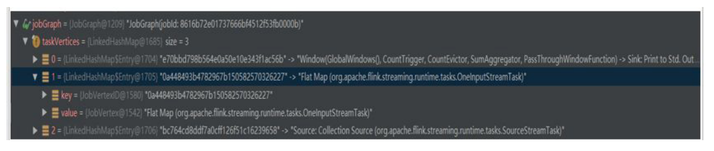

JobGraph 对象结构如上图所示，taskVertices 中只存在 Window、Flat Map、Source 三个 TaskVertex，**Sink operator 被嵌到 window operator 中去了**。

#### 为什么要为每个 operator 生成 hash 值？

Flink 任务失败的时候，**各个 operator 是能够从 checkpoint 中恢复到失败之前的状态的，恢复的时候是依据 JobVertexID（hash 值 )进行状态恢复的**。**相同的任务在恢复的时候要求 operator 的 hash 值不变，因此能够获取对应的状态**。

#### 每个 operator 是怎样生成 hash 值的？

如果用户对节点指定了一个散列值，**则基于用户指定的值能够产生一个长度为 16 的字节数组**。如果用户没有指定，**则根据当前节点所处的位置，产生一个散列值**。

> https://cloud.tencent.com/developer/article/2296239

考虑的因素主要有三点：

- 一是在当前 StreamNode 之前已经处理过的节点的个数，作为当前 StreamNode 的 id，添加到 hasher 中。

- 二 是 遍 历 当 前 StreamNode 输 出 的 每 个 StreamEdge， **并 判 断 当 前 StreamNode 与这个 StreamEdge 的目标 StreamNode 是否可以进行链接，如果可以，则将目标 StreamNode 的 id 也放入 hasher 中，且这个目标 StreamNode 的 id 与当前 StreamNode 的 id 取相同的值**；

- 三 是 将 上 述 步 骤 后 产 生 的 字 节 数 据， 与 当 前 StreamNode 的 所 有 输入StreamNode 对应的字节数据，进行相应的位操作，最终得到的字节据就是当前 StreamNode 对应的长度为 16 的字节数组。

### JobGraph 到 ExexcutionGraph 以及物理执行计划

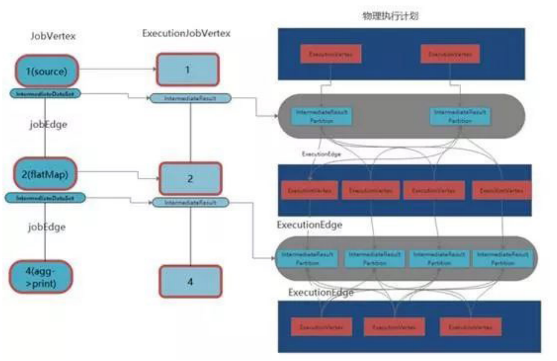

JobGraph 到 ExexcutionGraph 以及物理执行计划的流程：

- 将 JobGraph 里面的 jobVertex 从 Source 节点开始排序。

- 在 executionGraph.attachJobGraph(sortedTopology) 方 法 里 面，**根 据 JobVertex 生成 ExecutionJobVertex**，在 ExecutionJobVertex 构造方法里面，根据 jobVertex 的 IntermediateDataSet 构建 IntermediateResult，**根 据 jobVertex 并 发 构 建 ExecutionVertex**，ExecutionVertex 构 建 的 时候，构建 IntermediateResultPartition（每一个 Execution 构建 IntermediateResult 数个 IntermediateResultPartition ）；将创建的 ExecutionJobVertex 与置的 IntermediateResult 连接起来。

- 构建 ExecutionEdge ，连接到前面的 IntermediateResultPartition，最终从 ExecutionGraph 到物理执行计划。

## Flink Job 执行流程

### Flink On Yarn 模式

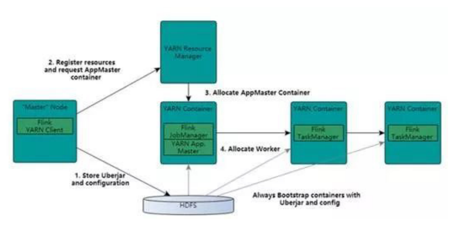

基于 Yarn 层面的架构类似 Spark on Yarn 模式，都是由 Client 提交 App 到 RM 上面去运行，然后 RM 分配第一个 container 去运行 AM，然后由 AM 去负责资源的监督和管理。需要说明的是，Flink 的 Yarn 模式更加类似 Spark on Yarn 的cluster 模式，在 cluster 模式中，dirver 将作为 AM 中的一个线程去运行。

Flink on Yarn 模 式 也 是 会 将 JobManager 启 动 在 container 里 面， 去 做个 driver 类 似 的 任 务 调 度 和 分 配，Yarn AM 与 Flink JobManager 在 同 一 个 Container 中，**这样 AM 可以知道 Flink JobManager 的地址，从而 AM 可以申请 Container 去启动 Flink TaskManager。待 Flink 成功运行在 Yarn 集群上，Flink Yarn Client 就可以提交 Flink Job 到 Flink JobManager，并进行后续的映射、调度和计算处理**。

### Fink on Yarn 的缺陷

- 资源分配是静态的，**一个作业需要在启动时获取所需的资源并且在它的生命周期里一直持有这些资源**。这导致了作业不能随负载变化而动态调整，在负载下降时无法归还空闲的资源，在负载上升时也无法动态扩展。

- On-Yarn 模式下，**所有的 container 都是固定大小的，导致无法根据作业需求来调整 container 的结构**。譬如 CPU 密集的作业或许需要更多的核，但不需要太多内存，固定结构的 container 会导致内存被浪费。

- 与容器管理基础设施的交互比较笨拙，需要两个步骤来启动 Flink 作业 : 
    1. 启动 Flink 守护进程。
    2. 提交作业。如果作业被容器化并且将作业部署作为容器部署的一部分，那么将不再需要步骤 2。

- On-Yarn 模式下，作业管理页面会在作业完成后消失不可访问。

- Flink 推荐 per job clusters 的部署方式，但是又支持可以在一个集群上运行多个作业的 session 模式，令人疑惑。

- 在 Flink 版本 1.5 中引入了 Dispatcher，Dispatcher 是在新设计里引入的一个新概念。Dispatcher 会从 Client 端接受作业提交请求并代表它在集群管理器上启动作业。

**引入 Dispatcher 的原因主要有两点：**

- 一些集群管理器需要一个中心化的作业生成和监控实例。
- 能够实现 Standalone 模式下 JobManager 的角色，且等待作业提交。在一些案例中，Dispatcher 是可选的 (Yarn) 或者不兼容的 (kubernetes)。

### 资源调度模型重构下的 Flink On Yarn 模式

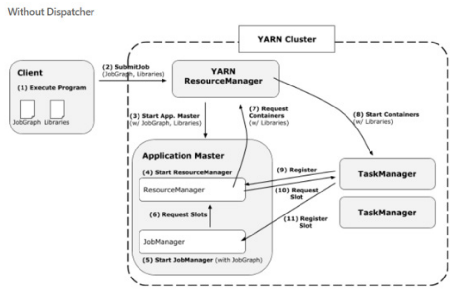

**没有 Dispatcher job 运行过程**

客 户 端 提 交 JobGraph 以 及 依 赖 jar 包 到 YarnResourceManager， 接着 Yarn ResourceManager 分 配 第 一 个 container 以 此 来 启 动 AppMaster，Application Master **中会启动一个 FlinkResourceManager 以及 JobManager，JobManager 会根据 JobGraph 生成的 ExecutionGraph 以及物理执行计划向 FlinkResourceManager 申 请 slot**，FlinkResoourceManager 会 管 理 这 些 slot 以及请求，如果没有可用 slot 就向 Yarn 的 ResourceManager 申请 container，container 启动以后会注册到 FlinkResourceManager，最后 JobManager 会将 subTask deploy 到对应 container 的 slot 中去。

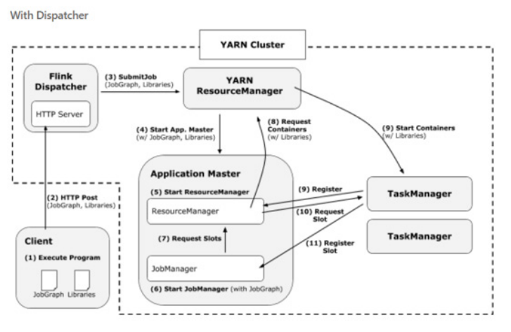

**在有 Dispatcher 的模式下**

会增加一个过程，就是 Client 会直接通过 HTTP Server 的方式，然后用 Dispatcher 将这个任务提交到 Yarn ResourceManager 中。

新框架具有四大优势，详情如下：

- client 直接在 Yarn 上启动作业，而不需要先启动一个集群然后再提交作业到集群。因此 client 再提交作业后可以马上返回。
- 所有的用户依赖库和配置文件都被直接放在应用的 classpath，而不是用动态的用户代码 classloader 去加载。
- container 在需要时才请求，不再使用时会被释放。
- “需要时申请”的 container 分配方式允许不同算子使用不同 profile (CPU 和内存结构 ) 的 container。

