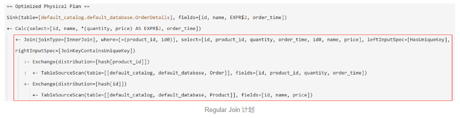
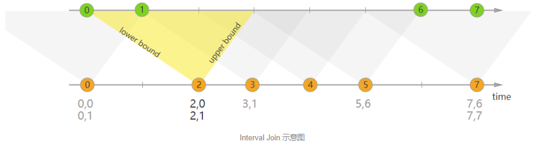
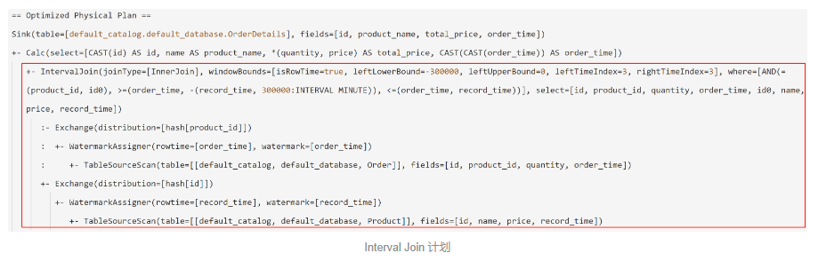
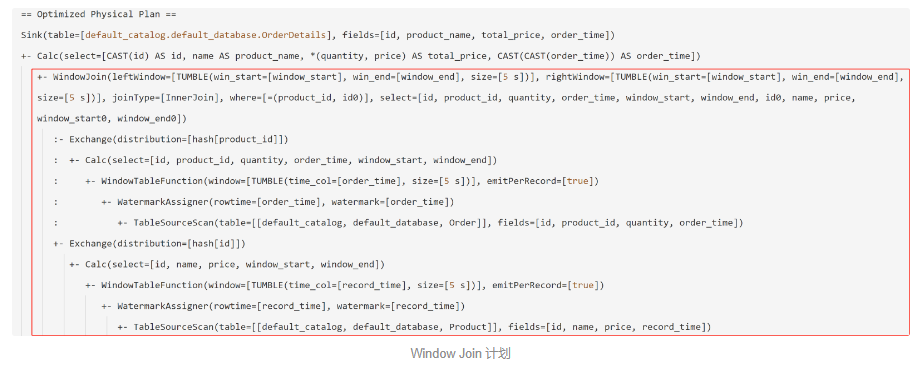
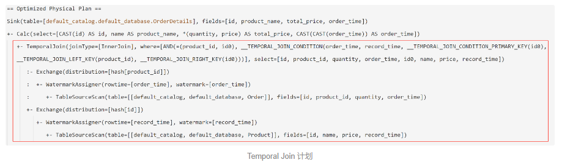
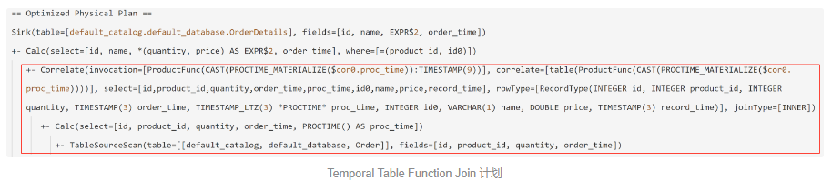

## 概述

Flink 作为流式数据处理框架的领跑者，在吞吐量、时延、准确型、容错性等方面都有优异的表现。在 API 方面，**它为用户提供了较底层的 DataStream API，也推出了 Table API 和 SQL 等编程接口。特别来看，SQL 以其易用、易迁移的特点，深受广大用户的欢迎**。

在常见的数据分析场景中，JOIN（关联）操作是一项很有挑战性的工作，**因为它涉及到左右两个表（流）的状态匹配，对内存的压力较大**；而相比恒定的批数据而言，流数据更加难以预测，例如数据*可能乱序、可能晚到，甚至可能丢失，**因此需要缓存的状态量更加庞大**，甚至会严重拖慢整体的数据处理进度*。由此可见，流的 JOIN 并没有一个全能且通用的方案，我们必须在 低时延 和 高精准 等维度间进行取舍。

考虑到不同业务场景的时效性、准确型要求不同，Flink 提供了多种流式的 JOIN 操作，用户可以根据实际情况选择最适合自己的类型。下面我们对它们逐一进行介绍。

## 常规 JOIN（Regular JOIN）

常规 JOIN（Regular JOIN）是语法最简单的一类 JOIN，和传统数据库的 JOIN 语法完全一致。**对于左表和右表的任何变动，都会触发实时计算和更新**，**因此它的结果是“逐步逼近”最终的精确值，也就是下游可能看到变来变去的结果。为了支持结果的更新，下游目的表需要 定义主键 （PRIMARY KEY NOT ENFORCED）**。

常规 JOIN 支持 INNER、LEFT、RIGHT 等多种 JOIN 类型。**其中 INNER JOIN 只会下发 Upsert 数据流（即只有更新和插入，没有删除操作）**，而 **LEFT 和 RIGHT JOIN 则会下发更多类型的 Changelog 数据流（包含了插入、更新、删除等各种类型）**。对于各类数据流的区别和转化，请参见 [Flink 官方文档：动态表](https://nightlies.apache.org/flink/flink-docs-master/zh/docs/dev/table/concepts/dynamic_tables/)。

**常规 JOIN 运行时需要保留左表和右表的状态，且随着时间的推移，状态会无限增长，最终可能导致作业 OOM 崩溃或异常缓慢**。因此我们强烈建议用户在 Flink 参数中设置 ```table.exec.state.ttl``` 选项，它可以指定 JOIN 状态的保留时间，以便 Flink 及时清理过期的状态。设置ttl以后，如果是inner join,那么状态更新的策略是oncreateandwrite,如果是left join,那么状态更新的策略是oncreateandread,也就是读了左边的状态那么就会重制时间。

下面是一个使用常规 JOIN 的示例作业：

```sql
CREATE TABLE `Order`
(
    id         INT,
    product_id INT,
    quantity   INT,
    order_time TIMESTAMP,
    PRIMARY KEY (id) NOT ENFORCED
) WITH (
      'connector' = 'datagen',
      'fields.id.kind' = 'sequence',
      'fields.id.start' = '1',
      'fields.id.end' = '100000',
      'fields.product_id.min' = '1',
      'fields.product_id.max' = '100',
      'rows-per-second' = '1'
);

CREATE TABLE `Product`
(
    id    INT,
    name  VARCHAR,
    price DOUBLE,
    PRIMARY KEY (id) NOT ENFORCED
) WITH (
      'connector' = 'datagen',
      'fields.id.min' = '1',
      'fields.id.max' = '100',
      'rows-per-second' = '1'
);

CREATE TABLE `OrderDetails`
(
    id           INT,
    product_name VARCHAR,
    total_price  DOUBLE,
    order_time   TIMESTAMP,
    PRIMARY KEY (id) NOT ENFORCED
) WITH (
      'connector' = 'print'
);

INSERT INTO `OrderDetails`
SELECT o.id, p.name, o.quantity * p.price, o.order_time
FROM `Order` o
INNER JOIN
`Product` p
ON o.product_id = p.id;
```

我们来看一下这个 SQL 作业生成的物理计划（红框标明的是 JOIN 部分）：



可以看到，我们的双表 Regular JOIN 语句最终生成了 Join 算子，它从两个数据源里获取数据，且数据根据我们的 JOIN 键来进行哈希分配。

在该 Flink 作业的运行时，实际执行 JOIN 逻辑的是 ```org.apache.flink.table.runtime.operators.join.stream.StreamingJoinOperator```。从类定义上来看，它属于 ```TwoInputStreamOperator```，即接收两个数据输入的算子。左右两表的状态保存在两个类型为 ```JoinRecordStateView``` 实例变量（leftRecordStateView、rightRecordStateView），而具体的关联逻辑在它的 processElement 方法中。由于源码注释非常清晰，这里就不再赘述，感兴趣的小伙伴可以阅读 [StreamingJoinOperator](https://github.com/apache/flink/blob/master/flink-table/flink-table-runtime/src/main/java/org/apache/flink/table/runtime/operators/join/stream/StreamingJoinOperator.java) 的源码。


## 时间区间 JOIN（Interval JOIN）

时间区间 JOIN 是另一种关联策略，它与上述的常规 JOIN 不同之处在于，**左右表仅在某个时间范围（给定上界和下界）内进行关联**，且**只支持普通 Append 数据流，不支持含 Retract 的动态表**。如下图（[来自 Flink 官方文档](https://nightlies.apache.org/flink/flink-docs-master/docs/dev/datastream/operators/joining/)）。**它的好处是由于给定了关联的区间，因此只需要保留很少的状态，内存压力较小。但是缺点是如果关联的数据晚到或者早到，导致落不到 JOIN 区间内，就可能导致结果不准确**。此外，只有当区间过了以后，JOIN 结果才会输出，因此会有一定的延迟存在。



我们同样来构造一个时间区间 JOIN 的示例作业：

```sql
CREATE TABLE `Order`
(
    id         INT,
    product_id INT,
    quantity   INT,
    order_time TIMESTAMP(3),
    WATERMARK FOR order_time AS order_time,
    PRIMARY KEY (id) NOT ENFORCED
) WITH (
      'connector' = 'datagen',
      'fields.id.kind' = 'sequence',
      'fields.id.start' = '1',
      'fields.id.end' = '100000',
      'fields.product_id.min' = '1',
      'fields.product_id.max' = '100',
      'rows-per-second' = '1'
);

CREATE TABLE `Product`
(
    id          INT,
    name        VARCHAR,
    price       DOUBLE,
    record_time TIMESTAMP(3),
    WATERMARK FOR record_time AS record_time,
    PRIMARY KEY (id) NOT ENFORCED
) WITH (
      'connector' = 'datagen',
      'fields.id.min' = '1',
      'fields.id.max' = '100',
      'rows-per-second' = '1'
);

CREATE TABLE `OrderDetails`
(
    id           INT,
    product_name VARCHAR,
    total_price  DOUBLE,
    order_time   TIMESTAMP
) WITH (
      'connector' = 'print'
);

INSERT INTO `OrderDetails`
SELECT o.id, p.name, o.quantity * p.price, o.order_time
FROM `Order` o,
     `Product` p
WHERE o.product_id = p.id
  AND o.order_time BETWEEN p.record_time - INTERVAL '5' MINUTE AND p.record_time;
```

可以看到，时间区间 JOIN 是在 SQL 的 ```WHERE``` 条件里限定了关联的时间区间，**因此要求输入的两个表都必须有 时间戳字段 且将该时间戳字段用作 WATERMARK FOR 语句指定的时间字段**。如果表实在没有时间戳字段，则可以使用 ```PROCTIME()``` 函数来生成一个处理时间戳。

> 特别注意：请不要直接使用未定义 WATERMARK 或 PROCTIME() 的原始 TIMESTAMP 类型字段，否则可能会退回到上述的 “常规 JOIN”。

它的语法树、优化后的物理计划，以及最终执行计划（红框标明的是 JOIN 部分）如下，可以看到算子已经由之前的 **Join 变成了 IntervalJoin:**



在运行时，Flink 会调用  ```org.apache.flink.table.runtime.operators.join.interval.TimeIntervalJoin``` 执行具体的关联操作，具体的 JOIN 逻辑在 ```org.apache.flink.table.runtime.operators.join.interval.IntervalJoinFunction```。同样地，我们可以阅读 [IntervalJoinFunction ](https://github.com/apache/flink/tree/master/flink-table/flink-table-runtime/src/main/java/org/apache/flink/table/runtime/operators/join/interval)的源码来查看它的细节。

## 窗口 JOIN

窗口 JOIN 也是用法非常简单的一种 JOIN 类型。**它以窗口为界，对窗口里面的左表、右表数据进行关联操作**。由于 Flink **支持滑动**（TUMBLE）、**滚动**（HOP 也叫做 SLIDING）、**会话**（SESSION）等不同窗口类型，因此可以根据业务需求进行选择。

窗口 JOIN 不强制要求左右表必须包含时间戳字段，**但是如果您使用时间相关窗口的话，也需要提供相关的时间戳来划分窗口**。

和上述 时间区间 JOIN 类似，窗口 JOIN 的输出也是最终值，**也就是说不会出现 常规 JOIN 那样不断变动的结果**。但是缺点也一样，**它只能在窗口结束后输出关联结果，且对于早到或者晚到等不在窗口内的数据是无法参与计算的，因此实时性和准确性方面都相对较差**。

下面是窗口 JOIN 的一个示例程序：

```sql
CREATE TABLE `Order`
(
    id         INT,
    product_id INT,
    quantity   INT,
    order_time TIMESTAMP(3),
    PRIMARY KEY (id) NOT ENFORCED,
    WATERMARK FOR order_time AS order_time
) WITH (
      'connector' = 'datagen',
      'fields.id.kind' = 'sequence',
      'fields.id.start' = '1',
      'fields.id.end' = '100000',
      'fields.product_id.min' = '1',
      'fields.product_id.max' = '100',
      'rows-per-second' = '1'
);

CREATE TABLE `Product`
(
    id          INT,
    name        VARCHAR,
    price       DOUBLE,
    record_time TIMESTAMP(3),
    PRIMARY KEY (id) NOT ENFORCED,
    WATERMARK FOR record_time AS record_time
) WITH (
      'connector' = 'datagen',
      'fields.id.min' = '1',
      'fields.id.max' = '100',
      'rows-per-second' = '1'
);

CREATE TABLE `OrderDetails`
(
    id           INT,
    product_name VARCHAR,
    total_price  DOUBLE,
    order_time   TIMESTAMP,
    PRIMARY KEY (id) NOT ENFORCED
) WITH (
      'connector' = 'print'
);

INSERT INTO `OrderDetails`
SELECT o.id, p.name, o.quantity * p.price, o.order_time
FROM ( SELECT * FROM TABLE(TUMBLE(TABLE `Order`, DESCRIPTOR(order_time), INTERVAL '5' SECOND))) AS o,
     ( SELECT * FROM TABLE(TUMBLE(TABLE `Product`, DESCRIPTOR(record_time), INTERVAL '5' SECOND))) AS p
WHERE o.product_id = p.id AND o.window_start = p.window_start AND o.window_end = p.window_end;
```

下面是它的物理计划，可以看到它的算子已经变成了 **WindowJoin**：



在运行时，Flink 调用的是 org.apache.flink.table.runtime.operators.join.window.WindowJoinOperator。点击阅读 [WindowJoinOperator](https://github.com/apache/flink/blob/master/flink-table/flink-table-runtime/src/main/java/org/apache/flink/table/runtime/operators/join/window/WindowJoinOperator.java) 的源码。

## 时态表 JOIN（Temporal JOIN）

时态表 JOIN 是一类特殊的关联操作：**本文前半部分介绍的各种 JOIN 类型都是基于最新的数据进行关联，而 时态表 JOIN 则可以根据左表记录中的时间戳，在右表的历史版本中进行查询和关联**。例如我们的**商品价格表会随时间不断变动**，左表来了一条时间戳为 10:00 的订单记录，**那么它会对右表在 10:00 的商品价格快照（当时的价格）进行关联并输出结果**；如果随后左表来了一条 10:30 的订单记录，那么它会对右表在 10:30 时的商品价格进行后续的关联。**这种特性对于统计不断变动的时序数据非常有用**。

时态表 JOIN 分为 **事件时间（Event Time）** 和 **处理时间（Processing Time）** 两种类型，且只支持 ```INNER``` 和 ```LEFT JOIN```。由于**基于处理时间的时态表 JOIN 存在 Bug**（参见 [FLINK-19830](https://issues.apache.org/jira/browse/FLINK-19830)），因此在最新的 Flink 版本中已被禁用。**我们这里主要介绍基于事件时间的时态表 JOIN**。

由于时态表 JOIN 需要**得知不同时刻下右表的不同版本**，因此它的右表必须是 Changelog [动态表](https://nightlies.apache.org/flink/flink-docs-master/zh/docs/dev/table/concepts/dynamic_tables/)（**即 Upsert、Retract 数据流，而非 Append 数据流**），且两侧的源表都必须定义 ```WATERMARK FOR```。随着 Watermark 水位推进，**Flink 可以逐步清理失效的数据**，因此时态表 JOIN 的内存压力相对也不大。此外，**还要求时态表的主键必须包含在 JOIN 等值条件中**。

下面是时态表 JOIN 的一个 SQL 示例程序，它的语法特点是 ```FOR SYSTEM_TIME AS OF``` 语句：

```sql
CREATE TABLE `Order`
(
    id         INT,
    product_id INT,
    quantity   INT,
    order_time TIMESTAMP(3),
    PRIMARY KEY (id) NOT ENFORCED,
    WATERMARK FOR order_time AS order_time
) WITH (
      'connector' = 'datagen',
      'fields.id.kind' = 'sequence',
      'fields.id.start' = '1',
      'fields.id.end' = '100000',
      'fields.product_id.min' = '1',
      'fields.product_id.max' = '100',
      'rows-per-second' = '1'
);

CREATE TABLE `Product`
(
    id          INT,
    name        VARCHAR,
    price       DOUBLE,
    record_time TIMESTAMP(3),
    PRIMARY KEY (id) NOT ENFORCED,
    WATERMARK FOR record_time AS record_time
) WITH (
      'connector' = 'datagen',
      'fields.id.min' = '1',
      'fields.id.max' = '100',
      'rows-per-second' = '1'
);

CREATE TABLE `OrderDetails`
(
    id           INT,
    product_name VARCHAR,
    total_price  DOUBLE,
    order_time   TIMESTAMP,
    PRIMARY KEY (id) NOT ENFORCED
) WITH (
      'connector' = 'print'
);

INSERT INTO `OrderDetails`
SELECT o.id, p.name, o.quantity * p.price, o.order_time
FROM `Order` o
         JOIN `Product` FOR SYSTEM_TIME AS OF o.order_time p
              ON o.product_id = p.id;
```

它的物理计划如下，可以看到生成的是 TemporalJoin 算子：



我们照例看一下运行时，Flink 调用的是 ```org.apache.flink.table.runtime.operators.join.temporal.TemporalRowTimeJoinOperator```。通过阅读 [TemporalRowTimeJoinOperator](https://github.com/apache/flink/blob/master/flink-table/flink-table-runtime/src/main/java/org/apache/flink/table/runtime/operators/join/temporal/TemporalRowTimeJoinOperator.java) 的源码，可以了解更多详情。

## 时态表函数 JOIN（Temporal Table Function JOIN）

Flink 很早就支持一种名为 **时态表函数 JOIN 的关联操作**，它允许用户对一个自定义表函数 [UDTF](https://nightlies.apache.org/flink/flink-docs-master/zh/docs/dev/table/functions/udfs/) 执行关联操作。换句话说，**UDTF 可以返回一张虚拟表，它可以是从外部系统实时查到的，也可以是动态生成的，非常灵活**。在没有上述各种复杂 JOIN 的上古年代，这是为数不多表关联方法。**它只支持 Append 流，且总是保留左右表的关联状态，因此存在一定的内存压力**。

下面是一个时态表函数 JOIN 的示例 SQL：

```sql
CREATE TEMPORARY SYSTEM FUNCTION ProductFunc
AS 'com.tencent.cloud.test.ProductFunc' LANGUAGE JAVA;

CREATE TABLE `Order`
(
    id         INT,
    product_id INT,
    quantity   INT,
    order_time TIMESTAMP(3),
    proc_time AS PROCTIME(),
    PRIMARY KEY (id) NOT ENFORCED
) WITH (
      'connector' = 'datagen',
      'fields.id.kind' = 'sequence',
      'fields.id.start' = '1',
      'fields.id.end' = '100000',
      'fields.product_id.min' = '1',
      'fields.product_id.max' = '100',
      'rows-per-second' = '1'
);

CREATE TABLE `OrderDetails`
(
    id           INT,
    product_name VARCHAR,
    total_price  DOUBLE,
    order_time   TIMESTAMP(3),
    PRIMARY KEY (id) NOT ENFORCED
) WITH (
      'connector' = 'print'
);

INSERT INTO `OrderDetails`
SELECT o.id, p.name, o.quantity * p.price, o.order_time
FROM `Order` o,
     LATERAL TABLE(`ProductFunc`(o.proc_time)) p
WHERE o.product_id = p.id;
```

其中的表函数  ```ProductFunc``` 的定义如下：

```java
package com.tencent.cloud.test;

import org.apache.flink.table.annotation.DataTypeHint;
import org.apache.flink.table.annotation.FunctionHint;
import org.apache.flink.table.functions.TableFunction;
import org.apache.flink.types.Row;

import java.sql.Timestamp;

@FunctionHint(output = @DataTypeHint("ROW<id INT, name VARCHAR, price DOUBLE, record_time TIMESTAMP(3)>"))
public class ProductFunc extends TableFunction<Row> {
	public void eval(Timestamp t) {
		Row data = new Row(4);
		data.setField(0, 1);	// 可自行模拟数据
		data.setField(1, "name");
		data.setField(2, 1.0);
		data.setField(3, t.toLocalDateTime());
		collect(data);
	}
}
```

下面是它的物理计划，可以看到被翻译成了 Correlate 算子，和上面其他 JOIN 类型的算子都不一样：



而在运行时，Flink 调用的是 ```org.apache.flink.table.planner.plan.nodes.exec.stream.StreamExecCorrelate```。同样地，我们可以阅读 [StreamExecCorrelate](https://github.com/apache/flink/blob/master/flink-table/flink-table-planner/src/main/java/org/apache/flink/table/planner/plan/nodes/exec/stream/StreamExecCorrelate.java) 的源码。

需要注意的是，在处理时间（Processing Time）模式下， [FLINK-19830](https://issues.apache.org/jira/browse/FLINK-19830) 提到的 Bug 仍然存在，只是考虑到历史兼容性，Flink 没有禁止在 时态表函数 JOIN 使用该模式。**然而，数据不准确的问题仍然会出现，因此要多多留意**。

## 总结

本文**简述了目前 Flink SQL 所有可用的 JOIN 类型**，说明了他们各自的应用场景，并提供了示例 SQL 和执行计划，以及运行时 Flink 调用的相关类。可以看到，Flink 在 JOIN 方面提供了丰富的工具箱，满足了大多数场景下的 JOIN 逻辑。

下表是本文提到的各类 JOIN 的总结：


| JOIN类型         | 实时性  | 准确度               | 支持的时间戳类型       |
|------------------|--------|----------------------|------------------------|
| 常规 JOIN       | 高     | 先低后高（逐步更新）| 事件时间、处理时间     |
| 时间区间 JOIN   | 中     | 中（取决于区间大小） | 事件时间、处理时间     |
| 窗口 JOIN       | 低     | 低（取决于窗口大小和类型） | 事件时间、处理时间 |
| 时态表 JOIN （比如商品价格会更新的情况，价格变动还想得到历史价格信息）    | 中     | 高（取决于具体实现） | 事件时间               |
| 时态表函数 JOIN | 中     | 高（取决于具体实现） | 事件时间、处理时间（但有 Bug） |


如果确实有业务场景不适合 SQL 描述，Flink 还提供了 [DataStream API](https://nightlies.apache.org/flink/flink-docs-release-1.14/zh/docs/dev/datastream/operators/joining/) 来实现更灵活的关联操作。例如通过 [异步算子](https://nightlies.apache.org/flink/flink-docs-release-1.14/zh/docs/dev/datastream/operators/asyncio/) 和 [状态缓存](https://nightlies.apache.org/flink/flink-docs-release-1.14/zh/docs/dev/datastream/fault-tolerance/state/)，我们可以设计出高性能、低时延的关联逻辑。我们会在后续的文章中逐步讲解如何应对这些高要求的 JOIN 场景。

> https://cloud.tencent.com/developer/article/1961354