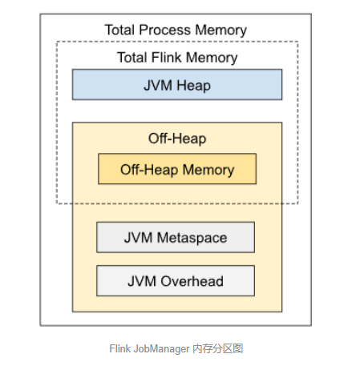

## 内存图


JobManager 的内存划分显得相当简单：**只有 JVM 进程总内存、Flink 总内存、堆内存、堆外内存、JVM 元空间、JVM 运行时开销，不再区分框架区和用户区，也没有托管内存、网络缓存**等其他区域。

> 但这并不意味着 JobManager 的内存更好管理；相反，这表示 Flink 社区对 JobManager 内存控制的还很粗粒度，因此出问题时更隐蔽，更难定位，因此一定要特别重视。

## JVM 进程总内存（Total Process Memory）

### 配置参数

```
jobmanager.memory.process.size
```

该区域表示整个 JVM 进程的内存用量，包括了下面要介绍的所有内存区域。**它通常用于设定容器环境（YARN、Kubernetes）的资源配额**。例如我们设置 Flink 参数 jobmanager.memory.process.size 为 4G，那么，**如果 JVM 不慎用超了物理内存（RSS、RES 等），就会面临被强制结束（SIGKILL，相当于 kill -9）的结果**。

由于 JobManager 肩负着协调整个作业的重任，还负责与 ZooKeeper 等 HA 服务通讯，如果因为资源超用而被直接中止，后果比 TaskManager 更严重：例如之前的最新快照还没来得及确认，新启动的 JobManager 找不到可用的快照信息，可能造成数据丢失或重复计算的后果。

因此在 有硬性资源配额检查 的容器环境下，请对作业充分压测后，妥善设置该参数，尽可能预留相当多的安全余量。

## Flink 总内存（Total Flink Memory）

### 配置参数

```
jobmanager.memory.flink.size
```

Flink 总内存指的是 JobManager 可以感知并管理的内存区域，即上述**提到的 JVM 进程总内存 再减去 Flink 无法控制的 Metaspace（元空间）和 Overhead（运行时开销）两区域**。

我们可以使用 ```jobmanager.memory.flink.size```参数来控制 Flink 总内存的阈值，对于非容器环境（例如 Standalone 等部署模式），可以设置这个参数来让 Flink 自行计算各个子内存区域的大小。

在实际业务场景中，我们建议 JobManager 的 Flink 总内存不低于 1.5G，以保证作业的稳定性。

## JVM 堆内存（JVM Heap Memory）

对于 JobManager 而言，堆内存（JVM 通过 -Xmx 和 -Xms 参数控制的、可供垃圾回收的内存区域）有如下用途：

1. Flink 框架自身的开销，**例如 RPC 通讯、Web UI 缓存、高可用相关的线程等**。
2. **各类新版 Connector 的 SplitEnumerator，用于动态感知和划分数据源的分片**。
3. Session 或 Application 等部署模式下，用户提交作业时，执行用户程序代码，也可能有内存分配。
4. Checkpoint 回调函数中的用户代码（CheckpointListener），用于通知快照完成或失败事件，或执行用户自定义逻辑。

堆内存大小的配置参数是 ```jobmanager.memory.heap.size```。需要特别注意的是，如果配置了该参数，请不要再配置上述提到的 JVM 进程总内存 或  Flink 总内存 参数，以免配置无效。

> 在生产环境，经常遇到客户需要通过 MySQL CDC Connector 来访问非常大的表（十亿条数据），**而 Flink CDC 默认的分块（chunk）大小是 8096. 这样 SplitEnumerator 就可能产生数十万个分片，导致 JobManager 内存耗尽**。

**针对这个场景，最简单的方法是调大 CREATE TABLE 语句的 WITH 参数中 ```scan.incremental.snapshot.chunk.size``` 的值，例如调大 100000，这样每个分片变大了，总分片数就会大幅减少，JobManager 的堆内存压力也会随之得到释放。但是，当分片变大时，TaskManager 的处理压力又会随之上升，因此 TaskManager 会变的更容易发生 OOM，按下葫芦浮起瓢**。

除了 Connector 对 JobManager 造成堆内存压力外，当用户提交 Flink 作业时，如果有额外的长期线程创建（例如通过 Curator 协调多个作业的数据处理范围），也可能导致提交时的 Classloader 所关联的内存对象无法被回收，最终造成内存泄漏。

## JVM 堆外内存（JVM Off-Heap Memory）

**JobManager 的堆外内存用量通常不大**，通常分为 JVM 管理的直接（Direct）内存以及通过 UNSAFE.allocateMemory 分配的原生（Native）内存块。

堆外内存的配置参数为 ```jobmanager.memory.off-heap.size```，默认是 128M，**但只是君子协定，用于计算堆内存大小时的扣除量，并不能限制超用**。但如果额外配置 ```jobmanager.memory.enable-jvm-direct-memory-limit``` 为 true，则 Flink 会通过 -XX:MaxDirectMemorySize 来严格限制 Direct 区的内存用量。一旦真的超用，会立刻抛出 OutOfMemoryError: Direct buffer memory 异常。

Flink 方面，堆外内存的用户主要有 Flink Akka 框架通讯，以及用户提交作业时代码（通常很少见），或者 Checkpoint 回调函数中的用户代码（通常也很少见）。

**正常情况下，堆外内存出问题的情况非常少。但如果堆内常常出现 OOM 却又找不到原因时，可以尝试启用上述的 limit 限制**（仍然有局限性，参见 [6]，来判断是否是因为 Direct 区的无限增长，导致的堆内存空间被挤压。


## JVM 元空间（JVM Metaspace）

JVM Metaspace 主要保存了加载的类和方法的元数据，Flink 配置参数为 ```jobmanager.memory.jvm-metaspace.size```，默认大小为 256M. 

**通常无需调整它，除非用户提交 Flink 作业时，用了大量的动态类生成和加载的 “魔法”**，造成 JVM 报出 OutOfMemoryError: Metaspace

## JVM 运行时开销（JVM Overhead）

除了上文描述的堆内、堆外、元空间外，JVM 自身运行时也会有一些内存开销，用来存放代码缓存等。**Flink 的配置参数为 ```jobmanager.memory.jvm-overhead.fraction```，默认为 0.1 即 10% 的 JVM 进程总内存**；同时也受最小阈值（参数为 jobmanager.memory.jvm-overhead.min，默认 192M）和最大阈值（参数为 jobmanager.memory.jvm-overhead.max，默认 1G）的限制。

**如果提交 Flink 作业时，有通过 JNI 调用 C/C++ 相关类库，那么也有可能用到这部分内存空间**。该区域的内存泄漏定位起来较为繁杂，可能需要例如 jemalloc [7] 和 jeprof [8] 等辅助，这里不再赘述。感兴趣的读者可以阅读我之前写的 Flink 常见问题定位指南 [9] 文章。


> https://cloud.tencent.com/developer/article/2026134
