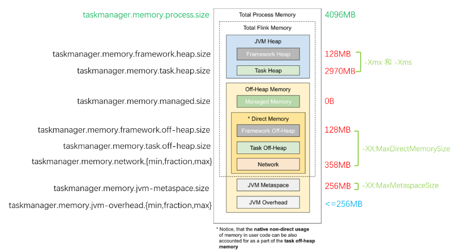
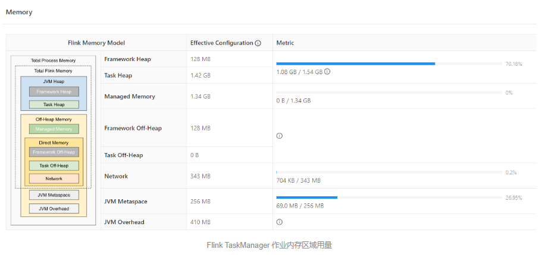

## 内存图



## JVM 进程总内存（Total Process Memory）

### 配置参数

```
taskmanager.memory.process.size
```

该区域表示在容器环境下，**TaskManager 所在 JVM 的最大可用的内存配额，包含了本文后续介绍的所有内存区域，超用时可能被强制结束进程**。我们可以通过 ```taskmanager.memory.process.size``` 参数控制它的大小。对于 YARN，如果 yarn.nodemanager.pmem-check-enabled 设为 true, 则也会在运行时定期检查容器内的进程是否超用内存。


## Flink 总内存（Total Flink Memory）

### 配置参数

```
taskmanager.memory.flink.size
```

**该内存区域指的是 Flink 可以控制的内存区域，即上述提到的 JVM 进程总内存 减去 Flink 无法控制的 Metaspace（元空间）和 Overhead（运行时开销）区域**。Flink 随后又把这部分内存区域划分为堆内、堆外（Direct）、堆外（Managed）等不同子区域，然后 Flink 自己也会会自动根据参数，计算得到各个子区域的配额。如果作业运行正常，则无需单独调整。

例如 4G 的 进程总内存 配置下，JVM 运行时开销（Overhead）占 进程总内存 的 10% 但最多 1G（下图是 409.6M），元空间（Metaspace）占 256M；堆外直接（Direct）内存网络缓存占 Flink 总内存 的 10% 但最多 1G（下图是 343M），框架堆和框架堆外各占 128M，**堆外管控（Managed）内存占 Flink 总内存 的 40%（下图是 1372M 即 1.34G），其他空间留给任务堆，即用户程序代码可以使用的内存空间（1459M 即 1.42G）**。



## JVM 堆内存（JVM Heap Memory）

### 配置参数

```
taskmanager.memory.framework.heap.size

taskmanager.memory.task.heap.size
```

**它是由 JVM 提供给用户程序运行的内存区域**，JVM 会按需运行 GC（垃圾回收器），协助清理失效对象。Flink 将堆内存从逻辑上划分为 ”框架堆“、”任务堆“ 两个子区域，分别通过 ```taskmanager.memory.framework.heap.size``` 和 ```taskmanager.memory.task.heap.size``` 来指定其大小：框架堆默认是 128m，任务堆如果未显式设置其大小，则会通过扣减其他区域配额来计算得到。例如对于 4G 的进程总内存，扣除了其他区域后，任务堆可用的只有不到 1.5G。

> 因此对于堆内存的监控是必须要配置的，当堆内存用量超过一定比率，或者 Full GC 时长和次数明显增长时，需要尽快介入并考虑扩容。

## JVM 堆外内存（JVM Off-Heap Memory）

广义上的 堆外内存 指的是 JVM 堆之外的内存空间，而我们这里特指 JVM 进程总内存除了元空间（Metaspace）和运行时开销（Overhead）以外的内存区域。因为上述两个区域是 JVM 自行管理，Flink 无法介入，我们后面单独划分和讲解。

### 配置参数

**Managed Memory**

```
taskmanager.memory.managed.fraction

taskmanager.memory.managed.size
```

### 托管内存（Managed Memory）


文章开头的总览图中，把托管内存区域设为 0，此时任务堆空间约 3G；而使用 Flink 默认配置时，任务堆只有 1.5G。这是因为默认情况下，托管内存占了 40% 的 Flink 总内存，导致堆内存可用的量变的相当少。因此我们非常有必要了解什么是托管内存。

从官方文档和 Flink 源码上来看，托管内存主要有三大使用场景：

1. 批处理算法，例如排序、HashJoin 等。他们会从 Flink 的 MemoryManager 请求内存片段（MemorySegment），而 MemoryManager 则会调用 UNSAFE.allocateMemory 分配堆外内存。
2. **RocksDB StateBackend**，Flink 只会预留一部分空间并扣除预算，但是不介入实际内存分配。因此该类型的内存资源被称为 OpaqueMemoryResource. 实际的内存分配还是由 JNI 调用的 RocksDB 自己通过 malloc 函数申请。
3. PyFlink。与 JNI 类似，在与 Python 进程交互的过程中，也会用到一部分托管内存。

显然，对于普通的流式 SQL 作业，如果启用了 RocksDB 状态后端时，才会大量使用托管内存。因此如果您的业务场景并未用到 RocksDB，那么可以调小托管内存的相对比例（```taskmanager.memory.managed.fraction```）或绝对大小（```taskmanager.memory.managed.size```），以增大任务堆的空间。

对于 RocksDB 作业，之所以分配了 40% Flink 总内存，是因为 RocksDB 的内存用量实在是一个很头疼的问题。早在 2017 年，就有 FLINK-7289: Memory allocation of RocksDB can be problematic in container environments 6 这个问题单，随后社区对此做了大量的工作（通过 LRUCache 参数、增强 WriteBufferManager 的 Slot 内空间复用等），来尽可能地限制 RocksDB 的总内存用量。在我之前的 Flink on RocksDB 参数调优指南 7 文章中，也有提到 RocksDB 内存调优的各项参数，**其中 MemTable、Block Cache 都是托管内存空间的用量大户**。

为了避免手动调优的繁杂，Flink 新版内存管理默认将 ```state.backend.rocksdb.memory.managed``` 参数设为 true，**这样就由 Flink 来计算 RocksDB 各部分需要用多少内存**，这也是 ”托管“ 的含义所在。如果仍然希望精细化手动调整 RocksDB 参数，则需要将上述参数设为 false。

### 直接内存（Direct Memory）

直接内存是 JVM 堆外的一类内存，它提供了相对安全可控但又不受 GC 影响的空间，JVM 参数是 -XX:MaxDirectMemorySize. 它主要用于

1. 框架自身（taskmanager.memory.framework.off-heap.size 参数，默认 128M，例如 Sort-Merge Shuffle 算法所需的内存）。
2. 用户任务（taskmanager.memory.task.off-heap.size 参数，默认设为 0）。
3. Netty 对 Network Buffer 的网络传输（taskmanager.memory.network.fraction 等参数，默认 0.1 即 10% 的 Flink 总内存）。

在生产环境中，如果作业并行度非常大（例如大于 500 甚至 1000），则需要调大 ```taskmanager.network.memory.floating-buffers-per-gate``` 和 ```taskmanager.network.memory.max-buffers-per-channel```（例如从 8 调整到 1000）和 ```taskmanager.network.memory.buffers-per-channel```（例如从 2 调整到 500），避免 Network Buffer 不足导致作业报错。

相关文章
> https://nightlies.apache.org/flink/flink-docs-master/docs/deployment/memory/network_mem_tuning/

## JVM 元空间（JVM Metaspace）

**JVM Metaspace 主要保存了加载的类和方法的元数据**，Flink 配置的参数是 ```taskmanager.memory.jvm-metaspace.size```，默认大小为 256M，JVM 参数是 -XX:MaxMetaspaceSize,如果用户编写的 Flink 程序中，有大量的动态类加载的需求，**动态编译并加载了 44 万个类，此时就容易出现元空间用量远超预期，发生 OOM 报错**。此时就需要适当调大元空间的大小，或者优化用户程序，及时卸载无用的 Classloader。

## JVM 运行时开销（JVM Overhead）

除了上述描述的内存区域外，JVM 自己还有一小块 ”自留地“，**用来存放线程栈、编译的代码缓存、JNI 调用的库所分配的内存等等**，Flink 配置参数是 ```taskmanager.memory.jvm-overhead.fraction```，默认是 JVM 总内存的 10%。

对于旧版本（1.9 及之前）的 Flink，RocksDB 通过 malloc 分配的内存也属于 Overhead 部分，而新版 Flink 把这部分归类到托管内存（Managed），但由于 FLINK-15532 Enable strict capacity limit for memory usage for RocksDB 9 问题仍未解决，RocksDB 仍然会少量超用一部分内存。

> 因此在生产环境下，如果 RocksDB 频繁造成内存超用，除了调大 Managed 托管内存外，也可以考虑调大 Overhead 区空间，以留出更多的安全余量。

相关文章

> https://cloud.tencent.com/developer/article/2024181