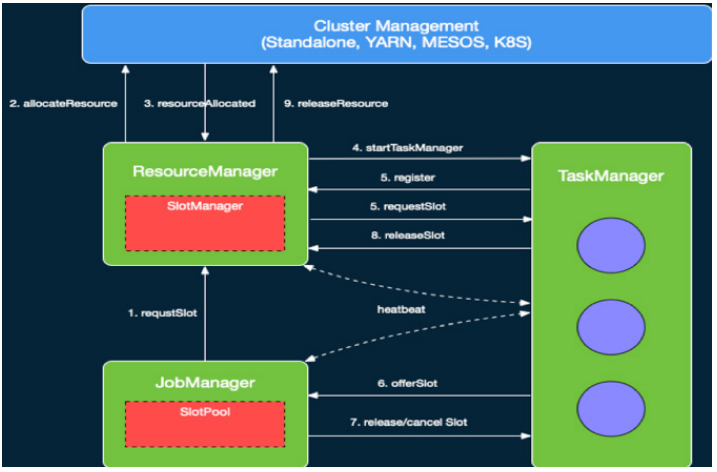

## Flink Runtime 整体架构

Flink 是可以运行在多种不同的环境中的，例如，它可以通过单进程多线程的方式直接运行，从而提供调试的能力。它也可以运行在Yarn 或者 K8S 这种资源管理系统上面，也可以在各种云环境中执行。

针对不同的执行环境，Flink 提供了一套统一的分布式作业执行引擎，也就是Flink Runtime 这层。**Flink 在 Runtime 层之上提供了 DataStream 和 DataSet 两套 API（这个是旧版本）**，分别用来编写流作业与批作业，以及一组更高级的 API 来简化特定作业的编写。本文主要介绍 Flink Runtime 层的整体架构。Flink Runtime 层的主要架构如图 2 所示，它展示了一个 Flink 集群的基本结构。Flink Runtime 层的整个架构主要是在 FLIP-6 中实现的，整体来说，它采用了标准 master-slave 的结构，其中左侧白色圈中的部分即是 master，它负责管理整个集群中的资源和作业；而右侧的两个 TaskExecutor 则是 Slave，负责提供具体的资源并实际执行作业。

其中，**Master 部分又包含了三个组件，即 Dispatcher、ResourceManager 和 JobManager**。**其中，Dispatcher 负责接收用户提供的作业，并且负责为这个新提交的作业拉起一个新的 JobManager 组件**。**ResourceManager 负责资源的管理，在整个 Flink 集群中只有一个 ResourceManager**(如果是standone模式那么全局就是一个Dispatcher和一个ResourceManager还有只有一个JobManager，如果是Yarn模式那么提交一个作业就有全部完整的组件)。JobManager 负责管理作业的执行，在一个 Flink 集群中可能有多个作业同时执行，每个作业都有自己的 JobManager 组件。这三个组件都包含在 AppMaster 进程中。

基于上述结构，当用户提交作业的时候，提交脚本会首先启动一个 Client 进程负责作业的编译与提交。**它首先将用户编写的代码编译为一个 JobGraph**，在这个过程，它还会进行一些检查或优化等工作，**例如判断哪些 Operator 可以 Chain 到同一个 Task 中**（没有shuffer和并行度一样的情况下）。然后，Client 将产生的 JobGraph 提交到集群中执行。此时有两种情况，一种是类似于 Standalone 这种 Session 模式，AM 会预先启动，此时 Client 直接与 Dispatcher 建立连接并提交作业即可。另一种是 Per-Job 模式，AM 不会预先启动，此时 Client 将首先向资源管理系统 （如 Yarn、K8S）申请资源来启动 AM，然后再向 AM 中的 Dispatcher 提交作业。

当作业到 Dispatcher 后，**Dispatcher 会首先启动一个 JobManager 组件**，然后 JobManager 会向 ResourceManager 申请资源来启动作业中具体的任务。这
时根据 Session 和 Per-Job 模式的区别， TaskExecutor 可能已经启动或者尚未启动。如果是前者，此时 ResourceManager 中已有记录了 TaskExecutor 注册的资源，可以直接选取空闲资源进行分配。否则，**ResourceManager 也需要首先向外部资源管理系统申请资源来启动 TaskExecutor**，然后等待 TaskExecutor 注册相应资源后再继续选择空闲资源进程分配。目前 Flink 中 TaskExecutor 的资源是通过 Slot 来描述的，一个 Slot 一般可以执行一个具体的 Task，但在一些情况下也可以执行多个相关联的 Task，这部分内容将在下文进行详述。**ResourceManager 选择到空闲的 Slot 之后，就会通知相应的 TM “将该 Slot 分配分 JobManager XX ”，然后 TaskExecutor 进行相应的记录后，会向 JobManager 进行注册。JobManager 收到 TaskExecutor 注册上来的 Slot 后，就可以实际提交 Task 了**（每一个TaskExecutor在Yarn里面就是一个container，所以看程序会启动几个TaskExecutor和Yarn也有一定的关系）。

TaskExecutor 收到 JobManager 提交的 Task 之后，会启动一个新的线程来执行该 Task。Task 启动后就会开始进行预先指定的计算，并通过数据 Shuffle 模块互相交换数据。

以上就是 Flink Runtime 层执行作业的基本流程。可以看出，Flink 支持两种不同的模式，即 Per-job 模式与 Session 模式还有Application模式。如图 3 所示，**Per-job 模式下整个 Flink 集群只执行单个作业，即每个作业会独享 Dispatcher 和 ResourceManager 组件**。此外，Per-job 模式下 AppMaster 和 TaskExecutor 都是按需申请的。因此，Per-job 模式更适合运行执行时间较长的大作业，这些作业对稳定性要求较高，并且对申请资源的时间不敏感。与之对应，在 Session 模式下，Flink 预先启动 AppMaster 以及一组 TaskExecutor，然后在整个集群的生命周期中会执行多个作业。可以看出，Session 模式更适合规模小，执行时间短的作业。

## 资源管理与作业调度

本节对 Flink 中资源管理与作业调度的功能进行更深入的说明。实际上，作业调度可以看做是对资源和任务进行匹配的过程。如上节所述，在 Flink 中，资源是通过 Slot 来表示的，每个 Slot 可以用来执行不同的 Task。而在另一端，任务即 Job 中实际的 Task，它包含了待执行的用户逻辑。**调度的主要目的就是为了给 Task 找到匹配的 Slot**。逻辑上来说，每个 Slot 都应该有一个向量来描述它所能提供的各种资源的量，每个 Task 也需要相应的说明它所需要的各种资源的量。但是实际上在 1.9 之前，Flink 是不支持细粒度的资源描述的，**而是统一的认为每个 Slot 提供的资源和 Task 需要的资源都是相同的**。从 1.9 开始，Flink 开始增加对细粒度的资源匹配的支持的实现，但这部分功能目前仍在完善中。

作业调度的基础是首先提供对资源的管理，因此我们首先来看下 Flink 中资源管理的实现。如上文所述，Flink 中的资源是由 TaskExecutor 上的 Slot 来表示的。如图 4 所示，**在 ResourceManager 中，有一个子组件叫做 SlotManager**，它**维护了当前集群中所有 TaskExecutor 上的 Slot 的信息与状态，如该 Slot 在哪个 TaskExecutor 中，该 Slot 当前是否空闲等**。当 JobManger 来为特定 Task 申请资源的时候，根据当前是 Per-job 还是 Session 模式，ResourceManager 可能会去申请资源来启动新的 TaskExecutor。当 TaskExecutor 启动之后，它会通过服务发现找到当前活跃的 ResourceManager 并进行注册。在注册信息中，会包含该 TaskExecutor 中所有 Slot 的信息。 **ResourceManager 收到注册信息后，其中的 SlotManager 就会记录下相应的 Slot 信息**。当 JobManager 为某个 Task 来申请资源时， **SlotManager 就会从当前空闲的 Slot 中按一定规则选择一个空闲的 Slot 进行分配**。当分配完成后，如第 2 节所述，**RM 会首先向 TaskManager 发送 RPC 要求将选定的 Slot 分配给特定的 JobManager**。TaskManager 如果还没有执行过该 JobManager 的 Task 的话，它需要首先向相应的 JobManager 建立连接，然后发送提供 Slot 的 RPC 请求。在 JobManager 中，所有 Task 的请求会缓存到 SlotPool 中。当有 Slot 被提供之后，**SlotPool 会从缓存的请求中选择相应的请求并结束相应的请求过程**。

当 Task 结束之后，无论是正常结束还是异常结束，都会通知 JobManager 相应的结束状态，然后在 TaskManager 端将 Slot 标记为已占用但未执行任务的状态。JobManager 会首先将相应的 Slot 缓存到 SlotPool 中，但不会立即释放。**这种方式避免了如果将 Slot 直接还给 ResourceManager，在任务异常结束之后需要重启时，需要立刻重新申请 Slot 的问题。通过延时释放，Failover 的 Task 可以尽快调度回原来的 TaskManager**，从而加快 Failover 的速度。当 SlotPool 中缓存的 Slot 超过指定的时间仍未使用时，SlotPool 就会发起释放该 Slot 的过程。与申请 Slot 的过程对应，SlotPool 会首先通知 TaskManager 来释放该 Slot，然后 TaskExecutor 通知 ResourceManager 该 Slot 已经被释放，从而最终完成释放的逻辑。

除了正常的通信逻辑外，在 ResourceManager 和 TaskExecutor 之间还存在定时的心跳消息来同步 Slot 的状态。**在分布式系统中，消息的丢失、错乱不可避免**，这些问题会在分布式系统的组件中引入不一致状态，**如果没有定时消息，那么组件无法从这些不一致状态中恢复**。此外，当组件之间长时间未收到对方的心跳时，就会认为对应的组件已经失效，并进入到 Failover 的流程。

在 Slot 管理基础上，Flink 可以将 Task 调度到相应的 Slot 当中。如上文所述，Flink 尚未完全引入细粒度的资源匹配，**默认情况下，每个 Slot 可以分配给一个 Task**。但是，这种方式在某些情况下会导致资源利用率不高。如图 5 所示，假如 A、B、C 依次执行计算逻辑，那么给 A、B、C 分配分配单独的 Slot 就会导致资源利用率不高。为了解决这一问题，Flink 提供了 Share Slot 的机制。如图 5 所示，基于 Share Slot，**每个 Slot 中可以部署来自不同 JobVertex 的多个任务，但是不能部署来自同一个 JobVertex 的 Task**。如图 5 所示，每个 Slot 中最多可以部署同一个 A、B 或 C 的 Task，但是可以同时部署 A、B 和 C 的各一个 Task。当单个 Task 占用资源较少时，Share Slot 可以提高资源利用率。 此外，Share Slot 也提供了一种简单的保持负载均衡的方式(**简单的理解就是Flink 允许 subtask 共享 slot，即便它们是不同的 task 的 subtask，只要是来自于同一作业即可**)。

对应官网图片：

> https://nightlies.apache.org/flink/flink-docs-release-1.17/zh/docs/concepts/flink-architecture/

基于上述 Slot 管理和分配的逻辑，JobManager 负责维护作业中 Task 执行的状态。如上文所述，Client 端会向 JobManager 提交一个 JobGraph，它代表了作业的逻辑结构。**JobManager 会根据 JobGraph 按并发展开，从而得到 JobManager 中关键的 ExecutionGraph**。ExecutionGraph 的结构下图所示，与JobGraph 相比，ExecutionGraph 中对于每个 Task 与中间结果等均创建了对应的对象，从而可以维护这些实体的信息与状态。

在一个 Flink Job 中是包含多个 Task 的，因此另一个关键的问题是在 Flink 中按什么顺序来调度 Task。目前 Flink 提供了两种基本的调度逻辑，即 Eager 调度与 Lazy From Source。**Eager 调度如其名子所示，它会在作业启动时申请资源将所有的 Task 调度起来**。**这种调度算法主要用来调度可能没有终止的流作业**。与之对应，（批处理）**Lazy From Source 则是从 Source 开始，按拓扑顺序来进行调度。简单来说，Lazy From Source 会先调度没有上游任务的 Source 任务**，当这些任务执行完成时，它会将输出数据缓存到内存或者写入到磁盘中。然后，对于后续的任务，当它的前驱任务全部执行完成后，Flink 就会将这些任务调度起来。这些任务会从读取上游缓存的输出数据进行自己的计算。这一过程继续进行直到所有的任务完成计算。

## 错误恢复

在 Flink 作业的执行过程中，除正常执行的流程外，还有可能由于环境等原因导致各种类型的错误。整体上来说，错误可能分为两大类：**Task 执行出现错误或 Flink 集群的 Master 出现错误**。由于错误不可避免，**为了提高可用性，Flink 需要提供自动错误恢复机制来进行重试**。

### Task 执行出现错误

**对于第一类 Task 执行错误**，Flink 提供了多种不同的错误恢复策略。如下图所示:
- **（流处理）**第一种策略是 Restart-all，即直接重启所有的 Task。对于 Flink 的流任务，**由于 Flink 提供了 Checkpoint 机制，因此当任务重启后可以直接从上次的 Checkpoint 开始继续执行。因此这种方式更适合于流作业**。

    

- **（批处理）**第二类错误恢复策略是 Restart-individual(个体)，它只适用于 Task 之间没有数据传输的情况。这种情况下，我们可以直接重启出错的任务。

    

**由于 Flink 的批作业没有 Checkpoint 机制**，因此对于需要数据传输的作业，直接重启所有 Task 会导致作业从头计算，从而导致一定的性能问题。为了增强对 Batch 作业，**Flink 在 1.9 中引入了一种新的 Region-Based 的 Failover 策略**。在一个 Flink 的 Batch 作业中 Task 之间存在两种数据传输方式，**一种是 Pipeline 类型的方式，这种方式上下游 Task 之间直接通过网络传输数据，因此需要上下游同时运行；另外一种是 Blocking 类型的试**，如上节所述，这种方式下，上游的 Task 会首先将数据进行缓存，因此上下游的 Task 可以单独执行。基于这两种类型的传输，Flink 将 ExecutionGraph 中使用 Pipeline 方式传输数据的 Task 的子图叫做 Region，从而将整个 ExecutionGraph 划分为多个子图。可以看出，Region 内的 Task 必须同时重启，而不同 Region 的 Task 由于在 Region 边界存在 Blocking 的边，因此，可以单独重启下游 Region 中的 Task。

基于这一思路 , 如果某个 Region 中的某个 Task 执行出现错误，可以分两种情况进行考虑。如图下图所示，如果是由于 Task 本身的问题发生错误，那么可以只重启该 Task 所属的 Region 中的 Task，这些 Task 重启之后，可以直接拉取上游 Region 缓存的输出结果继续进行计算。

另一方面，**如图如果错误是由于读取上游结果出现问题，如网络连接中断、缓存上游输出数据的 TaskExecutor 异常退出等，那么还需要重启上游 Region 来重新产生相应的数据**。在这种情况下，如果上游 Region 输出的数据分发方式不是确定性的（如 KeyBy、Broadcast 是确定性的分发方式，而 Rebalance、Random 则不是，因为每次执行会产生不同的分发结果），为保证结果正确性，还需要同时重启上游 Region 所有的下游 Region,。如果是由于下游任务本身导致的错误，可以只重启下游对应的 Region，如下图。

如果是**由于上游失败导致的错误，那么需要同时重启上游的 Region 和下游的 Region**。实际上，如果下游的输出使用了非确定的数据分割方式，为了保持数据一致性，还需要同时重启所有上游 Region 的下游 Region，如下图。

### Flink 集群的 Master 出现错误

除了 Task 本身执行的异常外，**另一类异常是 Flink 集群的 Master 进行发生异常**。**目前 Flink 支持启动多个 Master 作为备份，这些 Master 可以通过 ZK 来进行选主，从而保证某一时刻只有一个 Master 在运行**。当前活路的 Master 发生异常时 , 某个备份的 Master 可以接管协调的工作。为了保证 Master 可以准确维护作业的状态，**Flink 目前采用了一种最简单的实现方式，即直接重启整个作业**。实际上，由于作业本身可能仍在正常运行，因此这种方式存在一定的改进空间。

