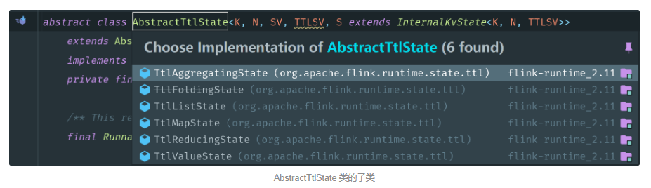
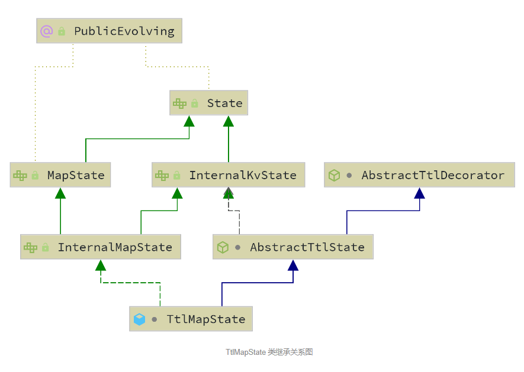
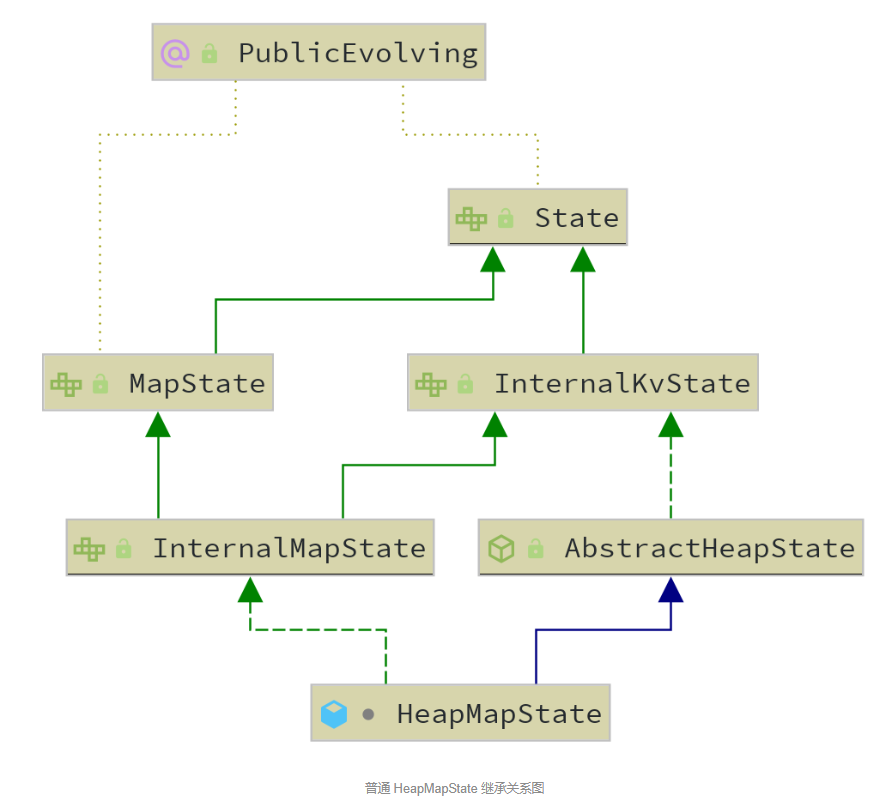

## Flink State TTL 概述

在流计算作业中，经常会遇到一些状态数不断累积，导致状态量越来越大的情形。例如，**作业中定义了超长的时间窗口，或者在动态表上应用了无限范围的 GROUP BY 语句，以及执行了没有时间窗口限制的双流 JOIN 等等操作**。对于这些情况，旧版本的 Flink 并不能很好应对，经常导致堆内存出现 OOM，或者堆外内存（RocksDB）用量持续增长导致超出容器的配额上限，造成作业的频繁崩溃，业务不能正常运行。

从 Flink 1.6 版本开始，社区引入了 ```State TTL``` 特性，该特性**可以允许对作业中定义的 Keyed 状态进行超时自动清理**（通常情况下，Flink 中大多数状态都是 Keyed 状态，只有少数地方会用到 Operator 状态，因此本文的“状态”均指的是 Keyed 状态），并且提供了多个设置参数，可以灵活地设定时间戳更新的时机、过期状态的可见性等，以应对不同的需求场景。

本质上来讲，```State TTL``` 功能给每个 Flink 的 **Keyed 状态增加了一个“时间戳”**，而 Flink 在状态创建、写入或读取（可选）时更新这个时间戳，**并且判断状态是否过期。如果状态过期，还会根据可见性参数，来决定是否返回已过期但还未清理的状态**等等。**状态的清理并不是即时的，而是使用了一种 Lazy 的算法来实现，从而减少状态清理对性能的影响**。

当前最新的 Flink 1.8 版本对 State TTL 功能做了进一步的完善，增加了若干新特性。本文将对这些特性和 Flink 内部对 State TTL 的实现方式做介绍。

## State TTL 功能的用法

为了熟悉一个功能特性，最直观的方式是了解它的用法。在 [Flink 的官方文档](https://nightlies.apache.org/flink/flink-docs-release-1.18/docs/dev/datastream/fault-tolerance/state/) 中，用法示例如下：

```java
import org.apache.flink.api.common.state.StateTtlConfig;
import org.apache.flink.api.common.state.ValueStateDescriptor;
import org.apache.flink.api.common.time.Time;

StateTtlConfig ttlConfig = StateTtlConfig
    .newBuilder(Time.seconds(1))
    .setUpdateType(StateTtlConfig.UpdateType.OnCreateAndWrite)
    .setStateVisibility(StateTtlConfig.StateVisibility.NeverReturnExpired)
    .build();
    
ValueStateDescriptor<String> stateDescriptor = new ValueStateDescriptor<>("text state", String.class);
stateDescriptor.enableTimeToLive(ttlConfig);
```

可以看到，**要使用 State TTL 功能，首先要定义一个 StateTtlConfig 对象**。这个 StateTtlConfig 对象可以通过构造器模式（Builder Pattern）来创建，典型地用法是传入一个 Time 对象作为 TTL 时间，**然后设置更新类型（Update Type）和状态可见性（State Visibility）**，这两个功能的含义将在下面的文章中详细描述。当 StateTtlConfig 对象构造完成后，即可在后续声明的状态描述符（State Descriptor）中启用 State TTL 功能了。

从上述的代码也可以看到，**State TTL 功能所指定的过期时间并不是全局生效的，而是和某个具体的状态所绑定**。换而言之，如果希望对所有状态都生效，那么就需要对所有用到的状态定义都传入 StateTtlConfig 对象。对 Flink 源码感兴趣的同学，可以尝试为 Flink 增加一个默认的 StateTTL 选项，实现起来很简单，这里不再展开说明了。

State TTL 使用的更多案例，可以参见官方的 [flink-stream-state-ttl-test](https://github.com/apache/flink/tree/master/flink-end-to-end-tests/flink-stream-state-ttl-test/src/main/java/org/apache/flink/streaming/tests) 包，它提供了很多测试用例可以参考。

## StateTtlConfig 的参数说明

- **TTL**：表示状态的过期时间，是一个 org.apache.flink.api.common.time.Time 对象。一旦设置了 TTL，那么如果上次访问的时间戳 + TTL 超过了当前时间，则表明状态过期了（这是一个简化的说法，严谨的定义请参考 org.apache.flink.runtime.state.ttl.TtlUtils 类中关于 expired 的实现） 。

- **UpdateType**：表示状态时间戳的更新的时机，是一个 Enum 对象。如果设置为 Disabled，**则表明不更新时间戳；如果设置为 OnCreateAndWrite，则表明当状态创建或每次写入时都会更新时间戳；如果设置为 OnReadAndWrite，则除了在状态创建和写入时更新时间戳外，读取也会更新状态的时间戳**。

- **StateVisibility**：表示对已过期但还未被清理掉的状态如何处理，也是 Enum 对象。如果设置为 ```ReturnExpiredIfNotCleanedUp```，那么即使这个状态的时间戳表明它已经过期了，但是只要还未被真正清理掉，就会被返回给调用方；如果设置为 ```NeverReturnExpired```，那么一旦这个状态过期了，那么永远不会被返回给调用方，只会返回空状态，避免了过期状态带来的干扰。

- TimeCharacteristic 以及 TtlTimeCharacteristic：表示 State TTL 功能所适用的时间模式，仍然是 Enum 对象。前者已经被标记为 Deprecated（废弃），推荐新代码采用新的 TtlTimeCharacteristic 参数。截止到 Flink 1.8，只支持 ProcessingTime 一种时间模式，对 EventTime 模式的 State TTL 支持还在开发中。

- **CleanupStrategies**：表示过期对象的清理策略，目前来说有三种 Enum 值。当设置为 ```FULL_STATE_SCAN_SNAPSHOT``` 时，对应的是 EmptyCleanupStrategy 类，表示对过期状态不做主动清理，当执行完整快照（Snapshot / Checkpoint）时，会生成一个较小的状态文件，但本地状态并不会减小。**唯有当作业重启并从上一个快照点恢复后，本地状态才会实际减小，因此可能仍然不能解决内存压力的问题**。为了应对这个问题，Flink 还提供了增量清理的枚举值，分别是针对 Heap StateBackend 的 INCREMENTAL_CLEANUP（对应 IncrementalCleanupStrategy 类），以及对 RocksDB StateBackend 有效的 ```ROCKSDB_COMPACTION_FILTER```（对应 RocksdbCompactFilterCleanupStrategy 类）.  对于增量清理功能，**Flink 可以被配置为每读取若干条记录就执行一次清理操作，而且可以指定每次要清理多少条失效记录**；对于 RocksDB 的状态清理，则是通过 JNI 来调用 C++ 语言编写的 FlinkCompactionFilter 来实现，**底层是通过 RocksDB 提供的后台 Compaction 操作来实现对失效状态过滤的**。

## State TTL 的实现原理

为了了解 State TTL 功能在 Flink 代码的实现，同样可以从 StateTtlConfig 类开始顺藤摸瓜。可以看到，关于 State TTL 的实现代码，主要集中在 flink-runtime 模块的 org.apache.flink.runtime.state.ttl 包，以及 flink-statebackend-rocksd 模块的 org.apache.flink.contrib.streaming.state.ttl 包下。

首先我们来看一下 flink-runtime 模块是如何定义和实现 TTL 功能的，这里面有多个类可以特别留意：

### TtlValue 类

这个类是一个包装类，它可以为任意的值对象增加一个 ```lastAccessTimestamp``` 的时间戳，***并且可以获取传入的对象以及时间戳***。但需要注意的是，一旦初始化，所有参数就不可以改变。它是 State TTL 状态保存的基本单元，可以通过 TtlUtils 工具类提供的 wrapWithTs(value, timestamp) 方法将一个普通值对象包装为 TtlValue 对象。

```java
public class TtlValue<T> implements Serializable {

	private final T userValue;
	private final long lastAccessTimestamp;

	public TtlValue(T userValue, long lastAccessTimestamp) {
		this.userValue = userValue;
		this.lastAccessTimestamp = lastAccessTimestamp;
	}

	public T getUserValue() {
		return userValue;
	}

	public long getLastAccessTimestamp() {
		return lastAccessTimestamp;
	}
}
```

### AbstractTtlDecorator 及子类

这是一个抽象的包装类。把 Flink 原有的状态（State Handler）与用户设置的 StateTtlConfig 对象一起传入这个类的构造方法后，将会根据前面介绍的多个参数，对这个类的若干布尔常量做赋值，**例如 updateTsOnRead 表示是否在读取记录时更新时间戳，returnExpired 表示是否允许返回已过期的状态等，从而返回一个支持 TTL 的状态对象**。

它有若干子类，例如对我们常见的 Aggregating / List / Map / Reducing / Folding / Value 等六种状态类型，均提供了具体的实现。**这个抽象类还提供了若干工具方法，例如判断状态值是否过期、将普通的值包装为带时间戳的状态值等，同时还提供了 TTL 检查是否过期以及过期后的增量清理等逻辑**。



例如在下面的 getWrappedWithTtlCheckAndUpdate 方法中，**首先会调用传入的 getter 对象来获取 TtlValue 对象**，它是一个普通的状态加上了时间戳，**然后判断它是否为 null 以及是否过期，如果过期就调用传入的 stateClear 对象来做清理**，它是一个 ThrowableRunnable 对象，约等于 Java 自带的 Runnable，只是允许抛出给定的异常。正如之前所言，这个方法会根据之前传入的 StateTtlConfig 的参数而决定，是否在读取时更新时间戳，以及在过期后是否返回过期的状态等。**updater 对象则负责处理更新时间戳等操作**。

```java
<SE extends Throwable, CE extends Throwable, CLE extends Throwable, V> TtlValue<V> getWrappedWithTtlCheckAndUpdate(
    SupplierWithException<TtlValue<V>, SE> getter,
    ThrowingConsumer<TtlValue<V>, CE> updater,
    ThrowingRunnable<CLE> stateClear)    // 增量清理状态的 Runnable 类（经过 Flink 封装，允许在运行时抛出异常
    throws SE, CE, CLE {
    TtlValue<V> ttlValue = getter.get();
    if (ttlValue == null) {
        return null;
    } else if (expired(ttlValue)) {
        stateClear.run();
        if (!returnExpired) {
            return null;
        }
    } else if (updateTsOnRead) {
        updater.accept(rewrapWithNewTs(ttlValue));
    }
    return ttlValue;
}
```

而我们以 TtlMapState 为例，看一下上述 方法的调用情况：

```java
private TtlValue<UV> getWrapped(UK key) throws Exception {
   accessCallback.run();
   return getWrappedWithTtlCheckAndUpdate(
      () -> original.get(key), v -> original.put(key, v), () -> original.remove(key));
}
```

可以看到，getter、updater、stateClear 对象的定义方式非常简单，采用 Lambda 表达式，清晰地描述了各自的动作。original 表示原始的 Flink 状态（State Handler），可以看到具体的操作还是在原始状态对象上进行的，这个类只是一个装饰器，给原始状态对象增加了时间戳以及过期判断等逻辑。

然后再看下 TtlMapState 的 put 方法：

```java
@Override
public void put(UK key, UV value) throws Exception {
    accessCallback.run();
    original.put(key, wrapWithTs(value));
}
```

这里的 accessCallback 是一个回调的 Runnable 对象，**用来实现过期状态的增量清理逻辑**，**它会在每个 put 或 get 方法被调用前都执行一次**。限于篇幅限制，这里不再展开叙述，感兴趣的同学可以参考 TtlStateFactory 类的 [registerTtlIncrementalCleanupCallback()](https://github.com/apache/flink/blob/master/flink-runtime/src/main/java/org/apache/flink/runtime/state/ttl/TtlStateFactory.java) 方法。本文下面的示例代码中也给出了具体实现逻辑。

下面两张图是 TtlMapState 和普通的 HeapMapState 的继承关系图，可以清楚地看到，**支持 TTL 的 State 对象与普通的 State 对象之间并没有很大的区别**，只是增加了一下辅助方法以扩展了 TTL 的特性。另外一个区别在于它只是一个包装类，需要传入其他的 State 对象才可以完成其功能。





### TtlStateContext 类

这个类主要用于初始化上面提到的 AbstractTtlDecorator 类，它包含了实例化 TTL 状态类所需的所有参数，例如被包装的普通状态对象（original）及其所需的 TypeSerializer、StateTtlConfig 对象（前文有讲）、TtlTimeProvider 对象（用来获取当前的时间戳，默认情况下只是对 System.currentTimeMillis() 的封装，用户也可以自定义，例如测试代码里提供的 MonotonicTTLTimeProvider 单调递增时间戳生成器等）、Runnable 类型的 accessCallback 对象（用来做失效对象的具体清理，前文已经描述过）。

TtlStateContext 对象可以由 TtlStateFactory 类来动态创建，它是一个工厂模式的类：

```java
private IS createValueState() throws Exception {
    ValueStateDescriptor<TtlValue<SV>> ttlDescriptor = new ValueStateDescriptor<>(    // 创建一个 TtlValue 类型的 State Descriptor, 可以看到它是一个复合类型
        stateDesc.getName(), new TtlSerializer<>(LongSerializer.INSTANCE, stateDesc.getSerializer()));
    return (IS) new TtlValueState<>(createTtlStateContext(ttlDescriptor));
}

... ... ...

private <OIS extends State, TTLS extends State, V, TTLV> TtlStateContext<OIS, V>
    createTtlStateContext(StateDescriptor<TTLS, TTLV> ttlDescriptor) throws Exception {

    ttlDescriptor.enableTimeToLive(stateDesc.getTtlConfig());     // 从给定的 State Descriptor 获取 TTL 时间
    OIS originalState = (OIS) stateBackend.createInternalState(   // 创建原始状态
        namespaceSerializer, ttlDescriptor, getSnapshotTransformFactory());
    return new TtlStateContext<>(    // 将原始状态包装到 TtlStateContext 类型中，用于随后生成具体的 TTL State 对象，例如 TtlValueState
        originalState, ttlConfig, timeProvider, (TypeSerializer<V>) stateDesc.getSerializer(),
        registerTtlIncrementalCleanupCallback((InternalKvState<?, ?, ?>) originalState));
}

private Runnable registerTtlIncrementalCleanupCallback(InternalKvState<?, ?, ?> originalState) {
    StateTtlConfig.IncrementalCleanupStrategy config =
        ttlConfig.getCleanupStrategies().getIncrementalCleanupStrategy();
    boolean cleanupConfigured = config != null && incrementalCleanup != null;
    boolean isCleanupActive = cleanupConfigured &&
        isStateIteratorSupported(originalState, incrementalCleanup.getCleanupSize());
    Runnable callback = isCleanupActive ? incrementalCleanup::stateAccessed : () -> { };    // stateAccessed  执行具体的清理逻辑
    if (isCleanupActive && config.runCleanupForEveryRecord()) {
        stateBackend.registerKeySelectionListener(stub -> callback.run());
    }
    return callback;
}
```
## 总结

Flink 的 State TTL 特性的引入，解决了长期以来困扰用户的问题：随着状态数越来越多，旧的状态无法及时被清除（尤其是通过 Flink Table / SQL API 来创建的作业，用户无法显式地管理状态），导致系统越来越不稳定。目前 State TTL 仅对 Processing Time 时间模式有效，但通过与开发者进行交流，Flink 在不远的今后也将对 Event Time 的 State TTL 特性提供支持。

State TTL 特性是基于状态后端底层的状态实现的，不同于 Table 模块基于 Timer 机制实现的 Idle State Retention Time 机制，后者局限性很大，且 Timer 的数目过多时，本身也会对内存造成巨大的压力，但优点在于状态的清理可以很实时，不必像 State TTL 一样只能增量地每次清理一小部分或者在后台异步清理。因此对于 Table / SQL 作业，两种机制可以结合使用，以应对逐渐增加的状态带来的挑战。

> https://cloud.tencent.com/developer/article/1452844